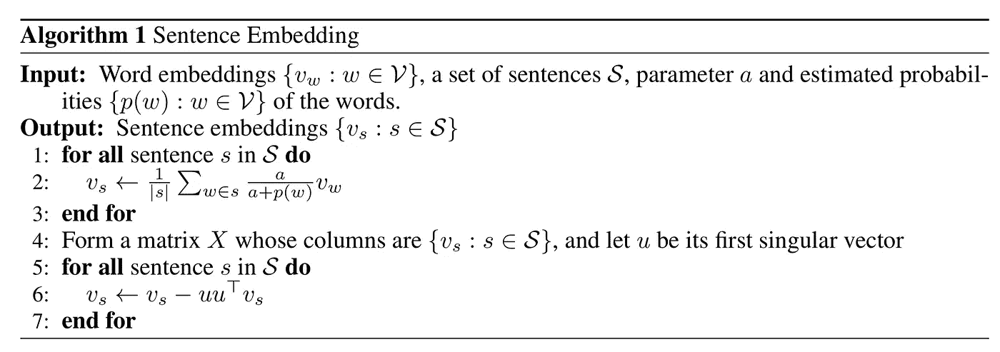
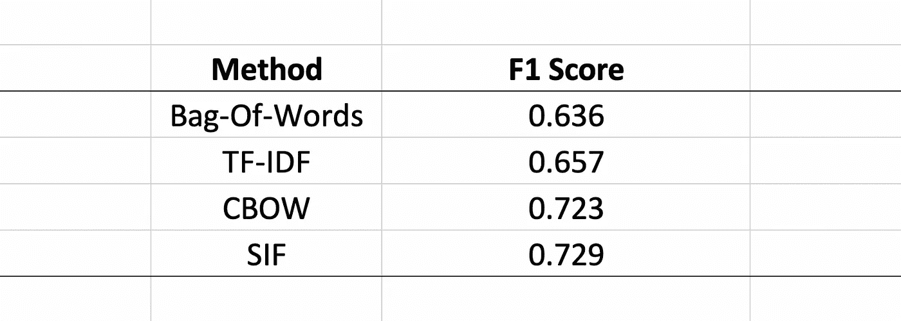
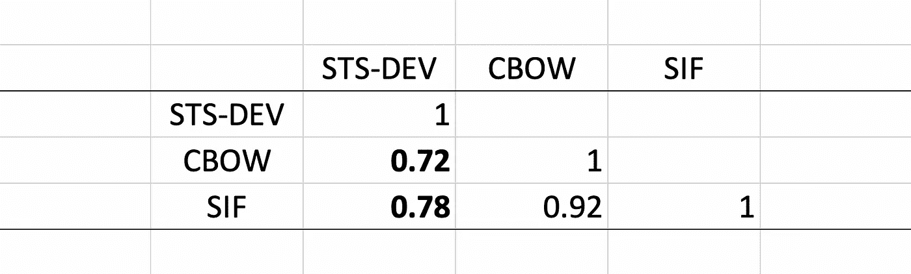

# 句子嵌入。请快点！

> 原文：<https://towardsdatascience.com/fse-2b1ffa791cf9?source=collection_archive---------3----------------------->

## 句子嵌入是现代自然语言处理应用中的一个关键因素。使用 Gensim、Cython 和 BLAS 将句子嵌入计算速度提高 38 倍。


Photo by [Bernard Hermant](https://unsplash.com/@bernardhermant?utm_source=medium&utm_medium=referral) on [Unsplash](https://unsplash.com?utm_source=medium&utm_medium=referral)

***本文中的 fse 代码已弃用。请确保使用***[***Github***](https://github.com/oborchers/Fast_Sentence_Embeddings)***上概述的更新代码。***

## 介绍

当在机器学习管道中处理文本数据时，您可能会遇到计算句子嵌入的需要。类似于常规的单词嵌入(如 Word2Vec、GloVE、Elmo、Bert 或 Fasttext)，句子嵌入将一个完整的句子嵌入到一个向量空间。实际上，一个句子嵌入可能看起来像这样:

《我枪杀了警长》→[0.2；0.1 ;-0.3 ;0.9 ;…]

这些句子嵌入保留了一些好的特性，因为它们继承了潜在单词嵌入的特征[1]。因此，我们可以出于不同的目的使用句子嵌入:

*   基于句子的嵌入计算句子的相似度矩阵。
*   用一种普通的绘图技术来画句子，比如 t-SNE。
*   预测句子的某些值，即情感。

在“深度平均网络”[2]中可以看到一个非常简单的句子嵌入的监督应用，其中作者在情感分析和问题回答中使用句子嵌入。事实上，当你处理文本数据时，句子嵌入是一个看似简单的基线。幸运的是，如果(预训练的)单词嵌入已经可用，它们不需要任何形式的基于梯度的优化。


Photo by [Álvaro Serrano](https://unsplash.com/@alvaroserrano?utm_source=medium&utm_medium=referral) on [Unsplash](https://unsplash.com?utm_source=medium&utm_medium=referral)

这篇文章的目标读者是*技术数据科学受众*。我们将探索平滑逆频率(SIF)句子嵌入[1]。具体来说，我们正在通过手工制作一个函数来优化 SIF 嵌入的计算，这个函数是专门为**尽快计算 SIF 嵌入而定制的**。为此，我们首先使用 Python，然后迁移到 Cython，最后迁移到基本线性代数子程序(BLAS)。Cython 和 BLAS 是 Gensims Word2Vec 实现中使用的核心组件。我必须感谢拉迪姆·řehůřek，因为 Gensims 的实现是这篇文章的基础。对于类似的帖子，请随意阅读原始 Word2Vec 优化[博客](https://rare-technologies.com/word2vec-in-python-part-two-optimizing/)。下面的优化允许我们将 SIF 嵌入的计算速度提高 38 倍(！)。

## SIF 嵌入

平滑逆频率嵌入最初由[1]构思，相应的论文已在 2017 年 ICLR 上发表。原始论文的代码可从 [Github](https://github.com/PrincetonML/SIF) 获得。作者为逆频率加权连续词袋模型提出了一个很好的概率动机。我们不讨论数学的技术细节，而是讨论计算 SIF 嵌入的算法的优化。如果您必须计算数百万个句子的 SIF 嵌入，您需要一个例程在一生中完成这项任务。在本帖中，我们只是在寻找**速度**。Gensim 提供了相当多的信息。



Algorithm to compute the SIF embeddings. Source: [1].

辨别算法，我们可以推断大部分工作将在第 1 & 2 行完成。虽然看起来很简单，但是在使用 Python 时，有足够的空间来优化第 1 行和第 2 行。任务如下:尽可能快地为 brown 语料库中的所有句子计算 SIF 嵌入。我们将依靠 Gensims Word2Vec 实现来获得单词向量，并且只使用一点预处理。

## **实现**

这个项目的全部代码可以在 [Github](https://github.com/oborchers/Fast_Sentence_Embeddings) 获得。可以安装我用 pip 写的 ***快速句子嵌入库*** :

```
pip install fse
```

您将需要常规的 Python 包，特别是 Numpy、Scipy、Cython 和 Gensim。**TL；DR:如果你需要快速的句子嵌入，就用:**

```
from gensim.models import Word2Vec
sentences = [[“cat”, “say”, “meow”], [“dog”, “say”, “woof”]]
model = Word2Vec(sentences, min_count=1)from fse.models import Sentence2Vec
se = Sentence2Vec(model)
sentences_emb = se.train(sentences)
```

## **优化**

为了优化 SIF 功能，我们首先需要一个能够正常工作的原型。让我们来看看原型:

代码应该是不言自明的。我们首先定义变量 *vlookup* ，它将我们指向 gensims vocab 类。在此我们可以访问一个*单词索引*和*计数*。 *Vectors* 将我们指向 gensim *wv* 类，它包含单词 Vectors 本身。然后我们迭代所有的句子。对于每个句子，我们将句子中所有单词的向量相加，同时乘以它们的 SIF 权重。最后，我们用向量除以句子的长度。不要太花哨。

我们需要一个嵌入来度量这个函数的执行时间。让我们使用一个 100 维的 Word2Vec 嵌入，它是在通常可用的 Brown 语料库上训练的。然后我们使用语料库的前 400 个句子，并对函数计时。 **5.70 秒**。

那太慢了。敏锐的眼睛已经注意到了这个缺陷:我在向量加法中使用了 for 循环。这正是在这种情况下**不使用 python for-loops** 的原因。他们太慢了。为了避免这一点，让我们重写第 37–40 行来使用 numpy 例程。

结果是惊人的: **0.041434 秒。**比基准版本快**137 倍**。然而，我们仍然可以做得更好。好多了。您可能已经注意到，vectors[w]充当单词向量的查找表。如果我们*预先计算*句子的单词索引，我们可以直接使用 numpy 索引一次访问所有向量，这样要快得多。在同一步骤中，我们必须预先计算向量的 SIF 权重，以便通过索引访问它们。

运行时间为 **0.011987 秒**，这些小的增加导致该函数比我们建立的基线快**476 倍**。

为了进一步加速实现，我们可能实际上预先计算所有的加权向量，因为权重和单词向量本身不会改变。因此，我们将运行时间减少到 **0.008674 秒**，比基线增加了**658 倍****。*但是等等。有一个陷阱:***

**通过预先计算 SIF 向量，我们可能不得不计算一个相当大的矩阵，如果我们只有几个句子和大量的词汇，这不是时间有效的。它也不节省空间，因为我们必须在 RAM 中存储一个单独的加权嵌入矩阵。因此，我们正在内存和时间效率之间进行权衡。只有当句子中用于训练的有效单词数大于词汇量时，预计算加权向量才有意义。**

**我会稍微破坏一下，声明这是不必要的，因为我们稍后将使用 BLAS 函数，但是现在记住它。**

**我们已经获得了相当大的加速。我们要优化的下一件事是向量的求和，我们仍然可以获得显著的加速。然而，为了更好地对结果进行基准测试，我们将语句到索引的转换从等式中去掉。因此，我们预计算了以下基准的所有句子索引:**

```
sentences_idx = [np.asarray([int(model.wv.vocab[w].index) for w in s if w in model.wv.vocab], dtype=np.intc) for s in sentences]
```

**你会立即意识到这在实践中是一个非常糟糕的想法，因为我们现在必须存储第二个数据集。然而，目前它很好地服务于我们的基准测试目的。**

**在 **0.004472 秒**的情况下，新函数——使用预先计算的加权向量和句子索引——以基准实现速度的**1276 倍**计时。**然而，由于基线没有使用预先计算的指数**，这种比较有些偏离。因此，这是我们目前的新基准。**

**下一步是迁移到 [Cython](https://cython.org) 。请注意，我们仍然在使用预先计算的指数和加权向量。我们将所有东西包装到一个漂亮的 Cython 文件中，然后编译它。**

**cdef float[:，:]命令允许我们访问预先计算的向量的内存视图。关于更详细的解释，Cython 网站提供了一个关于内存视图的简洁的教程。记得用**

```
# cython: boundscheck=False
# cython: wraparound=False
```

**在文件的开头。这两个命令移除了安全网，这可能会降低我们的速度。前者检查我们是否超出了数组的边界，而后者允许我们执行负索引(我们不打算使用)。我们现在运行的**比之前的*纯 numpy 实现*快 2.42 倍**，后者也依赖于预先计算的句子索引。因此，这种比较又是公平的。**

**请注意，我们已经将所有必要的结构*预定义为 C 变量*，我们可以在纯 C 循环中使用它们，而没有任何 Pythonic 干扰。因此，我们也可以释放全局解释器锁( [GIL](https://realpython.com/python-gil/) )，当我们考虑 **fse** 的多线程实现时，这可能会在未来的某个时间点派上用场。我们基本上重写了用于对句子中所有单词求和的代码部分:**

**因此，我们将运行时间减少到 **0.000805 秒**，这标志着比第一次 Cython 实现又增加了 **2.28 倍**。**

**最后，我们将进行[爆破](https://en.wikipedia.org/wiki/Basic_Linear_Algebra_Subprograms)。基本线性代数子程序描述低级线性代数例程。它们分为三级:第一级:向量运算，第二级:向量-矩阵运算，第三级:矩阵-矩阵运算。出于我们的目的，我们只需要访问 1 级。确切地说，我们需要:**

*   **SAXPY : (Single)常量乘以一个向量加上一个向量**
*   **SSCAL : (Single)用常数缩放一个向量**

**Gensims 核心类大量使用这些高度优化的例程来加速 Word2Vec、Doc2Vec 和 Fasttext。**

**现在回想一下我们之前写的关于预计算 SIF 加权向量的内容。SAXPY 函数接受参数 *a* ，它用在 y = a*x + y 中。因此，我们无论如何都要做权重*向量乘法。因此，预先计算 SIF 向量实际上毕竟是一个低效的想法。**

**此外，我们正在放弃 Cython 内存视图，以便通过指针和内存地址直接不安全地访问 numpy 变量。**

**我们必须在其他地方定义 sscal 和 saxpy 指针，这在代码片段中是多余的(通常在*。pxd 文件)。**

**我们从这些额外的麻烦中得到了什么？运行时间 **0.000267 秒**，这再次标志着**3.01 倍的增长(！)**超过以前的实现。如果我们只看使用预先计算的向量和索引的函数，我们将运行时间从 **0.004472** 减少到 **0.000267 秒**，速度增加了**16.76 倍**。随着我们增加向量和数据的大小，这些值可能会发生显著变化。总的来说，我们将代码的速度提高了 21，400 倍，尽管由于预先计算的不同，这有点像苹果和橘子的比较。**

## ****验证&申请****

**为了测试一切是否正常，我们现在看两个任务:
STS 句子相似性基准[3]和在句子水平上预测情绪[4]。你可以在相应的 [Jupyter 笔记本](https://github.com/oborchers/Fast_Sentence_Embeddings/blob/master/fse/Sentence%20Prediction.ipynb)中找到脚本。让我们使用预先训练的 GoogleNews-vectors-negative300 个向量来估计句子嵌入。**

**预测情绪的 reddit 数据集包含四个类别:令人毛骨悚然、血腥、快乐和愤怒。经过一些预处理后，我们得到了 2460 个句子和所有四种情感类别的平衡。**

**至于时间:使用我们之前开发的第二个变体计算句子嵌入，每个循环需要大约 991 ms 19.2 ms(平均标准时间。戴夫。7 次运行，每次 1 个循环)。fse.models.Sentence2Vec 中包含的最终实现在每个循环 25.9 ms 615 s 内完成任务(平均标准时间。戴夫。7 次运行，每次 10 个循环)，一个**38 倍的速度提升**和一个公平的比较。**

****

**Source: [Author](https://github.com/oborchers/Fast_Sentence_Embeddings/blob/master/fse/Sentence%20Prediction.ipynb).**

**在预测情绪方面，我们也能够很好地完成任务。注:多项逻辑回归，训练/测试分离 50%。**

**最后，我们接近句子相似度基准。数据在[这里](http://ixa2.si.ehu.es/stswiki/index.php/STSbenchmark)可用。我们只看开发集。最初的论文报道了 71.7 的 spearman 相关性，但是他们使用了手套向量。根据其他基准测试，实现工作正常。**

****

**Source: [Author](https://github.com/oborchers/Fast_Sentence_Embeddings/blob/master/fse/Sentence%20Prediction.ipynb).**

## **结论**

**句子嵌入是自然语言处理流水线的重要组成部分。这篇博文展示了如何实现平均和 SIF 加权 CBOW 嵌入，这可以作为后续任务的良好基线。由于它们的简单性和模块化，我们预计会有各种各样的应用。相应的 **fse** 包可以在 pip / Github 上获得，它为数据科学家提供了一种快速计算句子嵌入的方法。**

**如有疑问，欢迎联系 [me](mailto:borchers@bwl.uni-mannheim.de) 。**

## **附加说明**

**这篇文章的代码可以在 [Github](https://github.com/oborchers/Fast_Sentence_Embeddings) 和 pip 上找到:**

```
pip install fse
```

## **文学**

1.  **Arora S，Liang Y，Ma T (2017)一个简单但难以击败的句子嵌入基线。里面的糖膏剂学习。代表。(法国土伦)，1-16 岁。**
2.  **Iyyer M，Manjunatha V，Boyd-Graber J，Daumé III H (2015)深度无序合成与文本分类的句法方法相匹敌。继续。第 53 届 Annu。见面。协会计算机。语言学家。第七国际。Jt。糖膏剂纳特。郎。过程。, 1681–1691.**
3.  **埃内科·阿吉雷、丹尼尔·塞尔、莫娜·迪亚卜、伊戈·洛佩兹·加兹皮奥、露西娅·斯佩亚。Semeval-2017 任务 1:语义文本相似度多语种和跨语种聚焦评估。SemEval 2017 会议录。**
4.  **杨志成、雷米·勒布雷特和卡尔·阿伯勒。"用于分析社交媒体的多模态分类."2017 年第 27 届欧洲机器学习和数据库知识发现原理与实践会议(ECML-PKDD)**

## **放弃**

***所表达的观点仅代表我个人，并不代表我的雇主的观点或意见。作者对本网站内容的任何错误或遗漏不承担任何责任或义务。本网站包含的信息按“原样”提供，不保证完整性、准确性、有用性或及时性。***