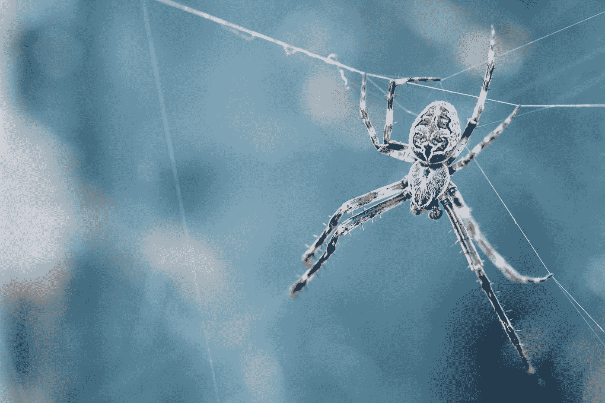
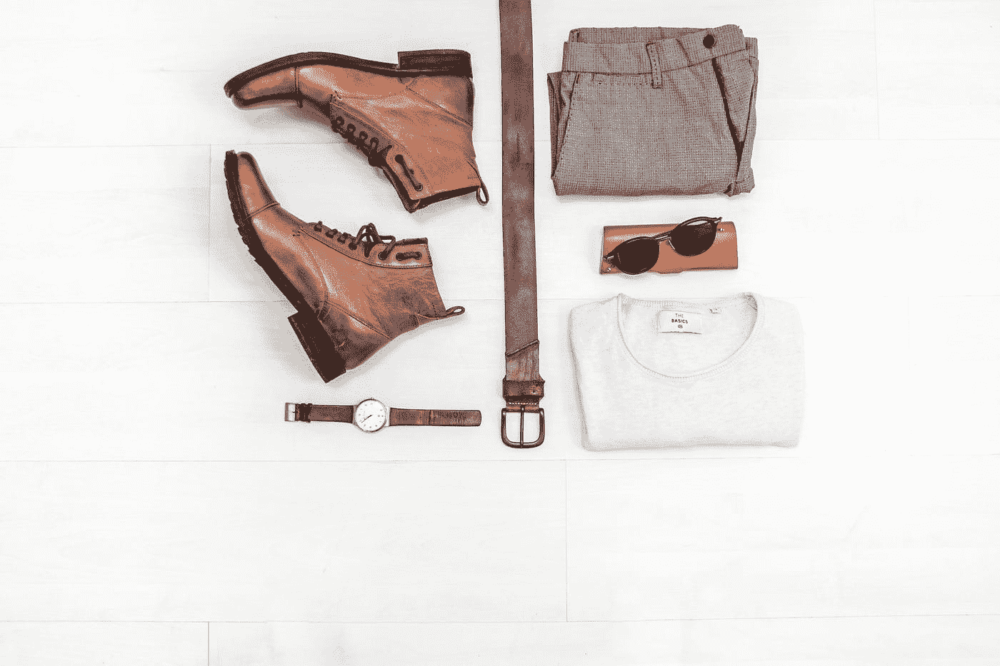
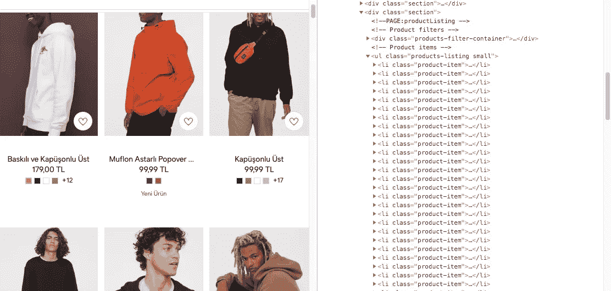
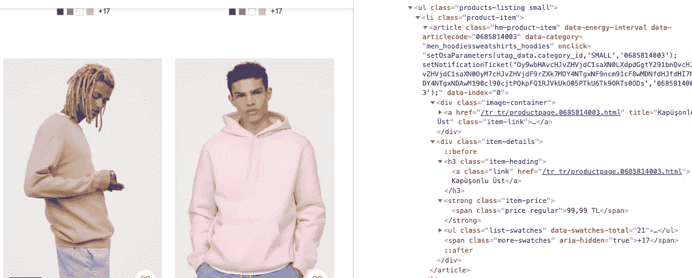

# 为深度学习加油:通过网络抓取创建自定义数据集

> 原文：<https://towardsdatascience.com/fuel-up-the-deep-learning-custom-dataset-creation-with-web-scraping-ba0f44414cf7?source=collection_archive---------12----------------------->



Photo by [Dev Leigh](https://unsplash.com/@loveleighmiles?utm_source=medium&utm_medium=referral) on [Unsplash](https://unsplash.com?utm_source=medium&utm_medium=referral)

我完全理解了深度学习的一件事。它需要大量的数据才能工作。没有数据，它只是一个高级算法。它不能单独产生任何有意义的输出。

当你从零开始开发深度学习模型时，这一点更加明显。

在上下文中， [**开放图像数据集**](https://opensource.google.com/projects/open-images-dataset) 包含 900 万张已经用图像级标签和对象边界框进行了注释的图像。准备如此庞大的数据集需要付出巨大的努力。

好消息是，你可以根据你的需要用相对较少的数据量 [**微调一个预训练的模型**](/transfer-learning-from-pre-trained-models-f2393f124751) 。

在接下来的部分中，我将向您展示如何使用 **Scrapy** 和 **Python** 创建这样一个数据集。希望这能帮助你开始你的第一个机器学习项目。


Photo by [Jon Tyson](https://unsplash.com/@jontyson?utm_source=medium&utm_medium=referral) on [Unsplash](https://unsplash.com?utm_source=medium&utm_medium=referral)

假设您想要开发一个机器学习模型，在提供的图像中检测衣服、鞋子、包和配件。您可能还想开发一个图像相似性模型，根据给定的输入图像为您提供相似衣服的图像。像购物一样，Pinterest、谷歌和许多其他公司提供的 look 功能。

对于这两种情况，您都需要大量与领域相关的图像和数据。网络抓取是一个工具，你可以用来克服这个困难。



Photo by [NordWood Themes](https://unsplash.com/@nordwood?utm_source=medium&utm_medium=referral) on [Unsplash](https://unsplash.com?utm_source=medium&utm_medium=referral)

让我以一种结构化的方式来解释 web 报废流程，从而一步一步地指导您:

# 第一步:了解礼貌刮擦的规则

在网络抓取中，你必须遵守几个规则，以免损害网站报废。在考虑网络抓取之前，请花时间去理解这些规则。这里有一个[网站](https://blog.scrapinghub.com/2016/08/25/how-to-crawl-the-web-politely-with-scrapy)用具体的例子来解释它们。

# 第二步:决定刮哪个网站

这似乎是显而易见的，但这是第一步，其余的很大程度上取决于这一点。在投入时间和精力之前，想想你的兴趣是什么。这将有助于你缩小关注网站的选择范围。

在我的情况下，由于我计划开发时尚的深度学习模型，我将寻找在线购物网站。

我们的数据来源将是服装购物网站，因为我们的领域与时尚有关。所以我决定刮一下 **'www2.hm.com/tr_tr '，**来演示一下整个刮的过程。

如果你在另一个领域有一个特定的网站，你仍然可以按照这个例子来理解你可以很容易地应用到你的案例中的基础知识。

# 第三步:了解网站的结构

了解产品如何在 **'www2.hm.com/tr_tr'** 中列出和分页以加快抓取过程非常重要。在我们的例子中，产品分为女性、男性和儿童。网站上有一些页面，你可以在那里看到特定主要类别的所有产品。因此，我们不必搜索每个子类别，如男士衬衫、男鞋等。

如果你查看那些页面的 Url，你可以看到使用了两个参数: ***【偏移量】*** 和 ***【页面大小】。*** 我们将使用 offset 值来浏览产品列表，并使用 page-size 值来定义一页上要列出多少产品。更高的**页面大小**值需要更少的 Http 请求，因此减少了抓取时间。

> [https://www2 . hm . com/tr _ tr/erkek/u rune-gore-satin-al/view-all . html？sort = stock&image-size = small&image = model&offset = 0&page-size = 72](https://www2.hm.com/tr_tr/erkek/urune-gore-satin-al/view-all.html?sort=stock&image-size=small&image=model&offset=0&page-size=72)

# 第四步:理解 HTML 中的模式

此时，我们应该检查列出了所有商品及其图片、产品名称和价格信息的 Html。

如果我们理解了网站上使用的 Html 和 CSS 模式，那么我们就可以很容易地找到我们想要抓取的部分。

在我们的例子中，您可以在下面的图片中看到，所有的条目都包含在具有**“products-listing small”**类名的



Inspecting HTML patterns for Web Scrapping

当我们进入具有“product-item”类名的单个

*   元素的细节时，我们可以看到产品图片链接、产品名称和产品价格信息位于何处。您可以看到页面上显示的每个产品都使用了相同的 Html 模式。

Inspecting HTML patterns for Web Scrapping

# 步骤 5:构建并运行 Scrapy Spider

假设你的电脑上已经安装并运行了 Python，让我们从安装 [**Scrapy**](https://scrapy.org) 开始。

使用您的 shell 终端安装 Scrapy 并生成您的 Scrapy 项目。

我们还需要安装[图像库](https://pypi.org/project/image/)。这是 Scrapy 图像管道所要求的，我们将使用它来下载产品图像。

```
$ pip install scrapy
$ pip install image
$ scrapy startproject **fashionWebScraping**
$ cd **fashionWebScraping**
$ ls
```

完成后，您将看到 scrapy.cfg、items.py、pipelines.py、middlewares.py 和 settings.py 文件被填充到文件夹中。一个空的**‘蜘蛛’**文件夹也出现在项目主文件夹中，用于存储我们的蜘蛛 python 文件。

我们需要修改 **settings.py** ， **items.py** 并构建一个蜘蛛 python 文件开始抓取。

**建立 Scrapy 项目**

为了设置项目，我将修改***setting . py***by*包括几个行项目来定义图像管道。然后我会改一些基本设置礼貌刮。可以参考 [Scrapy 网站](https://doc.scrapy.org/en/latest/topics/settings.html)了解更多设置。*

```
*BOT_NAME = 'fashionWebScraping'SPIDER_MODULES = ['fashionWebScraping.spiders']
NEWSPIDER_MODULE = 'fashionWebScraping.spiders'**# Crawl responsibly by identifying yourself 
# (and your website) on the user-agent**
USER_AGENT = 'erdemisbilen@gmail.com'**# Obey robots.txt rules**
ROBOTSTXT_OBEY = True**# This to avoid hitting servers too hard**
DOWNLOAD_DELAY = 5**# Configure item pipelines**
ITEM_PIPELINES = {'scrapy.pipelines.images.ImagesPipeline': 1}
IMAGES_STORE = '/Angular/fashionWebScraping/images_scraped'*
```

***用 *items.py*** 定义项目*

> *为了定义通用的输出数据格式，Scrapy 提供了`[***Item***](https://doc.scrapy.org/en/1.0/topics/items.html#scrapy.item.Item)`类。`[***Item***](https://doc.scrapy.org/en/1.0/topics/items.html#scrapy.item.Item)`对象是用来收集抓取数据的简单容器。*
> 
> ***出自**[**scrapy.org**](https://docs.scrapy.org/en/latest/topics/items.html)*

*让我们在 ***items.py*** 中定义我们的项目:*

```
*import scrapyclass FashionwebscrapingItem(scrapy.Item):**#items to store product details**
  gender=Field()
  productId=Field()
  productName=Field()
  priceOriginal=Field()
  priceSale=Field()**#items to store links**
  imageLink = Field()
  productLink=Field()**#item for company name**
  company = Field()**#items for image pipeline**
  image_urls = scrapy.Field()
  images = scrapy.Field()pass*
```

***编写我们的蜘蛛***

> *蜘蛛是定义如何抓取某个站点(或一组站点)的类，包括如何执行抓取(即跟随链接)以及如何从页面中提取结构化数据(即抓取项目)。换句话说，蜘蛛是为特定站点(或者，在某些情况下，一组站点)定义抓取和解析页面的自定义行为的地方。*
> 
> ***出自**[**scrapy.org**](https://docs.scrapy.org/en/latest/topics/spiders.html)*

```
***fashionWebScraping $** scrapy genspider fashionHM hm.com
*Created spider 'fashionHM' using template 'basic' in module:
fashionWebScraping.spiders.fashionHM**
```

*上面的 shell 命令创建了一个空的蜘蛛文件。让我们将代码写入我们的 ***fashionHM.py*** 文件:*

```
*import scrapy
from fashionWebScraping.items import FashionwebscrapingItem
from scrapy.http import Request**#to read from a csv file**
import csvclass FashionhmSpider(scrapy.Spider):
 name = 'fashionHM'
 allowed_domains = ['www2.hm.com']
 start_urls = ['http://www2.hm.com/']**# This function helps us to scrape the whole content of the website
 # by following the links in a csv file.**
 def start_requests(self):**# Read main category links from a csv file** 
  with open("SpiderMainCategoryLinks.csv", "rU") as f:
   reader=csv.DictReader(f)

   for row in reader:
    url=row['url']**# Change the offset value incrementally 
    # to navigate through the     product list
    # You can play with the range value 
    # according to maximum product quantity
**    link_urls = [url.format(i*100) for i in range(0,1)]

    for link_url in link_urls:
      print(link_url)

 **# Pass the each link containing 100 products, 
      # to parse_product_pages function with the gender metadata**request=Request(link_url, callback=self.parse_product_pages, meta={'gender': row['gender']})
      yield request**# This function scrapes the page with the help of xpath provided**
 def parse_product_pages(self,response):
  item=FashionwebscrapingItem()

 ** # Get the HTML block where all the products are listed
  # <ul> HTML element with the "products-listing small" class name**
  content=response.xpath('//ul[@class="products-listing small"]')

 **# loop through the <li> elements with the 
   # "product-item" class name in the content**
   for product_content in content.xpath('//li[@class="product-item"]'):
    image_urls = []

    **# get the product details and populate the items**
item['productId']=product_content.xpath('.//article[@class="hm-product-item"]/@data-articlecode').extract_first()item['productName']=product_content.xpath('.//a[@class="link"]/text()').extract_first()item['priceOriginal']=product_content.xpath('.//span[@class="price regular"]/text()').extract_first()item['priceSale']=product_content.xpath('.//span[@class="price sale"]/text()').extract_first()if item['priceSale']==None:
      item['priceSale']=item['priceOriginal']item['productLink']="https://www2.hm.com"+product_content.xpath('.//a[@class="link"]/@href').extract_first()item['imageLink']="https:"+product_content.xpath('.//img/@data-src').extract_first()
     image_urls.append(item['imageLink'])
     item['image_urls']=image_urls
     item['company']="H&M"
     item['gender']=response.meta['gender']

     if item['productId']==None: 
      break
     print(item['productId'])

     yield (item)def parse(self, response):
  pass*
```

*首先，从 CSV 文件中读取主类别链接，然后循环使用偏移值遍历链接，以浏览产品列表。*

*这里的技巧是使用 **XPath** 来定位我们想要抓取的 Html 部分。剩下的就很简单了。*

*慢慢来，研究一下 [XPath](https://docs.scrapy.org/en/xpath-tutorial/topics/xpath-tutorial.html) ，因为它是 web 报废的核心主题。它提供了在 HTML 中导航的工具。*

***运行我们的蜘蛛***

```
***$** scrapy crawl -o rawdata_HM.json -t json fashionHM*
```

*在几分钟内，这一行 shell 命令通过将图像和相关产品数据存储在一个 JSON 文件中，不仅生成了 10K 图像和相关产品数据。*

*像魔术一样！*

# *结论*

*我们用 Scrapy 和 Python 经历了网页抓取的过程。如果你是**数据科学**或**机器学习**爱好者，掌握网页抓取的基础知识会对你有很大帮助。*

*你可以在[我的 GitHub 库](https://github.com/eisbilen/fashionWebScraping)中找到项目代码。*

*下载的服装图像可以用于训练与时尚相关的定制深度学习模型。在培训过程中使用这些图像之前，您可能需要对它们进行预处理和标记。*

*不幸的是，这是深度学习最耗时和最困难的任务。*

*我的下一篇文章将详细讨论这个主题。*