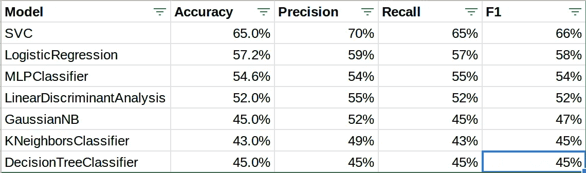

# 完整管道项目:用于检测假新闻的 Python AI

> 原文：<https://towardsdatascience.com/full-pipeline-project-python-ai-for-detecting-fake-news-with-nlp-bbb1eec4936d?source=collection_archive---------4----------------------->


太多关于机器学习的文章只关注建模。那些关键的模型构建和验证的中间部分当然值得关注，但是我想要更多——我希望你也一样。我对自己的项目写了一个完整的回顾，包括数据争论、前面提到的模型工作和公共接口的创建。如果你想直接跳到“笑点”，完整的节目可以在[https://www.unslanted.net/newsbot/](https://www.unslanted.net/newsbot/)找到。

我一开始的想法是假新闻的措辞与标准新闻截然不同，机器学习可以检测到这种差异。在我自己对假新闻文章的检查中，我发现相对频繁使用的术语似乎是为了激起愤怒。我还发现，这类文章中明显的写作技巧通常比标准新闻中明显的要差得多。有了这些想法，我就有了一些基础，可以开始构建我的模型，将假新闻从其他新闻中分类出来。

为了找出这个假设是否正确，我们首先需要一个客观标记的数据集，它将为我们提供假新闻的例子和由专业事实检查员提供的真实新闻的例子。这些数据需要有指向新闻文章的 URL，以及对该文章的真实性或虚构性的判断。我找到了两个符合这个标准的数据集。第一个是来自广告丰特斯媒体的互动媒体偏见图。你可以访问他们的图表，在这里获得第一个数据集:【https://www.adfontesmedia.com/interactive-media-bias-chart/】T2 我们将使用的另一个数据集是 FakeNewsNet 数据集，在这里可以获得:【https://github.com/KaiDMML/FakeNewsNet】T4。我对数据集做了一些手动更改，以消除 pdf 和任何明显不是 URL 的内容，并通过对 FakeNewsNet 的 politifact_fake.csv 文件中的所有项目给予“假”评级，对 politifact_real.csv 文件中的所有项目给予“真”评级，来标准化评分系统。

一旦我们有了数据集，我们的下一个任务将是把这些数据集组合成一个单一的数据库表，然后我们可以用它来提取我们将要处理的文本。我使用 Django ORM 来管理到数据库的连接。后来，这也使得为我们的模型提供一个公共接口变得更加容易，因为 Django 是一个全功能的 MVC web 框架。通过 manage.py 启动我们的应用程序后，我必须通过 Django.db 模型类创建表:

```
from django.db import modelsclass ArticleExample(models.Model):
   # This will hold the visible text for this example
   body_text = models.TextField()
   # This bias score is a left-right bias provided by Media Bias
   # Chart, but not used in this project. 
   bias_score = models.FloatField()
   bias_class = models.IntegerField()
   # quality_score comes from the Media Bias Chart data
   quality_score = models.FloatField()
   # quality_class is based on the quality score and allows us to
   # integrate politifact data in their
   # 4-class way, True = 4, Mostly True = 3, Mostly Fake = 2,
   # Fake = 1
   quality_class = models.IntegerField()

   origin_url = models.TextField()
   origin_source = models.TextField()
```

很简单，对吧？接下来，我们回到 Django 的 manage.py 并运行 makemigrations 和 migrate 来设置我们的数据库。

现在我们必须将数据放入这个表中。这是一个数据争论的过程，也是机器学习中最困难和最耗时的部分之一。在大型 ML 环境中，有些数据工程师除了收集数据集之外，几乎什么也不做。

让我们深入研究这个问题。本质上，我们需要:

1.  加载我们的网址和分数列表。
2.  从 URL 加载页面并解析它
3.  将解析后的版本与分数一起存储
4.  通过平均分割数据，为任何没有类的数据点添加类。

首先，让我们看看除了解析页面部分之外的所有内容。现在，您只需要知道 SoupStrainer(我们将在一分钟内开发)将为我们处理所有这些。

这个程序的主要部分是 harvester.py。在 harvester 的第一部分，我们必须做一些初始设置，以允许我们的 django 程序从命令行运行，而不是通过 web 界面。

```
import os, sys, re, timeproj_path = “/home/jwales/eclipse-workspace/crowdnews/”
os.environ.setdefault(“DJANGO_SETTINGS_MODULE”, “crowdnews.settings”)
sys.path.append(proj_path)
os.chdir(proj_path)
from django.core.wsgi import get_wsgi_application
application = get_wsgi_application()
from django.contrib.gis.views import feed
```

根据机器上项目路径的具体情况，您的里程会有所不同。接下来，我们需要加载并设置我们的模型和我们的解析器。我们很快会解释这是什么意思，听我说。

```
import pandas as pd
from newsbot.strainer import *
from newsbot.models import *ss = SoupStrainer()
print(“Initializing dictionary…”)
ss.init()
```

接下来，我们使用以下方法加载从 Politifact 获得的数据:

```
def harvest_Politifact_data():
   print(“Ready to harvest Politifact data.”)
   input(“[Enter to continue, Ctl+C to cancel]>>”)
   print(“Reading URLs file”) # Read the data file into a pandas dataframe
   df_csv = pd.read_csv(“newsbot/politifact_data.csv”,
   error_bad_lines=False, quotechar=’”’, thousands=’,’,
   low_memory=False) for index, row in df_csv.iterrows():
      print(“Attempting URL: “ + row[‘news_url’])
      if(ss.loadAddress(row[‘news_url’])):
         print(“Loaded OK”)
   # some of this data loads 404 pages b/c it is a little old, 
   # some load login pages. I’ve found that
   # ignoring anything under 500 characters is a decent 
   # strategy for weeding those out.
         if(len(ss.extractText)>500):
            ae = ArticleExample()
            ae.body_text = ss.extractText
            ae.origin_url = row[‘news_url’]
            ae.origin_source = ‘politifact data’
            ae.bias_score = 0 # Politifact data doesn’t have this
            ae.bias_class = 5 # 5 is ‘no data’
            ae.quality_score = row[‘score’]
            ae.quality_class = row[‘class’]
            ae.save()
            print(“Saved, napping for 1…”)
            time.sleep(1)
         else:
            print(“**** This URL produced insufficient data.”)
      else:
         print(“**** Error on that URL ^^^^^”)
```

通过这些，你会看到我们首先使用 Pandas 来读取 CSV 文件中的 URL 和分数。然后，我们将它发送给解析器，并将结果文本保存在 body_text 中。然后我们小睡一秒钟，善待我们正在收获的网站。媒体偏差图表数据的过程是类似的，我们只需将 quality_class 除以媒体偏差图表中质量分数的 1/4。

然而，真正的工作还没有开始！我们如何从这些网站获取数据，它看起来像什么，我们如何解析它？

对于这项任务，我们需要限制我们要看的单词的数量。我们希望确保这些单词是真正的英语单词，并且我们希望只保存单词 stem，因此像 programmer、programming 和 program 这样的单词都可以简化为 program。这将限制我们最终训练样本的规模，并使其在普通 PC 上易于管理。这个任务将会出现在我们在 harvester 中遇到的 SoupStrainer 类中，我告诉过你我们一会儿会解释。重要的时刻已经到来！

首先是我们的进口产品。我们将使用 BeautifulSoup 解析 HTML，使用 urllib3 从网上加载网页，使用 PorterStemmer 做词干处理。此外，我们还需要一些其他东西来处理这些数据:

```
import urllib3, re, string, json, html
from bs4 import BeautifulSoup
from bs4.element import Comment
from urllib3.exceptions import HTTPError
from io import StringIO
from nltk.stem import PorterStemmer
```

接下来，我们将设置我们的类，并从一个完整的字典中初始化我们的字典，您可以从:[https://github.com/dwyl/english-words](https://github.com/dwyl/english-words)获得

```
class SoupStrainer():
   englishDictionary = {}
   haveHeadline = False
   recHeadline = ‘’
   locToGet = ‘’
   pageData = None
   errMsg = None
   soup = None
   msgOutput = True def init(self):
      with open(‘newsbot/words_dictionary.json’) as json_file:
         self.englishDictionary = json.load(json_file)
```

我们只对页面上的可见文本感兴趣，所以下一步是构建一个过滤器，它能够检测哪些标签是可见的，哪些是不可见的:

```
def tag_visible(self, element):
   if element.parent.name in [‘style’, ‘script’, 
          ‘head’, ‘title’, ‘meta’, ‘[document]’]:
      return False
   if isinstance(element, Comment):
      return False
   return True
```

我们将在下一个函数中使用它，该函数执行实际的加载和解析。系好安全带，这是一次有趣的旅行。

首先，我们将设置一些东西，并确保它看起来至少有点像 URL:

```
def loadAddress(self, address):
   self.locToGet = address
   self.haveHeadline = False htmatch = re.compile(‘.*http.*’)
   user_agent = {‘user-agent’: ‘Mozilla/5.0 (Windows NT 6.3;
                 rv:36.0) Gecko/20100101 Firefox/36.0’}
   ps = PorterStemmer()   if(htmatch.match(self.locToGet) is None):
      self.locToGet = “http://” + self.locToGet
```

接下来，让我们看看是否可以加载 URL:

```
if(len(self.locToGet) > 5):
   if(self.msgOutput):
     print(“Ready to load page data for: “ + self.locToGet +  
           “which was derived from “ + address)
   try:
      urllib3.disable_warnings(
             urllib3.exceptions.InsecureRequestWarning)
      http = urllib3.PoolManager(2, headers=user_agent)
      r = http.request(‘GET’, self.locToGet)
      self.pageData = r.data
      if(self.msgOutput):
         print(“Page data loaded OK”)
   except:
      self.errMsg = ‘Error on HTTP request’
      if(self.msgOutput):
         print(“Problem loading the page”)
      return False
```

到目前为止，一切顺利，我们只是加载网页并获取结果 HTML 文件。接下来，我们应该提取可见文本，去掉标点符号，确保它是一个真实的单词，然后对其进行词干处理。我留下了一行注释，告诉你如何复习字典中没有的单词。

```
 self.extractText = ‘’
 self.recHeadline = self.locToGet
 self.soup = BeautifulSoup(self.pageData, ‘html.parser’)
 ttexts = self.soup.findAll(text=True)
 viz_text = filter(self.tag_visible, ttexts)
 allVisText = u””.join(t.strip() for t in viz_text) for word in allVisText.split():
    canonWord = word.lower()
    canonWord = canonWord.translate(
         str.maketrans(‘’, ‘’, string.punctuation))
    canonWord = canonWord.strip(string.punctuation)
    if(canonWord in self.englishDictionary):
       canonWord = ps.stem(canonWord)
       self.extractText = self.extractText + canonWord + “ “

 return True
```

现在，当我们运行 harvester.py 时，我们将得到一组完整的示例，包括带词干的真实单词、一个 URL 和一个 quality_class，它告诉我们它是假的还是真的。

为了理解下一部分，我们需要看一下我们将要构建的模型。该计划的核心是创建一个示例矩阵，其中每行是一个示例。该行由一组 1 和 0 组成，表示匹配该索引的单词是否出现在示例中。因此，我们需要做的下一步是为我们刚刚下载并放入数据库的所有示例中的每个单词附加一个唯一的索引。所以我们需要建立一个字典。第一步是构建这项任务所需的数据模型和表格。回到 models.py，添加以下内容:

```
class DictEntry(models.Model):
 canonWord = models.TextField()
```

走到您的终端，跳 makemigrations/migrate 舞，然后我们就可以开始构建字典了。为此，我们需要看一下脚本 dictbuilder.py。

一旦我们加载了所需的 django 库，我们就可以使用当前在我们的规范单词字典表中的任何单词构建一个 python 字典。这为我们提供了一种快速的方法来查看字典中是否已经有某个内容，而不必进行数据库查找。如果您通过为每个单词测试访问数据库来做到这一点，您的速度将会降低至少 10 倍，因此这一部分绝对是值得的。碰巧的是，我们将在整个过程中重复这样做，所以这里我们将创建一个文件 util.py，并创建一个函数来返回我们的规范单词字典:

```
def loadCanonDict():
    canonDict = DictEntry.objects.all()
    dictSize = canonDict.count() + 1
    cDict = {}
    for cw in canonDict:
        cDict[cw.canonWord] = cw.pk

    return cDict
```

最后，我们准备用所有示例中的所有单词来构建字典表:

```
qs_Examples = ArticleExample.objects.all() #filter(pk__gt = 2942)
print(“Examples: “ + str(qs_Examples.count()))
for ex in qs_Examples:
   cwords = ex.body_text.split()
   for cwrd in cwords:
      if(cwrd in cDict.keys()):
         print(‘.’, end=’’, flush=True)
      else:
         print(‘X’, end=’’, flush=True)
         nde = DictEntry(canonWord = cwrd)
         nde.save()
         cDict[cwrd] = nde.pk
```

这将为每个单词分配一个主键 ID，这些单词将按顺序编号。这样，当我们构建一个示例时，我们可以使用主键作为列号来更新任何特定的示例，并确保相同的列对于每个示例都意味着相同的事情。请注意，如果您需要清空字典并重新构建，您还需要重置主键计数器。我不得不在开发过程中这样做，也许这篇文章会帮你解决这个头疼的问题！

退一步说，我们现在有了一个数据集，我们有了一种方法来指出在任何特定的例子中存在哪些单词。我们(在我的数据集中)有 20，870 个单词和 2，500 个带分数的独特例子。现在我们准备开始学习我们的模型。如果你是我这样的书呆子，你现在绝对是昏了头。

我们面临的问题是将新闻分为四类，假的，不可靠的，合法的和真实的。这是分类器模型的一个问题。我们使用的模型库是 scikit-learn。我们将测试几个模型，看看哪个效果好。我认为这种类型的问题对于支持向量机或神经网络来说非常好。

对于每一篇文章，我们现在都有一个经过精简和词干处理的文本副本。每个单词都有一个唯一的 ID。我们将把每个例子构建为一个 numpy 行向量，如果单词 ID n 出现在文章中，每个例子[n]将为 1，否则为 0。然后，我们将所有这些行向量堆叠成一个巨大的 20，870 x 2，500 的矩阵。然后我们将把我们的数据集提供的质量类别存储在一个列向量中，并使用这个矩阵和列向量来训练和测试我们的模型。

例如，我们需要一种方法将一篇文章处理成一行。如果我们测试任何新的示例，这是一个我们需要再次重复的任务，所以我们将再次为它创建一个实用函数:

```
def buildExampleRow(body_text, cDict):
    dictSize = len(cDict.keys())
    one_ex_vector = np.zeros(dictSize+2)
    cwords = body_text.split()
    for word in cwords:
        if(word in cDict.keys()):
            one_ex_vector[cDict[word]-1] = 1
        else:
            print("This word doesn't exist in the dict:" + word)

    return(one_ex_vector)
```

接下来，我们构建一个函数来从数据库中加载我们的示例。

```
def processExamples(qs_Examples, cDict):
    Y_vector = np.zeros(qs_Examples.count(), dtype=np.int8)
    Y_vec_count = 0
    examplesMatrix = None

    for ex in qs_Examples:
        Y_vector[Y_vec_count] = int(ex.quality_class)
        Y_vec_count = Y_vec_count + 1
        if(examplesMatrix is None):
            examplesMatrix = buildExampleRow(ex.body_text, cDict)
        else:
            examplesMatrix = np.vstack(
               [examplesMatrix, 
               buildExampleRow(ex.body_text, cDict)])
            print('.', end='', flush=True)

    return( (Y_vector, examplesMatrix))
```

现在，我们可以在 class_learner.py 中快速轻松地设置培训内容:

```
from newsbot.util import *

print("Setting up..")
cDict = loadCanonDict()
qs_Examples = ArticleExample.objects.filter(quality_class__lt = 5)

print("Processing examples")
(Y_vector, examplesMatrix) = processExamples(qs_Examples, cDict)
```

现在是训练和测试模型的时候了。我们将把我们的数据分成一个训练和测试集，然后我们将训练我们的多层感知器分类器。很简单，事实证明:

```
X_train, X_test, y_train, y_test = train_test_split(examplesMatrix, Y_vector, test_size=0.2)model = MLPClassifier(hidden_layer_sizes=(128,64,32,16,8), max_iter=2500)model.fit(X_train, y_train)
```

使用像 SciKit 这样强大的库的好处在于，这个过程的基础对于几个不同的模型是相同的。当你想改变模型时，你可以把 model=MLPClassifier(…)改为另一个模型，你通常会得到一个工作程序。

现在，我们有了一个训练有素的模型，我们终于有时间去发现它是否有效，以及我们是否可以从中构建一些很酷的东西。为了找到答案，我们需要做一些测试并理解它们。这样就开始了模型验证的过程。对于分类模型，我们可以很好地了解我们是如何对新闻进行分类的。

```
print(“***************”)
print(“Classification based:”)
print(accuracy_score(predictions, y_test))
print(confusion_matrix(predictions, y_test))
print(classification_report(predictions, y_test))
print(“***************”)
```

请敲鼓…

```
***************
Accuracy score: 0.546
Confusion Matrix: 
[[ 35   8   3   2]
 [ 10  44  28   5]
 [ 21  40  83  58]
 [  3   4  45 111]]
Classification report: 
              precision    recall  f1-score   support1       0.51      0.73      0.60        48
           2       0.46      0.51      0.48        87
           3       0.52      0.41      0.46       202
           4       0.63      0.68      0.65       163accuracy                           0.55       500
   macro avg       0.53      0.58      0.55       500
weighted avg       0.54      0.55      0.54       500***************
```

解读这些数字，我们得到:

准确性得分，0.546: 这意味着我们的预测有 54.6%是准确的。由于我们有 4 个类，随机猜测会产生 25%的准确率，所以这实际上是一个改进。

**混淆矩阵**:这组 16 个数字给了我们一些非常有趣的信息。我在下面用一种更易读的格式绘制了它。每一行代表一个类预测类，每一列代表真实类。在行和列的交叉处的数字是被预测为每个预测类的真实类的数量。例如，你在第二行第二列看到的数字 44 是真实类为 2，预测值也为 2 的例子数。您在同一行的下一列中看到的 28 是实际上是 2 的示例数，但我们的模型预测的是 3。请注意，在实际得分为 1 的文章中，1/2 的权重很大。类似地，在最下面一行，我们有实际上被评为 a 4 的例子，注意最后两列比前两列大得多。这是好消息！

**分类报告:**

在这里，每一行代表一个类，并显示精度、召回和 F1 分数。你在这里看到的数字从很大到不太大不等。总的来说，看起来我们更善于定位真实的新闻而不是虚假的，但是如果我们能做到这一点，我们仍然可以足够接近地工作。如果您继续往下，您会看到我们还会得到一个总体加权平均精度/召回率/F1 分数，这让我们对模型的总体表现有了更清晰的了解。我们的 0.54 F1 分数为我们提供了精确度和召回分数之间的平衡，并且是用于评估分类模型的良好的单一度量。如果我们在另一款车型上获得更高的 F1，我们应该选择它而不是这款。准确性得分也是一个很好的单一指标，在实践中，这两者通常非常接近。

早些时候，我在混淆矩阵中注意到，分类器似乎经常偏离 1。如果我也看看我的模型的平均绝对误差:

```
mae = mean_absolute_error(y_test, predictions)
print(“Mean absolute Error: “ + str(mae))
```

我会得到:

```
Mean absolute Error: 0.54
```

这进一步证明，平均而言，该模型与实际答案相差不超过 1 类。这将为我们模型的进一步开发和最终交付提供信息。如果我们要将这个模型交付给最终用户，让他们清楚地了解我们的模型在想什么，我们将需要生成概率估计。大多数模型可以自动处理，支持向量分类器需要“概率=真”标志来在训练时产生概率估计器。

既然您已经知道如何阅读混淆矩阵和分类报告，并且我们已经选择了用于模型评估的单一指标，现在我们可以测试一大堆不同的模型。在存储库中可用的代码中，我刚刚注释掉了这里显示的所有各种模型的调用，因此您可以看到 scikit 允许您通过简单地更改模型声明来切换学习模型，其他一切都保持不变。

**3 小时后**

经过大量的训练和结果分类，下面是我们对这个问题的各种不同模型的测试结果:



嗯，我很惊讶逻辑回归得到了第二名。对于 K-Neighbors 和决策树我并不感到惊讶，它们看起来并不适合这个问题。SVC 是明显的赢家。

**思考我们的界面**

现在我们对模型的表现有了清晰的了解。接下来我们需要看看他们在真实例子上的表现。我们知道模型往往接近正确，即使它们不正确。我们接下来需要知道更多关于他们是否提供了相互矛盾的答案，或者他们是否给了我们一致的答案。我们将不得不保存我们的前 3 个模型，并构建一些东西来测试它们。

**拯救我们的模型**

对于任务的这一部分，我创建了一个名为 class_saver.py 的新文件。这样，我可以加载数据一次，运行并测试所有三个顶级模型，并使用 pickle 保存它们。我们将设置我们的环境，然后将我们的前三个模型放入一个可迭代的 python 字典中:

```
print("Setting up..")
cDict = loadCanonDict()
qs_Examples = ArticleExample.objects.filter(quality_class__lt = 5)
print("Processing examples")
(Y_vector, examplesMatrix) = processExamples(qs_Examples, cDict)
X_train, X_test, y_train, y_test =
     train_test_split(examplesMatrix, Y_vector, test_size=0.2)
chosen_models = {}chosen_models['newsbot/MLPC_model.sav'] = MLPClassifier(hidden_layer_sizes=(128,64,32,16,8), max_iter=2500)chosen_models['newsbot/svc_model.sav'] = 
SVC(gamma='scale', probability = True)chosen_models['newsbot/log_model.sav'] = 
LogisticRegression()
```

接下来，我们将循环选择模型，训练它们，并决定是否要保留它们。注意，这些模型有随机的初始化，多次运行它们会产生稍微不同的结果，所以你需要看一下它们的统计数据，以确保你得到了一个好的结果。

```
for fname, model in chosen_models.items():
    print("Working on " + fname)
    model.fit(X_train, y_train)
    predictions = model.predict(X_test)
    print("Classification report: ")
    print(classification_report(predictions, y_test))
    print("***************")
    dosave = input("Save " + fname + "? ")
    if(dosave == 'y' or dosave == 'Y'):
        print("Saving...")
        pickle.dump(model, open(fname, 'wb'))
        print("Saved!")
    else:
        print("Not saved!")
```

训练完模型并保存后，您将得到 3 个文件。我的 3 个文件非常大，总共约 391 兆字节。

现在，让我们构建一个命令行界面，它将给出我们对真实例子的估计。这里我们可以重用很多代码。如果您在资源库中跟进，我们现在将使用 classify_news.py。

在我们完成了添加所需导入和为 ORM 访问设置 Django 的常规设置后，接下来我们需要加载之前设计的 3 个模型。

```
print(“Loading brain…”)
log_model = pickle.load(open(‘newsbot/log_model.sav’, ‘rb’))
svc_model = pickle.load(open(‘newsbot/svc_model.sav’, ‘rb’))
mlp_model = pickle.load(open(‘newsbot/mlp_model.sav’, ‘rb’))print(“Brain load successful.”)
```

接下来，我们需要初始化所有东西，以便将一篇文章变成一个例子，就像我们之前做的那样:

```
print("Initializing dictionaries...")
cDict = loadCanonDict()
ss = SoupStrainer()
ss.init()
```

然后，我们将文章转化为模型的输入行:

```
url = input("URL to analyze: ")

print("Attempting URL: " + url)
if(ss.loadAddress(url)):
    articleX = buildExampleRow(ss.extractText, cDict)
else:
    print("Error on URL, exiting")
    exit(0)

articleX = articleX.reshape(1, -1)
```

最后，当我们设置好适当的行向量后，我们可以预测并生成每个模型的概率:

```
log_prediction = log_model.predict(articleX)
log_probabilities = log_model.predict_proba(articleX)svc_prediction = svc_model.predict(articleX)
svc_probabilities = svc_model.predict_proba(articleX)mlp_prediction = mlp_model.predict(articleX)
mlp_probabilities = mlp_model.predict_proba(articleX)# 6\. Display the processed text and the results
print(“*** SVC “)
print(“Prediction on this article is: “)
print(svc_prediction)
print(“Probabilities:”)
print(svc_probabilities)print(“*** Logistic “)
print(“Prediction on this article is: “)
print(log_prediction)
print(“Probabilities:”)
print(log_probabilities)print(“*** MLP “)
print(“Prediction on this article is: “)
print(mlp_prediction)
print(“Probabilities:”)
print(mlp_probabilities)
```

现在我运行分类器。大约需要 1 到 2 秒的加载时间来解开我的模型和加载字典，这有点长，但仍然可以接受。如果我们要大规模推广，我们需要找到一种方法将模型和字典加载到内存中，并让它们一直存在，直到被删除。对于我们的开发版本，这仍然有效。如果我粘贴一个我认为真实的文章 URL，我会得到以下输出:

```
*** SVC 
Prediction on this article is: 
[3]
Probabilities:
[[0.01111608 0.0503078 0.70502378 0.23355233]]
*** Logistic 
Prediction on this article is: 
[3]
Probabilities:
[[5.61033543e-04 5.89780773e-03 7.63196217e-01 2.30344942e-01]]
*** MLP 
Prediction on this article is: 
[4]
Probabilities:
[[1.18020372e-04 1.93965844e-09 4.88694225e-01 5.11187753e-01]]
```

这些概率向我展示了与我的 4 个类别相关的概率，第一个是完全虚假的，最后一个是完全真实的。在支持向量分类器中，真实或大部分真实的几率为 70.5+ 23.4 = 93.9%！其他两个国家也取得了类似的数字。我所有的分类者都同意，这篇文章看起来很真实。在我写这篇文章的时候，它是华盛顿邮报的头条。接下来，我去了一个非常不可靠的新闻来源，这是一个众所周知的虚假和不可靠的新闻故事的供应商，并从他们的头版随机选择一个故事。以下是输出:

```
*** SVC 
Prediction on this article is: 
[1]
Probabilities:
[[0.80220529 0.18501285 0.01051862 0.00226324]]
*** Logistic 
Prediction on this article is: 
[1]
Probabilities:
[[0.53989611 0.45269964 0.0005857 0.00681855]]
*** MLP 
Prediction on this article is: 
[1]
Probabilities:
[[8.38376936e-01 1.84104358e-03 1.59391877e-01 3.90143317e-04]]
```

找到了。三个分类器都同意，这篇文章是假的。这里的概率很有趣。SVC 和逻辑模型非常确定这是假的/不可靠的。请注意，MLP 给出了 15.9%的文章大部分是真实的可能性。

最后，我将测试我的一个读者发给我的一篇文章，我邀请他做测试者。他发现这个项目的早期版本产生了不一致的结果，特别是我的 SVC 和 MLP 模型的第一个版本不一致。在这个版本中，它也引起了很大的争议:

```
*** SVC 
Prediction on this article is: 
[3]
Probabilities:
[[0.28233338 0.38757642 0.26880828 0.06128192]]
*** Logistic 
Prediction on this article is: 
[3]
Probabilities:
[[3.93710544e-01 1.68049849e-01 4.38124141e-01 1.15466230e-04]]
*** MLP 
Prediction on this article is: 
[3]
Probabilities:
[[3.67580348e-03 1.66093528e-05 9.96254861e-01 5.27264258e-05]]
```

请注意，SVC 几乎不知道这是怎么回事，在类别 1、2 和 3 中给它一个相当平等的评级，然后它选择预测类别 3，即使类别 2 具有最高的概率。在逻辑模型中可以看到相同的基本结果:1 和 3 的概率有些相似，加上 2 的 16.8%的概率，它最终预测了 3。MLP 模型确定这篇文章是 3。有趣的是，这篇文章是关于经济的，但它来自一个不可靠的来源，并且使用了很多类似假新闻的语言。我认为分类器有困难，因为它是关于训练领域之外的主题。培训中使用的文章通常是关于美国政治的，而不是关于经济的，所以这可能是我们看到这种结果的原因。

**构建网络界面**

咻。各位，这是一段漫长的旅程。现在，我们有了 3 个看起来运行良好的模型，我们希望部署它们，以便公众可以使用它们。我们知道，在许多情况下，一篇文章应该属于第 4 类，我们的模型通常将它们的大部分权重归入第 3 类和第 4 类，并且它们在天平的另一端工作类似。我们知道他们有时会有分歧，尤其是在涉及具体概率的细节上。我们知道，典型的用户不会安装 python 和大量的库来使用这个工具。我们必须让它易于使用，易于理解，并且每个人都可以使用。

好消息，我们最初把这个小东西放在 Django MVC 框架中，所以从这里开始构建一个 web 界面是一个相对简单的过程。

首先，当我们使用 startapp 启动整个过程时，我们更新了 django 提供的 views.py。

在这一部分中，我们看到了一些我们以前在命令行界面中使用过的熟悉代码，这些代码用于设置模型、解析示例并返回表示提交文章的单词内容的行向量:

```
from django.shortcuts import render
import pandas as pd
import numpy as np
import pickle

from .models import *
from .forms import *
from newsbot.strainer import *
from newsbot.util import *

def index(request):

    url = request.GET.get('u')
    if((url is not None) and (len(url) > 5)):
        print("Setting up")
        svc_model = pickle.load(open('newsbot/svc_model.sav', 'rb'))
        mlp_model = pickle.load(open('newsbot/MLPC_model.sav', 'rb'))
        log_model = pickle.load(open('newsbot/log_model.sav', 'rb'))
        cDict = loadCanonDict()        
        ss = SoupStrainer()
        ss.init()
        print("Setup complete")
        print("Attempting URL: " + url)
        if(ss.loadAddress(url)):
            articleX = buildExampleRow(ss.extractText, cDict)
        else:
            print("Error on URL, exiting")
            return render(request, 'urlFail.html', {'URL', url})

        articleX = articleX.reshape(1, -1)
```

Shazam，我们在一个由 1 和 0 组成的 numpy 数组中找到了 articleX 作为我们的文章，它代表了文章中出现的规范单词。

现在我们需要从所有模型中得到一个结果:

```
 svc_prediction = svc_model.predict(articleX)
 svc_probabilities = svc_model.predict_proba(articleX)

 mlp_prediction = mlp_model.predict(articleX)
 mlp_probabilities = mlp_model.predict_proba(articleX)

 log_prediction = log_model.predict(articleX)
 log_probabilities = log_model.predict_proba(articleX)
```

接下来，我需要为我们的模板设置一些显示变量。我们希望模板中尽可能少的数学和逻辑，所以我们用显示友好的百分点来设置概率，而不是统计学家熟悉的 0 比 1 浮动形式。我们为每个模型创建一个总虚假和总真实指标，如下所示:

总伪造率=伪造(0 级)概率+欺骗(1 级)概率

总真实=看似合法(3 级)概率+真实(3 级)概率

这使得我们只需在模板中进行一次比较，就可以决定我们是要显示“看起来真实”还是“看起来虚假”作为我们的规则。

```
svc_prb = (svc_probabilities[0][0]*100, svc_probabilities[0][1]*100, svc_probabilities[0][2]*100, svc_probabilities[0][3]*100)
 svc_totFake = (svc_probabilities[0][0]*100) + (svc_probabilities[0][1]*100)
 svc_totReal = (svc_probabilities[0][2]*100) + (svc_probabilities[0][3]*100) mlp_prb = (mlp_probabilities[0][0]*100, mlp_probabilities[0][1]*100, mlp_probabilities[0][2]*100, mlp_probabilities[0][3]*100)
 mlp_totFake = (mlp_probabilities[0][0]*100) + (mlp_probabilities[0][1]*100)
 mlp_totReal = (mlp_probabilities[0][2]*100) + (mlp_probabilities[0][3]*100) log_prb = (log_probabilities[0][0]*100, log_probabilities[0][1]*100, log_probabilities[0][2]*100, log_probabilities[0][3]*100)
 log_totFake = (log_probabilities[0][0]*100) + (log_probabilities[0][1]*100)
 log_totReal = (log_probabilities[0][2]*100) + (log_probabilities[0][3]*100)
```

然后我们想把这三种模式结合起来。这将处理有争议裁决的案件。如果我们的三个模型中的两个强烈倾向于一个方向，而另一个强烈倾向于另一个方向，那么将它们平均在一起将解决争端。这给了我们一个概率分布，我们可以使用它作为我们的最终用户想要的页面顶部的单一预测:它是真的还是假的？

```
fin_prb = ( (((svc_probabilities[0][0]*100)+(mlp_probabilities[0][0]*100)+(log_probabilities[0][0]*100))/3), 
 (((svc_probabilities[0][1]*100)+(mlp_probabilities[0][1]*100)+(log_probabilities[0][1]*100))/3),
 (((svc_probabilities[0][2]*100)+(mlp_probabilities[0][2]*100)+(log_probabilities[0][2]*100))/3),
 (((svc_probabilities[0][3]*100)+(mlp_probabilities[0][3]*100)+(log_probabilities[0][3]*100))/3) )
 fin_totFake = (svc_totFake + mlp_totFake + log_totFake)/3
 fin_totReal = (svc_totReal + mlp_totReal + log_totReal)/3
```

然后，我们将所有这些内容转储到一个上下文中，并将小狗发送到我们的模板:

```
context = {‘headline’:ss.recHeadline, ‘words’: ss.extractText, ‘url’ : url,
 ‘svc_totFake’: svc_totFake, 
 ‘svc_totReal’: svc_totReal, 
 ‘svc_prediction’: svc_prediction, 
 ‘svc_probabilities’: svc_prb, 
 ‘mlp_totFake’: mlp_totFake, 
 ‘mlp_totReal’: mlp_totReal, 
 ‘mlp_prediction’: mlp_prediction, 
 ‘mlp_probabilities’: mlp_prb,
 ‘log_totFake’: log_totFake, 
 ‘log_totReal’: log_totReal, 
 ‘log_prediction’: log_prediction, 
 ‘log_probabilities’: log_prb,
 ‘fin_totFake’: fin_totFake, 
 ‘fin_totReal’: fin_totReal, 
 ‘fin_probabilities’: fin_prb
 } return render(request, ‘newsbot/results.html’, context)
```

如果没有提供 URL，您需要在表单的末尾添加这一点来呈现要求用户输入 URL 的表单:

```
else:
 return render(request, ‘newsbot/urlForm.html’)
```

在 results.html 中，我们只需为每个结果创建一个快速表。这是最后的裁决表:

```
<h3 style=”text-align: center;”>
 Combined Result:<br>
 
 Fake/Dodgy
 
 Seems Legit/True
 
 </h3>

 <br>Probability of Fake: {{ fin_probabilities.0|floatformat }}% chance of Fake
<div class=”progress”>
 <div class=”progress-bar” id=”fakeProb_bar” role=”progressbar” aria-valuenow=”{{ fin_probabilities.0 }}”
 aria-valuemin=”0" aria-valuemax=”100" style=”width:{{ fin_probabilities.0 }}%”></div>
</div>

 <br>Probability of Dodgy: {{ fin_probabilities.1|floatformat }}% chance of Dodgy
<div class=”progress”>
 <div class=”progress-bar” id=”MfakeProb_bar” role=”progressbar” aria-valuenow=”{{ fin_probabilities.1 }}”
 aria-valuemin=”0" aria-valuemax=”100" style=”width:{{ fin_probabilities.1 }}%”></div>
</div>

 <br>Probability of Mostly True: {{ fin_probabilities.2|floatformat }}% chance of Mostly True
<div class=”progress”>
 <div class=”progress-bar” id=”MtrueProb_bar” role=”progressbar” aria-valuenow=”{{ fin_probabilities.2 }}”
 aria-valuemin=”0" aria-valuemax=”100" style=”width:{{ fin_probabilities.2 }}%”></div>
</div>

 <br>Probability of True: {{ fin_probabilities.3|floatformat }}% chance of True
<div class=”progress”>
 <div class=”progress-bar” id=”trueProb_bar” role=”progressbar” aria-valuenow=”{{ fin_probabilities.3 }}”
 aria-valuemin=”0" aria-valuemax=”100" style=”width:{{ fin_probabilities.3 }}%”></div>
</div>
```

对要显示的任何其他模型重复上述步骤。

—

**重述**

如果你已经走了这么远，我们已经走了很长一段路了。我们从一个机器无法理解的假设开始。我们找到数据来训练我们的机器，把数据哄成我们的机器可以处理的形式，然后训练机器。然后我们用真实数据进行了测试，出乎所有人意料的是，我们发现它实际上有一个合理的答案。完成这样一个漫长的项目让你对整个机器学习管道有了一个完整的了解。尽管这个项目很长，但仍有很大的改进余地。更多想法包括:

询问用户他们认为机器人是对还是错，并记录他们的答案以备将来可能的训练。

从更多来源查找更多数据集或获取更多数据集。

写一个爬虫挖掘假新闻网站收集越来越多的例子。

调整超参数。

将领域知识扩展到其他国家或其他学科。

使用域名或标题作为数据特征。

想办法统计页面上的广告数量，假设假新闻网站通常有更多的广告。

既然您已经看到了分类器可能做的事情，特别是在解释结果的帮助下，天空是无限的。感谢你的到来，我希望我帮助启发和教育！