# 全栈深度学习步骤和工具

> 原文：<https://towardsdatascience.com/full-stack-deep-learning-steps-and-tools-a21eda6227b1?source=collection_archive---------7----------------------->

## 我从一门关于全栈深度学习的课程中学到的总结


Photo by [Fatos Bytyqi](https://unsplash.com/@fatosi?utm_source=medium&utm_medium=referral) on [Unsplash](https://unsplash.com?utm_source=medium&utm_medium=referral)

大家好，一切都好吗？今天，我要写一篇文章，谈谈我从看到[全栈深度学习(FSDL)2019 年 3 月](https://fullstackdeeplearning.com/march2019)课程中学到了什么。这是一个很棒的在线课程，它告诉我们用全栈深度学习来做项目。我最喜欢的是他们如何教我们一个项目，不仅教我们如何创建深度学习架构，还告诉我们在做深度学习项目时应该关注的软件工程内容。

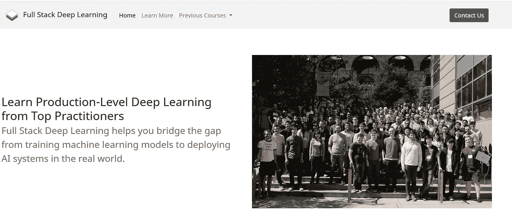

Source : [https://fullstackdeeplearning.com/](https://fullstackdeeplearning.com/)

当我们做一个深度学习项目时，我们需要知道我们应该使用哪些步骤和技术。我们需要知道这些来提高项目的质量。这将是非常有用的，特别是当我们想在一个团队中做项目的时候。当团队协作时，我们不希望项目变得混乱。

本文将根据 FSDL 课程重点介绍全栈深度学习项目每个步骤中的**工具**和**做什么**(加上一些我所知道的工具的补充)。将有一个简短的描述在每个步骤做什么。本文将只展示我在那门课程中注意到的**工具**。本文重点介绍的编程语言是 Python。

> 2020 年 7 月 12 日更新:可在此访问全栈深度学习课程[https://course.fullstackdeeplearning.com/](https://course.fullstackdeeplearning.com/)。来看看吧:)。

# 概述

1.  步伐
2.  规划和项目设置
3.  数据收集和标记
4.  代码库开发
5.  培训和调试
6.  部署
7.  结论
8.  编后记

# 步伐

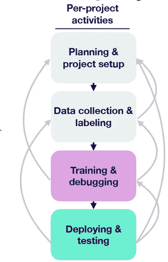

Figure 1 : Step on doing Full Stack Deep Learning project

这些是 FSDL 课程告诉我们的步骤:

1.  规划和项目设置
2.  数据收集和标记
3.  培训和调试
4.  部署和测试

其中的每一步都可以返回到上一步或前一步(不是瀑布)。课程还建议我们迭代地进行这个过程，这意味着我们从小的进步开始，并不断地提高它。例如，我们开始使用小数据的简单模型，然后随着时间的推移改进它。

# 规划和项目设置

这一步将是你要做的第一步。我们需要说明项目要做什么和项目的目标。我们还需要陈述项目的度量和基线。该步骤的子步骤如下:

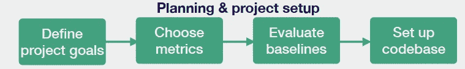

Figure 2 : Substeps of planning and project setup

## 定义项目目标


Photo by [Patrick Perkins](https://unsplash.com/@pperkins?utm_source=medium&utm_medium=referral) on [Unsplash](https://unsplash.com?utm_source=medium&utm_medium=referral)

首先，我们需要定义这个项目要做什么。选择制作什么有两个考虑因素。它们是影响力和可行性。

我们需要确保这个项目是有影响力的。你的应用程序的价值是什么，我们希望在这个项目中。您需要回答的两个问题是

1.  哪里可以利用廉价预测的优势？
2.  您可以在哪里自动化复杂的手动软件管道？

对于我们选择的应用程序产生的廉价预测，我们可以产生巨大的价值，从而降低其他任务的成本。

可行性也是我们需要注意的。由于深度学习关注数据，我们需要确保数据可用，并符合项目要求和成本预算。

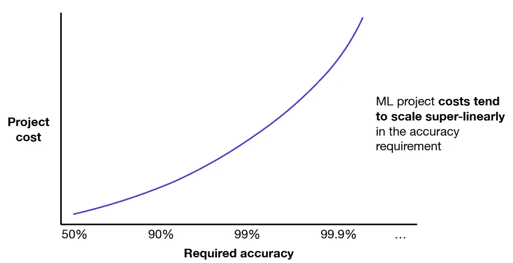

Figure 3 : The relation of project cost and required accuracy

在需要设定最低目标时，我们需要考虑准确性要求。因为项目成本往往与项目成本呈超线性相关，所以我们需要考虑我们的需求和我们可以承受的最大成本。还要考虑到可能会有一些情况，其中预测失败并不重要**，以及一些情况，其中模型必须具有**尽可能低的误差**。**

最后，需要看到问题难度。项目有多难。为了衡量难度，我们可以看一些类似问题的已发表的作品。比如在 [**ARXIV**](https://arxiv.org/) 中搜索一些论文或者任何与项目有类似问题的会议。有了这些，我们就可以把握项目的难度了。

有关评估项目可行性的更多详细信息，请参见图 4。

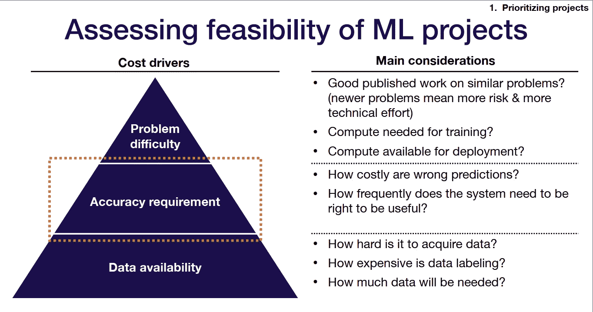

Figure 4 : Assessing feasibility of ML project

## 选择指标


[Figure 5 : example of metrics. src: https://towardsdatascience.com/precision-vs-recall-386cf9f89488](/precision-vs-recall-386cf9f89488)

度量是对系统性能或效率的特定特征的**测量**。

由于机器学习中的系统在优化单个数字上工作得最好，所以我们需要定义一个满足单个数字要求的度量，即使可能有许多度量需要计算。对于一个我们需要使用很多指标的问题，我们需要选择一个公式来组合这些指标。有:

1.  简单平均/加权平均
2.  阈值 n-1 度量，评估第 n 个度量
3.  特定于领域的公式(例如地图)

以下是如何结合两个指标(精确度和召回率)的一些例子:

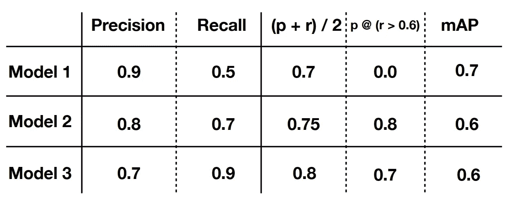

Figure 6 : Combining Precision and Recall

## 选择基线


Photo by [Nik Shuliahin](https://unsplash.com/@tjump?utm_source=medium&utm_medium=referral) on [Unsplash](https://unsplash.com?utm_source=medium&utm_medium=referral)

在我们选择了度量标准之后，我们需要选择我们的基线。基线是一个预期值或条件，绩效将根据它来衡量，以便与我们的工作进行比较。它将给我们一个预期模型性能的下限。基线越紧，基线就越有用。

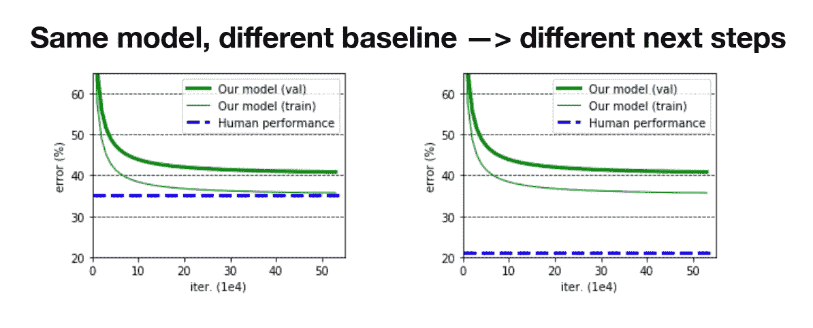

Figure 7 : Baseline

那么为什么基线很重要呢？为什么不跳过这一步？我们可以通过与基线比较来衡量我们的模型有多好。通过了解模型的好坏，我们可以选择下一步要调整的地方。

要寻找基线，您可以使用几个来源:

1.  **外部基线**，您从业务或工程需求中形成基线。您也可以使用发布的工作结果作为基线。
2.  **内部基线**，使用脚本基线或创建简单的机器学习(ML)模型，如使用基于标准特征的单词或使用简单模型。

基线是根据你的需要选择的。例如，如果您想要一个超越人类系统，您需要添加一个人类基线。

## 设置基本代码

创建您的代码库，这将是如何做进一步的核心步骤。代码库中的源代码可以根据项目当前要做的事情的当前需要来开发。例如，如果当前步骤是收集数据，我们将编写用于收集数据的代码(如果需要)。我们通常会来回进行这一步。

我们应该确保代码库中的源代码是可复制的和可扩展的，尤其是在团队中做项目的时候。要做到这一点，你需要使用正确的工具。这篇文章稍后会告诉我们。

# 数据收集和标记

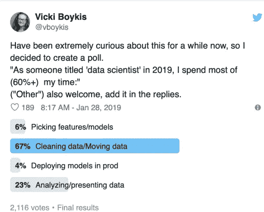

Figure 8 : Tweet about poll time spent as data scientist

在我们定义了我们将在项目中创建什么、基线和度量标准之后，最痛苦的步骤将开始，**数据收集和标记**。

大多数深度学习应用都需要大量需要标注的数据。时间会大部分消耗在这个过程中。虽然您也可以使用公共数据集，但是我们项目所需的带标签的数据集通常是不公开的。

下面是子步骤:

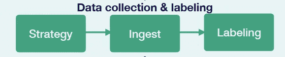

Figure 9 : substeps of data collection and labeling

## 战略


Photo by [Campaign Creators](https://unsplash.com/@campaign_creators?utm_source=medium&utm_medium=referral) on [Unsplash](https://unsplash.com?utm_source=medium&utm_medium=referral)

我们需要计划如何获得完整的数据集。有多种方法可以获得数据。你应该考虑的一点是，数据需要根据我们想要在项目中创建的内容进行对齐。

## 吸收

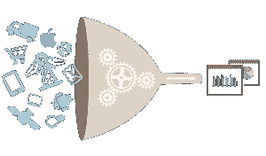

Source : [https://pushshift.io/ingesting-data%E2%80%8A-%E2%80%8Ausing-high-performance-python-code-to-collect-data/](https://pushshift.io/ingesting-data%E2%80%8A-%E2%80%8Ausing-high-performance-python-code-to-collect-data/)

如果获取数据的策略是通过互联网抓取一些网站，我们需要使用一些工具来完成。Scrapy 是对项目有帮助的工具之一

**刺儿头**


Source : [http://rafaelsilva.com/for-students/directed-research/scrapy-logo-big/](http://rafaelsilva.com/for-students/directed-research/scrapy-logo-big/)

这是一个 Python scrapper 和数据爬虫库，可以用来抓取和抓取网站。它可用于收集网站上的图像和文本等数据。我们也可以用这个从必应、谷歌或 Instagram 上删除图片。要使用这个库，我们需要学习也可以在它的网站上找到的教程。别担心，这不难学。

在我们收集数据之后，你需要考虑的下一个问题是把你收集的数据发送到哪里。因为你不是一个人在做这个项目，所以你需要确保每个人都可以访问这些数据。此外，我们需要选择将要保存的数据的格式。当我们想把数据保存在云中时，下面是一个解决方案。

**对象存储**

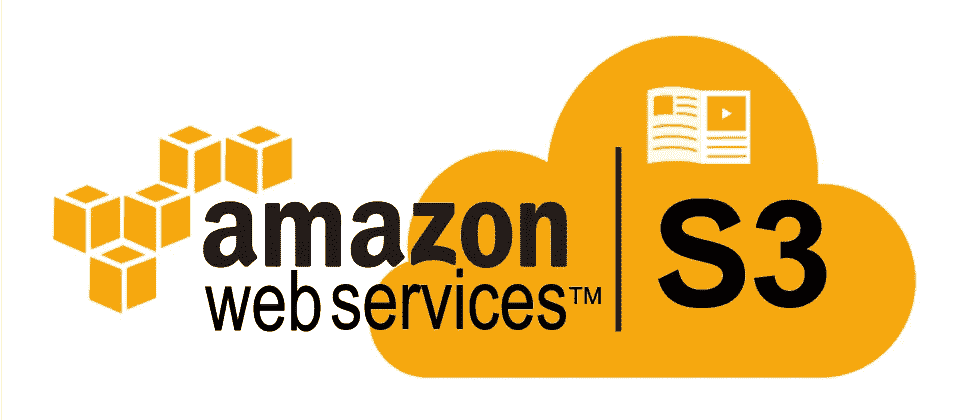

[Source : https://cloudacademy.com/blog/amazon-s3-vs-amazon-glacier-a-simple-backup-strategy-in-the-cloud/](https://cloudacademy.com/blog/amazon-s3-vs-amazon-glacier-a-simple-backup-strategy-in-the-cloud/)

对于存储图像和视频等二进制数据，您可以使用云存储，如 [**【亚马逊 3】**](https://aws.amazon.com/s3/)**或[](https://cloud.google.com/)****等，通过 API 在文件系统上构建对象存储。我们还可以在服务中内置版本控制。更多详情请见他们的网站。需要付费才能使用(也有免费计划)。******

********数据库********

****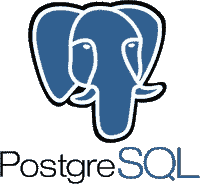****

****[Source : https://aws.amazon.com/rds/postgresql/](https://aws.amazon.com/rds/postgresql/)****

****数据库用于结构化数据的持久、快速、可伸缩的存储和检索。数据库用于保存经常被连续访问的非二进制数据。您将在这里保存元数据(标签、用户活动)。你可以使用一些工具。推荐的一个是[**PostgreSQL**](https://www.postgresql.org/)。****

****它可以存储结构化的 SQL 数据库，也可以用来保存非结构化的 json 数据。它仍在积极维护中。****

******数据湖******

****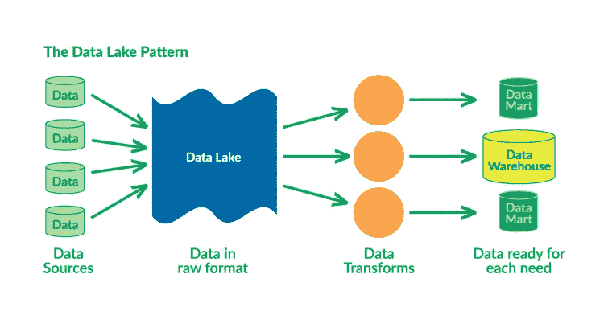****

****Figure 10 : Data lake pattern****

****当您的数据是来自多个来源和多种格式的非结构化聚集，并且转换成本很高时，您可以使用数据湖。基本上，你把所有的数据都转储到它上面，它就会把这些数据转化成特定的需求。****

****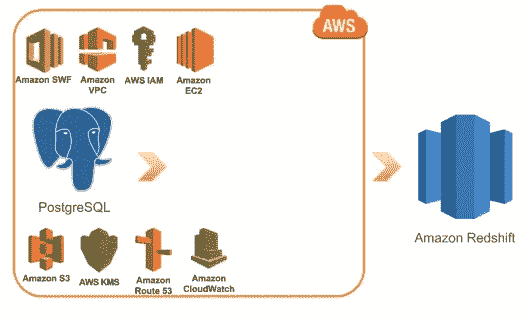****

****Figure 11 : Amazon redshift****

****亚马逊红移是解决数据湖的一个可行方案。****

****当我们进行训练过程时，我们需要将您的模型所需的数据移动到您的文件系统中。****

****数据应该**版本化**以确保进度是可恢复的。版本控制不仅适用于源代码，也适用于数据。在讨论完数据标记之后，我们将深入研究数据版本控制。****

## ****数据标记****

********

****Figure 12 : Data labeling solution****

****在这一节中，我们将知道如何标记数据。您可以使用以下资源来标记数据:****

1.  ****自己雇佣注释者****
2.  ****众包([土耳其机器人](https://www.mturk.com/))****
3.  ****使用[**figure eight**](https://www.figure-eight.com/)[**scale . ai**](https://scale.ai/)[**label box**](http://labelbox.com)等全业务数据标注公司****

****如果您希望团队对其进行注释，您可以使用以下几个工具:****

****[**data Turks**](https://dataturks.com/)****

********

****Source : dataturks.com****

****在线协作注释工具 Data Turks。对于免费计划，它被限制为 10000 个注释，并且数据必须是公开的。它为 NLP(序列标记、分类等)和计算机视觉(图像分割、图像包围盒、分类等)的一些任务提供了一些注释工具。FSDL 的课程用这个作为标记的工具。****

****[多卡诺 ](https://github.com/chakki-works/doccano)****

****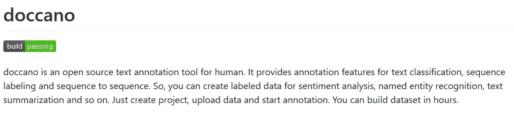****

****Source : [https://github.com/chakki-works/doccano](https://github.com/chakki-works/doccano)****

****NLP 任务的免费开源注释工具。它还支持序列标记、分类和机器翻译任务。也可以设置成一个协作注释工具，但它需要一个服务器。****

****[**CVAT**](https://github.com/opencv/cvat)****

****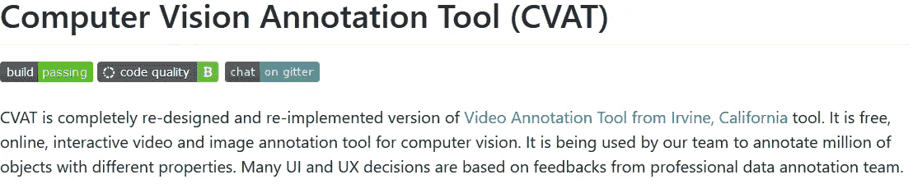****

****Source : [https://github.com/opencv/cvat](https://github.com/opencv/cvat)****

****用于计算机视觉任务的离线注释工具。它是由英特尔作为开源软件发布的。它可以标记边界框和图像分割。****

## ****公共数据集****

****如果您想搜索任何公共数据集，请参见 Stacy Stanford[创建的这篇文章](https://medium.com/u/937712f14440?source=post_page-----a21eda6227b1--------------------------------)以了解任何公共数据集的列表。****

****[](https://medium.com/towards-artificial-intelligence/the-50-best-public-datasets-for-machine-learning-d80e9f030279) [## 机器学习和数据科学的最佳公共数据集

### 机器学习和数据科学最好的数据集是什么？经过数小时对数据集的审查，我们已经…

medium.com](https://medium.com/towards-artificial-intelligence/the-50-best-public-datasets-for-machine-learning-d80e9f030279) 

它仍在积极地更新和维护。

## 数据版本化

关于如何进行数据版本控制，有几个层次:

1.  **0 级**:未版本化。我们不应该尝试这样做。部署需要版本化。如果数据没有版本化，那么部署的模型也没有版本化。如果我们使用未版本化的，会有一个问题，那就是无法回到以前的结果。
2.  **一级**:通过快照版本化。我们存储不同版本上使用的所有数据。我们可以说它有点粗糙。我们仍然需要像编写代码一样简单地编写数据版本
3.  **级别 2** :数据被版本化为代码和资产的混合。沉重的文件将被存储在其他服务器(如亚马逊 S3)，那里有一个 JSON 或类似类型的相关元数据的参考。相关元数据可以包含标签、用户活动等。JSON 文件将被版本化。JSON 文件会变得很大。为了更简单，我们可以使用 **git-lfs** 来版本化它。这个水平做项目应该是可以接受的。
4.  **第三级**:使用专门的软件解决方案对数据进行版本控制。如果你觉得 2 级对你的项目来说还不够，可以这样做。数据版本化的工具之一是 **DVC** 。

[**DVC**](https://dvc.org/)

****

**Source : [https://dvc.org/](https://dvc.org/)**

**DVC 的建立是为了让 ML 模型可以共享和复制。它旨在处理大型文件、数据集、机器学习模型、指标和代码。这是一个为 ML 模型及其数据集版本化的解决方案。我们可以将版本控制连接到云存储中，如亚马逊 S3 和 GCP。****** 

# ******代码库开发******

******当我们做项目时，期望在做好每一步的基础上编写代码。当我们写代码时，可再现性是我们必须关心的一件事。我们需要确保我们的代码库具有可重复性。******

******在我们深入工具之前，我们需要选择我们代码库的语言和框架。******

## ******程序设计语言******

******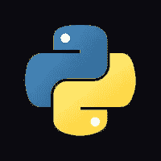******

******Source : [https://www.python.org/](https://www.python.org/)******

******对于选择编程语言，我更喜欢 [Python](https://www.python.org/) 而不是其他。Python 拥有最大的数据科学社区，非常值得开发。流行的深度学习软件也大多由 Python 支持。这种语言也很容易学。******

## ******深度学习框架******

******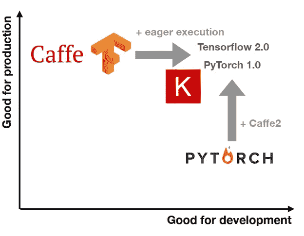******

******Figure 13 : DL Framework production and development diagram******

******对于深度学习框架，您可以做出几种选择。Python 中最流行框架是 Tensorflow、Keras 和 PyTorch。用你喜欢的那个。******

******为了更容易调试，可以使用 **PyTorch** 作为深度学习框架。 **Keras** 也很好用，有很好的 UX。它是 Tensorflow、Theano 和其他深度学习框架的包装器，使其更易于使用。 **Tensorflow** 如果你喜欢他们的环境也是一个选择。Tensorflow 能够做出明智的决策，是因为它的社区提供了支持，并且拥有出色的部署工具。******

****不要担心部署。有一种软件可以将模型格式转换成另一种格式。例如，您可以将由 **Pytorch** 生成的模型转换为 **Tensorflow** 。我们稍后会看到这一点。****

****我认为选择语言和框架的因素是它背后的社区有多活跃。因为它将产生大量可以集成到其中定制包。****

## ****版本控制****

****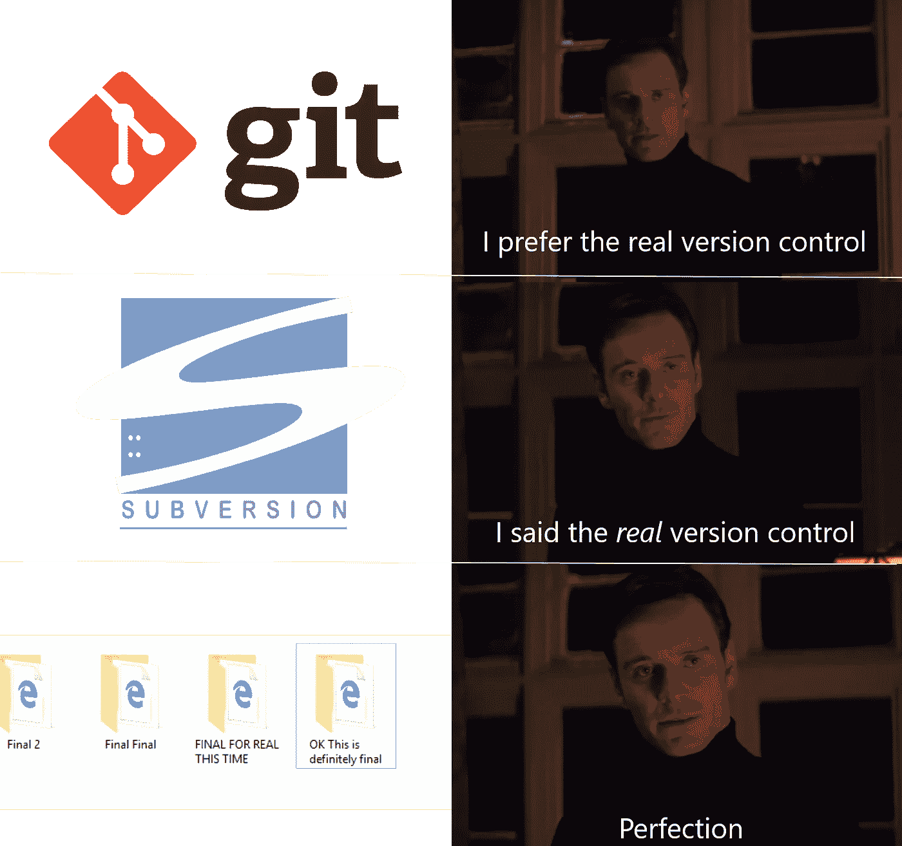****

****Source : [https://www.reddit.com/r/ProgrammerHumor/comments/72rki5/the_real_version_control/](https://www.reddit.com/r/ProgrammerHumor/comments/72rki5/the_real_version_control/)****

****做项目的时候很重要的一件事就是版本控制。当我们做项目时，我们不希望当有人意外破坏我们的代码库时无法重做。我们还需要跟踪每次更新的代码，以查看其他人更新了哪些更改。如果我们不使用一些工具，这是不可能的。 **Git** 是做这件事的解决方案之一。****

****好的，我们知道版本控制很重要，尤其是在协作工作中。目前， [**git**](https://git-scm.com/) 是做版本控制的最佳方案之一。它也可以用来和你团队中的其他人分享你的代码。没有这一点，我不认为你能在项目中与其他人合作得很好。****

****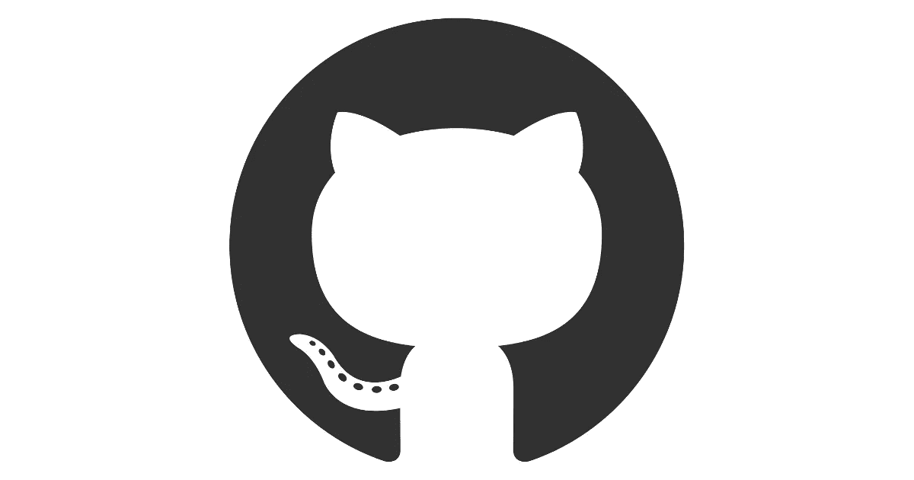****

****Source : GitHub****

****有几个可以使用 Git 的服务，比如 [**GitHub**](http://github.com) 、 [**BitBucket**](https://bitbucket.org/) 和 [**GitLab**](https://gitlab.com/) 。****

## ****代码审查****

****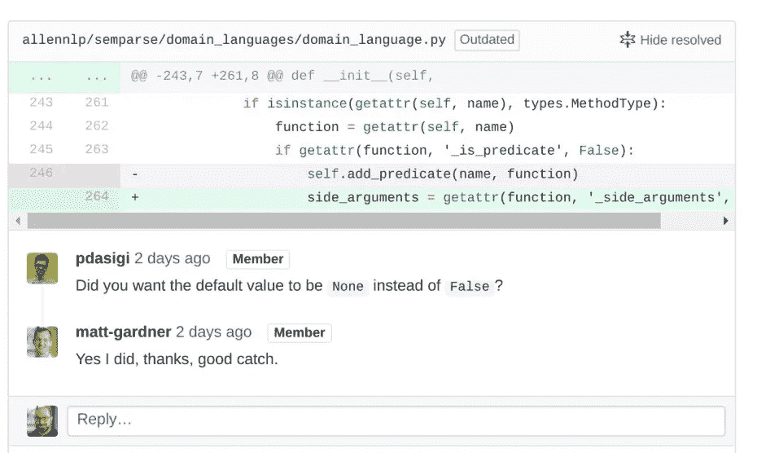****

****Figure 14 : Code Review****

****还有一件重要的事情应该做，那就是**代码审查**。代码审查是对通过单元或集成测试的不正确代码或质量差的代码的早期保护。当您进行协作时，让某人检查您的代码并对其进行评审。大多数版本控制服务应该支持这个特性。****

## ****项目结构****

****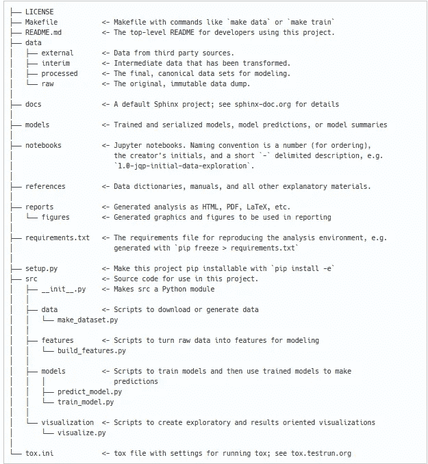****

****Figure 15 : Example of folder structure. Source : [https://drivendata.github.io/cookiecutter-data-science/](https://drivendata.github.io/cookiecutter-data-science/)****

****当我们第一次创建项目结构文件夹时，我们一定想知道如何创建文件夹结构。然后，我们放弃，把所有的代码放到根项目文件夹里。给出质量差的代码是一种不好的做法。****

****我发现的解决方案之一是[烹饪数据科学](https://drivendata.github.io/cookiecutter-data-science/)。它给出了一个模板，我们应该如何创建项目结构。它也给出了如何给创建的文件命名，以及你应该把它放在哪里。一定要用它来使你的代码库不会变得凌乱。考虑阅读网站来使用它。****

## ****集成开发环境(IDE)****

****IDE 是可以用来加速编写代码的工具之一。它集成了对开发有用的工具。有几种 ide 可供您使用:****

****[**皮查姆**](https://www.jetbrains.com/pycharm/)****

********

****Source : [http://www.jetbrains.com/pycharm](http://www.jetbrains.com/pycharm)****

****JetBrains 发布的 IDE。该 IDE 不仅可以用于深度学习项目，还可以用于其他项目，如 web 开发。Pycharm 具有自动代码完成、代码清理、重构功能，并与其他工具集成，这对于使用 Python 开发非常重要(首先需要安装插件)。它有很好的调试环境。它还可以运行笔记本(。ipynb)文件。****

****[](https://jupyterlab.readthedocs.io/en/stable/)****

******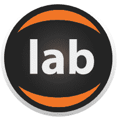******

******Source : [https://github.com/jupyterlab/](https://github.com/jupyterlab/)******

******Jupyter Lab 是一个易于使用的 IDE，交互式数据科学环境工具，它不仅可以用作 IDE，还可以用作演示工具。用户界面(UI)最好把这个作为一个可视化工具或者一个教程工具。我们可以用 markdown 格式制作文档，也可以在笔记本上插入图片。******

******就我个人而言，我使用 **Pycharm** 编写源代码。当我创建一些教程来测试一些东西或进行探索性数据分析(EDA)时，我会使用 **Jupyter Lab** 来完成。只是不要把你的可重用代码放到你的笔记本文件里，它的可复制性很差。******

## ****连续累计****

> ****“嘿，什么鬼东西！？为什么我无法在此版本中运行培训流程”-A****
> 
> ****“Idk，我只是推我的代码，我认为它在我的笔记本上工作..等一下..我在这条线上得到一个错误..我没有将所有代码复制到我的实现中”——B****
> 
> ****“那你为什么推！？！?"—答****

****在我们将我们的工作推送到存储库之前，我们需要确保代码确实有效并且没有错误。为此，我们应该在将模型和代码推送到存储库之前测试代码。必须完成单元或集成测试。****

****单元测试测试代码应该通过的模块功能。集成测试测试模块的集成。它会检查你的逻辑是否正确。这样做是为了在做实验前发现你的错误。****

****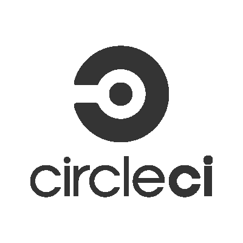****

****Source : [circleci.com](http://circcleci.com)****

****[**CircleCI**](http://circleci.com) 是做持续集成的解决方案之一。它可以进行单元测试和集成测试。它可以使用 Docker Image(我们稍后将深入讨论)作为环境的容器化(我们应该使用它)。可以做到这一点的类似工具有[](https://jenkins.io/)****和[**TravisCI**](https://travis-ci.org/)**。**********

****如果您想用 Python 测试代码，可以使用以下几个库:****

****`[pipenv check](https://github.com/pypa/pipenv)` **:** 扫描我们的 Python 包依赖图，寻找已知的安全漏洞****

****`[pylint](https://github.com/PyCQA/pylint)`:对 Python 文件进行静态分析，并报告样式和 bug 问题。****

****`[mypy](https://github.com/python/mypy)`:对 Python 文件进行静态分析检查****

****`[bandit](https://github.com/PyCQA/bandit)`:执行静态分析，查找 Python 代码中常见的安全漏洞****

****`[shellcheck](https://github.com/koalaman/shellcheck)`:查找 shell 脚本中的错误和潜在错误(如果使用的话)****

****`[pytest](https://github.com/pytest-dev/pytest)`:用于进行单元和集成测试的 Python 测试库****

****将它们写入您的 CI，并确保通过这些测试。如果失败了，那么重写你的代码，并知道代码中的错误在哪里。****

****这是一个在深度学习系统上编写单元测试的例子。****

****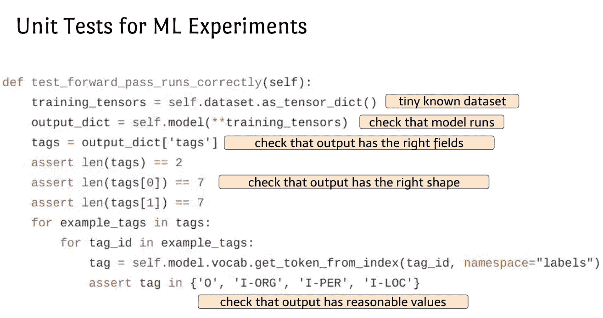****

****Figure 16 : Example of doing unit test in ML experiments****

## ****海关环境和集装箱化****

> ****“嘿，我已经在我的电脑上测试过了，效果很好”****
> 
> ****“什么？不，老兄，它在我的电脑上失败了？它是如何在你的电脑上工作的！?"****

****有过这种经历吗？我有。造成这种情况的原因之一是你的工作环境与其他人的不同。例如，你在 Windows 上工作，另一个在 Linux 上工作。你的库和他们的库的差异也可能是问题的导火索。****

****为了解决这个问题，您需要在一个名为`requirements.txt`的文本中显式地编写您的库依赖关系。然后运行 Python 虚拟环境如`[pipenv](https://github.com/pypa/pipenv).`这将解决库依赖。尽管如此，它仍然不能解决团队的环境和操作系统的差异。要解决，可以用 **Docker。******

********

****Source : docker.com****

****Docker 是一个可以设置成虚拟环境的容器。我们可以安装我们在 Docker 中设置的库依赖项和其他环境变量。有了这个，你就不用担心会因为环境的不同而产生误差。当我们想要部署应用程序时，Docker 也是一个重要的工具。它会强制部署的地方使用期望的环境。****

****为了共享容器，首先，我们需要将创建环境的所有步骤写入 **Dockerfile** ，然后创建一个 **DockerImage** 。可以推入 **DockerHub** 中。然后另一个人可以从 **DockerHub** 中拉出 **DockerImage** 并从他/她的机器上运行它。****

****要了解关于 Docker 的更多信息，有一篇由 Preethi Kasireddy 撰写的初学者友好的好文章。****

****[](https://medium.freecodecamp.org/a-beginner-friendly-introduction-to-containers-vms-and-docker-79a9e3e119b) [## 对初学者友好的容器、虚拟机和 Docker 介绍

### 如果你是一个程序员或技术人员，你可能至少听说过 Docker:一个打包、运输…

medium.freecodecamp.org](https://medium.freecodecamp.org/a-beginner-friendly-introduction-to-containers-vms-and-docker-79a9e3e119b) 

图 17 是一个如何创建 Dockerfile 文件的例子。

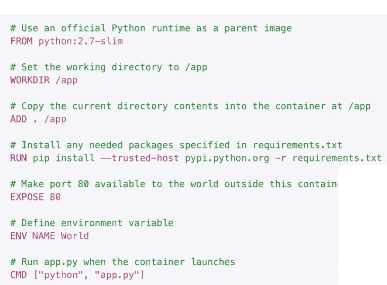

Figure 17 : Example of Dockerfile**** 

# ****培训和调试****

****现在我们正处于训练和调试阶段。这是你做实验和制作模型的步骤。这一步的子步骤如下:****

****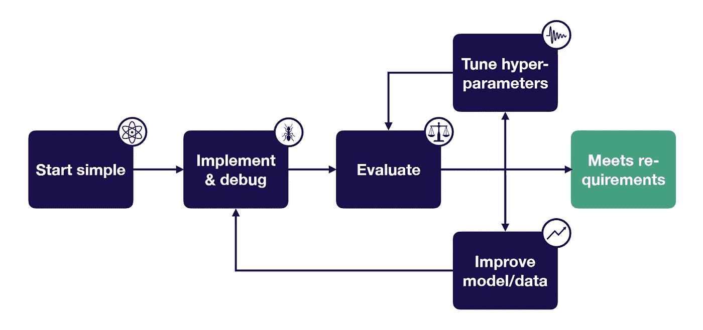****

****FIgure 18 : Substeps Training and Debugging****

## ****从简单开始****

****使用您选择的深度学习框架，用简单的架构对神经网络进行编码(例如:具有 1 个隐藏层的神经网络)。然后使用默认的超参数，如无正则化和默认的 Adam 优化器。如果需要，不要忘记规范化输入。最后，使用模型的简单版本(例如:小数据集)。****

## ****实施和调试****

****实现神经网络，有几个技巧，你应该按照顺序。****

1.  ******让模型运行******

****我们应该做的是让你用你的 DL 框架创建的模型**运行**。这意味着要确保在更新权重的过程中没有异常发生。****

****经常发生的异常如下:****

1.  ****形状不匹配****
2.  ****铸造问题****
3.  ****被遗忘****

******2。超配单个批次******

****之后，我们应该对单个批次进行过度拟合，以观察模型是否可以学习。过度拟合意味着我们根本不关心验证，而是关注我们的模型是否能够根据我们的需要进行学习。我们这样做，直到模型的质量变得过拟合(~100%)。以下是此过程中出现的常见问题:****

1.  ****错误上升(可能由以下原因引起:学习率过高、错误的损失函数符号等)****
2.  ****错误爆发/变得异常(可能由以下原因引起:数值问题，如对数运算、经验或高学习率等)****
3.  ****错误振荡(可能由以下原因引起:损坏的数据标签、学习率过高等)****
4.  ****错误平台(可能由以下原因引起:学习率太低、数据标签损坏等)****

******3。与已知结果比较******

****在我们确保我们的模型训练良好之后，我们需要将结果与其他已知结果进行比较。下面是已知结果的层次结构:****

****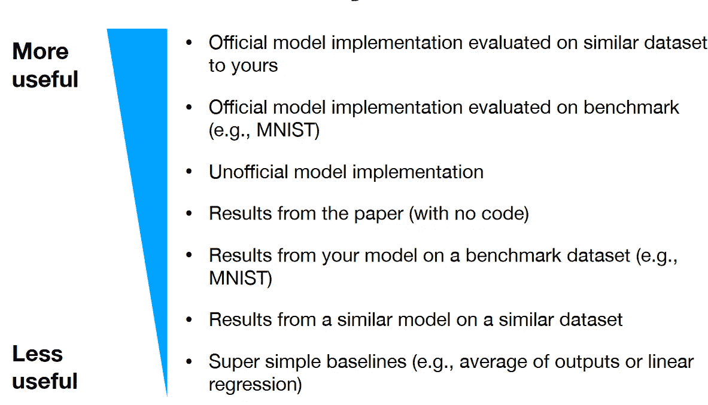****

****Figure 19 : Hierarchy of known results****

****我们这样做是为了确保我们的模型能够真正学习数据，并看到模型在学习任务的正确轨道上。我们将需要不断迭代，直到模型能够达到预期的性能。****

## ****评价****

****我们将通过计算误差来计算**偏差-方差分解**，该误差是用我们当前最佳模型的所选度量来计算的。偏差-方差分解的计算公式如下:****

********

******其中**:****

```
**irreducible error = the error of the baseline
bias = training error - iredducible error
variance = validation error - train error
validation overfitting = test error - validation error**
```

****下面是一些实现偏差-方差分解的例子。****

********

****Figure 20 : Breakdown of test error****

****通过了解偏差、方差和验证过拟合的值，它可以帮助我们选择下一步要改进的内容。****

****如果模型已经满足了需求，那么就部署模型。如果没有，那么通过使用评估的结果来解决是改进数据还是调整超参数的问题。在预测某组实例时，考虑看看模型有什么问题。迭代直到满足需求(或者放弃)。****

******这里有一些工具对这一步很有帮助:******

## ****版本控制****

****又来了，版本控制。是的，我们对代码和数据进行了版本控制，现在是对模型进行版本控制的时候了。以下是可用于版本控制的工具:****

****[WANDB](https://www.wandb.com/)****

********

****Source : Wandb.com****

****模型结果的版本控制。它有很好的用户界面和体验。然后，它可以保存模型上使用的参数、模型结果的样本，并且还可以保存将被版本化的模型的权重和偏差。此外，它可以实时可视化模型的结果。此外，我们还可以将模型恢复到之前的运行(也可以将模型的权重更改为之前的运行)，这使得模型的重现更加容易。它可以随时运行。它还可以很好地扩展，因为它可以与 Kubeflow (Kubernetes for ML，它为容器化的应用程序管理资源和服务)集成。****

******无损耗******

********

****Source : Losswise.com****

****它也是对模型进行版本控制的版本控制。它还实时保存用于实验的模型和超参数的结果。它还可以估计模型何时完成训练。每当您将代码推送到存储库(在指定的分支上)时，它都会训练模型。它还可以实时显示模型的结果。****

## ****超参数优化****

****当优化或调整学习率这样的超参数时，有一些库和工具可以用来做这件事。有:****

****对于 Keras DL 框架: [Hyperas](https://github.com/maxpumperla/hyperas) ，****

****对于 Pytorch DL 框架:[超搜索](https://github.com/kevinzakka/hypersearch)****

****其他:[远视](http://hyperopt.github.io/hyperopt/)****

******WANDB** 还提供超参数优化解决方案。不过，您需要先联系他们才能启用它。****

# ****部署****

****最后一步将是这一步。子步骤如下:****

********

****Figure 21 : Substeps of Deploying & Testing****

******试生产**意味着您将通过在选定的最终用户群中测试来验证系统。通过这样做，我们希望能够在全面部署之前获得系统的反馈。对于测试，除了单元测试和集成测试之外，你还可以对你的系统进行一些测试，例如:渗透测试、压力测试等等。****

****在我们确定模型和系统已经满足需求之后，就该部署模型了。首先，有几种部署模型的方法。有:****

1.  ****Web 服务器部署****
2.  ****嵌入式系统和移动设备****

******Web 服务器部署******

****如果我们想部署到网站上，我们可以使用几种策略。在此之前，我们需要确保我们创建了一个 RESTful API，用于响应 HTTP 请求(GET、POST、DELETE 等)的预测。这些战略如下:****

1.  ****将代码部署到云实例。通过添加实例进行缩放。****
2.  ****将代码部署为容器(Docker)，通过编排进行扩展。应用程序代码被打包到 Docker 容器中。例子:[AWS Fargate。](https://aws.amazon.com/fargate/)****
3.  ****将代码部署为“无服务器功能”。应用程序代码被打包成 zip 文件。无服务器功能将管理一切。例如:即时扩展、每秒请求数、负载平衡等。它不同于上述两个，无服务器功能只支付计算时间，而不是正常运行时间。例如: [**AWS Lambda**](https://aws.amazon.com/lambda/) ，[**Google Cloud Functions**](https://cloud.google.com/functions/)，[**Azure Functions**](https://azure.microsoft.com/en-us/services/functions/)****

****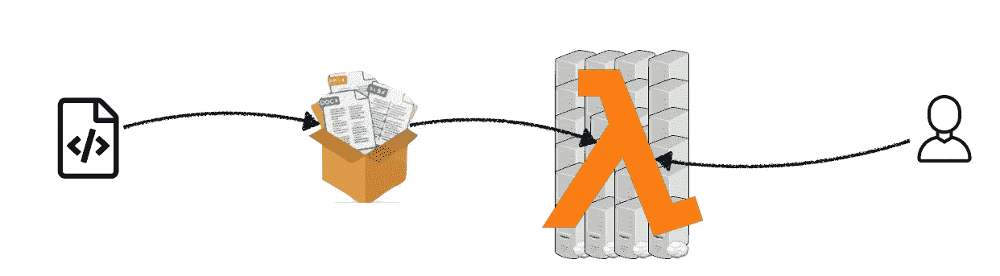****

****Figure 22 : Amazon Lambda****

******嵌入式系统和手机******

****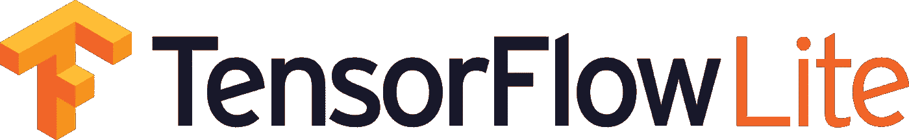****

****Source : [https://developers.googleblog.com/2017/11/announcing-tensorflow-lite.html](https://developers.googleblog.com/2017/11/announcing-tensorflow-lite.html)****

****要部署到嵌入式系统或手机上，我们可以使用[**tensor flow Lite**](https://www.tensorflow.org/lite)。与 Tensorflow 相比，它体积更小，速度更快，依赖性更小，因此可以部署到嵌入式系统或移动设备中。不幸的是，它的操作数有限。****

****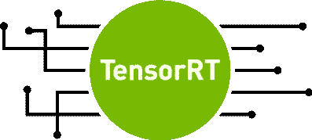****

****Source : [https://devblogs.nvidia.com/speed-up-inference-tensorrt/](https://devblogs.nvidia.com/speed-up-inference-tensorrt/)****

****还有一个工具叫 [**TensorRT**](https://developer.nvidia.com/tensorrt) 。它优化了用于预测的推理机，从而加快了推理过程。它是基于 CUDA 构建的。在嵌入式系统上，NVIDIA Jetson TX2 可以很好地配合它。****

****在苹果上，有一个叫做 [CoreML](https://developer.apple.com/documentation/coreml) 的工具，可以更容易的将 ML 系统集成到 IPhone 上。还有类似的工具叫做 [MLKit](https://developers.google.com/ml-kit/) ，可以用来帮助将 ML 系统部署到 Android 上。****

## ****交换****

********

****Source : [https://onnx.ai/](https://onnx.ai/)****

****[ONNX](https://onnx.ai/) (开放神经网络交换)是深度学习模型的开源格式，可以很容易地将模型转换成支持的深度学习框架。ONNX 支持 Tensorflow、Pytorch 和 Caffe2。它可以混合不同的框架，这样适合开发的框架(Pytorch)不需要擅长部署和推理(Tensorflow / Caffe2)。****

## ****监视****

****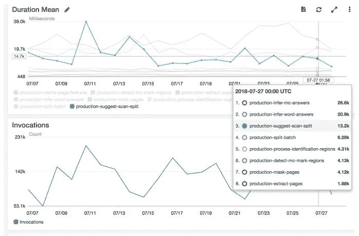****

****Figure 23 : Example of monitoing in AWS****

****如果把应用部署到云服务器，应该有监控系统的解决方案。当事情出错时，我们可以通过在监控系统中写入相关记录来设置警报。有了这个，我们就知道模型可以改进什么，并解决问题。****

# ****结论****

****在这篇文章中，我们根据 2019 年 3 月的 FSDL 课程，了解了做全栈深度学习的步骤。首先，我们需要设置和计划项目。在这一步中，我们需要定义目标、指标和基线。然后，我们收集数据并用可用的工具对其进行标记。在构建代码库的过程中，有一些工具可以保持上面描述的项目的质量。然后我们通过测试和调试进行建模。在模型满足需求之后，我们最终知道了将应用程序部署和监控到所需界面的步骤和工具。****

# ****编后记****

********

****Photo by [Joshua Hoehne](https://unsplash.com/@mrthetrain?utm_source=medium&utm_medium=referral) on [Unsplash](https://unsplash.com?utm_source=medium&utm_medium=referral)****

****就是这样，我的关于我所学课程介绍的工具和步骤的文章。我为什么写这篇文章？我发现我的大脑可以很容易地记住并让我更好地理解我需要的东西的内容。此外，在我写作的过程中，我有机会复习课程内容。此外，它可以让我分享我的知识给每个人。我很乐意把好的东西分享给大家:)。****

****在学习那门课程的过程中，我获得了很多新的东西，尤其是关于深度学习堆栈的工具。我还知道如何在深度学习中排除模型故障，因为它不容易调试。它还教会了我进行全栈深度学习的工具、步骤和技巧。总而言之，这是一门很棒的课程，而且可以免费使用。所以我推荐给任何想学习深度学习做项目的人。****

****说实话，我还没有尝试过本文所写的所有工具。本文介绍的工具及其描述摘自 FSDL 课程和我读过的一些资料。你可以告诉我是否有错误的信息，尤其是关于工具的。****

****因此，****

> ****我欢迎任何可以提高我自己和这篇文章的反馈。我正在学习写作，学习变得更好。我感激能让我变得更好的反馈。确保以适当的方式给出反馈😄。****

****在我的下一篇文章中再见。****

********

****Source : [https://cdn.pixabay.com/photo/2017/07/10/16/07/thank-you-2490552_1280.png](https://cdn.pixabay.com/photo/2017/07/10/16/07/thank-you-2490552_1280.png)****

******来源******

****[](https://www.guru99.com/pilot-testing.html) [## 什么是试点测试？定义、含义、示例

### 试点测试是在实时操作条件下验证系统的一个组件或整个系统。它…

www.guru99.com](https://www.guru99.com/pilot-testing.html) [](https://medium.com/data-ops/throw-your-data-in-a-lake-32cd21b6de02) [## 把你的数据扔进湖里

### 许多企业在不同的孤岛中组织数据，这使得询问需要数据的问题变得更加困难…

medium.com](https://medium.com/data-ops/throw-your-data-in-a-lake-32cd21b6de02) 

由[数据厨房](https://medium.com/u/d1a05acf3f79?source=post_page-----a21eda6227b1--------------------------------)

[https://docs . Google . com/Presentation/d/1 yhlpvphus 2 kgi 5 zwo 0 su-pku 3 gimak 3 its 38 z-B5Gw/](https://docs.google.com/presentation/d/1yHLPvPhUs2KGI5ZWo0sU-PKU3GimAk3iTsI38Z-B5Gw/)(ICLR 2019 关于再现性的演讲由 **Joel Grus** )。图 14 和 16 取自这个来源。

[](https://fullstackdeeplearning.com/) [## 全栈深度学习

### 面向熟悉深度学习基础、寻求扩展技能的软件开发人员的实践计划。

fullstackdeeplearning.com](https://fullstackdeeplearning.com/) 

其他数字取自这一来源。****