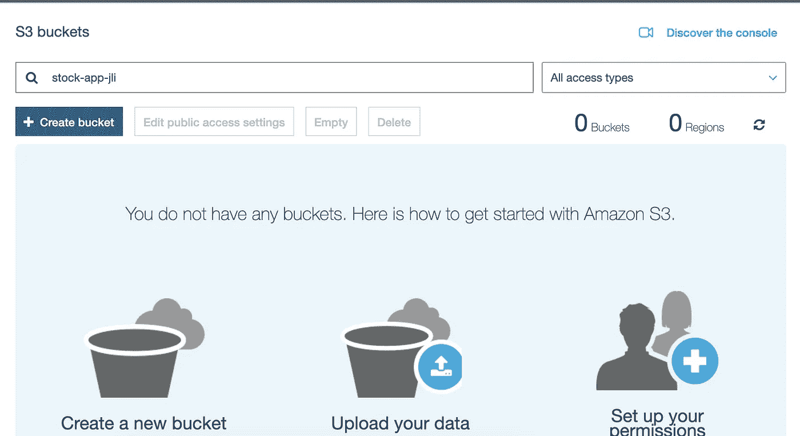
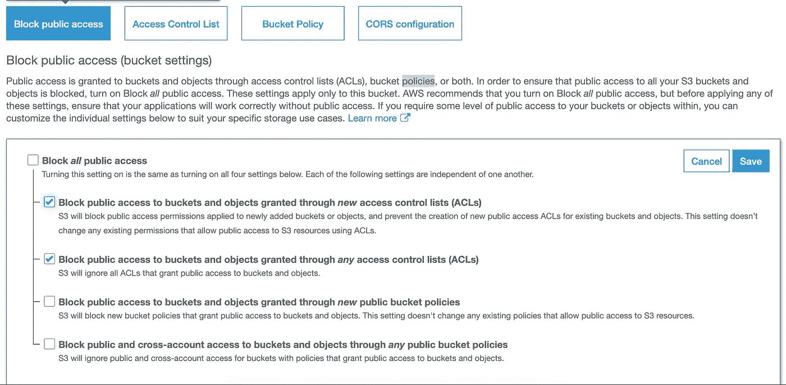
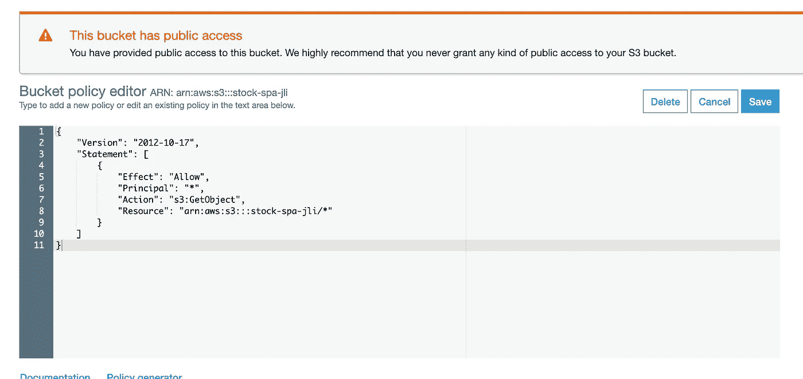
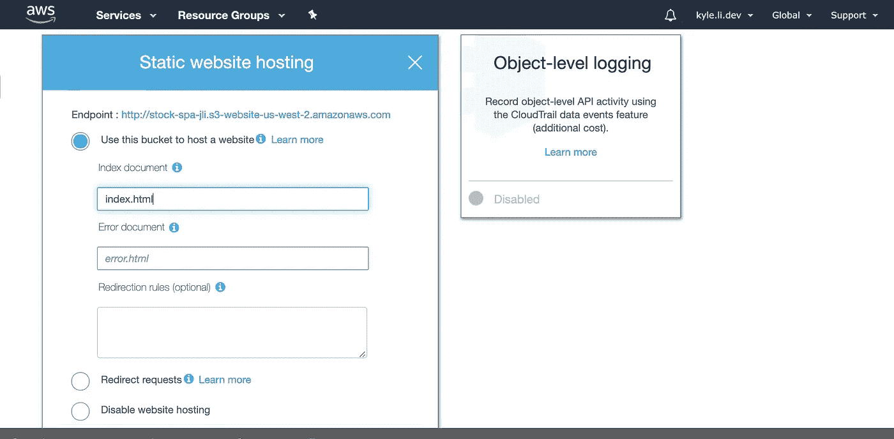
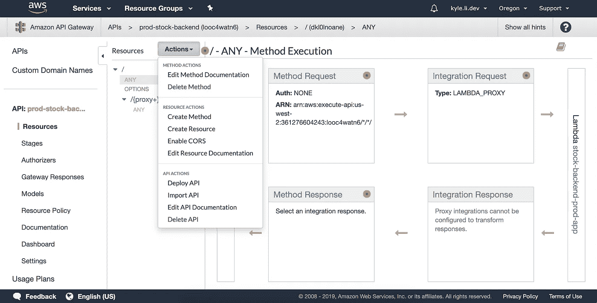
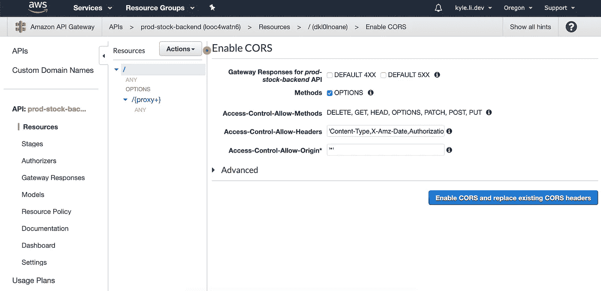
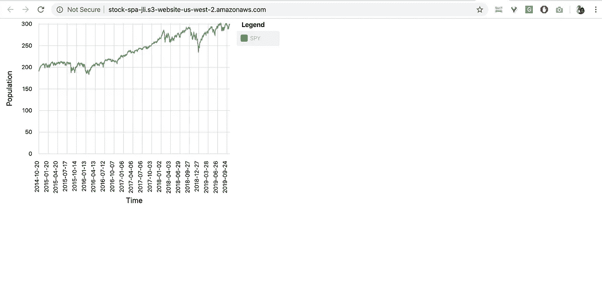

# 全栈开发教程:将 AWS Lambda 无服务器服务集成到 Angular SPA 中

> 原文：<https://towardsdatascience.com/full-stack-development-tutorial-integrate-aws-lambda-serverless-service-into-angular-spa-abb70bcf417f?source=collection_archive---------9----------------------->


Photo by [Stephen Dawson](https://unsplash.com/@srd844?utm_source=medium&utm_medium=referral) on [Unsplash](https://unsplash.com?utm_source=medium&utm_medium=referral)

(这篇文章也可以在[我的博客](https://kylelix7.github.io/)中找到)

这篇文章是我的全栈开发教程系列的最后一篇文章。在这篇文章中，我们将把后端 Lambda REST API 集成到我们之前开发的 Angular App 中。以前的帖子是[在 Angular SPA](/full-stack-development-tutorial-visualize-trading-data-on-angular-spa-7ec2a5749a38) 上可视化交易数据和[在 AWS Lambda](/full-stack-development-tutorial-serverless-rest-api-running-on-aws-lambda-a9a501f54405) 上运行无服务器 REST API 提供交易数据。

**更新 angular 服务，从 Lambda 调用 REST API**

首先，我们需要更新 SPA 中的服务，从 Lambda 调用 REST API，而不是返回哑数据。注意，我们已经定义了一个主题，以便图表组件可以被订阅。REST API 调用完成后。它发出历史数据。从图表组件中，它将接收该响应并对其进行一些业务逻辑处理。

更新图表组件以使用 Lambda 中的历史数据来可视化图表。在这个 typescript 中，我们从 StockDataService 订阅了 Observerable。然后，它将 Lambda 的响应分配给图表。

**发布 web 应用**

现在，我们可以为您的应用程序创建一个公共网站。首先，我们需要为 angular 应用程序部署构建生产代码。从终端运行以下命令。

```
ng build --prod
```

此命令将导致 dist 文件夹，其中包含此 SPA 的所有静态文件。我们将部署到 S3 建立一个公共网站。

**创建一个 S3 存储桶**

创建新的存储桶。除非您购买了自己的域名并为您的 web 应用程序设置了域名，否则您的域名将成为网站 url 的一部分。



接受所有默认选项并创建它。然后选择新创建的存储桶，单击 permisions。在阻止公共访问中，我们必须取消选中阻止“通过新公共存储桶策略授予的对存储桶和对象的公共访问”和“通过任何公共存储桶策略阻止对存储桶和对象的公共和跨帐户访问”，以便公共用户可以访问此 web 应用程序。



我们还需要添加一个存储桶策略。



```
{
    "Version": "2012-10-17",
    "Statement": [
        {
            "Effect": "Allow", 
            "Principal": "*", 
            "Action": "s3:GetObject", 
            "Resource": "arn:aws:s3:::[YOUR_BUCKET_NAME]/*" 
        } 
    ] 
}
```

**上传内容**

将 dist/stock-app 文件夹中的文件上传到存储桶

**启用虚拟主机**

打开属性，选择“静态网站托管”。为索引 documemt 键入 index.html，然后选中“使用此存储桶托管网站”。



现在，你应该可以在 [http:// < bucket_name >开你的 SPA 了。<your-region>. Amazon AWS . com/](http://stock-spa-jli.s3-website-us-west-2.amazonaws.com/)，我这里是 http://stock-spa-jli.s3-website-us-west-2.amazonaws.com/。但是，你会遇到一个问题。您看不到任何数据。那是因为我们的 REST API 和 API 网关不允许 CORS。我们将明确地启用它。

**启用 CORS**

接下来，我们需要在 API 网关中启用 CORS，以便 Lambda 中的 API 可以接受跨源请求。

在 AWS 控制台中打开 API 网关服务，并为我们在上一篇文章中开发的 Lambda 选择网关。选择要启用 CORS 的端点。为简单起见，我选择任意。然后在操作下拉列表中，选择启用 CORS 并确认。



**验证**

现在，我们都准备好了。您的 Lambda 应该能够为您的 SPA 提供数据。回到你在 S3 的网站。你会看到间谍的股票图表。



仅此而已。我们用 Angular 开发了一个简单的全栈 web 应用，使用无服务器框架，AWS Lambda，API gateway，S3。它是用云编队部署的。几乎所有后端 AWS Lambda 都由无服务器框架轻松处理。

建议读取:

[全面了解亚马逊网络服务(AWS)](https://www.educative.io/courses/learn-the-a-to-z-of-amazon-web-services-aws?aff=VEzk)

[AWS Lambda 在行动:事件驱动的无服务器应用第 1 版](https://www.amazon.com/gp/product/B07L9GHD6W/ref=as_li_tl?ie=UTF8&camp=1789&creative=9325&creativeASIN=B07L9GHD6W&linkCode=as2&tag=blog023b-20&linkId=8ed2825229096ab702683372bc52497a)

[亚马逊网络服务第二版](https://www.amazon.com/gp/product/1617295116/ref=as_li_tl?ie=UTF8&camp=1789&creative=9325&creativeASIN=1617295116&linkCode=as2&tag=blog023b-20&linkId=524b38e985a6ff114380a3fa96d6618c)

我的旧帖子:

[我关于金融和科技的帖子](https://medium.com/@fin.techology/my-posts-about-finance-and-tech-7b7e6b2e57f4?source=your_stories_page---------------------------)

[我关于 FAANG 访谈的帖子](https://medium.com/@fin.techology/my-posts-about-faang-interview-20e529c5f13f?source=your_stories_page---------------------------)

[从 CRUD web 应用开发到语音助手中的 SDE——我正在进行的机器学习之旅](https://medium.com/@fin.techology/from-crud-app-dev-to-sde-in-voice-assistant-my-ongoing-journey-to-ml-4ea11ec4966e?)

[全栈开发教程:用运行在 AWS Lambda 上的无服务器 REST API 提供交易数据](/full-stack-development-tutorial-serverless-rest-api-running-on-aws-lambda-a9a501f54405)

[全栈开发教程:在 Angular SPA 上可视化交易数据](/full-stack-development-tutorial-visualize-trading-data-on-angular-spa-7ec2a5749a38)

[强化学习:Q 学习简介](https://medium.com/@kyle.jinhai.li/reinforcement-learning-introduction-to-q-learning-444c951e292c)