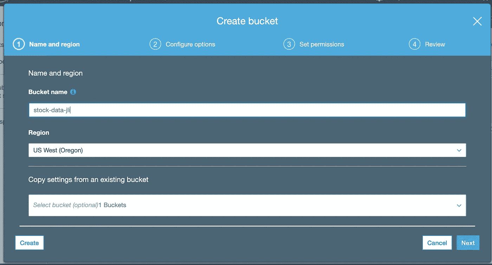
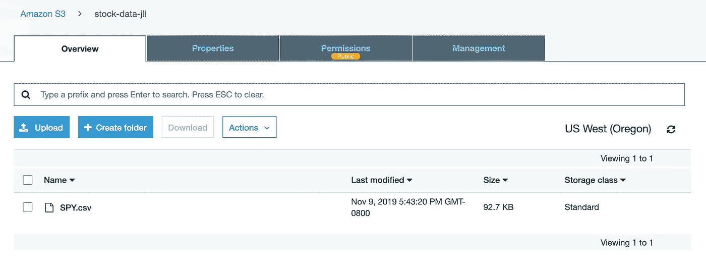
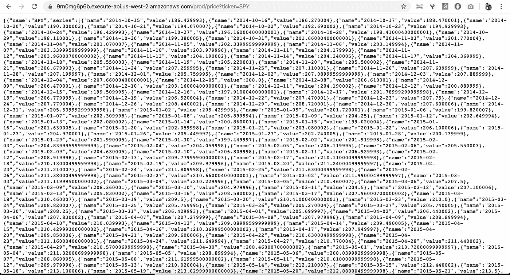

# 全栈开发教程:用运行在 AWS Lambda 上的无服务器 REST API 提供交易数据

> 原文：<https://towardsdatascience.com/full-stack-development-tutorial-serverless-rest-api-running-on-aws-lambda-a9a501f54405?source=collection_archive---------23----------------------->

> **无服务器计算**是一种[云计算](https://en.wikipedia.org/wiki/Cloud-computing) [执行模式](https://en.wikipedia.org/wiki/Execution_model)，云提供商运行服务器，动态管理机器资源的分配。定价基于应用程序消耗的实际资源量，而不是预先购买的容量单位。—维基百科


Photo by [Anthony Cantin](https://unsplash.com/@arizonanthony?utm_source=medium&utm_medium=referral) on [Unsplash](https://unsplash.com?utm_source=medium&utm_medium=referral)

(这篇文章也可以在[我的博客](https://kylelix7.github.io/)中找到)

这是我的全栈开发教程系列的第二篇文章。上一篇文章— [全栈开发教程:在 Angular SPA 上可视化交易数据](/full-stack-development-tutorial-visualize-trading-data-on-angular-spa-7ec2a5749a38)

无服务器计算的优势在于它可以在需要时执行。价格完全取决于使用情况。开发者无需维护服务器、修补安全漏洞、升级软件等。

亚马逊的 AWS 是一个事件驱动的无服务器计算平台。它拥有强大的运行时支持，包括 Node.js、Python、Java、Go、Ruby 和 C#。作为一个事件驱动的平台，Lambda 非常适合处理事件变化的场景，如“文件正在上传到 S3”，“数据库正在更新”，“物联网中接收到传感器数据”等。

在本教程中，我们将利用[无服务器框架](https://serverless.com/)为[本教程](/full-stack-development-tutorial-visualize-trading-data-on-angular-spa-7ec2a5749a38)中的股票应用程序创建一个无服务器 REST API。无服务器框架是一个开源框架，帮助在包括 AWS Lambda 在内的多个云环境中开发和部署无服务器功能。

**设计我们的端点**

遵循 REST 实践，让我们定义我们的端点/价格？ticker= <ticker_name>。和响应将如下所示，以在 UI 中显示图表。</ticker_name>

```
[
  {
    "name": "Ticker",
    "series": [
      {
        "name": "2018-11-05",
        "value": 1
      },
      {
        "name": "2018-11-07",
        "value": 1.0784432590958841
      }
    ]
  }
]
```

# 安装和设置

**AWS**

首先你需要一个 AWS 账户。如果您还没有 AWS 帐户，请注册。然后[创建一个 IAM 用户](https://docs.aws.amazon.com/IAM/latest/UserGuide/id_users_create.html#id_users_create_console)。最后，您将获得 IAM 用户的凭据。您将需要它来设置无服务器 cli，以便可以在 AWS 上部署和运行无服务器服务。

```
serverless config credentials --provider aws --key <ACCESS KEY ID> --secret <SECRET KEY>
```

**无服务器安装**

按照[说明](https://docs.docker.com/install/)安装 docker 进行部署。

# 初始化无服务器项目

为服务创建 serverless.yml 文件。它需要插件 wsgi 作为 web 服务器来运行 REST 服务。内置的 flask 开发服务器对于生产来说性能不够。注意 pythonRequirements 中的 slim 标志有助于限制源代码的大小。Lambda 的源代码有大小限制。纤细的旗帜有助于减小尺寸。因此，排除所有不必要的文件也很重要，比如 venv 中的文件。zip 标志有助于在上传到 S3 进行部署之前压缩源代码。配置的其余部分不言自明。

部署过程总结如下。无服务器框架将文件构建并打包为 zip 文件。然后，它使用 IAM 凭据将源代码上传到 S3 存储桶(该存储桶由无服务器 cli 自动创建)。然后，它利用 CloudFormation 部署 Lambda 服务。所有这些都发生在一个单一的命令中。

**实施**

实际的实现很简单。当请求历史数据时，它从 S3 抓取数据(csv 文件)并读入熊猫数据帧(S3 是一个 AWS 存储服务)。然后我们将迭代 dataframe 来构造我们上面定义的响应。当我们在 serverless.yml 中定义 Lambda 入口点 app.app 时，我们将在 app.py 中编写我们的服务。

在运行我们的应用程序之前，从 Yahoo finance 下载历史股票数据，并将其放在一个名为 data 的目录中。

然后运行本地启动应用程序。

```
(venv) **➜  stock-backend** python app.py* Serving Flask app "app" (lazy loading)* Environment: productionWARNING: This is a development server. Do not use it in a production deployment.Use a production WSGI server instead.* Debug mode: on* Running on http://127.0.0.1:5000/ (Press CTRL+C to quit)* Restarting with stat* Debugger is active!* Debugger PIN: 248-351-201
```

从现在开始，您可以验证您的 REST 端点是否工作。假设您在数据目录中有一个 SPY.csv 文件。打开浏览器输入[http://127 . 0 . 0 . 1:5000/price？地址栏里的 ticker=SPY](http://127.0.0.1:5000/price?ticker=SPY) 。JSON 响应的结果将显示在您的浏览器中。

```
[
  {
    "name": "SPY", 
    "series": [
      {
        "name": "2014-10-20", 
        "value": 190.300003
      }, 
      {
        "name": "2014-10-21", 
        "value": 194.070007
      }, 
      {
        "name": "2014-10-22", 
        "value": 192.690002
      }, 
      {
        "name": "2014-10-23", 
        "value": 194.929993
      }...
]
```

或者你可以使用 curl 命令来做同样的测试

```
curl [http://127.0.0.1:5000/price?ticker=SPY](http://127.0.0.1:5000/price?ticker=SPY)
```

# 使用 S3 存储历史股票数据

上述实现依赖于本地存储来保存历史股票数据。我们可以利用 AWS S3 来托管数据。转到 AWS 控制台并选择 S3。创建一个 S3 存储桶并命名。确保该名称是全局唯一的。



现在，我们可以将 csv 文件上传到存储桶。



接下来，为了让 Lambda 能够访问这个 S3 存储桶，我们需要为 Lambda 的角色分配一个 S3 只读策略。是的，这可以通过 serverless.yml 配置文件完成，无需与 AWS 控制台交互。serverless.yml 中更新后的提供程序如下所示

```
**provider**:
  **name**: aws
  **runtime**: python3.7
  **stage**: prod
  **region**: us-west-2
  **iamRoleStatements**:
    - **Effect**: **'Allow'
      Action**:
        - **'s3:ListBucket'
      Resource**: { **'Fn::Join'**: [**''**, [**'arn:aws:s3:::<YOUR_S3_BUCKET_NAME>'**]] }
    - **Effect**: **'Allow'
      Action**:
        - **'s3:getObject'
      Resource**:
        **Fn::Join**:
          - **''** - - **'arn:aws:s3:::<YOUR_S3_BUCKET_NAME>'** - **'/*'**
```

在 app.py 中，确保我们从 S3 加载数据，而不是从本地磁盘读取数据。

```
*# path = '{}/data/{}.csv'.format(os.path.dirname(os.path.realpath(__file__)), ticker)
# df = pd.read_csv(path, index_col='Date', parse_dates=True, usecols=['Date', 'Close'],
#                               na_values=['nan'])* df = pd.read_csv(**'s3://<YOUR_S3_BUCKET_NAME>/{}.csv'**.format(ticker), index_col=**'Date'**, parse_dates=**True**,
            usecols=[**'Date'**, **'Close'**], na_values=[**'nan'**])
```

# 部署到 AWS Lambda

现在到了激动人心的部分。让我们将服务部署到 Lambda。

```
(venv) **➜  stock-backend** sls deployServerless: Adding Python requirements helper.......Service Informationservice: stock-backendstage: prodregion: us-west-2stack: stock-backend-prodresources: 11api keys:Noneendpoints:ANY - https://9rn0mg6p6b.execute-api.us-west-2.amazonaws.com/prodANY - https://9rn0mg6p6b.execute-api.us-west-2.amazonaws.com/prod/{proxy+}functions:app: stock-backend-prod-applayers:NoneServerless: Run the "serverless" command to setup monitoring, troubleshooting and testing.
```

最后，您将获得新 API 的端点。这是来自 API 网关的 URL。你可以在你的浏览器上测试一下。请注意，您的 URL 会有所不同。我们用浏览器或者 curl 来测试一下。以下是结果。现在我们有了运行在 AWS Lambda 上的后端服务。部署很容易。



如果你对 AWS 创造了什么感兴趣，你可以登录你的 AWS 控制台找到答案。它创建用于部署的 S3 桶和云形成资源。使用 Lambda 执行的新 IAM 角色创建 Lambda 函数。此外，该角色还具有用户定义的角色，可以访问股票数据 S3 时段。

# 下一步是什么？

我将把[上一篇文章](/full-stack-development-tutorial-visualize-trading-data-on-angular-spa-7ec2a5749a38)中的 UI 与运行在 lambda 上的后端连接起来，然后将 UI 部署到 AWS。敬请期待！

建议读取:

[全面了解亚马逊网络服务(AWS)](https://www.educative.io/courses/learn-the-a-to-z-of-amazon-web-services-aws?aff=VEzk)

[AWS Lambda 在行动:事件驱动的无服务器应用第一版](https://amzn.to/3w0M9No)

[亚马逊网络服务第二版](https://amzn.to/3eNTR7G)

以前的帖子:

[我关于金融和科技的帖子](https://medium.com/@fin.techology/my-posts-about-finance-and-tech-7b7e6b2e57f4?source=your_stories_page---------------------------)

[我关于 FAANG 访谈的帖子](https://medium.com/@fin.techology/my-posts-about-faang-interview-20e529c5f13f?source=your_stories_page---------------------------)

[从 CRUD web 应用开发到语音助手中的 SDE——我正在进行的机器学习之旅](https://medium.com/@fin.techology/from-crud-app-dev-to-sde-in-voice-assistant-my-ongoing-journey-to-ml-4ea11ec4966e?)

[全栈开发教程:将 AWS Lambda 无服务器服务集成到 Angular SPA 中](/full-stack-development-tutorial-integrate-aws-lambda-serverless-service-into-angular-spa-abb70bcf417f)

[全栈开发教程:在 Angular SPA 上可视化交易数据](/full-stack-development-tutorial-visualize-trading-data-on-angular-spa-7ec2a5749a38)

[强化学习:Q 学习简介](https://medium.com/@kyle.jinhai.li/reinforcement-learning-introduction-to-q-learning-444c951e292c)