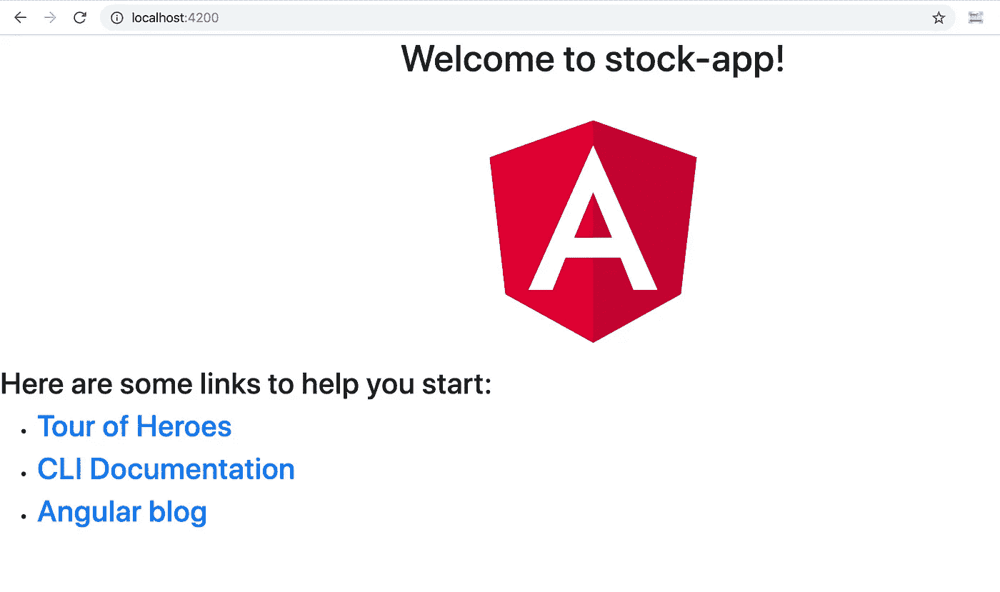

# 全栈开发教程:在 Angular SPA 上可视化交易数据

> 原文：<https://towardsdatascience.com/full-stack-development-tutorial-visualize-trading-data-on-angular-spa-7ec2a5749a38?source=collection_archive---------22----------------------->


Photo by [Carlos Muza](https://unsplash.com/@kmuza?utm_source=medium&utm_medium=referral) on [Unsplash](https://unsplash.com?utm_source=medium&utm_medium=referral)

(这篇文章也可以在[我的博客](https://kylelix7.github.io/)中找到)

本系列的下一篇文章:[全栈开发教程:用运行在 AWS Lambda 上的无服务器 REST API 提供交易数据](/full-stack-development-tutorial-serverless-rest-api-running-on-aws-lambda-a9a501f54405)

作为一名数据科学家，您是否曾想过如何在 web 应用程序中为您的用户可视化您的数据？我将演示一系列的全栈开发教程来创建一个简单的 web 应用程序——stock graph 的 Angular 用于 UI，AWS serverless Lambda 用于后端，AWS API gateway 用于 API 管理，CloudFormation 用于持续部署。

这篇文章演示了如何在 Angular 单页应用程序(SPA)中可视化股票数据。在本教程的最后，您将创建一个带有组件的 Angular 应用程序，用于在客户端显示股票数据。本教程中没有服务器交互。所有数据都存储在客户端。源代码可以从[这里](https://github.com/kylelix7/stock-app)下载。

# 安装 node.js 和 Angular CLI

# 创建新的 Angular 应用程序并安装依赖项

运行以下命令并相应地回答问题，以创建新的角度应用程序。然后安装用于造型的 ng-bootstrap 和用于显示图表的[泳道/ngx-charts](https://swimlane.gitbook.io/ngx-charts/) 。

在 app.module.ts 中包含 NgxChartsModule 和 browseranimentsmodule。Ngx-charts 在 app 模块中使用 browseranimentsmodule，以便随时可以使用。

在 angular.json 的 styles 数组中添加“node _ modules/bootstrap/dist/CSS/bootstrap . min . CSS”

现在，打开终端并运行 *ng serve，*您应该能够在 [http://localhost:4200/](http://localhost:4200/) 中看到下面的示例应用程序



# 创建一个组件来显示股票图

在终端中运行以下命令创建一个新组件

```
ng generate component chart
```

该命令完成后，将创建一个新的目录“chart”。它包含一个 spec 文件(用于单元测试)，一个 TypeScript 文件(。ts 文件)，它包含用于呈现 UI 的逻辑和模板文件(.html 文件)，它包含 UI 的标记。在模板 chart.component.html 中，用以下代码替换代码以正确配置图表。颜色方案、结果数据集、x 轴或 y 轴标签等属性是 ngx-charts-line-charts 的属性。我们用相应的变量来设置它们，这些变量将在 chart.component.ts 中声明和赋值。

在我们跳到 chart.component.ts 中的业务逻辑之前，让我们创建一个存储历史股票数据的界面。在 src/app 目录下创建一个 model.ts，内容如下。

现在让我们生成一个服务来提供历史数据。对于本教程，数据将被稳定地存储在 typescript 文件中。在现实世界中，它应该从远程服务器获取。我将有另一个教程来涵盖这个主题。在终端运行 *ng 生成服务库存数据*。

一旦我们有了服务来提供数据，我们需要更新 chart.component.ts 来更新绑定到 UI 的变量。下面是 typescript 中更新后的 ChartComponent。

接下来，我们需要更新 app.component.html，以确保应用程序显示我们刚刚创建的图表组件。

现在，您应该能够在 [http://localhost:4200/](http://localhost:4200/) 中看到新创建的图表


下一篇教程，我将展示如何用 python 构建后端 API，用 AWS Lambda 无服务器服务提供数据。保持调谐！

建议读取:

[全面了解亚马逊网络服务(AWS)](https://www.educative.io/courses/learn-the-a-to-z-of-amazon-web-services-aws?aff=VEzk)

[AWS Lambda 在行动:事件驱动的无服务器应用第一版](https://www.amazon.com/gp/product/B07L9GHD6W/ref=as_li_tl?ie=UTF8&camp=1789&creative=9325&creativeASIN=B07L9GHD6W&linkCode=as2&tag=blog023b-20&linkId=8ed2825229096ab702683372bc52497a)

[亚马逊网络服务第二版](https://www.amazon.com/gp/product/1617295116/ref=as_li_tl?ie=UTF8&camp=1789&creative=9325&creativeASIN=1617295116&linkCode=as2&tag=blog023b-20&linkId=524b38e985a6ff114380a3fa96d6618c)

我的帖子:

[我关于金融和科技的帖子](https://medium.com/@fin.techology/my-posts-about-finance-and-tech-7b7e6b2e57f4?source=your_stories_page---------------------------)

[我关于 FAANG 访谈的帖子](https://medium.com/@fin.techology/my-posts-about-faang-interview-20e529c5f13f?source=your_stories_page---------------------------)

[从 CRUD web 应用开发到语音助手中的 SDE——我正在进行的机器学习之旅](https://medium.com/@fin.techology/from-crud-app-dev-to-sde-in-voice-assistant-my-ongoing-journey-to-ml-4ea11ec4966e?)

[全栈开发教程:将 AWS Lambda 无服务器服务集成到 Angular SPA 中](/full-stack-development-tutorial-integrate-aws-lambda-serverless-service-into-angular-spa-abb70bcf417f)

[全栈开发教程:用运行在 AWS Lambda 上的无服务器 REST API 提供交易数据](/full-stack-development-tutorial-serverless-rest-api-running-on-aws-lambda-a9a501f54405)

[强化学习:Q 学习简介](https://medium.com/@kyle.jinhai.li/reinforcement-learning-introduction-to-q-learning-444c951e292c)

[全栈开发教程:在 Angular SPA 上可视化交易数据(1)](/full-stack-development-tutorial-visualize-trading-data-on-angular-spa-7ec2a5749a38)