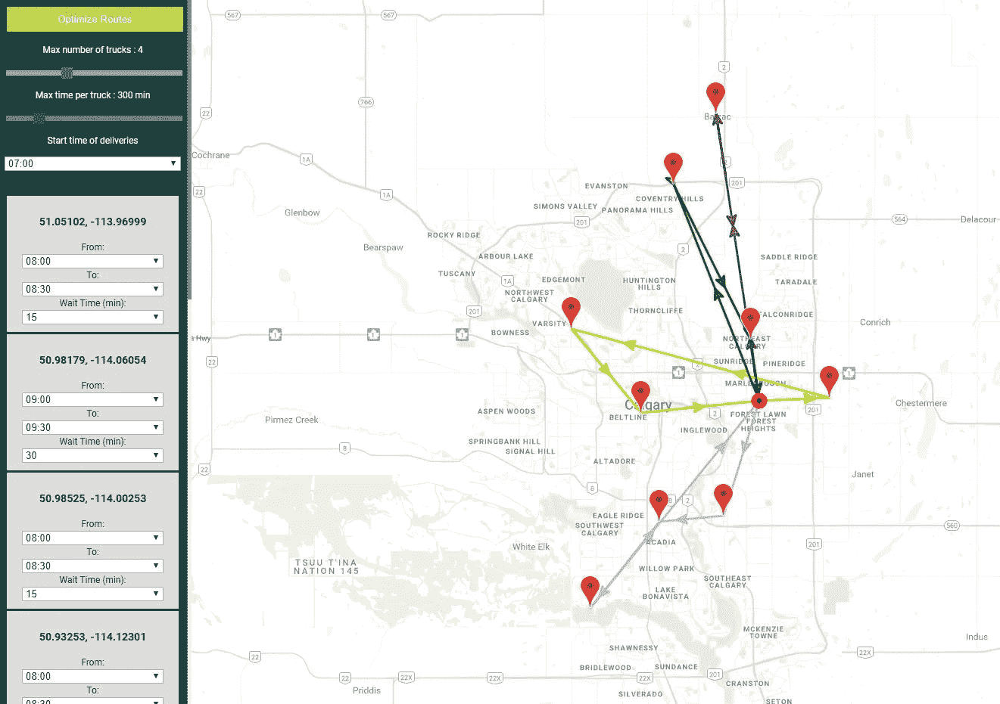
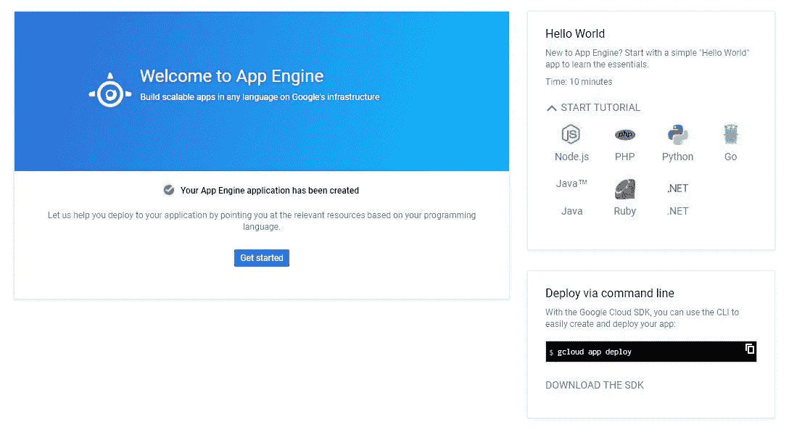
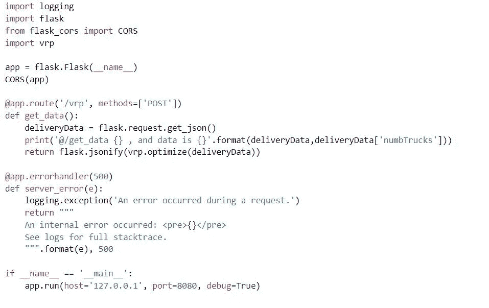
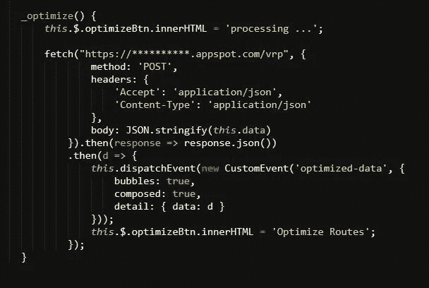

# 面向数据科学家的复杂解决方案全栈可视化

> 原文：<https://towardsdatascience.com/full-stack-visualizations-for-complex-solutions-for-data-scientists-5afc488f60d?source=collection_archive---------8----------------------->

## 笔记本不够用怎么办？

*这篇文章主要面向那些希望围绕他们的解决方案快速开发一个界面的数据科学家。虽然您确实可以在 Jupyter 笔记本或其他地方构建一些* [*交互式*](https://blog.dominodatalab.com/interactive-dashboards-in-jupyter/) [*仪表盘*](/a-very-simple-demo-of-interactive-controls-on-jupyter-notebook-4429cf46aabd) *，但我个人在我的几个项目中遇到了它们的局限性。此外，有时让人们去玩解决方案比你向他们解释要容易得多。*

我的目的是向您展示一个路线图&一些片段让您尽可能快地开始，这样您就可以制作类似于这个简单的[演示](https://route-optimization-22f24.firebaseapp.com)(下面的快照)的东西，它在后端运行 python(在更复杂的版本中用于集群的 DBSCAN ),并在客户端呈现结果，以便您将结果发送给公司的决策者，让他们大吃一惊。



Route optimization demo using Google Constraint Solver (DBSCAN is used in a more complex version all on the back-end)

无论是创建演示，还是将其添加到您的投资组合中，或者是向公司的管理层和利益相关者传达一些故事，能够快速将简单的用户界面包装在您的解决方案周围都可以极大地帮助您实现目标。在大多数情况下，您可能能够在笔记本或档案中包含一些图表&漂亮的图表，但是如果您需要某种程度的用户交互，而这在 Jupyter 笔记本或[合作实验室](https://colab.research.google.com/)中是不可能的，该怎么办呢？如果老板问“你能不能把一些东西组装起来，这样我以后可以玩玩？”或者“你能做一个演示，让我在你不参加的会议上使用吗？”。基本上，他们要求一个 URL 来点击并看到它的神奇之处，此外，这确保它每次都能按预期工作，而不会有人不小心弄乱你的代码，等等。

对于一个对 HTML 知之甚少的人来说，在没有任何教程的情况下从头开始开发这样的演示可能要花费一周的时间。然而，我希望在完成下面的步骤后，你能在几个小时内完成这样的事情。

您可能已经发现，这样的接口需要两个方面。在后端，您可以运行您的 python 魔术，在客户端，您可以将结果呈现为一些迷人的、令人瞠目结舌的图形，以便在给用户一些自由度来进一步探索您的解决方案的同时传递信息。我通常把我的后端放在 Google App Engine 上，它可以存放你的 python 代码，当你在前端触发它时就运行它，但是你也可以很好地使用 AWS 或其他服务。这里没有特别的偏好。

前端是我们用 HTML、CSS 和 JavaScript(JS)编写的地方。后端是你可以存储数据，利用云计算，甚至运行代码，而不需要使用你的用户(客户端)资源(想象一下他们的手机，电脑)。

**后端**

出于这个例子的目的，我们需要设置我们的后端，以便它能够响应一些 URL 请求。换句话说，当您在浏览器中输入一个 URL 或者通过一些 JS 代码(比如 fetch()、XMLHttpRequest()等)发出请求时，每个函数都会运行。(稍后您将看到一个示例)。因为我们正在编写后端来执行一些 python 代码(所以我们可以在以后享受做一些数据科学的酷东西——嘿，这里没有偏见:p)我们利用 Flask——python 的一个简单的 web 开发框架。

> [*Flask 是基于 Werkzeug、Jinja 2 和 good intentions 为 Python 开发的微框架。在你问之前:它是 BSD 许可的！*](http://flask.pocoo.org/)

您需要编写您的 python 脚本并将其托管在服务器上的某个地方，这样每次请求 URL 时，就会触发一个或多个 python 函数。您可以将一些数据传递给该函数，并最终获得一些数据，在本演示中，这些数据将是优化的路线和车辆信息。附带说明一下，这个简单的演示利用了 [Google 或](https://developers.google.com/optimization/)工具来解决一些教科书式的旅行推销员问题，这里的约束条件被定义为时间和卡车负载。

如果你之前没有用过 app engine，最简单的入门方法就是注册后按照 App Engine 中的教程进行操作。选择 Python 作为您的语言，并遵循 Hello World 教程的结尾。然后回到这里。



在浏览了关于 App Engine 的 hello world 教程后，你应该能够创建一个应用程序，并使用命令行或浏览器中的嵌入式 shell 和编辑器(我个人喜欢后者)将其部署到 Google App Engine，你真正需要创建的只是一个简单的 Flask 应用程序，如下所示。请记住，首先安装您将在后端代码中使用的包，如 Flask、[或-tools](https://developers.google.com/optimization/) 等。这意味着您需要将它们添加到 requirements.txt 文件中，然后进行安装(见下文)。



Simple Flask app for the back-end to trigger our functions via some URL requests

现在，如果我们向上面的“baseURL-of-project/vrp”发出请求，我们只是触发了与之相关的函数。简单吧？！这很棒，因为你可以在后端做任何你想做的事情，甚至添加复杂的建模和使用所有你需要的机器学习库，等等，然后将结果传递给你的客户端，以呈现一个漂亮的图形或图表。

**前端**

听到“前端开发”可能会吓到你，但我向你保证，你不需要知道一切来开始。你可以试着通过 python 来完成，但是我个人更喜欢 HTML、CSS 和 JS。以下是几个概念，每个概念都有很好的学习来源，应该是你需要开始学习的全部内容；

1.  [基础 Javascript](https://www.w3schools.com/js/)
2.  [承诺](https://developer.mozilla.org/en-US/docs/Web/JavaScript/Reference/Global_Objects/Promise)
3.  [获取](https://developer.mozilla.org/en-US/docs/Web/API/Fetch_API/Using_Fetch)()或 [XMLHttpRequest](https://developer.mozilla.org/en-US/docs/Web/API/XMLHttpRequest/Using_XMLHttpRequest) ()以在客户端(前端)发出我们的 URL 请求

我不会告诉你什么是最好的，因为有大量的前端库、包和框架。对你有用的就应该是好的。如果你没有任何线索，那么我建议你从浏览( [PWA 初学者工具包](https://pwa-starter-kit.polymer-project.org/))开始，你应该很快就能开始编写非常棒的尖端 web 应用程序。

我们需要一个简单的 HTML 页面来包含我们的演示 UI 元素，如按钮，输入字段，也许谷歌地图，因为它太简单了。记住，要使用谷歌的服务，比如地图，你需要在谷歌的相关网页上创建一个免费的 API 密匙。为了渲染地图，你可以简单地从这里开始和这里的。

一旦你有了一个动作按钮设置&你想把它连接到后端，你只需要在一些用户交互时向我们的触发 URL 发出请求，例如，在我们的例子中，当用户点击“优化路线”时。我们通过我们附加到按钮上的点击监听器(下面将详细介绍)捕捉到这个信息，并运行下面的函数。



JavaScript function where we make a POST request to our back-end URL

为了让你知道我说的点击监听器是什么意思，下面是一个功能演示的例子[在这里](https://www.w3schools.com/code/tryit.asp?filename=G242TJAWBOOQ)。

```
<!DOCTYPE html>
<html></html><h2>JavaScript addEventListener()</h2><p>This example uses the addEventListener() method to attach a click event to a button.</p><button id="myBtn">Try it</button><p id="demo"></p><script>
document.getElementById("myBtn").addEventListener("click", displayDate);function displayDate() {
  document.getElementById("demo").innerHTML = Date();
}
</script></body>
</html>
```

请注意我是如何在 *_optimize* ()方法的请求体中以字符串形式传递数据的。我还利用了 fetch 函数，该函数返回一个[承诺](https://developer.mozilla.org/en-US/docs/Web/JavaScript/Reference/Global_Objects/Promise)，允许我在结果返回时检索它。完成了。一旦你有了结果，你可以简单地通过 *console.log(response.json())把它打印到控制台上，*进入谷歌浏览器的开发者工具，确认你收到了结果。另外，您需要在 App Engine 中将******替换为您的项目名称。除此之外，所有这些都是 JS 以您喜欢的方式处理和呈现您的数据。有很多 JS 图形库。 [*D3.js*](https://d3js.org/) 是我的最爱之一。

**托管您的前端**

所以，你已经写好了项目。现在你需要通过一个可以和懒人分享的 URL 来访问它(lol)。你需要的只是一个托管服务。周围有很多托管服务。我一直在使用相对较新的谷歌 Firebase 服务，因为它的学习曲线非常短。你可以选择任何你喜欢的服务。要在 Firebase 上托管您的项目，您需要通过 Firebase 控制台创建一个项目(需要几分钟)。然后转到机器中的本地项目文件夹，初始化 Firebase 并连接到新创建的 Firebase 项目。不要担心所有这些都是一步一步的概述[这里](https://firebase.google.com/docs/hosting/quickstart?authuser=0)。然后从本地项目目录中输入下面的命令来部署您的项目。

```
firebase deploy
```

然后，该 URL 会显示在 Firebase 控制台的主机下。这就是了。

**结论**

如果您开始一个基本的 UI，您可以轻松地将您的数据科学项目包装到一个更高级的交互式外壳中，这将使任何人都可以自由地玩和不喜欢玩！！我个人已经看到了以这种方式展示你的解决方案的优势。虽然您确实可以通过 Jupyter 笔记本或其他工具为简单的项目创建一些交互式菜单，但构建更复杂的仪表板通常是前端开发人员的任务。我认为，作为一名努力变得更好的数据科学家，你不必依赖他人的时间表或技能。所以，帮你自己一个忙，花一个周末在这上面，掌握它&享受你将因此获得的自由。

如果你按照我提供的教程和链接，你应该可以在一两天内开始构建。后端应该非常简单，因为它主要是 python 而不是 Flask shell。对于以前没有做过前端开发的人来说，前端可能需要更多的时间。我希望我已经提供了一步一步的指导，让你去，但我可能会添加更多的细节取决于我得到的评论。请让我知道我如何才能改善这个职位，我会这样做。

**参考文献**

[](https://blog.dominodatalab.com/interactive-dashboards-in-jupyter/) [## 用 Jupyter 构建交互式仪表盘

### 欢迎来到“高级 Jupyter 笔记本技巧”的第二部分在第一部分，我描述了魔术，以及如何计算笔记本…

blog.dominodatalab.com](https://blog.dominodatalab.com/interactive-dashboards-in-jupyter/) [](/a-very-simple-demo-of-interactive-controls-on-jupyter-notebook-4429cf46aabd) [## Jupyter 笔记本上一个非常简单的交互控件演示

### 当使用交互式小工具时，笔记本变得生动起来。用户可以可视化和控制数据的变化。学习…

towardsdatascience.com](/a-very-simple-demo-of-interactive-controls-on-jupyter-notebook-4429cf46aabd)