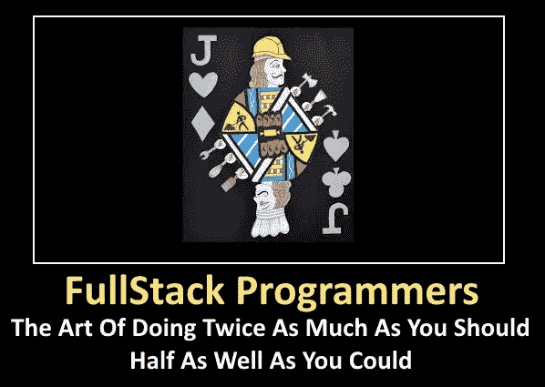
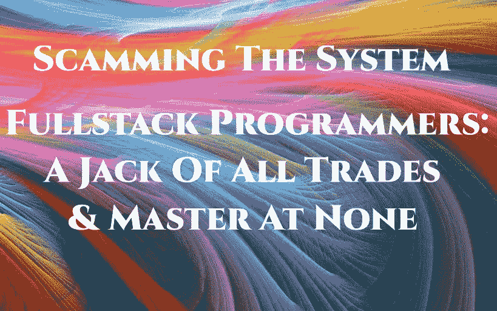

# 全栈编程:失败的前奏

> 原文：<https://towardsdatascience.com/fullstack-programming-a-prelude-to-failure-2bc93cf19e71?source=collection_archive---------12----------------------->

## 神话，现实，荒谬

# 简介:

如果你是这种认为自己是“全栈程序员”的新老时尚“称谓”的一部分，或者拥有无数让你负责技术的头衔(例如，首席技术官、副总裁 R&D、技术负责人等)。)为了你自己和你的公司，你应该花几分钟时间来阅读这篇文章。如果你个人认为这篇文章质疑了你的能力，我首先向你道歉。 然而，在你勃然大怒、口吐白沫、发疯并根据标题和你对“全栈”思想的坚持来否定整篇文章之前，让我们首先尝试定义和理解围绕全栈编程愿景的实际困境。

我无法确定“全栈”这个术语是从什么时候开始被广泛用于描述一个编程职位的。它就像其他许多术语一样，随着时间的推移而时隐时现。例如，已经变得非常流行的术语“DevOps”以其最基本的形式代表了永恒的开发、准备和生产周期。如果小心应用，应该可以缩短从编程到实现的时间。最近，你也会注意到“CI/CD”这个术语。当我第一次看到它的时候，我觉得自己像个傻瓜，对自己说“这到底是什么意思？”，就去查了一下。当我意识到它代表“持续集成/持续开发”时，我简直笑破了肚皮。开发运维的 YAT(另一个术语)(基于敏捷、Scrum 或看板等方法。等等。)!因此，对于技术领域的任何人来说,“Fullstack”越来越受欢迎，越来越受关注，这并不奇怪。突然间，我面试或交谈过的一半程序员都一本正经地直视着我，说:“我是一名全栈程序员”。

然后我问，就像我问 CI/CD 一样，“那到底是什么意思？”。当我听到有人吹嘘他们的全栈能力时，问题来得又快又激烈(是的，我承认有点讽刺。)

1.你指的是哪一堆？贵公司正在使用或打算使用的技术是什么？

2.你自称懂 Angular，Vue，HTML & React？完全了解他们吗？

3.可以用 NodeJS，Java/Scala，C++，PHP，Python，Golang？你知道所有那些语言，并且很了解它们？

4.你了解 JSON，以及在深度嵌套的情况下如何真正使用它？

5.你知道 AWS，Azure 等。所有的部件呢？从 EC2 到 NAT 网关，再到 AWS 提供的所有 1001+模块？

6.您是 Redis 和 Memcached 方面的专家，知道如何设置和正确使用 Redis 系统，以及使用它做什么？

7.你知道 IOS 原生和 Android 原生以及使用 React 不使用原生代码吗？

8.你知道 SQL 和 NoSQL 吗？它们之间的区别以及如何操作？你懂 MySQL，Postgre/Postgres SQL，MongoDB，Hadoop，Cassandra，Apache Spark？

9.或许最重要的是，您知道如何保护您所有的数据，包括静态数据和传输中的数据吗？

我只是让问题飞，没有等待答案。因为人们可以很容易地把上面的问题变成 25 个或更多。任何胆敢告诉我他们知道以上所有的事情，并且非常了解它们的人，不是傻瓜就是骗子。那么，我们所说的“全栈”是什么呢？首先也是最重要的，定义你的全栈。我不知道你说的“全栈”是什么意思！

为了理解什么是真正的堆栈，让我们举两个简单的堆栈为例，它们都是词汇和缩写词，在技术领域很常见。技术专家知道“灯”堆栈和更新的“平均”堆栈。LAMP 代表“Linux、Apache、MySQL 和 PHP”。MEAN 代表“MongoDB，Express，Angular，NodeJS”。平均堆栈中包含一个前端，即 Angular。灯堆没有。

毫无疑问，可能有数百个“堆栈”。所有这些都是为了确定和阐明特定项目所需的技术。他们定义技术。他们从来没有打算也不应该被用来定义一个特定工作 的程序员的实际资格。事实上，这篇文章的全部论点是，如果成功是你的目标，那么“全栈”应用于程序员是一个神话和可怕的错误。

# 神话

我认为没有人能把一个具体的原因归结于“全栈”编程的出现。我有我的理论和假设，虽然它们的混合，然后延续了全栈神话可能是最好的猜测。我相当肯定 fullstack 的想法是出于好意。在一个程序员身上结合一种专长和另一种专长。这是合乎逻辑的，因为许多优秀的程序员确实有能力以胜任的方式处理两种技术。然而，和所有事情一样，“fullstack”不受约束，已经成为一个包罗万象的术语，需要大量的专业知识，涉及广泛的技术。这是一个神话——尽管是当今公认的编程方式。

1.**资金有限** —现实一点，有预算。无论是在初创公司还是在大公司，这都是理所当然的。创建预算是为了确保燃烧率不会造成失控的列车，并且公司能够吸收成本。这是经济学 101 和那些选择忽略通过销售保证筹集或赚到的钱的人的灾难。因此，这似乎很有意义，与其拥有一个每个人(或团队)都是一两件事的专家的编程团队，为什么不拥有能够做所有事情的人呢？“全栈”获得了它自己的地位。毕竟，许多公司要求他们的 CTO“亲力亲为”(HO)，这样他们就可以做两份工作——一份是编程，一份是管理其他程序员。那么为什么不把各种“专长”结合到一个岗位上呢？这确实节省了资金，并且有运行小而紧密的团队的额外优势。

2.**编程团队的后援** —另一个突出的点，我相信这一点，就是如果一个程序员生病或离开，在真正的“全栈”环境中，另一个程序员可以接管，直到找到替代者。毕竟，如果每个人都是“全栈”，他们应该都知道其他人知道什么。不需要某个特定领域的专家，因为假设每个人都是某方面的专家。

3.**不知道需要多少知识**——在最近一次与新任命的研发副总裁的公开谈话中，他问我对“全栈”程序员团队有什么想法。我用一个问题来回答。“栈是什么？”他说，就是 MongoDB，React，NodeJS 栈，包括微服务，lambda 等使用 AWS 的技术。我想了一会儿，很清楚地知道过于诚实会让我失去面试的机会。对我来说，“残酷的诚实”永远是赢家。我问副总裁，他是否明白他在要求他的程序员了解什么。

a.他们必须理解和了解 NodeJS，尽管普遍认为 NodeJS 不仅仅是 JavaScript 的扩展。它是一种有如此多可能性和中间件的语言，需要对同步和异步编程有深刻的理解。将微服务的正确实现添加到组合中是对 NodeJS 如何工作以及在编程结构中应该做什么(更重要的是不应该做什么)的另一个层次的真正理解。

b.MongoDB 是一个 NoSQL 数据存储库。许多人没有意识到的是，仅它就包含了一种超过 200 种可能调用的语言。它还要求对数据有深刻的理解，因为这不是你的关系、线性表。(即使在 SQL 系统中，也需要一个严肃的数据人员(DBA))。MongoDB 和所有 NoSQL 系统也需要无模式数据的知识。(见我在 Medium 的文章:“[使用 Mongoose 处理你的大数据的重大错误](/the-drastic-mistake-of-using-mongoose-to-handle-your-big-data-a3c408e21a4c)”。)这本身就是一门科学。复制和分片呢？索引使用？了解何时使用 map reduce 和所有其他要点。

c.然后就是 AWS。AWS 中有大量的技术。Lambda 就是其中之一。它变得非常受欢迎，但如果没有正确实施，可能会变成一场噩梦(特别是在公司成本方面)。那么对 AWS 的其他要求呢？简单的 AWS 堆栈包括实例、NAT 网关、S3 的使用以及 AWS 提供的无数技术。这本身就是一项巨大的任务，很容易失控。

d.我在回答中补充了一些其他花絮。redis——何时何地使用？怎么用？如何熟练地操作 it 和数据。

e.谁来负责数据安全？这本身就是一份全职工作，而且在开发周期中经常被忽视，这很可怕。(如果不深入这个主题，请参见我在 Medium 上的文章:“[设计网络安全技术系统的 10 个初始步骤](/10-initial-steps-towards-designing-a-secure-system-12747a58c3a)”)。

f.如果这还不足以说明，仅仅通过描述**期望一个程序员能够做以上所有的事情并且做得很好是多么疯狂**，我接着去了前端。你是在告诉我，一个人将知道上面列表中的所有内容，并且还能够准备一个具有规范 UI 和 UX 的体面前端？即使它没有反应过来，(也许是最难的)，但角或 Vue，它仍然是一个巨大的想象力。我不在乎那个程序员有多“忍者”。

应该清楚的是，任何“堆栈”都可以被分解成最相关的部分。一旦这一堆知识被仔细剖析，什么是需要的，什么是不需要的就变得很清楚了。期望一两个“全栈”程序员对所有这些活动部分有一个完整和全面的理解是在给你的系统招致灾难。

4.**朴素&简单狂妄** —是的，有一些栈(例如 WordPress，Wix 等。)可以一个人跑。然而，任何声称拥有全栈知识的程序员或 CTO，有时我听到过对许多编程语言、前端和数据库结构(混合了 SQL 和 NoSQL)的这种说法，都是极端的狂妄自大。

# 现实

**现实**很简单。俗话说，“鱼和熊掌不可兼得”。很少有人能把一个“完整的堆栈”管理到一个平庸的程度，更不用说优秀的程度了。我和这些杰出人士中的一些人很友好。相信我，这些人赚的钱比你的公司愿意支付的要多得多。

**事实是**你首先必须定义你的堆栈包含什么。如果我们坚持上面的例子，您的 NodeJS 程序员也可以处理 MongoDB 设置。但是他们会理解对安全的需求吗？我已经数不清有多少次在本地或者在 Atlas 上看到过 MongoDB 的设置，它完全不安全，需要一个马裤。这些程序员会知道当数据在传输时，他们必须对其应用安全措施吗？他们会理解 bCrypt 和 crypto 的区别吗？我可以继续下去，但让我们假设所有以上可以在一个人身上找到。前端呢？他们还将开发一个完整的前端(移动和网络)，同时做好以上工作？

现实是，成功的团队有特定的工作。在所有堆栈中，您可以将其分为三个主要功能:

1.前端

2.后端

3.数据库

现实是专业知识的交叉。需要定义某些参数，尤其是关于 JSON 的参数，以及需要发送什么，哪一方将进行计算。

**事实是**随着你的公司对编程端的要求越来越高，你对程序员的期望也必须更加明确。贴一个广告，列出一系列语言、技术和需求，并称之为“需要全栈程序员”，并不能很好地说明这家公司。事实上，对于许多人来说，它应该敲响警钟，亮起红灯，说明该公司的确切专业知识以及它将如何取得成功。

**现实情况**是你和你的公司需要准确定义什么是需要的，需要什么样的程序员支持，并在现实的预算内工作。雇佣一个首席技术官和两个“全栈”程序员是不够的。

**现实是——理智地面对现实和局限**。

# 荒谬

你会雇佣一个懂 Python 的程序员做数据科学家吗？我非常希望答案是“不”。为什么？因为数据科学家需要一套技能，而 Python 或 Java/Scala 只是其中的一部分。那么，为什么你会考虑雇佣一个懂一点 NodeJS 的 Python 程序员来构建一个完整的前端、后端和数据库系统呢？这显然是荒谬的。

但是..但是..但是..你测试了他们！是的，你做到了。他们通过了 Python 测试、NodeJS 测试、DB 测试，甚至一些小型前端系统。这里一个表单，那里一个问题，一个响应站点——当然你会发现一个优秀的全栈程序员。它们是如此之好，以至于即使你改用 Golang 或者将 JAVA 引入其中，它们也会无缝地完成过渡。

那个 IOS 原生程序员？如果他们能做 IOS，他们也能做 Android，对吗？当然啦！他们将能够处理两个系统中的所有细微差别，包括从后端来回传输的数据。为什么不呢？

当你思考这个问题的时候，处于飞速发展的后端的人应该能够处理整个数据和安全系统。我的意思是这只是他们正在做的事情的一小部分。

简单的数学告诉你两个程序员可以做五个人的工作。你可以简单地保护你的预算，在公司眼里看起来像一个不可思议的英雄。你发现了“全栈”的诱惑。你也逐渐发现了通往荒谬期望和不可能任务的道路。如今有了令人难以置信的 IDE 和工具，程序员应该能够处理任何事情。**对吗？不对！哦，这么错**。

这就像期望首席技术官成为首席执行官，首席运营官和首席财务官合二为一。没有一个理智的人会建议做这样的事。为什么你会期望一个程序员去做呢？总之，你不应该期望一个“全栈”程序员什么都懂，什么都是专家。这太荒谬了。

# 失败的前奏

**对于所有“全栈程序员”来说:**

在你决定令我和这篇文章，尖叫和忽略整篇文章或投票否决它之前，请只阅读这一部分。那就做你想做的。

不是你。是这个系统把你扔进了不可能得到一份体面工作的境地，而没有声明你是一个“全栈程序员”。需要“全栈”的工作数量飞速增长。你需要工作。你别无选择，只能宣布你的“全面”能力，并在你知识的薄弱点上磨练。

然而，这种期望会迫使你陷入一种没有胜算的境地。你需要成为某些方面的专家，而不是所有方面。被迫钻研你知识薄弱的领域，会迫使你加强这方面的知识，但代价是你的其他知识。技术系统每三个月就会发生变化。任何一种语言提供给你的数量，对于一个人来说几乎是不可能跟上的。乘以一个“满栈”，你会发现自己溺水了。

然而你坚持对我说:*“我是一个全栈程序员。我都知道。我能处理好一切。现实点吧。Fullstack 会留在这里，然后离开。”*

所以，我会非常诚实地回答。全栈编程是个骗局。你将成为万事通，但什么都不会。当您的数据库无法响应，或者您的后端没有进行正确的计算，或者您的前端没有正确呈现数据，或者当您的系统遭到黑客攻击和破坏时，猜猜谁会受到指责？毕竟你是一个全栈程序员！

值得一提的是，成功的公司是那些认识到他们的每一部分都需要专业知识的公司。那些很快陷入困境或陷入巨大麻烦的公司是那些要求他们的程序员知道所有事情并能处理整个堆栈中所有事情的公司。

前端程序员不应该弄乱数据库结构和信息。后端程序员永远不要和前端打交道。在我们这个时代，安全问题必须由了解幕后情况的专家来解决。

有些技术可以而且可能应该结合到一项工作中。这并不意味着你已经成为一名全栈程序员。这仅仅意味着你扩展了你的专业知识，允许你在未来要求一份更大更好的工作。

**远离“全栈”的诱惑。离远点。知道自己知道的，承认自己不知道的。这些是我最喜欢的英语单词。“我不知道”。不要试图欺骗系统。最终的结果是你，程序员，将会受到责备。**

_________________________________________________________________

可以通过电子邮件联系到泰德:tedwgross@gmail.com；[推特](https://twitter.com/tedwgross)(@ tedwgross)；[LinkedIn](http://il.linkedin.com/in/tedwgross)；[中等](https://medium.com/@tedwgross)