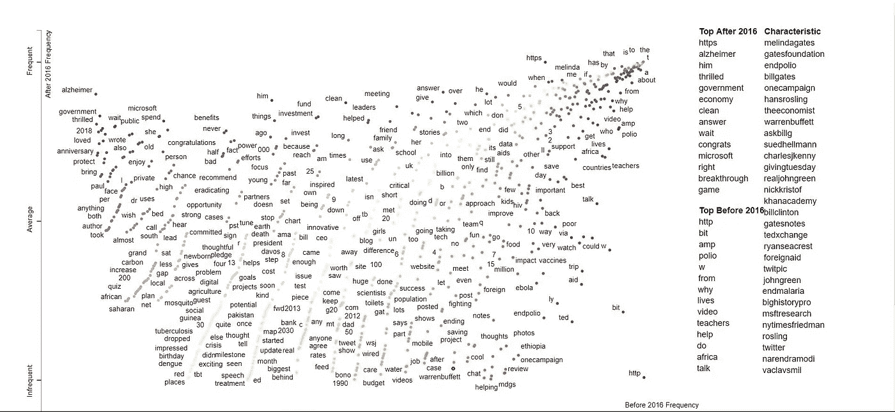
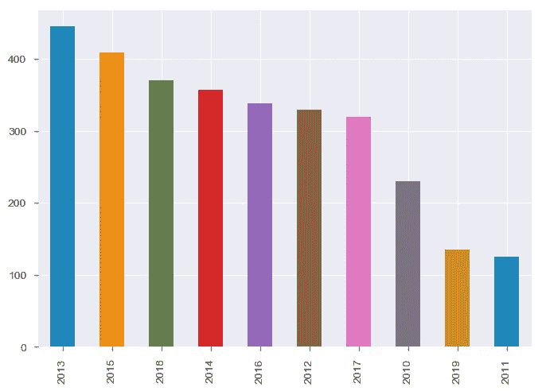
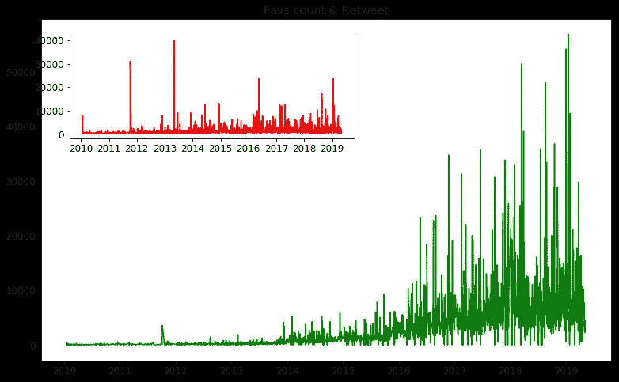

# 分析@BillGates tweets Twitter API 的乐趣——从提取、数据可视化到情感分析的逐步分析

> 原文：<https://towardsdatascience.com/fun-with-analyzing-billgates-tweets-twitter-apis-step-by-step-analysis-11d9c0448110?source=collection_archive---------6----------------------->


这是网络抓取和 API 系列的第二篇文章。第一封邮件来了。 [**请查看**](/web-scraping-for-beginners-beautifulsoup-scrapy-selenium-twitter-api-f5a6d0589ea6) 。在这篇文章中，我们可以看到如何使用 twitter API 提取 Twitter 数据，然后使用 word cloud、饼状图进行一些基本的可视化，然后使用 Textblob 和 Vader 进行情感分析。

如果你没有 Jupyter，那么请继续安装 [**和 anaconda**](https://www.anaconda.com/distribution/) 。


让我们做以下事情

1.  创建一个 twitter 帐户或使用您现有的 Twitter 帐户。
2.  twitter 开发者访问密钥请求
3.  使用 Twitter 流 API 提取实时推文
4.  使用 Tweepy 使用 Twitter 搜索/Rest API 提取历史推文
5.  将数据加载到熊猫数据框中
6.  Wordcloud
7.  分散文本
8.  做一些统计分析和可视化。
9.  使用**文本块**进行情感分析。
10.  使用 **VADER** 进行情感分析
11.  使用 **Syuzhet(R)** 进行情感分析

在使用 Twitter API 之前，我们需要一个 Twitter 帐户，然后请求一个开发者密钥。首先，如果你没有 twitter 账户，就创建一个。获取必要的开发人员密钥的步骤如下

[**观看这段创建 twitter 账户的 youtube 视频**](https://www.youtube.com/watch?v=-r6o-fczBGE)

1.  转到[**https://developer.twitter.com/en/apps**](https://developer.twitter.com/en/apps)。
2.  使用您的 twitter 帐户登录。如果你没有，那就创建一个。


3.登录后，创建一个应用程序。


4.填写所有必填字段。


5.您将获得以下凭据


1.  **API 键**
2.  **API 密钥**
3.  **访问令牌**
4.  **访问令牌秘密**

[**看看这段 youtube 视频，关于创建 twitter**](https://www.youtube.com/watch?v=KPHC2ygBak4)

[**查看他的文档以获得 Twitter 开发密钥**](https://python-twitter.readthedocs.io/en/latest/getting_started.html)

## Twitter 提供了 2 个 API

*   ***串流 API***
*   ***搜索 API 或者休息 API***


在 twitter 开发人员网站上，可用的 python 相关包装器有


*   每秒 6000 条推文
*   **每分钟 473，500 条**推文。
*   **每天有 5 亿条推文被发送**
*   每年 2000 亿条推文。
*   每月有 3.26 亿人使用 Twitter
*   **每天产生 2.5 万亿字节**的数据。
*   **地球人口的 50%** 在社交媒体上，总共有**27.89 亿**人。
*   到 **2025** 年，据估计全球每天将产生 **463 艾字节**的数据——这相当于每天 212，765，957 张 DVD！
*   社交媒体占在线总时间的 33% 。

资料来源:Domo.com


**来源:视觉资本家**


来源:视觉资本家

## 1.流式 API

**Twitter 搜索 API** 和 **Twitter 流媒体 API** 非常适合那些只想访问 Twitter 数据进行**轻量级分析或统计分析**的个人。

Twitter 的流媒体 API 是推数据，因为推文几乎是实时发生的。流媒体 API 的主要缺点是 Twitter 的流媒体 API 只提供了正在发生的推文的**样本。根据用户要求的标准和当前的流量，用户通过 Twitter 的流媒体 API 收到的推文占总推文的实际百分比变化很大。研究估计，使用 Twitter 的流媒体 API 用户可以预期**以近乎实时的方式收到 1%的推文。(** [**参考网站)**](https://brightplanet.com/2013/06/twitter-firehose-vs-twitter-api-whats-the-difference-and-why-should-you-care/)**

开始安装所有必需的库之前—使用 pip 命令提示符

[***请查看更多关于 PIP***](https://www.w3schools.com/python/python_pip.asp)

```
**pip install vaderSentiment
pip install nltk
pip install Textblob
pip install numby
pip install pandas**
```

之后，导入所有需要的库

首先，输入您的所有凭证。登录 twitter 账户，进入应用程序，然后填写上述所有信息。

请务必打印并检查您的凭证

您可以通过以下方式进行筛选

1.  用户标识
2.  用户名
3.  按关键字查询
4.  地理位置

按位置过滤，选择我按位置过滤的推文=旧金山


仅仅一条微博就包含了如此多的信息


[**检查所有可用的 tweet 对象**](https://developer.twitter.com/en/docs/tweets/data-dictionary/overview/tweet-object.html)

JSON 对象看起来像

您也可以将其保存到 CSV 文件中

包含选定信息的 1 条 tweet 的输出


## [了解更多关于流式 API 的信息](https://developer.twitter.com/en/docs/tutorials/consuming-streaming-data)

Twitter API 的输出是 JSON 格式的。那么 JSON 是什么呢

[***请看这段 youtube 视频。***](https://www.youtube.com/watch?v=sSL2to7Jg5g)

[***有关 JSON 文件和 python***](https://www.datacamp.com/community/tutorials/json-data-python) 的更多信息，请查看 data camp 文章

现在我们可以下载 JSON 格式的文件了

将 JSON 文件上传到列表。

检查按键和推文本身

输出如下所示


该字典包含许多信息，如创建时间、用户 ID、转发时间、时间戳等。只需从字典中读取您需要的信息，然后继续进行文本挖掘和可视化。

## 2.搜索 API 或 REST API

Twitter 的搜索 API 让你可以从已经发生的推文中访问已经存在的数据集。对于个人用户，无论查询条件如何，您可以接收的最大推文数量是最后**3200 条推文**。对于一个特定的关键词，你通常只能对每个关键词的最后 5000 条推文进行投票。在某个时间段内，您还会受到请求数量的限制。Twitter 请求限制在过去几年中有所改变，但目前限制为 15 分钟内 180 次请求。

让我们将 **tweepy** 用于搜索 API。

1.  在命令提示符下安装 tweepy


因为我已经安装了它，所以说这个要求已经满足了。

2.导入所需的库。

3.提供您之前获得的所有凭证

4.现在我们将提取推文，主要功能如下。我正在提取比尔·盖茨的微博。 ***最多允许 3200 条*** 。如果用户的推文超过 3200 条，我无法提取用户的整个推文历史。


下载的文件如下所示


5.现在，将数据上传到熊猫数据框中，以便进行数据可视化和情感分析

数据如下图所示


大约 80%的时间用于准备数据，只有 20%的时间用于分析。

6.对推文做一些基本的清理


来源:福布斯

7.现在我们可以进行基本的数据分析和可视化

我们来做一个词云。查看文档了解更多信息。

唯一必需的参数是文本，其他参数都是可选的。

输出是


你也可以做面膜

原图是


还有单词云


代码是

```
**There are 292731 words in the combination of all tweets.**
```

## 分散文本

一种工具，用于在中小型语料库中查找有区别的术语，并以性感、交互式散点图的形式呈现这些术语，这些散点图带有不重叠的术语标签。探索性数据分析变得更有趣了。

[**查看 GitHub 链接**](https://github.com/JasonKessler/scattertext)

视觉是惊人的。我试着用推文做一个分散的文本。请参考 GitHub 的示例代码和场景。我认为我的散文肯定可以改进。

代码是

我喜欢 HTML 显示中的图表。我已经附上了截图。



**推文中最常见的 20 个词**


现在做一些基本的分析。找到最受欢迎和转发最多的推文。

代码是

输出

```
The tweet with more likes is: 
Congratulations to the Indian government on the first 100 days of @AyushmanNHA. It’s great to see how many people h… [https://t.co/mGXaz16H7W](https://t.co/mGXaz16H7W)
**Number of likes: 56774**
The tweet with more retweets is: 
RT @WarrenBuffett: Warren is in the house.
**Number of retweets: 39904**
```

最喜欢的推文是

推文来源——显然没有 ***iPhone 和 Android😃***

```
**Twitter Web Client           1115
Hootsuite                     907
Sprinklr                      733
Twitter Media Studio          100
Twitter for Windows            89
Twitter for Windows Phone      56
Twitter for Websites           11
Twitpic                        10
Twitter Ads                     8
Spredfast                       6
Twitter for Android             6
Panoramic moTweets              5
Mobile Web                      3
Seesmic Look                    3
Yfrog                           1
Vine for windows phone          1
Facebook                        1
Twitter Web App                 1
Mobile Web (M2)                 1
Name: Source, dtype: int64**
```


## 按年份分类的推文



2013 年是盖茨发 445 条推文的一年，2015 年是 409 条。最低的是 2011 年，有 125 条推文。

```
**2013    445
2015    409
2018    370
2014    357
2016    338
2012    329
2017    319
2010    230
2019    135
2011    125**
```

## 按月推文

4 月是他发微博最多的月份，有 329 条，最少的是 11 月，有 196 条


```
**Apr    329
Mar    305
May    292
Feb    283
Jan    282
Jun    254
Oct    236
Sep    234
Dec    227
Aug    212
Jul    207
Nov    196**
```

## 每日推文

**周三**是他发了将近 **609** 条推文的一天，接下来是周四，有 586 条。周末是最低的😄


```
**Wednesday    609
Thursday     586
Tuesday      549
Friday       521
Monday       389
Saturday     239
Sunday       164**
```

## 每小时的推文:

大多数推文是在下午。最大值在下午 **5.00 左右**有 297。甚至他在午夜或凌晨 1 点发微博😀。AM 推文很少。


```
**17    297
14    250
21    230
16    219
20    212
18    202
15    199
22    193
13    188
23    163
19    154
0     147
12    137
1      90
6      54
4      53
2      53
3      52
5      48
8      39
7      30
11     27
9      11
10      9**
```

## 多年来的收藏计数和转发



收藏和转发直方图


Fav 计数— Seaborn


## 情感分析


图片来源:媒体文章

# 什么是情感分析？

情感分析也被称为*观点挖掘*是[自然语言处理](https://monkeylearn.com/blog/definitive-guide-natural-language-processing/) (NLP)中的一个领域，它建立了试图识别和提取文本中观点的系统。通常，除了识别意见，这些系统还提取表达的属性，例如:

*   *极性*:如果说话人表达的是*正面*或*负面*的意见，
*   *主语*:正在谈论的事情，
*   *意见持有人*:表达意见的个人或实体。

在情感分析系统的帮助下，这种非结构化信息可以自动转换为公众对产品、服务、品牌、政治或人们可以表达意见的任何主题的意见的结构化数据。这些数据对于市场分析、公共关系、产品评论、净推广者评分、产品反馈和客户服务等商业应用非常有用。

## 一些 Python 情感分析 API 和库

*   **Scikit-learn**
*   **NLTK**
*   **空间**
*   **张量流**
*   **Keras**
*   **PyTorch**
*   **Gensim**
*   **波尔格洛**
*   **文本块**
*   **图案**
*   **词汇**
*   **斯坦福 CoreNLP Python**
*   **蒙托林瓜**

## [***通过 TextBlob 进行情绪分析:***](https://textblob.readthedocs.io/en/dev/)

*TextBlob* 是一个用于处理文本数据的 Python (2 和 3)库。它提供了一个简单的 API，用于处理常见的自然语言处理(NLP)任务，如词性标注、名词短语提取、情感分析、分类、翻译等。

代码是

```
**Percentage of positive tweets: 63.23192672554792% 
Percentage of neutral tweets: 26.66012430487406%
Percentage of negative tweets: 10.107948969578018%**
```

产量在 90%以上

饼图是


## **维达的情绪分析:**

VADER (Valence Aware 字典和情感推理器)是一个基于词典和规则的情感分析工具，专门针对社交媒体中表达的情感。它在[【麻省理工学院许可】](http://choosealicense.com/)下是完全开源的

[***更多信息请查看此 GitHub 链接***](https://github.com/cjhutto/vaderSentiment)

计算情感得分的代码与上面类似。只有图书馆不一样。我们只考虑复合分数。

```
**Percentage of positive tweets: 66.47039581288846%
Percentage of neutral tweets: 20.870134118416747%
Percentage of negative tweets: 12.659470068694798%**
```


***SA —来自文本 blob*** 的情感分析得分

***VSA —来自维德的情绪分析评分***

## Syuzhet 的情感分析

这个软件包附带了四个情感词典，并提供了一种方法来访问斯坦福大学 NLP 小组开发的健壮但计算昂贵的情感提取工具。

[**更多信息请查看链接。**](http://www.matthewjockers.net/2015/02/02/syuzhet/)

这个包有 R 版本，代码如下。我参考了示例代码并做到了这一点。如果你想要更多的细节，请检查我提供的链接，也检查 Rcran 项目。


## 结论

希望你喜欢阅读这篇文章。现在你知道使用 Twitter API 提取数据有多简单了——流媒体和搜索。只需几行代码，您就可以从 Twitter 获取数据，并使用熊猫进行所有分析。在下一篇文章中，我会写一些关于 scrapy 和 selenium 的内容。我也会很快更新我的 GitHub 并提供链接。同时，如果你想提供反馈或建议，或者有任何问题，请发送电子邮件给 epmanalytics100@gmail.com。再次感谢你阅读我的帖子👍

我发现这张图表很有帮助。(来源:FT)


Jupyter 备忘单(来源:Datacamp)


熊猫小抄 1(来源:数据营)


Matplotlib 备忘单(来源:Datacamp)


再次感谢你阅读我的帖子😃