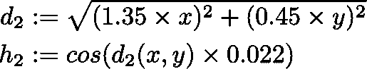

# HTML 画布的乐趣:让我们制作熔岩灯等离子体

> 原文：<https://towardsdatascience.com/fun-with-html-canvas-lets-make-lava-lamp-plasma-e4b0d89fe778?source=collection_archive---------11----------------------->

Real time lava-lamp style plasma

在这篇文章中，你将学习如何创建上面嵌入的熔岩灯等离子体效果。该效果是实时计算的，并使用 HTML 画布进行渲染。

如果你在手机上，看不到嵌入，你可以[直接打开嵌入页面](https://jci4z.codesandbox.io/)。

不需要高等数学。我会解释所有我们需要的数学概念。我们将使用`sin`和`cos`函数，这就是这个效果所需的所有数学复杂性。

如果您想查看完成的代码，请在另一个窗口中打开[源代码](https://codesandbox.io/s/crazy-surf-jci4z)。

# HTML

我们的 HTML 结构是基本的。我们创建一个主体，在其中放置一个画布，并对我们的标记进行样式化，使我们的画布总是填充整个窗口。

```
<!DOCTYPE html>
<body
  style="position: fixed; left: 0px; right: 0px; top: 0px; bottom: 0px; overflow: hidden; margin: 0; padding: 0;"> <canvas 
    id="canvas"
    style="width: 100%; height: 100%; padding: 0;margin: 0;"
  ></canvas></body>
```

# 设置

我们将画布设置为固定大小的`512 x 512`像素。画布的像素被设计为拉伸填充整个窗口，但是内部像素缓冲区的大小是固定的`512 x 512`。

```
const canvas = document.getElementById("canvas");
const c = canvas.getContext("2d");*// size of canvas* const imgSize = 512;canvas.width = imgSize;
canvas.height = imgSize;
```

我们不打算在画布上使用任何绘图功能，我们将把它当作一个像素缓冲区。我们不能直接操作画布上的像素值，但我们可以创建一个与画布大小相同的图像缓冲区，根据需要操作图像缓冲区，然后将其内容绘制到画布上。

对 [createImageData](https://developer.mozilla.org/en-US/docs/Web/API/CanvasRenderingContext2D/createImageData) 的调用为我们提供了一个与画布大小相同的图像缓冲区。

```
*// init image data with black pixels*const image = c.createImageData(imgSize, imgSize);for (let i = 0; i < image.data.length; i += 4) {
  image.data[i] = 0; *// R* image.data[i + 1] = 0; *// G* image.data[i + 2] = 0; *// B* image.data[i + 3] = 255; *// A* }
```

返回的图像数据是像素数据的一维数组。每个像素由四个连续的值表示。这四个值是 0-255 范围内的整数强度。它们依次保存像素的红色、绿色、蓝色和 alpha 分量的值。

该阵列按行存储所有图像像素。第一行的像素先出现，然后是第二行，依此类推，行与行之间没有间隙。

我们将所有的图像像素初始化为不透明的黑色。

# 效果总结

该效果依赖于构造两个高度图，在相对运动时组合它们，并根据高度值的总和对输出进行着色。

# 1 号高度图

我们想填充第一个`1024 x 1024`高度图，平滑值范围从 0..128.

我们希望值的分布平滑，没有噪声。我们将在第二个高度图中添加噪声。第一个高度图的工作是给我们一些各个方向的平滑的波浪作为可预测的基础层。

我们希望生成一个高度图，当在透视图中渲染时，看起来像这样:


height map 1

我在用正弦函数生成高度图。还记得窦的功能吗？以下是相关事实:

*   它产生连续的波浪
*   它是周期性的，频率为 2π
*   它生成-1 和 1 之间的值

我们来看看。


plain sin(x)

我们想要产生一个大约有 1.5 个完整振荡的波。这就是我们从 sin 函数中得到的，当我们给它 0 到 3π的值时。

如果我们适当的缩放比例，我们可以得到任何我们需要的频率。例如，如果我们想要在 x = 0 和 x = 512 之间产生 1.5 次振荡，我们不会将`x`传递给 sin，但是`x × 3π/512``x`越接近 512，我们的转换输入值就越接近 3π。


graph of sin(x `×` 3π/512)

接下来我们需要关注的是输出范围。sin 函数给出了介于-1 和 1 之间的值。我们想要 0..128.

我们可以转换-1..1 到我们想要的范围，首先归一化到 0..1.为此，我们加 1，然后除以 2。值在 0 之间..1 我们可以到达 0..乘以 128 得到 128。

因此，我们完成的发电机公式是:


该图具有我们需要的所有属性:


`we have a wave in range (sin(x×3π/512)+1)/2*128`

我们有一个很好的函数来生成我们的高度图。但是我们如何用合适的值填充 2D 高度图呢？

我们确定每个像素到高度图中心的距离，并使用*距离*作为高度生成函数的输入。相同的距离像素产生相同的高度值，所以我们得到一个从中心出现的径向波值。


Same distance pixels generate the same height value

为了计算像素到中心的距离，我们首先将像素坐标偏移地图宽度和高度的一半。这有效地将坐标移动到以原点为中心的坐标系。

像素坐标允许我们构建一个直角三角形，所以我们可以使用[勾股定理](https://medium.com/swlh/why-the-pythagorean-theorem-is-true-1d4c8a508510)告诉我们`distance² = cx² + cy²`


the distance from origin is given by sqrt(cx²+cy²)

第一张高度图就这样了。对应的代码是:

# 二号高度图

我们想用 0 范围内的值填充第二个`1024 x 1024`高度图..127.这一次我们想要不规则。它们需要在空间上连贯一致，从山丘到山谷平滑过渡。

由于我们已经熟悉了 sin 函数，我将继续使用 trig 函数来生成第二个高度图。在透视图中，它看起来像这样:


Height map 2

这张地图不是随机的。事实上，这是非常有规律的。它甚至关于 x 轴和 y 轴都是对称的。它只是混杂在一起，足以有一个有机的感觉，这就是我们所要寻找的。

它由正弦和余弦函数之和构成，这些函数在偏离中心的轴伪距离上运算。像以前一样，输入被缩小以产生适合我们的地图大小的波浪量，输出被缩放为 0..127.

## 构建高度函数

主要思想是使用正弦和余弦之和来产生波状不规则性。出于我们的目的——这里纯粹是审美目的——我们将 cos 函数理解为 sin 函数的相移版本。


cos is just a phase shifted version of sin

这次我们不想要径向对称，所以我们不打算用距离作为这些函数的输入。相反，我们将使用轴倾斜版本的距离。

对于 sin 部分，我们将拉伸 y 坐标，收缩 x 坐标。然后，我们缩小输入，以达到一个适合我们地图大小的好看的频率。


对于 cos 部分，我们遵循同样的思路，但是沿 x 轴拉伸，沿 y 轴收缩。



这两个部分为我们产生了规则的椭圆波形。当我们把它们加起来，它们就形成了我们想要的不规则的山丘景观


sin, cos, and combined waves

我们仍然需要将输出标准化到 0..127.当我们将 sin 和 cos 的输出相加时，我们得到-2 范围内的值..2，所以我们加 2，除以 4，得到值 0..1，然后缩放 127 以得到我们想要的范围。


第二张高度图到此为止。下面是相应的代码:

# 渲染高度贴图

我们将我们的高度图构造为`1024 x 1024`，与我们的可见图像尺寸`512 x 512`相比，它在每个方向上的尺寸都是两倍

为了使高度图可见，我们可以迭代任何`512 x 512`部分，从高度值中导出每个像素的显示颜色，并将颜色放入我们的图像缓冲区。

因为高度图包含 0..128 和 0..127，我们可以将它们相加，得出范围为 0..255.最简单的开始是渲染相应的灰度值，其中红色、绿色和蓝色分量是相同的。

如果我们对高度图 1、高度图 2 以及它们的值的总和(都从左上角开始)执行此操作，我们将得到以下图像:


height map 1, height map 2, and the sum of their values

下面是更新图像像素缓冲区的相应代码:

# 高度场动画

我们应该开始制作我们的高度图来获得初步的视觉效果。我们应得的。

这个想法是动画的高度地图的位置相对于彼此。请记住，我们有`1024 x 1024`高度图，但只有一个`512 x 512`图像视图，因此在每个高度图上，对图像有贡献的第一个——左上角——像素可以是范围`[0..512]x[0..512]`内的任何像素


different offsets of height maps create different values in the view port

我们将使用[requestAnimationFrame](https://developer.mozilla.org/en-US/docs/Web/API/window/requestAnimationFrame)API 来启动我们的动画。当需要渲染下一帧时，它会调用我们的`tick`函数。浏览器会尽力给我们一点时间来绘制下一帧，通常目标是每秒 60 帧。我们需要请求在我们完成后再次被呼叫。

在我们的 tick 函数中，我们将高度图偏移更新到新的位置，重新计算新的图像数据，并将图像呈现到画布上。

## 随时间插值高度图偏移

当我们的回调函数被调用时，浏览器会传入一个以毫秒为单位表示时间的高分辨率数值。每次调用我们的时候，这个参数都会比上次调用的毫秒数高。我们可以将这一事实用于基于时间的动画，从而独立于帧速率。

我们将使用时钟值来驱动高度贴图偏移的动画。我们需要在两个高度图上的两个轴上插入 0 到 512 之间的值。我们将为四个偏移值中的每一个单独做这件事，因为我们不希望运动开始看起来太有规律或重复。

我们的目标是移动高度贴图的中点，使其在视口中漫游，如下所示:


desired middle point movement of our height maps within the viewport

是的，既然我们已经对 sin 和 cos 有了充分的了解，我们就用它们来插值时间偏移。

给定一个进行中的时间值`t`,我们的插值必须给我们一个范围为 0 的值..512.

我们在构建高度图时使用的相同原则在这里也适用。我们将缩小`t`来延长一个完整振荡发生的时间。然后，我们通过加 1，除以 2，然后乘以 512 来缩放到所需的范围。

我们还想增加一些变化，因为我们想对四个偏移量进行稍微不同的插值。为此，我们可以改变时间比例因子，并给`t`增加一个常数，以在输出中产生相移。

这是我们的基本公式:


对于四个偏移中的每一个，我们将对`timeScale`和`phaseShift`使用稍微不同的值，以避免锁步重复动画。下面是相应的代码:

随着偏移动画的到位，我们已经得到了等离子体效果的灰度版本。

# 我们迄今为止的进展

这是我们迄今为止取得的进展:[动画灰度等离子体](https://codesandbox.io/s/nameless-wood-rq5wy)


screenshot of grey-scale plasma sandbox

# 添加颜色

我们将通过添加颜色来改善我们的等离子效果。首先，我们将添加静态颜色，然后我们将提出一个随着时间改变颜色的策略。

## 使用单一调色板

主要思想是使用一组固定的 256 种颜色来对应范围 0..255.

如果我们认为低值是谷，高值是山，我们可以决定将山设为蓝色`rgb 0,0,255`而将谷设为红色`rgb 255,0,0`，并在颜色之间进行线性插值。我们可以预先计算所有 256 种颜色，并将它们放入一个数组中，这样高度值为 0..255 索引成与高度相对应的颜色。

如果我们用`r, g, and b`键将颜色表示为对象，我们可以使用辅助函数在两种颜色之间进行插值:

```
// c1 and c2 are colors
// f is a fraction between 0..1
//
// returns an interpolated color between 
//   c1 (for f=0) and
//   c2 (for f=1)
//
// pass f=0.5 to get the color half-way between c1 and c2const interpolate = (c1, c2, f) => {

  return {
    r: Math.floor(c1.r + (c2.r - c1.r) * f),
    g: Math.floor(c1.g + (c2.g - c1.g) * f),
    b: Math.floor(c1.b + (c2.b - c1.b) * f)
  };
};
```

## 使用双色渐变

我们可以生成 256 种颜色的渐变，如下所示:

```
// generates an array of 256 colors 
// forming a linear gradient of the form
// [c1, ..., c2]const linearGradient = (c1, c2) => {
  const g = [];
  *// interpolate between the colors in the gradient* for (let i = 0; i < 256; i++) {
    const f = i / 255;
    g[i] = interpolate(c1, c2, f);
  }
  return g;
};
```

有了这些助手，我们可以像这样定义一个调色板:

```
let palette = linearGradient(
   { r: 255, g: 255, b: 0 },  // c1 yellow
   { r: 0, g: 54, b: 128 }    // c2 dark blue
);
```

在`updateImageData`中，我们可以使用调色板中对应于高度值的颜色:

```
*// height value of 0..255* let h = heightMap1[i] + heightMap2[k];*// get color value from current palette* let c = palette[h];
```

以下是使用两种颜色之间的线性渐变的一些结果:


Using a linear gradient between two colors

整体视觉效果还是和灰度着色差不多。我们可以通过在渐变中添加额外的不同颜色来创造更多样的外观。

## 五色渐变

让我们创建一个渐变函数，它接受五种不同的颜色，并在它们之间进行插值。

创建五种颜色的调色板极大地增强了我们输出的多样性。

通过在中等高度的部分选择任意的颜色，我们将我们对深度的感知与潜在的高度值分离。

我们可以自由地为调色板的中间选择浅色，为相邻的颜色选择深色，以获得更高和更低的值。在我们的感知中，这使得高度图的中间色调看起来像脊线。这种效果是我们只有用两种以上颜色的渐变才能达到的。


multi-color palettes can effectively accentuate or blur areas in our height map

# 使用两种调色板

现在我们可以轻松地创建调色板，我们可以创建两个调色板，并随着时间的推移在它们之间进行插值。

我们想开始创造性地使用颜色，所以在我们继续之前，让我们快速添加一个助手来创建一个随机的 5 色渐变调色板。

```
*// returns a random color* const randomColor = () => {
  const r = Math.floor(Math.random() * 255);
  const g = Math.floor(Math.random() * 255);
  const b = Math.floor(Math.random() * 255);

  return { r, g, b };
};// returns a random 5-color gradient palette
const makeRandomPalette = () => {
  const c1 = randomColor();
  const c2 = randomColor();
  const c3 = randomColor();
  const c4 = randomColor();
  const c5 = randomColor();

  return makeFiveColorGradient(c1, c2, c3, c4, c5);
};
```

每一帧我们计算一个范围为 0 的值..1，并将当前帧的调色板创建为源调色板的相应颜色之间的插值。

我们将使用 cos 函数进行插值。应用与之前相同的规则:我们拉伸`t`值来控制振荡时间，然后归一化为 0..通过加 1 除以 2 得到 1。

```
*// two palettes we interpolate between* const palettes = [makeRandomPalette(), makeRandomPalette()];*// current palette is edstablished durting animation* let palette = [];const updatePalette = t => {
  const timeScale = 0.0005;
  const x = t * timeScale;

  *// normalized value 0..1 used to interpolate palette colors* const inter = (Math.cos(x) + 1) / 2; *// create interpolated palette for current frame* for (let i = 0; i < 256; i++) {
    palette[i] = interpolate(palettes[0][i], palettes[1][i], inter);
  }
};
```

现在，我们可以使用两个调色板来实现我们的效果不同的艺术意境。


Given two color palettes we can interpolate between the two each frame

## 转向时生成新调色板

两个调色板之间的混合很好，但仍然有些静态。最后，随着时间的推移，我们将生成新的调色板。

当在两个调色板之间来回切换时，最好能知道我们何时到达插值的远端，也就是说`inter`何时分别到达`0`和`1`，并且即将开始向相反的方向移动。

一旦我们检测到这个事实，我们可以在另一端生成一个新的调色板，并平滑地插入一组新的颜色。

仅仅检查`inter`的具体值是不够的。首先，我们不能指望准确地击中`0`或`1`。

假设我们在`inter = 0.01`，直到下一帧足够长的时间过去，使得 cos 函数经过`0`并再次移动到`0.01`。这种情况也说明了我们的下一个问题:仅仅看插值并不能告诉我们前进的方向。我们应该重新生成两个调色板中的哪一个？

## 检测转向点

我们需要插值函数`cos`的[导数](https://simple.wikipedia.org/wiki/Derivative_(mathematics))。我们需要看看`-sin`。

`cos`的导数给出了`cos`任意给定点处切线的斜率。实际上:当一个函数在点`x`向下时，导数函数在点`x`为负。当函数在点`x`向上时，导数在点`x`为正。

因此，我们可以寻找导数符号的变化。如果前一帧的导数是负的，而当前帧的导数是正的，我们已经改变了方向，正在向第二个调色板插值。

同样的想法适用于相反的情况。如果前一帧的导数是正的，而当前帧的导数是负的，我们已经改变了方向，正在向第一个调色板插值。

`cos`的导数是`-sin`。通过查看图表，说服自己上述陈述是正确的。


cos(x) and its derivative -sin(x)

当`cos`向下时，`-sin`为负。当`cos`抬头时，`-sin`为正。在`cos`改变方向的点`-sin`是`0`。

我们将使用这些事实，并扩展我们的调色板插值，以在检测到导数符号变化时生成新的调色板。

根据新的导数是正的还是负的，我们知道我们正在向哪个调色板插值，所以我们可以替换正确的那个。

对新生成的调色板插值结束了我们的工作。等离子效果完成了。

恭喜你走到这一步！

# 结论

哇，那真是一段旅程。在这里找到完整的工作源码[。坐下来享受你创造的一切吧！](https://codesandbox.io/s/crazy-surf-jci4z)


random screenshot of lava lamp plasma

PS: 看看这篇用 HTML 创建星球大战标题抓取的文章。这比血浆更容易做到，但也相当值得。它看起来非常接近真实的交易。

[](https://medium.com/better-programming/create-a-star-wars-title-crawl-in-html-c25a76fea401) [## 创建一个 HTML 格式的星球大战标题抓取

### 很久很久以前，在一个遥远的浏览器里

medium.com](https://medium.com/better-programming/create-a-star-wars-title-crawl-in-html-c25a76fea401)