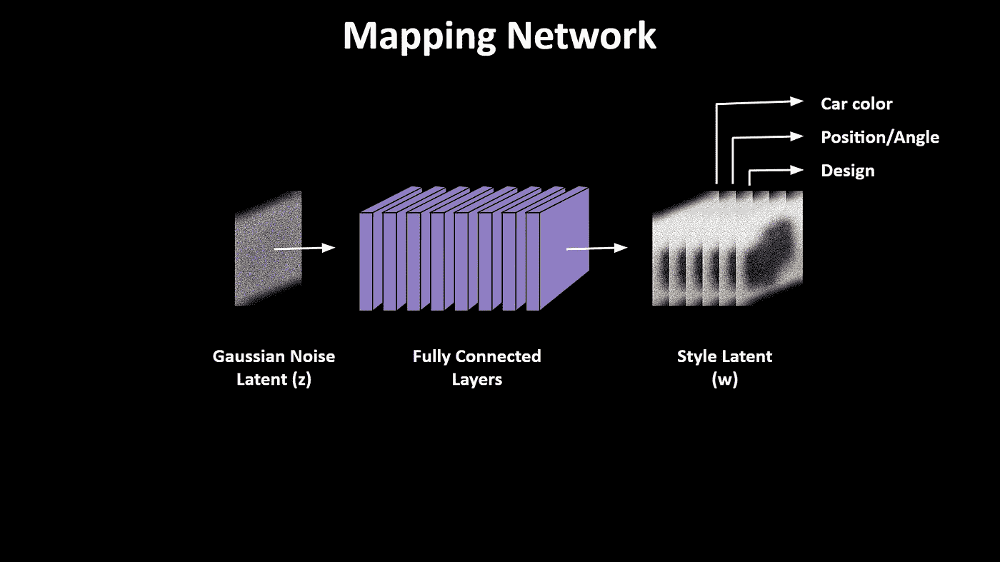

# StyleGAN 的乐趣:让我们预测特斯拉 CyberTruck 的设计！

> 原文：<https://towardsdatascience.com/fun-with-stylegan-lets-predict-the-tesla-cybertruck-design-3f2123ab4d0d?source=collection_archive---------35----------------------->

## 当你从一辆旧的*皮卡*和一辆*特斯拉 Model X* 的潜在组合中生成一辆带有 **StyleGAN** 的汽车时，会发生什么？

11 月 21 日，埃隆·马斯克将推出一款新的特斯拉皮卡，他说

所以自然地，作为一名数据科学家和特斯拉粉丝，我必须探索人工智能是否可以预测这辆卡车的设计！

经过数周的尝试和失败，我终于找到了一个名为 [**StyleGAN**](https://github.com/NVlabs/stylegan) 的生成式人工智能模型，它可以产生[想象中的汽车设计](https://www.youtube.com/watch?v=OLZ3-ZJwSu4)，我用这个模型结合了一辆*皮卡*和一辆*特斯拉 Model X* 的设计，给了我们一个特斯拉卡车的估算设计。

StyleGAN output for **Old Pickup Truck + Tesla Model X**

在进一步将假想的特斯拉卡车的设计与一辆[装甲运兵车](https://i.pinimg.com/originals/4d/5e/1a/4d5e1aae30ceac3f6669ad9126d02dde.jpg)的设计相结合后，我们根据埃隆的描述得到了赛博卡车设计的最佳估计。

Is this what the Tesla CyberTruck will look like? StyleGAN seems to think so.

# 理解风格 g

今年早些时候，NVIDIA 的研究人员推出了 StyleGAN 。它最出名的是能够生成看起来非常真实的随机人脸。他们还提供生成汽车的预训练模型，这是我在这个项目中使用的。

These people are not real. These are random faces generated by StyleGAN. [[source](https://github.com/NVlabs/stylegan)]

任何 GAN 方法的典型发生器网络使用从高斯分布提取的随机噪声像素的图像作为起点。然后，它学习将这个有噪声的图像转换为目标分布，在我们的例子中是一辆汽车的图像。

生成器使用几个卷积层来学习这个目标分布，使用数千个图像样本用于其训练过程。然而，StyleGAN 的工作方式略有不同。它在输入噪声层和卷积层之间引入了一个额外的映射网络。映射网络仅由完全连接的层组成，这些层接收噪声图像并将其转换为一些有意义的潜在空间表示。

Mapping Network in StyleGAN

这个中间的潜在空间包含多个层，其中每一层都表示一个特定的造型元素，生成器在试图生成汽车图像时需要使用该元素。因此，一层可能包含关于汽车颜色的信息，另一层可能包含关于位置和角度的信息，如前视图或后视图。一层可以包含前灯设计的信息等等。

The Generator/Synthesis Network of StyleGAN.

现在是斯蒂根模型的生成器。该模型使用小尺度的恒定图像作为在训练过程中学习的起点。几个上采样和卷积层处理这个输入。来自映射网络的中间潜在表示在这里被用于不同的级别，以控制输出汽车图像的设计。这就是 StyleGAN 能够生成随机汽车图像的方式。

# 然而，这里有一个问题。

虽然我们可以使用 StyleGAN 来转换随机噪声输入，使其看起来像汽车，但我们无法控制汽车的设计元素。换句话说，对于任何给定的输入，我们无法控制映射网络的输出。因此，如果我们想为特斯拉 CyberTruck 生成具有特定风格特征的汽车，我们将需要以某种方式修改这种潜在的风格，以符合 CyberTruck 的描述。只有这样，我们才能使用合成网络来可视化汽车的最终输出图像。

# 编码器拯救世界。

谢天谢地，有人为这个问题找到了一个巧妙的解决办法。名为 [**StyleGAN-Encoder**](https://github.com/Puzer/stylegan-encoder) 的 github repo 将在这里帮助我们。

使用这个编码器，我们可以训练另一个神经网络，它充当一个**“反向生成器”**。它可以将任何汽车的图像(如特斯拉 Model X)作为其输入，并产生相应的潜在空间作为其输出。一旦潜在空间可用，我们可以对其进行修改，并根据我们的意愿改变输入车的设计。很聪明，对吧？

所以，这里是这个**反向发电机**的工作原理。首先，我们使用一个预训练的 ResNet 模型来转换我们想要改变其设计的汽车的图像，并将其转换为潜在的风格作为其输出。为此生成训练数据非常容易，我们可以简单地使用 StyleGAN 生成器来生成几乎无限的输入-输出样本对。使用这个，我们可以得到一个由 StyleGAN 的映射网络产生的潜在空间的相当不错的估计。

但是，仍然有一些更多的优化需要做。一旦我们从 ResNet 获得了对潜在风格的粗略估计，我们就可以用它来生成汽车的相应图像。损失函数现在可以由 [**VGG 感知损失**](/perceptual-losses-for-real-time-style-transfer-and-super-resolution-637b5d93fa6d) 度量来定义，该度量测量两个输出图像在视觉上看起来有多不同。对于比较图像之间的视觉相似性来说，这是一个比诸如均方误差之类的更健壮的度量。

现在，为了优化潜在的风格，我们需要做的就是通过这个组合网络反向传播，同时保持所有网络权重固定。这里唯一允许训练的参数是**输入风格潜伏**。因此，经过几次反复训练后，你可以很快收敛到潜在风格的最佳估计值。

# 玩潜伏空间！

我们现在准备通过组合不同汽车的潜在风格，挑选我们想从哪辆汽车中选择的设计元素，来玩转这种潜在风格。然后，我们可以简单地使用 StyleGAN 生成器来产生混合多种汽车设计的结果。

> 我必须承认，和甘斯一起工作时，玩这个潜在空间是你能得到的最大乐趣！

# 结果:赛博卡车预测！

我摆弄了一下这个人工智能，得到了一些关于即将推出的特斯拉 CyberTruck 设计的有趣预测。我将不同的设计风格混合到一辆旧学校皮卡的潜在空间中，得到了 StyleGAN 输出，如下图。

1.  第一个简单地将卡车转换成 Model X 克隆，如果不是因为埃隆·马斯克对网络卡车的疯狂设计想法，这将是一个安全的选择。
2.  这就是为什么我认为第二种选择看起来最接近网络卡车的实际样子。它结合了
3.  第三种选择也可能是真的，如果埃隆决定让它看起来像一辆复古的银翼杀手汽车，但不幸的是，它看起来不再像特斯拉汽车。

我投票给最接近真实情况的选项 2。但是，你们觉得呢？你认为赛博卡车看起来会像这些预言中的任何一个吗？或者你认为它会看起来完全不同，一些我们从未见过的东西？请在下面的评论中告诉我！

# 参考

1.  [学习如何用一个生成性对抗网络来变形人脸！](https://www.youtube.com/watch?v=dCKbRCUyop8)由 [Arxiv 洞察](https://www.youtube.com/channel/UCNIkB2IeJ-6AmZv7bQ1oBYg)
2.  [用 nVidia StyleGAN 和 Python (7.3)生成人脸](https://www.youtube.com/watch?v=Wwwyr7cOBlUFF)作者[杰夫·希顿](https://www.youtube.com/user/HeatonResearch)
3.  [StyleGAN](https://www.youtube.com/watch?v=AQBti_wN414) 作者[亨利·艾实验室](https://www.youtube.com/channel/UCHB9VepY6kYvZjj0Bgxnpbw)

感谢您的阅读。如果你喜欢这篇文章，你可以在[媒体](https://medium.com/@chintan.t93)、 [GitHub](https://github.com/ChintanTrivedi) 上关注我的更多作品，或者订阅我的 [YouTube 频道](http://youtube.com/c/DeepGamingAI)。