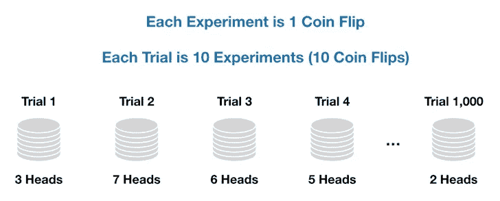
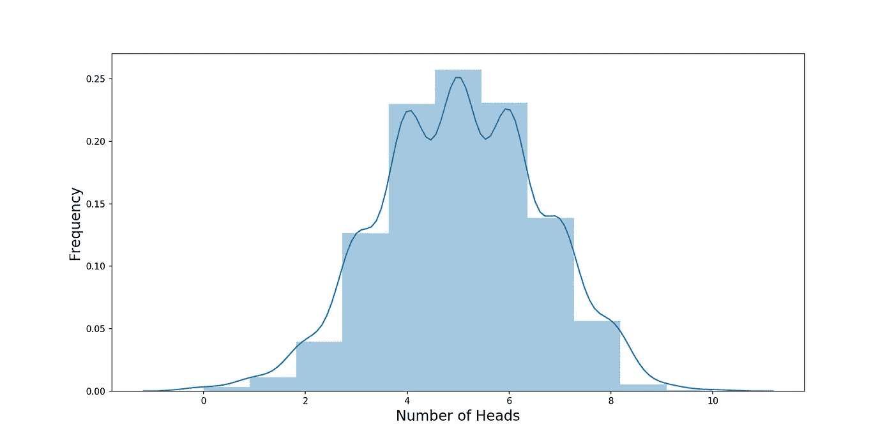
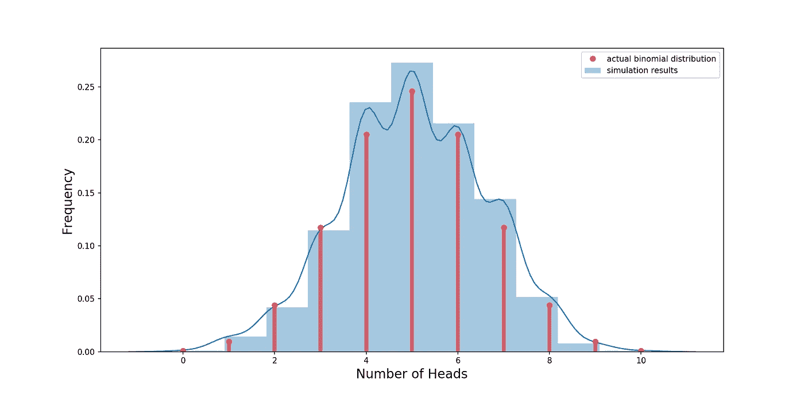
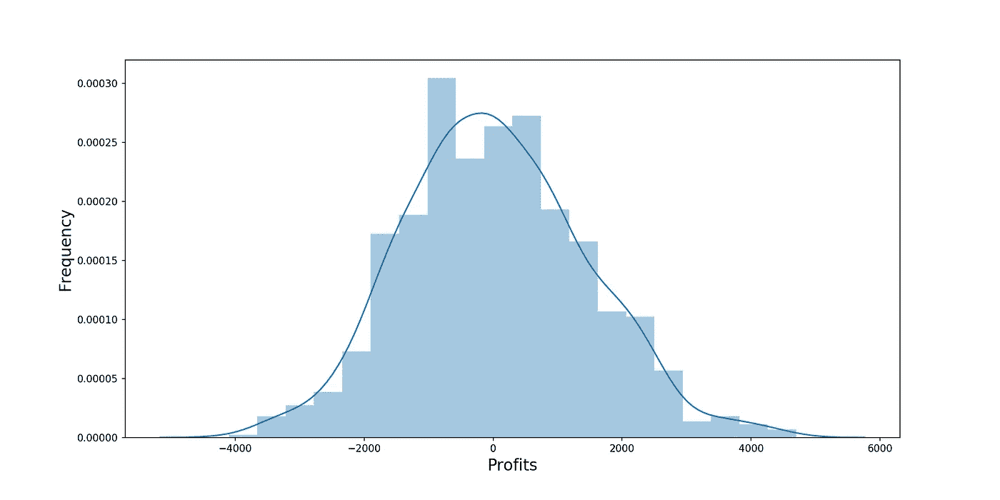
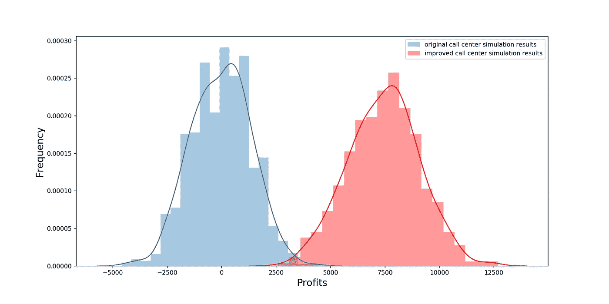

# 有趣的二项式分布

> 原文：<https://towardsdatascience.com/fun-with-the-binomial-distribution-96a5ecabf65b?source=collection_archive---------4----------------------->


## 理解不太为人所知的正态分布，以及如何应用它

每个人都知道并喜欢正态分布。它被用于各种各样的应用，如投资建模、A/B 测试和制造过程改进(六西格玛)。

但是人们对二项分布不太熟悉。这很遗憾，因为二项分布真的很有用。有人问过你类似这样的问题吗:

> "给定一枚硬币，掷 10 次，得到 6 个头的概率是多少？"

概率(尤其是餐巾纸后面的概率计算)不是我最喜欢的东西。所以当我第一次学习二项分布的时候，我想，“是的，我再也不用担心抛硬币的概率问题了！”

那是因为抛硬币的结果遵循二项分布。我应该强调一下,[大数定律](https://en.wikipedia.org/wiki/Law_of_large_numbers)在这里适用。为了技术上的正确，**我应该说，如果我们一遍又一遍地重复进行同一套实验(投掷硬币 10 次)，我们在所有这些实验中观察到的人头数将遵循二项式分布。**

不要担心，我很快会详细说明这一点。

# 什么是二项分布

首先让我们从稍微更技术性的定义开始— **二项式分布是一系列实验的概率分布，其中每个实验产生一个二元结果，并且每个结果都独立于所有其他结果。**

一次抛硬币是二进制结果实验的一个例子。抛硬币也符合另一个二项式分布要求——每一次抛硬币的结果都是独立的。需要明确的是，实验的结果不需要像掷硬币一样具有相同的可能性，以下内容也符合二项分布的前提条件:

*   不公平的硬币(例如有 80%的概率正面朝上)。
*   在街上随机挑选一些人来回答是或否的问题。
*   试图说服网站访问者购买产品——是或否的结果取决于他们是否购买。

概率和统计的新手可能会遇到的一个问题是概率分布的概念。我们倾向于确定性地思考，比如“我将一枚硬币抛 10 次，产生了 6 个头”。所以结果是 6，那么分布在哪里呢？

概率分布来源于方差。如果你和我都掷 10 枚硬币，很可能我们会得到不同的结果(你可能得到 5 个正面，而我得到 7 个)。**这种方差，也就是围绕结果的不确定性，产生了一种概率分布，它基本上告诉我们哪些结果相对更有可能(比如 5 个头)，哪些结果相对不太可能(比如 10 个头)。**

我们可以通过模拟产生这样的概率分布，如下图所示:



Illustration of a Sequence of Trials that Would Produce a Binomial Distribution

在我们进入运行这个模拟并产生二项式分布的 Python 代码之前，让我们先了解一些定义。当你看到教科书中描述的二项式分布及其背后的实验时，这些描述总是包括以下关键参数:

1.  **n:** 我们做实验的次数。在我们的硬币例子中，n 等于 10(每个实验是硬币的 1 次翻转)。
2.  **p:** 成功概率。公平地说，应该是 50%。
3.  k: 成功的目标次数。之前我们提到过我们希望获得 6 项成功。

# 用 Python 实现二项式分布

让我们来看一些运行上述模拟的 python 代码。下面的代码 **(** [**也可以在我的 Github 这里得到**](https://github.com/yiuhyuk/binomial) **)** 做了如下的事情:

1.  生成一个介于 0 和 1 之间的随机数。如果这个数字是 0.5 或者更多，那么把它算作正面，否则就是反面。使用 Python list comprehension 做 n 次。这在函数 **run_binom** 中通过变量 **tosses** 实现。
2.  重复指定次数(试验次数由输入变量**试验**指定)。我们将进行 1000 次试验。

```
# Import libraries
import numpy as np
import matplotlib.pyplot as plt
import seaborn as sns# Input variables# Number of trials
trials = 1000# Number of independent experiments in each trial
n = 10# Probability of success for each experiment
p = 0.5# Function that runs our coin toss trials
# heads is a list of the number of successes from each trial of n experiments
def run_binom(trials, n, p):
    heads = []
    for i in range(trials):
        tosses = [np.random.random() for i in range(n)]
        heads.append(len([i for i in tosses if i>=0.50]))
    return heads# Run the function
heads = run_binom(trials, n, p)# Plot the results as a histogram
fig, ax = plt.subplots(figsize=(14,7))
ax = sns.distplot(heads, bins=11, label='simulation results')ax.set_xlabel("Number of Heads",fontsize=16)
ax.set_ylabel("Frequency",fontsize=16)
```

这就是代码。那么，当我们重复 10 次掷硬币试验 1000 次时，会发生什么呢？我们得到下面绘制的直方图:



Our Simulation Results

让我们修改前面代码的绘图部分，以便我们的绘图也显示实际的二项式分布(使用 scipy 库中的 [stats.binom 函数):](https://docs.scipy.org/doc/scipy/reference/generated/scipy.stats.binom.html#scipy.stats.binom)

```
# Plot the actual binomial distribution as a sanity check
from scipy.stats import binom
x = range(0,11)
ax.plot(x, binom.pmf(x, n, p), 'ro', label='actual binomial distribution')
ax.vlines(x, 0, binom.pmf(x, n, p), colors='r', lw=5, alpha=0.5)
plt.legend()
plt.show()
```

下图用蓝色显示了我们最初的模拟分布，用红色显示了实际的二项式分布。要点是，如果我们实际上重复 10 次抛硬币 1000 次，二项式分布是我们观察到的非常好的近似值——因此，我们可以直接使用二项式分布，而不是浪费大量时间来抛硬币和记录结果！



Actual Binomial Distribution (Red) vs. Our Simulation Results (Blue)

如果我们想模拟一系列 **n** 次实验的结果(回想一下，在我们的例子中 n=10，但实际上它可以是任何正整数)，我们可以使用二项分布的随机变量来生成结果，如下所示:

```
np.random.binomial(n, p)
```

最后，让我们通过对 10 次抛硬币进行 10，000 次模拟来回答我们最初的问题(10 次抛硬币得到 6 个正面的概率):

```
# Probability of getting 6 headsruns = 10000
prob_6 = sum([1 for i in np.random.binomial(n, p, size=runs) if i==6])/runs
print('The probability of 6 heads is: ' + str(prob_6))
```

我们发现概率约为 20%(我们也可以通过 x 轴上红色垂直线高于 6 的高度在之前的直方图中看到这一点)。

# 二项分布在现实世界中的应用

酷，但是如果我们想分析抛硬币以外的事情呢？让我们来看一下二项分布的一个程式化的真实世界用例。假设我们是数据科学家，负责提高我们公司呼叫中心的 ROI(投资回报),在这里，员工试图给潜在客户打电话，让他们购买我们的产品。

您查看了一些历史数据，发现了以下情况:

*   典型的呼叫中心员工平均每天打 50 个电话。
*   每次通话的转换(购买)概率为 4%。
*   你公司每次转换的平均收入是 20 美元。
*   您正在分析的呼叫中心有 100 名员工。
*   每个雇员每天的工资是 200 美元。

> 我们可以将每个员工视为具有以下参数的二项分布随机变量:
> 
> **n = 50**
> 
> **p = 4%**

以下代码模拟了我们的呼叫中心:

```
# Call Center Simulation# Number of employees to simulate
employees = 100# Cost per employee
wage = 200# Number of independent calls per employee
n = 50# Probability of success for each call
p = 0.04# Revenue per call
revenue = 100# Binomial random variables of call center employees
conversions = np.random.binomial(n, p, size=employees)# Print some key metrics of our call center
print('Average Conversions per Employee: ' + str(round(np.mean(conversions), 2)))
print('Standard Deviation of Conversions per Employee: ' + str(round(np.std(conversions), 2)))
print('Total Conversions: ' + str(np.sum(conversions)))
print('Total Revenues: ' + str(np.sum(conversions)*revenue))
print('Total Expense: ' + str(employees*wage))
print('Total Profits: ' + str(np.sum(conversions)*revenue - employees*wage))
```

如果您运行该代码，您会得到如下输出(每次运行都会发生变化，因为**转换**是一个二项分布的随机变量数组)呼叫中心的关键指标:

*   **每位员工的平均转换率:** 2.13
*   **每个员工转换率的标准偏差:** 1.48
*   总转换数: 213
*   总收入:21300 美元
*   **总费用:**20，000 美元
*   **总利润:【1,300 美元**

与费用相比，利润相当微薄。但这些只是随机产生的一天的结果。让我们看看我们的呼叫中心在 1，000 次模拟中的利润，看看每天的利润是如何变化的:



Profit Distribution of Our Call Center

哇，鉴于我们呼叫中心目前的运营指标，亏损的可能性非常高(近一半的模拟利润为负)。那我们该怎么办？

**回想每位员工的业绩都遵循二项分布**，我们意识到我们可以采取以下一项或多项措施来改善情况:

*   多打冷门电话(增加 **n** )。
*   以更高的百分比转换(增加 **p** )。
*   少给员工发工资(我们不会这么做，因为我们人好)。

最终，我们开发了一个潜在客户生成工具，使我们的呼叫中心员工能够识别更有可能购买我们产品的人。这导致电话通话时间更短(需要的甜言蜜语更少)，我们的转换概率上升，最终对我们的参数进行了如下修改:

*   **n = 55**
*   **p = 5%**

让我们运行下面几行代码，模拟我们新改进的呼叫中心的 1000 个潜在工作日，看看这些变化如何影响我们未来每日利润的统计分布。

```
# Call Center Simulation (Higher Conversion Rate)# Number of employees to simulate
employees = 100# Cost per employee
wage = 200# Number of independent calls per employee
n = 55# Probability of success for each call
p = 0.05# Revenue per call
revenue = 100# Binomial random variables of call center employees
conversions_up = np.random.binomial(n, p, size=employees)# Simulate 1,000 days for our call center# Number of days to simulate
sims = 1000sim_conversions_up = [np.sum(np.random.binomial(n, p, size=employees)) for i in range(sims)]
sim_profits_up = np.array(sim_conversions_up)*revenue - employees*wage# Plot and save the results as a histogram
fig, ax = plt.subplots(figsize=(14,7))
ax = sns.distplot(sim_profits, bins=20, label='original call center simulation results')
ax = sns.distplot(sim_profits_up, bins=20, label='improved call center simulation results', color='red')ax.set_xlabel("Profits",fontsize=16)
ax.set_ylabel("Frequency",fontsize=16)
plt.legend()
```

上面的代码还绘制了我们的改进结果(红色)相对于旧结果(蓝色)的分布。我们不需要[进行 A/B 测试(尽管我们真的应该)](/data-science-fundamentals-a-b-testing-cb371ceecc27)就能看到我们的销售线索挖掘工具已经显著改善了我们呼叫中心的运营和盈利能力。

> 我们成功认识到每个员工产生的利润遵循二项式分布，因此如果我们能够增加 **n** (每天拨打的陌生电话数量)和 **p** (每次电话的转换概率)参数，我们可以产生更高的利润。



Improved Call Center Simulation

# 结论

最后，我想提出以下几点:

*   **概率分布是接近现实的模型。**如果我们能够找到一个与我们所关心的结果非常接近的分布，那么这个分布就非常强大——就像我们上面看到的那样，只需要几个参数(n 和 p ),我们就可以对数百人产生的利润进行建模。
*   然而，同样重要的是**认识到模型在哪里以及如何与我们的现实情况不匹配** —这样我们就知道在什么情况下我们的模型可能表现不佳。

干杯！

***更多数据科学与分析相关帖子由我:***

[*了解 PCA*](/understanding-pca-fae3e243731d?source=post_page---------------------------)

[*了解随机森林*](/understanding-random-forest-58381e0602d2?source=post_page---------------------------)

[*理解神经网络*](/understanding-neural-networks-19020b758230?source=post_page---------------------------)

[*了解 A/B 测试*](/data-science-fundamentals-a-b-testing-cb371ceecc27?source=post_page---------------------------)

[*用 Tableau 可视化股票*](/visualizing-the-stock-market-with-tableau-c0a7288e7b4d?source=post_page---------------------------)

[*维度的诅咒*](/the-curse-of-dimensionality-50dc6e49aa1e?source=post_page---------------------------)