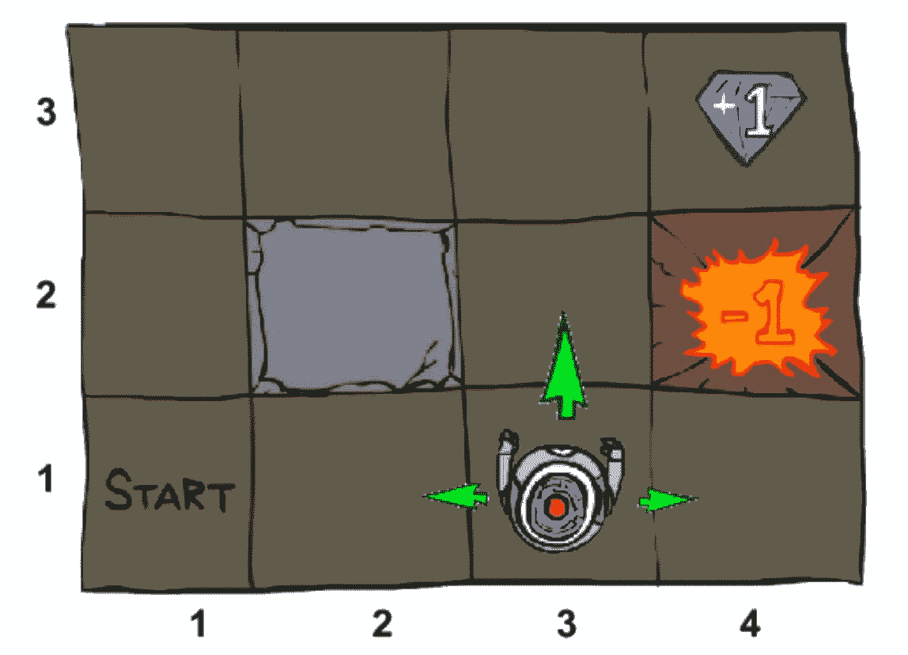
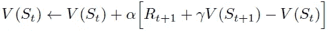
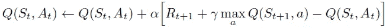
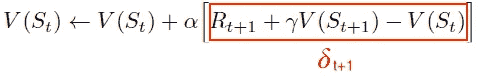

# 强化学习中的函数逼近

> 原文：<https://towardsdatascience.com/function-approximation-in-reinforcement-learning-85a4864d566?source=collection_archive---------0----------------------->

## 当状态和动作空间爆炸时该怎么办…字面意思？

Photo by [Maksym Kaharlytskyi](https://unsplash.com/@qwitka?utm_source=medium&utm_medium=referral) on [Unsplash](https://unsplash.com?utm_source=medium&utm_medium=referral)

**更新**:学习和练习强化学习的最好方式是去 http://rl-lab.com

# 概观

在像 DP 和蒙特卡罗这样的表格方法中，我们已经看到状态的表示实际上是每个状态的记忆。
现在让我们回忆一下到底什么是状态。
状态是可观察特征或变量的组合。这意味着每当一个特性或变量有了一个新值，就会产生一个新的状态。

我们来举一个具体的例子。假设一个代理在 4x4 网格中，那么代理在砂砾上的位置就是一个特征。这给出了 16 个不同的位置，意味着 16 个不同的州。

Grid World

但这还不是全部，假设方位(北、南、东、西)也是一个特征。这为每个位置提供了 4 种可能性，这使得状态的数量为 16*4 = 64。此外，如果代理有可能使用 5 种不同的工具(包括“无工具”的情况)，这将使状态数增加到 64 * 5 = 320。
你明白了……

表示这些状态的一种方法是创建一个多维数组，比如 V[row，column，direction，tool]。然后我们或者查询或者计算一个状态。
例如 V[1，2，north，torch]表示代理在第 1 行第 2 列，面向北方，手持火炬的状态。这个数组单元格中的值表明了这个状态的价值。
另一个例子是 V[4，1，west，nothing]，它是第 4 行第 1 列的一个代理，向西行驶，但什么也没有。

让我们也考虑一下国际象棋。
每一步棋后棋盘的情况是一种状态。估计大约有 10^120 个州！
国际象棋中一种状态的一种表示可以是:

黑卒，黑车，…，无，无，…。，白皇后，白主教]

其中每个维度代表棋盘上的一个正方形，其值是黑色或白色棋子之一，也可以是零。

所以一旦我们有了状态集，我们就可以为每个状态分配一个值状态函数。

不用说，容纳多个状态所需的存储量是巨大的，并且计算每个状态的值所需的时间也是令人望而却步的。

从逻辑上讲，这促使我们寻找更好、更合适的解决方案。

# 解决方法

记住我们正在努力做的事情总是有用的，因为我们可能会忽略所有的细节。
我们的想法是，我们希望找到环境中每个状态/动作的值，以便代理遵循收集最大回报的最佳路径。

在上一节中，我们已经表明，当状态空间变得太大时，表格方法就变得不充分和不合适了。为了解决这个缺点，我们可以根据每个状态的特征采用新的方法。目的是使用这些特征集合来概括具有相似特征的状态的值的**估计**。

我们使用单词**估计**来表示这种方法永远不会找到一个状态的真实值，而是它的近似值。尽管这个结果看起来很不方便，但是这将实现更快的计算和更多的推广。

计算这些近似值的方法被称为**函数近似值**。

有许多函数逼近器:

*   特征的线性组合
*   神经网络
*   决策图表
*   最近邻

…

由于我们将使用梯度下降以找到最佳结果，函数逼近器必须是可微分的，这导致我们对特征和神经网络的线性组合。

## 特征的线性组合

现在让我们深入研究这种线性函数逼近方法的细节。
但首先让我们记住这个公式，它来自[数学背后的强化学习](https://medium.com/@zsalloum/math-behind-reinforcement-learning-the-easy-way-1b7ed0c030f4)文章:

这是一个递归公式，它根据下一个状态***【s’***等等的值来计算一个状态 ***s*** 的值…
这个公式的问题是，每次我们需要计算 V(s)时，我们都需要计算所有未来的状态。更糟糕的是，如果我们在某个时候遇到一个与我们过去已经见过的状态相似的状态，我们没有办法识别它。

还记得在[时间差异](/td-in-reinforcement-learning-the-easy-way-f92ecfa9f3ce)文章中提到的，利用 Q 学习公式，我们有一种估计未来状态的方法:

我们将利用这些公式推导出一些有趣的解。
让我们重新定义 V(s ),比如它反映了它所包含的特征。状态值函数可以用其特征的加权和来表示:
V(s) = W1。F1(s) + W2。F2(s) + … +Wn。Fn(s)或简称:

𝝫(s)是在状态 ***s*** 下的特征向量，而𝜽ᵀ是应用于特征的权重的转置矩阵，以这种方式，一些特征在任何状态 ***s*** 下比其他特征更受重视。

现在让我们定义𝜹，也称为 TD 误差，如下所示:

通过用新的定义代替𝜹中的 V(s ),我们得到:

请记住，根据定义 V(St) = R(t₊₁) + 𝛾V(St₊₁)，这意味着𝜹应该是零。然而，我们不是在一个确定的环境中，这意味着我们不能确定相同的行为总是导致相同的结果，并且学习过程不是 100%准确的，这意味着我们对 V(s)的学习不一定等同于 R(t₊₁) + 𝛾V(St₊₁).所有这些导致𝜹具有非零值。所以现在我们的目标是计算𝜽，以便最小化𝜹.通过最小化 J(𝜽).来实现这一点的便利方法

J(𝜽)与任何回归一样，计算实际结果与真实结果之间的差异。然而我们的问题是我们不知道什么是真正的结果！相反，我们将计算实际结果和估计结果之间的差异。每次迭代后，我们都有一个新的真实结果估计，这使得我们看起来好像是在瞄准一个移动的目标。
想法仍然是不断改进估计，直到两者之间的差异变得足够小。
已经证明这种方法有足够的收敛性保证。

成本函数的最小化可以使用梯度下降法来完成，该方法在[梯度下降](/gradient-descent-the-easy-way-5240ca9a08da)文章中有详细描述。
梯度下降将逐步向最小化 J(𝜽的值更新𝜽，更新公式为:

其中𝜹 𝝫(s)大致是 J(𝜽)相对于𝜽的导数，⍺是学习率]0，1]。

**重要提示**:实际上 J(𝜽相对于𝜽的推导是𝜹【𝝫(st)-𝝫(st+1】，但实际上这个算法的结果更差。

我们已经建立了状态值函数的函数近似，现在让我们把这个概念扩展到动作值函数。

设𝝫(s,a)为状态 ***s*** 的特征，动作 ***a*** ，我们要做的是根据一个策略 **π来估计 Q(s，a)的值。**

与状态值类似，动作值函数为:

𝜽权重的更新是:

## 神经网络

与非线性函数近似(如神经网络)相比，线性函数近似的主要缺点是需要良好的精选特征，这可能需要领域知识。

在非线性函数逼近器中，我们将再次重新定义状态和动作值函数 V 和 Q，例如:

所以现在 v 和 q 是**非线性函数**即以𝝫(s) / 𝝫(s，a)和𝜽为参数。
在这个公式中我们要注意的是，特征的数量和𝜽向量的大小不一定相同(就想象一个神经网络)。

从上面我们现在可以计算 TD 误差𝜹和权重𝜽的更新

请注意，𝜹是使用先前已知的𝜽值(此处称为𝜽⁻)和新计算的值来计算的。
神经网络计算的细节可以在反向传播文章[第一部分](/back-propagation-the-easy-way-part-1-6a8cde653f65)、[第二部分](/back-propagation-the-easy-way-part-2-bea37046c897)和[第三部分](/back-propagation-the-easy-way-part-3-cc1de33e8397)中找到。

# 结论

总之，当类似情况发生时，函数近似有助于找到状态或动作的值，而在计算 V 和 Q 的真实值时，需要完整的计算，并且不从过去的经验中学习。此外，函数逼近节省了计算时间和存储空间。

# 相关文章

*   [政策梯度循序渐进](/policy-gradient-step-by-step-ac34b629fd55)
*   [基于策略的强化学习](/policy-based-reinforcement-learning-the-easy-way-8de9a3356083)
*   [强化学习中的演员评论家介绍](/introduction-to-actor-critic-7642bdb2b3d2)