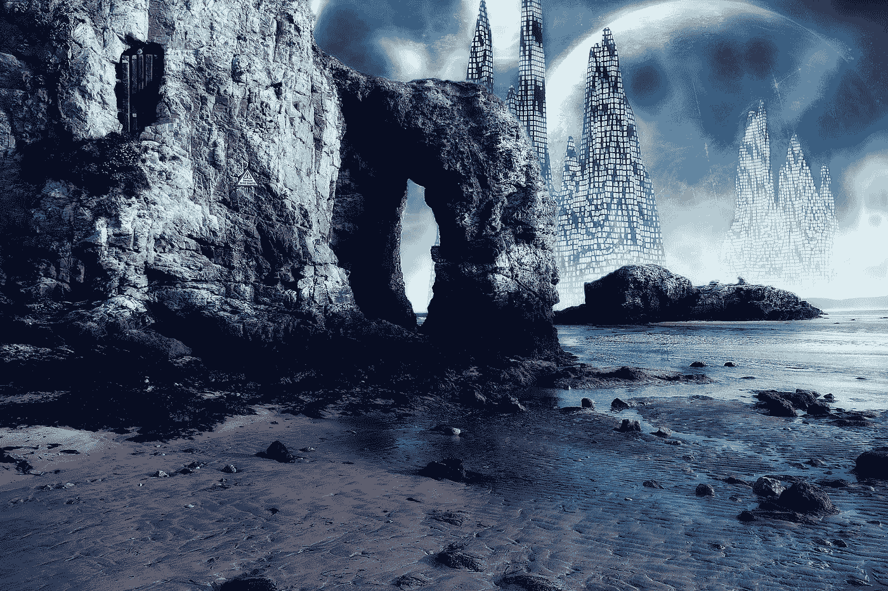

# 什么是增强现实

> 原文：<https://towardsdatascience.com/fundamentals-of-augmented-reality-ar-89ce986f70f8?source=collection_archive---------8----------------------->

Image by [Dina Dee](https://pixabay.com/users/DeeDee51-128913/?utm_source=link-attribution&amp;utm_medium=referral&amp;utm_campaign=image&amp;utm_content=1716056) fromPixabay

## 什么是增强现实，它是如何工作的

增强现实(AR)是我们用数字数据增强的现实。

数字数据可以是文本、图片、视频、3d 资产或以上所有形式的组合。

AR 系统将需要理解现实并重建它，以创建它的数字双胞胎。

它还需要使用户能够与数字孪生和数字数据进行交互。

照相机没有固有的方向感。你不能命令它给你前面或后面的东西拍照。你只能把它指向你想要的方向。

这是一个传感器阵列，当光线穿过一个洞射向它时，它就会燃烧起来。

赋予相机方向感和对世界的理解是一个复杂的过程。处理分析和理解像素的研究领域被称为计算机视觉(CV)。

像我们一样看世界，像我们一样分类物体，像我们一样学习适应世界的变化，这就是机器学习(ML)。

我们不断学习，变得更加聪明。当机器学习并产生比以前好一点的结果时，它的人工智能(AI)。

ML、AI 和 CV，以及组成 IMU(惯性测量单元)的一些硬件传感器，使 AR 成为可能。

# AR 的层次

增强现实应用的核心是摄像头。一切都来源于摄像机带入系统的数据。

通过检测形状和运动来形成增强世界。这构成了物理层。

除了有形的层面，还有赋予我们所见事物意义的语义层。

语义层包括训练神经网络，以便机器能够像我们一样理解世界。

自动驾驶汽车在很大程度上解决了这个问题。这些汽车上的硬件比手机上的更先进。在移动领域，我们仍在努力构建理解物理世界的基础层。

这篇文章是关于物理层的。

# 物理层

物理层的主要组件是-

1.  惯性测量组合
2.  用户交互
3.  点云和空间制图/ SLAM
4.  模式匹配
5.  锚，跟踪和坚持。

# 1.惯性测量组合

IMU(惯性测量单元)是测量线性加速度的加速度计、测量旋转的陀螺仪和测量航向的磁力计。

汽车上的传统里程表通过检测车轮的转动来测量行驶的距离。

手机上的视觉里程表从一系列图像中测量行驶的距离和方向。

视觉里程计与 IMU 的组件相结合，形成视觉惯性里程计(VIO)系统。

我们不能使用传统的里程表传感器，因为它们是为车轮设计的，而我们的是腿部运动。

# 2.用户

我们不需要智能眼镜来看世界，就像我们不戴眼镜时一样。

AR 的用处来自于使用关于世界的信息，然后给它增加价值。

博物馆里的灭绝动物可以活过来，或者将我们的相机对准建筑物可以向我们展示更多信息。如果你去伦敦，你现在看不到大本钟，因为伊丽莎白塔还需要几年才能完工。但是，如果你下载大本钟 AR 应用程序，并将其指向脚手架负载的结构，你就可以再次看到和听到大本钟。

# 3.点云和空间制图/ SLAM

来自相机的数据由计算机视觉算法进行分类，这些算法试图识别数据流中的现实世界物体，并返回一堆点，也就是点云。

拿一个放大镜仔细看一张图片，你会开始看到像素。或者，如果你在 Photoshop 中不断放大图片，你会开始看到像素。这张照片只不过是一个点云。在图片的情况下，这些点被称为像素。

图片中的像素以某种方式组织和排列在一起，使得从远处看，图片是完整的。手机上的点云数据还没有整合起来，因为它仍在试图理解现实世界中的图片。

连接云中的点会产生一个网格。看起来像蜘蛛侠用蜘蛛网覆盖你的家具。随着新的信息通过摄像机进入，网格不断变化并一直扩展，直到系统可以开始锁定对象。这也称为空间映射。

在绘制环境地图的同时，该程序还试图定位自己，以找出设备相对于周围环境的位置以及它面对的方向。这被称为 SLAM(同步定位和绘图)

然后程序试图在这个网格中找到熟悉的模式。这就把我们带到了下一个话题——模式匹配。

在下面的参考部分有一个来自微软的视频，展示了空间映射如何在 Hololens 上工作。

# 4.模式匹配

苹果的 ARKit 和谷歌的 ARCore 的第一次发布，移动上的两个原生 AR 框架只识别水平面。这两个框架花了几个月才识别出垂直面。

水平面为我们提供了放置数字对象的地面和桌面。

很多 AR 游戏非常有创意的使用了水平面。现在很有趣，因为它是新的。除了游戏，要让 AR 在现实生活中有用，我们需要的不仅仅是飞机。

除了程序检测形状，*我们*可以告诉程序寻找一个复杂的模式。该图案以图像的形式提供给系统。

## 图像识别

我们可以用图像识别做很多事情——比如当你把手机对准广告牌上的数字动画人物时，你就可以把这个人物放在手机屏幕上。让博物馆里的图片活起来，或者提供关于艺术家的信息，等等。

## 物体、房间和场景识别

我们还能够扫描 3D 对象，并为程序生成一个模式，然后识别现实世界中的 3D 对象。这叫做物体识别。

如果您将对象识别扩展到一个房间中的多个对象，它将成为房间识别。

在户外更大范围内进一步扩展，就成了场景识别。

Wikitude 支持物体、房间和场景识别。ARKit 在其最新版本中支持对象识别 it，并且用例有些受限。扫描 3D 对象以将其提供给系统的必要步骤需要时间来在消费硬件上正确完成。

虽然能够检测比平面更复杂的图案是件好事，但是这种方法有一个严重的缺点。

喂食模式限制了程序真正了解世界。如果我们要从每一个可能的角度给我们当今世界的每一张照片提供信息，这将需要很多年和数十亿美元，而且一旦我们告诉程序一张照片，这张照片可能已经过时了。

我们这个世界的事情一直在变。

一天中的时间变化，季节变化，灯光变化，使事物看起来不同。山在冬天会下雪，看起来和夏天不一样。同一棵树也会落叶。事情会随着时间而褪色。新的拆迁。新的结构，我们可以用几年的时间来写这段文字，写下所有发生变化的东西。

# 5.锚定、跟踪和持久性

很多人用持续这个词，其实是指跟踪一个主播。然后他们问了一个关于堆栈溢出的问题，并以错误的理由否决了一个响应。

让我们先弄清楚一些定义。

锚定是将数字对象放置在增强世界中。

跟踪是在相机四处移动时保持增强世界的一致定义，以便增强世界中的数字对象停留在它们锚定的位置。

但是它在追踪什么呢？

它从图像序列中跟踪特征点，通常是高对比度的点，以形成光流。ARKit 结合使用这种基于特征的方法和另一种称为直接方法的方法来完成工作。

关于特征点和从图像中提取特征的更多信息可以在参考文献部分找到。

持久性是指当应用程序关闭并再次打开时，能够记住数字对象在现实世界中的位置。

持久性的工作原理是保存(序列化)我们从世界点云中获得的地图。当您打开应用程序时，您可以选择重新加载保存的地图。这样，您就不需要在该空间中再次执行空间映射。

人类视觉系统中的术语“持续性”与大脑在图像被取走后保持图像几分之一秒的能力有关。这就是电影的工作原理。对于我们来说，每秒 24 帧是一个很好的帧速率，可以保留上一帧并将其融合到下一帧中，以获得流畅的运动感。但是，那不是 AR 中的坚持。那是追踪。

# 模式匹配的局限性

当我们 2 岁的时候，我们看着一个图案，然后指着它。一个声音轻轻地告诉我们，这是一张桌子！表！然后我们看了其他 100 张桌子，被告知是桌子！

稍微不同的形式但共同的特征可以用共同的标签来标记。在某种程度上，我们开始对桌子充满信心。

手机上的 AR 很难整理出飞机在现实世界中可能出现的所有不同方式。

一个水平面可以处于许多不同的高度，在不同的光照条件下，它们看起来可能不同。

垂直面可以有多种不同的角度。

可以有任意数量的既不水平也不垂直的倾斜平面。

墙从地面升起。45 度的墙。如果我们沿着边走，现在我们是沿着一个多边形而不是一个矩形。并且墙壁彼此相交。他们总是这样。

随着摄像机花费更多时间收集数据，程序的置信度可能会上升或下降。

随着新数据的到来，也许那架飞机现在看起来更大或更小，或者位于大厅更远处。来自位于第一架飞机后面 50 英尺的另一架飞机的数据进入，现在从摄像机的角度看，这两架飞机看起来像一个巨大的垂直平面。

随着时间的推移，也许程序将能够解决飞机是分开的。但是我们没有更多的时间了。我们希望程序能非常快地完成所有这些计算。要让 AR 在手机上有用，它必须实时工作。

# **跟踪的局限性**

随着对相机周围世界的理解发生变化，世界的定义也发生变化，程序越来越难准确地记住数字世界中特定对象的位置，尤其是当它不看着它时。

在现实世界中，这个问题可能是这样的

我看到一台自动点唱机，就走过去在酒吧找了个座位坐下。现在我知道点唱机在我身后。也许我会点一杯啤酒，放在我正前方几英寸的地方。如果这是菲利普·K·蒂克的小说，也许这就是当我眨眼的时候世界改变的时候。世界绕着它的轴旋转，也许我忘了和它一起旋转。我伸手去拿啤酒，它已经不在我刚才放的地方了。点唱机也不是真的在我身后。它现在在我的左边！

想象一下你周围的一切都有可能像这样每秒钟移动 30 次！(默认情况下，手机上的摄像头以每秒 30 帧的速度录制视频)。

我们需要在这些芯片上有大量的能量，以便能够实时处理这个世界并把它保持在一起。

# 结论

我们的大脑是我们的硬件，我们的智力是我们的软件，已经进化了一百万年。相机已经有 100 多年的历史了，机器学习比它还新。

要做好这件事有很多挑战。云计算是真实存在的，随着 5G 网络速度的到来，我们应该能够使用云的力量，并将结果实时传输回手机。

AR 在教育、旅游、时尚、零售、公用事业、娱乐、出版、MRO、远程指导、游戏等领域有着巨大的潜力……这个清单很大，而且还在不断增长。

数十亿美元正涌入这项技术。一些人认为这是继互联网之后的下一个最大的革命。

Magic Leap 是一家制造 AR 耳机的公司，它成为了科技史上获得资金最多的初创公司——据报道，风投资金达 23 亿美元，而且还是在没有产品的情况下。当它结束融资时，它所拥有的只是展示潜在产品的视频。现在他们有了一个产品。这是好的，但远远达不到他们在那些视频中显示的。后来他们声称这些视频是在视觉特效软件中被篡改的。不知道他们是怎么逃脱的。

但是，这是当今 AR 创业世界存在的狂热。没有投资者想错过。

无论财务预测是什么，最终，我相信它会改善我们联系的方式。

半个世纪以来开发的复杂计算机视觉算法可以实时检测面部特征。Snap 使用该算法覆盖数字图像，用户以有趣的方式使用它来建立关系和人际联系。

令人愉快的体验来自看似互不关联的技术层面。

在实验室深处智能开发的扫描像素技术(CSAIL)可以通过帮助人们以新的方式交流来获得其意义，并在将他们与世界联系起来的事物中找到新的意义。

对我来说，这是一个完整的循环，这也是我所期待的。

# 参考

从图像中提取特征；

 [## 特征提取-维基百科

### 在机器学习、模式识别和图像处理中，特征提取是从一个初始集合开始的

en.wikipedia.org](https://en.wikipedia.org/wiki/Feature_extraction) 

微软 Hololens 空间制图: