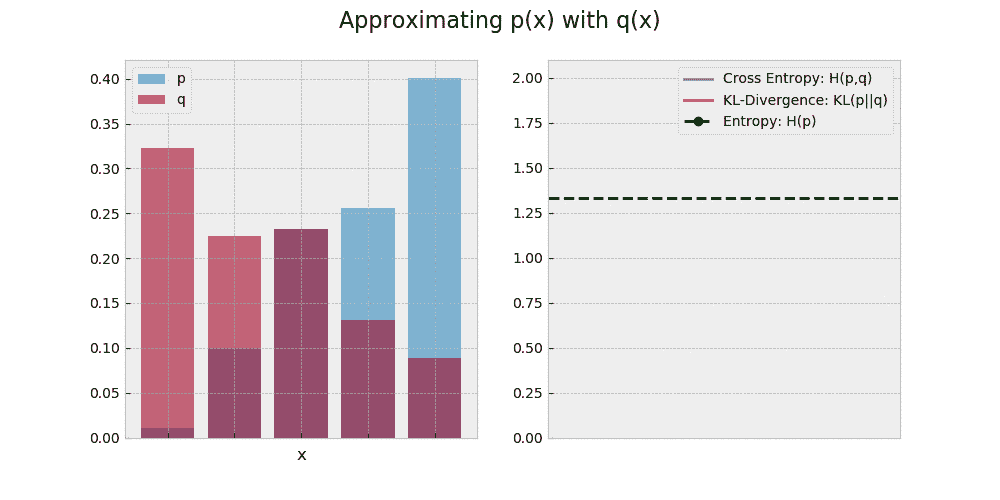
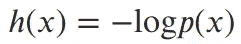
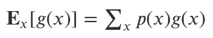
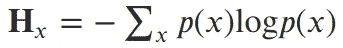
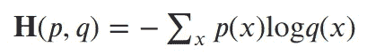
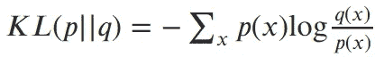
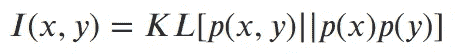

# 机器学习基础(三)

> 原文：<https://towardsdatascience.com/fundamentals-of-machine-learning-part-3-b305933f00cd?source=collection_archive---------16----------------------->

## 信息论

# 介绍

这是我认为机器学习的基础主题系列的第 3 部分。这些主题是加深对该领域理解的基础。到目前为止，我们已经介绍了:

1.  [概率论](/probability-fundamentals-of-machine-learning-part-1-a156b4703e69)
2.  [最大似然估计](/maximum-likelihood-estimation-984af2dcfcac)

这篇文章的目的是涵盖信息论中的重要概念，并描述它们如何用于机器学习。这里的许多主题将建立在我们在概率论的文章中讨论的概念上，比如独立性和期望。

我将利用机器学习和统计学的思想来激发和构建这些概念。如果你有物理学背景，你可能已经看到这些概念的不同动机(即通过热力学)。

# 信息

让我们假设我们的目标是通过使用的单词来检测给定文本的作者，以此来激发我们的讨论。哪些词对检测作者身份有用？直觉上，像“the”、“or”和“it”这样的词不会很有用，因为无论作者是谁，这些词都很有可能出现在任何文本中。看起来普通单词包含的信息比罕见单词少，而且信息内容在某种程度上与概率直接相关。

让我们通过让 x 是代表所有可能单词的随机变量， *p* ( *x* )是观察一个特定单词的概率 *x* 来使这个更正式。我们想要为通过观察一个特定的单词所获得的信息创造一些可量化的概念。

我们将使用 *h* ( *x* )来表示从观察单词 *x* 中获得的信息。同样，对于两个单词 *x* 和 *y* ，我们可以将通过观察它们获得的信息写成 *h* ( *x，y* )。我们的目标是找到一个合适的 h。

首先，我们来考虑两个词 *x* 和 *y* 的独立性。像“足球”和“比分”这样的词不是独立的，因为看到一个会使另一个更有可能。所以在“足球”之后看“比分”获得的信息应该不大。回想一下[第一部](/probability-fundamentals-of-machine-learning-part-1-a156b4703e69)，独立在形式上是指 *p* ( *x，y*)*= p*(*x*)*p*(*y*)。如果两个词 *x* 和 *y* 不相关，我们要 *h* ( *x，y*)=*h*(x)+*h*(*y*)。换句话说，同时看到两个不相关的单词所获得的信息应该是单独看到它们所获得的信息的总和。

我们希望我们的 *h* 公式与 *p，*相关，但是我们有这样一个问题，即独立观察的联合概率是一个乘积，而联合信息是一个和。为了解决这个问题，我们使用对数的乘积规则将乘积转换为总和:

log[ *p* ( *x，y*)]= log[*p*(*x*)*p*(*y*)= log*p*(*x*)+log*p*(*y*)。

将信息与概率的对数联系起来似乎是我们需要的技巧。我们把与 x 相关的信息写成:

Information gained from observing *x.*

这个公式满足我们的要求，即更可能的观察产生更少的信息，对于两个独立的观察 *x* 和 *y* ，我们有 *h* ( *x，y* ) = -log *p* ( *x， y*)=-log[*p*(*x*)*p*(*y*)]=[-log*p*(*x*)]+[-log*p*(*y*)]=*h*()

对数的底是一个任意的选择。信息理论家通常使用基数 2，并将信息单位称为“比特”，而在机器学习中，通常使用基数 *e* 并将信息单位称为“NAT”。这个信息量的另一种观点是，给定某种编码*，h*h*(*x*)给出了发送一条消息 *x* 所需的位数。*

# 熵

我们刚刚把信息写成了一个随机变量的函数。在[第 1 部分](/probability-fundamentals-of-machine-learning-part-1-a156b4703e69)中，我们了解到随机变量 x 上的函数 *g* 的期望值，给出了 g 的期望值(或平均值):

Expectation of g(x) with respect to x.

我们的信息函数的期望 *h* 是信息论中最基本的概念之一。这种期望被称为随机变量 x 的熵，通常用大写字母 H 表示:

Entropy of random variable x.

熵是信息函数的期望值，或者换句话说，它是通过观察从 *p* ( *x* )随机抽取获得的平均信息量。这是一个需要知道的有用值！

信息论者可能会使用熵来计算传输给定长度的消息所需的预期比特数。更好的是，为了降低传输成本，找到使熵最小化的消息编码将是有益的。这将允许发射机压缩消息，并且每条消息发送更少的比特。

寻找有效的编码类似于为机器学习问题寻找特征的有效表示。我们希望用尽可能少的特征来表示我们的数据(以避免过度拟合和维数灾难)，同时仍然保持足够的信息来做出准确的决策。

我们将会看到，熵的概念对于思考其他几个重要的概念是有用的。

# 交叉熵

让我们回到我们的作者分类问题。让我们通过只考虑两个类来简化问题:{文本来自作者 A，文本不来自作者 A}。我们将把我们试图分类的每个文档视为一个“单词包”，这意味着我们不关心单词的顺序，只关心哪些单词存在。我们将每个文档表示为向量 **x** ，其中如果单词 *j* 出现在文档中，则条目 *j* 为 1，否则为 0。

我们假设存在某种基本事实分布 *p* ( **x** )，这给出了文档 **x** 是由作者 a 编写的概率。如果我们可以了解这种分布，那么对于任何一个其中 *p* ( **x** ) >为 0.5 的文档，我们都可以猜测该文档是由 a 编写的

但是我们不知道 *p* ，所以我们写下一个模型 *q* 并尝试拟合 *q* 的参数，使其接近*p。*然后我们将使用 *q* 来决定 A 是否是任何给定文本的作者。

由于我们使用的是 *q* ，因此对一个文档 ***x*** 进行分类所需的信息量为*h*(***x***)=-log*q*(***x***)。但是如果 **x** 实际上是由 *p* 分配的，那么对于**xt**所需信息的期望值是:

Cross Entropy

这是 *q* 相对于真实分布 *p* 的交叉熵。如果我们以此为代价函数，找到使交叉熵最小化的 *q* 的参数，那么当 *q* 与 *p* 相同时，将出现最佳解。

最小化交叉熵通常是逻辑回归和用于分类的神经网络的目标。可以看出，最小化交叉熵相当于最大化我们的模型 *q.* 的似然性。因此，这种解决分类的方法找到了最大似然估计量，如[第 2 部分](/maximum-likelihood-estimation-984af2dcfcac)中所讨论的。

# 相对熵(KL-散度)

假设我们使用的是 *q* 而不是 *p* ，交叉熵给了我们分类文档所需的平均信息量。显然，如果我们使用 *p，*，那么平均起来，我们只需要 **H** (x)比特数(真实分布的熵)。但是由于我们使用的是 *q* ，平均需要 **H** ( *p，q* )位(交叉熵)。

使用 *q* 差多少？用 *q* 代替 *p* 需要 **H** ( *p，q* )- **H** (x)额外的位。我们称这个值为相对熵或 Kullback-Leibler (KL)散度。如果我们代入交叉熵和熵的方程，然后收集各项，我们得到 KL 散度为:

KL-Divergence

同样，这给了我们所需的额外位数(或 NAT ),因为我们使用了 *q* 来代替 *p* 。KL-散度总是大于 0，除非 *q* 等于 *p* 。因此，最小化也是一个常见的目标函数。最小化 KL-散度也最小化交叉熵，我们已经说过交叉熵是最大似然估计量。

# 交互信息

我们之前讨论过，有些单词并不是相互独立的，当我们同时观察它们时，这种依赖性会导致我们获得多余的信息(例如“足球”和“得分”)。我们想知道两个变量共享多少信息。

回想一下，如果 x 和y 为自变量，那么它们的联合分布为 *p* (x，y) = *p* (x) *p* (y)。如果它们不是独立的，那么我们就不能这样分解联合分布。当变量独立时，我们没有任何冗余，随着变量越来越依赖，冗余信息量增加。为了对此进行量化，我们使用 x 和 y 的互信息:

Mutual Information.

如果我们用独立因子分解来表示真实的联合分布，那么互信息就是所需的额外信息量。如果变量是独立的，那么 KL 散度将为 0，否则它将随着变量冗余度的增加而增加。

互信息经常被用于在机器学习中执行特征选择。对于给定的特征，我们可以用类别标签来度量特征的互信息。如果互信息高，则该特征是该类的强指示符。例如，如果作者 A 总是在他们的文档中包含他们的名字，那么他们的名字和类之间的互信息将会非常高。

类似地，如果我们有太多的特征需要考虑，我们可以使用特征之间的互信息来删除那些冗余的特征。如果作者 A 总是包括他们的名字和他们的家乡，那么我们可以安全地从我们的词汇中删除他们的家乡，并且仍然可以很好地完成任务。

# 结论

在这篇文章中，我们已经涵盖了信息论中直接适用于机器学习的主要概念。从任何意义上来说，这都不是一个详尽的处理方法，但是这些是我个人在实践中一次又一次看到的概念。

更多阅读，我建议看看克里斯托弗·毕晓普的书[模式识别和机器学习](https://www.microsoft.com/en-us/research/people/cmbishop/#!prml-book)。整本书是知识的金矿，但是我讨论的概念都可以在第一章的信息论部分找到。

大卫·麦凯的书[信息论、推理和学习算法](https://www.inference.org.uk/itprnn/book.pdf)也很受欢迎。

下次见！