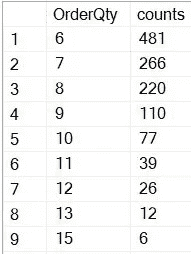
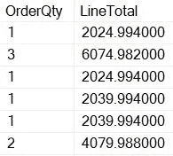
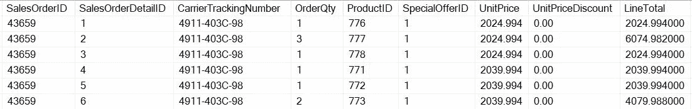
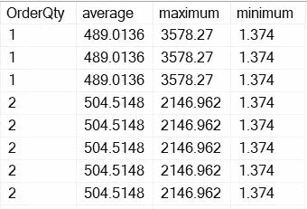

# 数据库:SQL 基础

> 原文：<https://towardsdatascience.com/fundamentals-of-sql-d0182bc1346b?source=collection_archive---------25----------------------->

## 带有客户交易实例的简单易懂的解释。


这篇文章不可能完全涵盖 SQL 功能的每个方面，但是，我试图创建一个快速参考指南，提供 SQL 的实用方面，并以简洁的方式展示重要的功能。如果你发现任何错误，请毫不犹豫地评论出来。

# 第 1 级
选择、从、在、分组依据、拥有、排序依据

> 当我们编写 SQL 语句时，它们的顺序应该和上面写的一样。我们还可以看到下面的代码:

> 从< *中选择*
> 条件>*
> 其中< *条件>* 分组按 *<条件>* 有 *<条件>*
> 顺序按< *条件>*

> 然而，在执行方面，流程是不同的。这意味着，当 SQL 语句在服务器端运行时，其读取顺序与下面写的顺序相同:

FROM(它选择所需的表)
WHERE(它根据条件过滤行)
GROUP BY(它聚合过滤的结果)
HAVING(聚合值的附加过滤级别)
SELECT(从结果中选择适当的列)
ORDER BY(按升序或降序排列值)

示例:

```
SELECT OrderQty, Count(*) AS countsFROM Sales.SalesOrderDetailWHERE UnitPrice > 1000GROUP BY OrderQtyHAVING count(*) < 500ORDER BY counts desc;
```

结果:



结果显示，对于单价大于 1000 的所有订单，我们有 481 个数量为 6 的订单实例(意味着 6 个项目)和 266 个数量为 7 的订单实例，依此类推。因此，数量越高，计数越低。

# 第二级
子查询，别名

我们从子查询中得到的结果被传递给主查询，以便生成复杂且更精确的结果。此外，别名用于为列或表提供临时名称。让我们看看使用这两种方法生成结果的例子。

```
SELECT OrderQty, LineTotalFROM Sales.SalesOrderDetail AS s1WHERE UnitPrice = (SELECT MIN(UnitPrice) FROM Sales.SalesOrderDetail AS s2WHERE s1.SalesOrderDetailID = s2.SalesOrderDetailID )
```

这里的子查询返回每个特定 ID 的最小单价。因此，如果 1 的 SalesOrderDetailID 有 5 件商品，它将返回所有这 5 件商品中的最低价格，ID 2 也是如此。

然后，主查询将返回单价与子查询输出的单价匹配的订单数量和行合计。s1 和 s2 称为别名，对于连接表非常有帮助。

结果



这意味着，我们有一个实例，其中数量为 1，行总计为 2024.99400，属于一个 ID 的最小单价。然后是另一个数量为 1 的实例，具有基于最低价格的特定行合计。

# 三级
在，存在，之间

> IN 子句可用于子查询，如下所示:

```
SELECT FirstName, LastNameFROM Person.PersonWHERE BusinessEntityID IN (SELECT BusinessEntityID FROM Sales.SalesPerson WHERE SalesLastYear > 2000000)
```

在此语句中，我们仅从 person 表中获取那些 BusinessEntityID 也存在于子查询中的人员的姓名，并且子查询从 Sales 表中返回销售额高于 2000000 的 business 的 BusinessEntityID。

> EXISTS 子句可用于子查询，如下所示:

```
 SELECT AccountNumber FROM Sales.Customer AS c1 WHERE EXISTS (SELECT * FROM Sales.SalesOrderHeader AS SOH WHERE SOH.CustomerID = c1.CustomerID AND OnlineOrderFlag=1)
```

子查询只返回布尔值，而不是可以与其他列匹配的某些值。因此，只要在线订单被标记为 1，它就返回 TRUE，否则返回 FALSE。换句话说，外部查询仅基于子查询提供的 TRUE 和 FALSE 条件工作。

> 介于两者之间的例子

```
SELECT SalesOrderDetailID, UnitPrice FROM Sales.SalesOrderDetail WHERE OrderQty BETWEEN 4 AND 6
```

它只是检查订单数量在 4 和 6 之间的行。

# 四级
窗口功能&案例报表

> 案例陈述真的很酷。

这仅仅是一个 **if-then-else** 语句。它检查一个条件，如果它是真的，那么它返回一个特定的值，如果不是，它移动到 else 部分。我们可以定义许多 if-then 语句和一个 else 语句。只要遵循 SQL 的规则，就可以在整个脚本的任何地方使用它

```
SELECT  SalesOrderID,CASE OrderQty WHEN 1 THEN 'Order quantity is 1' WHEN 2 THEN 'Order quantity is 2' WHEN 3 THEN 'Order quantity is 3' ELSE 'Greater Than 3'END AS Order_QuantityFROM Sales.SalesOrderDetail
```

上面的代码只是说，选择 OrderQty 列，如果它是 1，则打印“order quantity is 1 ”,并对其他列进行类似的操作，直到您点击 else，其余的值将被打印为“大于 3”

> 窗口函数对于销售、利润和其他指标的比较非常有用。

这是我们将对其应用窗口函数的真实表的快照。



```
 SELECT OrderQty,AVG(UnitPrice) OVER(PARTITION BY OrderQty) AS average,MAX(UnitPrice) OVER(PARTITION BY OrderQty) AS maximum,MIN(UnitPrice) OVER(PARTITION BY OrderQty) AS minimum FROMSales.SalesOrderDetail;
```

这是结果的快照。



# 第 5 级
存储过程和 IF-ELSE (T-SQL)

当我们不得不反复编写一段代码时，存储过程是很有用的。相反，我们可以创建一个存储过程，定义一个参数，然后使用 execute 命令执行该过程。我们定义的变量写在@之后，然后用在 WHERE 子句中。

```
CREATE PROCEDURE attempt @cost_limit int AS SELECT * FROM Production.ProductCostHistory WHERE StandardCost > @cost_limit and endDate is null GOEXECUTE attempt @COST_LIMIT = 10
```

结果给出了标准成本大于执行期间传递给 cost_limit 变量的值的所有值(在本例中为 10)。

> 下一个例子

首先，我们声明变量，然后，我们启动 IF 语句并检查事务类型的计数是否大于 1。如果条件为真，将执行 BEGIN 部分。SET 关键字用于将 select 语句的值存储到变量中。一旦设置了变量，我就使用 print 语句通过 SQL 的串联功能打印变量值。请注意，CAST 函数在转换变量的数据类型时非常有用。

```
DECLARE @TYPE1 intDECLARE @TYPE2 intDECLARE @TYPE3 intIF(SELECT COUNT(*) TransactionType FROM Production.TransactionHistory) > 1BEGINSET @TYPE1 =(SELECT COUNT(*) FROM Production.TransactionHistory WHERE TransactionType = 'W');SET @TYPE2 =(SELECT COUNT(*) FROM Production.TransactionHistory WHERE TransactionType = 'S');SET @TYPE3 =(SELECT COUNT(*) FROM Production.TransactionHistory WHERE TransactionType = 'P');PRINT 'Total count of W type transactions ' + CAST(@type1 as varchar(10)) + '.' ;PRINT 'Total count of s type transactions ' + CAST(@type2 as varchar(10)) + '.' ;PRINT 'Total count of p type transactions ' + CAST(@type3 as varchar(10)) + '.' ;END
```

> 使用存储过程和 IF-ELSE 函数输出结果的附加查询。

```
CREATE PROCEDURE Learning@quantity int,@cost INTASBEGINDECLARE @COUNT INTSET @COUNT =(SELECT count(*) from Production.TransactionHistory where Quantity > @quantity and actualcost > @cost)PRINT @COUNTIF @count > 1000BEGINPRINT 'There are more than 1000 instances with quantity =' + cast(@quantity as varchar)+ ' and cost =' + + cast(@cost as varchar)ENDELSEBEGINPRINT 'THERE ARE LESS THAN 1000 such INSTANCES'ENDENDGOEXECUTE Learning @COST=10 , @QUANTITY = 10
```

> 请注意一些要点

*   取决于子查询输出的布尔值。
*   IN 取决于子查询输出的匹配值。
*   在 SQL 中，子句的顺序很重要，它根据执行的顺序而不同。
*   为存储过程定义的变量不同于声明的变量。
*   任何内容都可以放在开始和结束之间，并作为单个批处理运行。