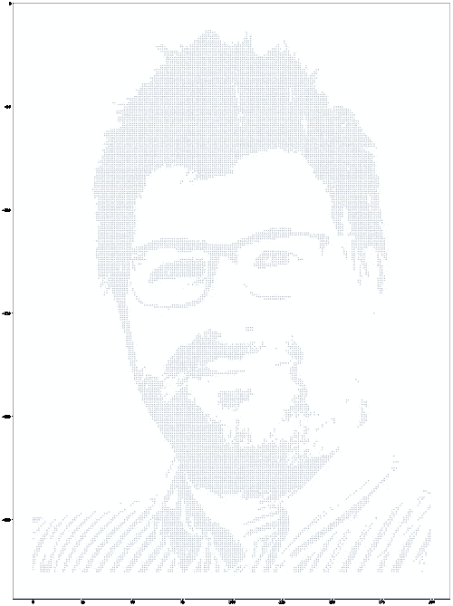
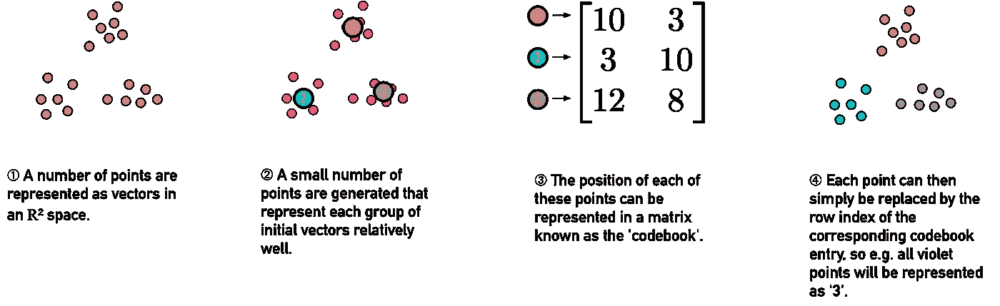
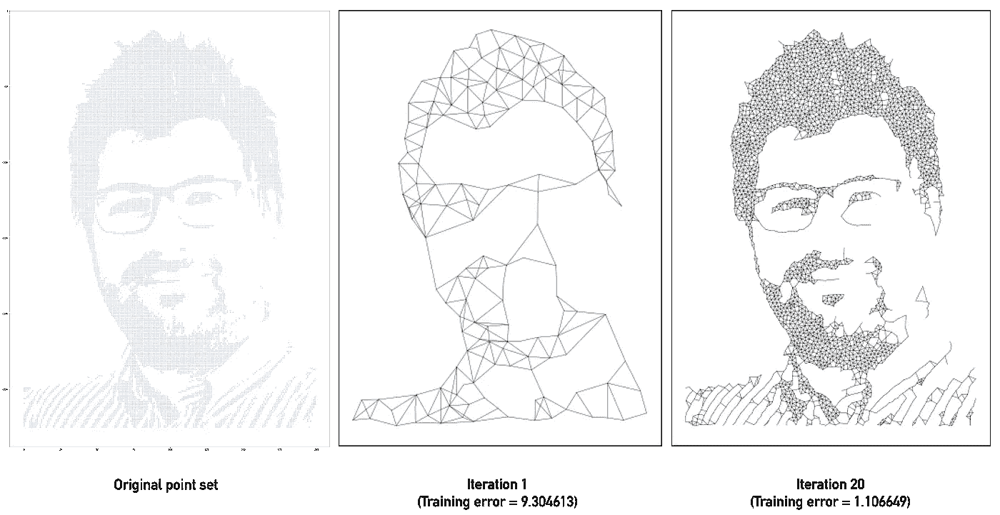
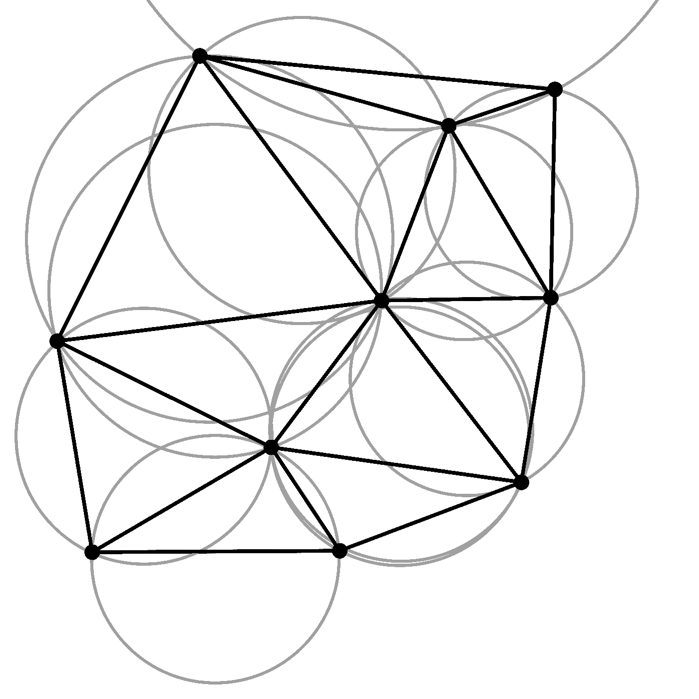
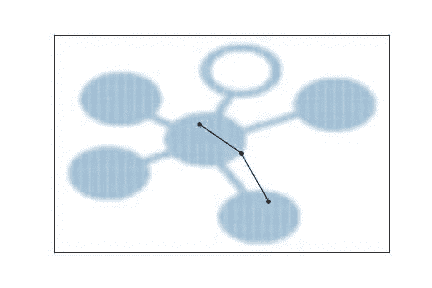
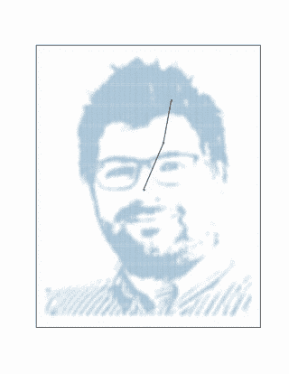

# 支持竞争的神经网络

> 原文：<https://towardsdatascience.com/funderstanding-competitive-neural-networks-f855bd7882e1?source=collection_archive---------17----------------------->

几年前，我想出了一个小术语来表示理解复杂概念的有趣方式。典型的大学教学方式是打好理论基础(无聊的几个小时)，重复你需要知道的基本科目(无聊的几个小时)，然后最终对正在发生的事情做出解释(又无聊了几个小时)，之后你离开时不会比开始时有更多的理解。与此相反，当你试图*资助某事、* **时，你先从一个有趣的激励性例子开始，然后再深入探究这一切的原因和方式。**

这是三个系列中的第一个帖子，旨在为一个特别有趣的主题提供“有趣的介绍”:竞争神经网络及其在向量量化中的应用(请，*请*停止运行，我知道这听起来像是沉重的数学负担，但我保证我会尽量减少！).在第 2 部分中，我们将讨论所谓的自组织特征映射(SOFMs ),之后，我们将在第 3 部分中研究不断增长的神经气体。

# 矢量量化:总体思路

想象你有一张黑白图像。实际上，您可以将这样的图像看作是一个点坐标列表 *(x，y)* ，其中包含了您想要涂成黑色的每个点。然后你会接近一个网格，就像在一个正方形的数学练习本上一样，然后给列表上的每一点涂上颜色。显而易见，你的点数越多，你的清单就越长。对于这个例子，我将我的工作牌头像数字化，并为它创建了这样一个列表，密度相对较低——它给了我大约 15，000(！)积分:

My work badge photo, digitized, converted to black and white and thresholded for optimum performance.

问题是，我们能减少点数，仍然得到可识别的、语义上忠实的图像吗？一种解决方案是找到能够很好地代表其附近一系列点的点，并使用它们作为这些点的“代理”。我们不使用 15，000 个点，而是指定几百个新点，并将它们放置在适当的位置，使它们各自相对代表周围的点。这将允许我们用最近的新点替换所有这些点，有效地将 15，000 个点减少到几百个点。此外，我们可以创建一个新点列表，这通常被称为“代码簿”，而不是每次都必须记下坐标，我们只需用最近的代码簿条目的索引替换每个点的 *(x，y)* 坐标对。如果我们已经很好地设置了点数，那么我们将得到一个相当不错的近似值。

The underlying idea of vector quantization: represent a large number of vectors by a smaller number of entries in a codebook, each of which is a relatively good proxy for the points it represents.

只剩下一个问题:我们到底该如何做？我的意思是，好主意，但我们需要找到这些点的方法，对吗？当然，最简单的方法是定义一个误差函数，并不断优化，直到我们达到目标。

The Growing Neural Gas algorithm converges to the point set relatively quickly: in 20 iterations, it created a semantically comprehensible representation, still with only 2,500 points — 16% of the original 15,564 points.

一种方法是简单地丢弃随机点，计算它们代表多少新点，以及它们的邻域中有多少点已经被代表，而它们的邻域中有多少点根本不应该被代表。然后，我们不断增加新的分数，剔除表现不佳的分数。这通常类似于两种较老的机器学习方法，称为简单竞争赫比学习。问题是这些需要很长时间才能融合。我指的是年龄——大多数时候，结果并不令人印象深刻。

The idea of Delaunay triangulation: to divided the set of points into triangles so that no point is within the circumcircle of another triangle (gray). By definition, this also means a Delaunay triangulation does not have intersections between the triangulating lines. Illustration courtesy of [Wikipedia/Gjacquenot](https://en.wikipedia.org/wiki/Delaunay_triangulation#/media/File:Delaunay_circumcircles_vectorial.svg).

相反，我们可以做得更好。我们有一些数学技巧可以帮助我们做到这一点，叫做*三角测量*。三角剖分基本上是以一种特殊的方式将一个空间分成三角形。对于点，最简单的三角剖分当然是开始连接点，直到你得到很多三角形。事实证明，有更聪明的方法可以做到这一点。 **Delaunay 三角测量**在多个点之间创建三角形，这样没有其他点在任何三角形的外接圆(包含三角形所有三个点的圆)内。这给了我们一个不相交的三角形网格。一个奇妙的小副作用是，如果我们连接外接圆的中心，我们会得到由这些点围成的空间的所谓的 **Voronoi 分割**。将画出每个 Voronoi 分割的边界，使得点 P 周围的 Voronoi 分割将包括比初始点集内任何其他点更靠近 P 的每个点。这有助于我们在点之间很好地划分空间:我们可以通过简单地测量代码簿点网格内 Voronoi 分区内的点的百分比以及空的百分比来测量我们模型的有效性。这使得误差函数相对容易优化。一件好事是，Delaunay 三角剖分和 Voronoi 分割都可以很好地推广到高维空间，所以在二维空间中工作的东西也可以在高维空间中使用。

# 变得有竞争力

A Growing Neural Gas model learning the topology of the [Starschema](https://www.starschema.net) logo, 100 iterations with a high drop-out rate.

好吧，那么“竞争性”神经网络呢？你可能遇到的大多数神经网络都遵循一定的模式:具有激活功能的神经元获得输入并产生输出。从这个意义上说，“竞争性”神经网络非常不同。相反，在竞争性神经网络中，神经元“竞争”被激活，其中激活通常是离所选数据点的距离的函数。最靠近数据点的神经元——也就是说，具有最高激活度的神经元——“获胜”，并向数据点移动，吸引其一些邻居。从这个意义上来说，**竞争力允许学习拓扑**，这是一个有用的副作用，当用于从低维表示重建高维形状时。事实上，Martinetz 和 Schulten 创建了第一个简单的神经气体模型，称之为*拓扑表示网络* (TRN)。[这篇由 Marco Piastra 撰写的论文](https://arxiv.org/pdf/0812.2969.pdf)展示了竞争性神经网络在重建甚至非常复杂的形状方面令人印象深刻的潜力，例如 22 类七面体或[斯坦福兔子](https://en.wikipedia.org/wiki/Stanford_bunny)。

Neural gas models can learn fairly complex topologies, such as the human face, as seen before. In this example, a high-dropout slow-converging Growing Neural Gas starting with two vertices and adding a new one every ten iterations creates an approximation of my photo. This graph contains only 752 nodes, a compression of 95.17% of the original 15,564 points.

竞争学习有一个相当接近的神经生理类比。它是 **Hebbian 学习**的一种形式。这种机器学习的方法源于对“一起放电的神经元连接在一起”的观察:也就是说，当独立的神经元同时对刺激做出反应时，突触强度(神经元“接近度”的一种衡量标准)就会增加。正是神经元的这一特性被不断增长的神经气体用来连接各个顶点，使我们不必像自组织特征图那样指定图的大小和形状:最佳匹配和第二最佳匹配被连接为“共同响应者”，连接的强度取决于两点之间的相对响应强度。如果两个点都强烈响应，则表明它们与数据点的距离几乎相等，因此可以被视为紧密相连——“一起触发”会导致算法将相关点“连接在一起”。

虽然听起来可能很抽象，**这些算法可以很容易地适应我们日常机器学习工作量的一部分**。在无监督学习的许多应用中，增长的神经气体和自组织特征图是有用的，其中第一个也是最重要的当然是**聚类**。但与许多聚类算法不同，例如，生长神经气体不需要预先提供聚类数。这在不相交的簇的数量是问题的开始时是有用的。例如，考虑计算页面字数的问题:增长的神经气体，如果配置良好，可以将单词加入到单独的子图中，不相连的子图的数量给出了字数。类似地，难以可视化和解释的多个高维集群可以使用基于增长神经气体的算法轻松计数。

我们将在本系列的后续部分中讨论的两个实现——**生长神经气体**和**自组织特征映射** (Kohonen 映射)——具有广泛的用途。正如我们将看到的，它们不仅可以用于复制形状，还可以用于聚类和嵌入高维数据集。因为这些技术属于拓扑数据分析的更广泛的领域，这可能变得非常数学密集，并且因为它们不同于我们通常理解的神经网络的方式，神经网络由前馈神经元层和它们之间的连接组成，例如使用反向传播来训练。这些算法自 20 世纪 90 年代被发现以来，尽管具有迷人的特性，却一直被过度忽视。借助 Numpy、Theano 和 Tensorflow 等现代张量代数工具，这是深入竞争神经网络并实现其巨大潜力的最佳时机。在本系列的下一期中，我们将首先讨论自组织特征地图，以及如何将它们用于更多的日常数据科学应用。

本系列的下一部分，第二部分:自组织特征地图，将于 2019 年 1 月 20 日发布。看好这个空间！