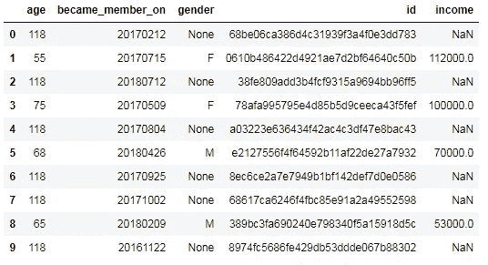
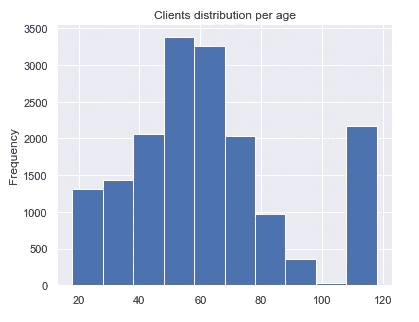
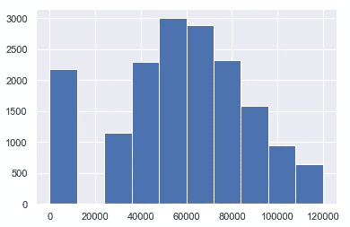
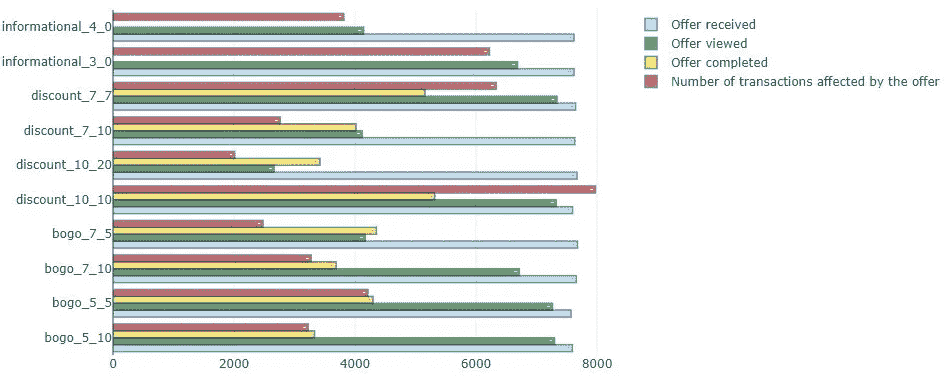
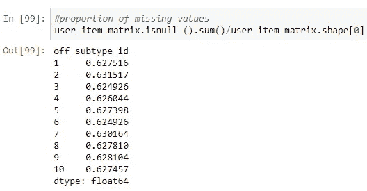

# 星巴克数据集上的 Funk SVD 实践体验

> 原文：<https://towardsdatascience.com/funk-svd-hands-on-experience-on-starbucks-data-set-f3e0946da014?source=collection_archive---------20----------------------->

Photo by [Austin Distel](https://unsplash.com/@austindistel?utm_source=medium&utm_medium=referral) on [Unsplash](https://unsplash.com?utm_source=medium&utm_medium=referral)

## 尝试使用协同过滤来个性化移动应用提供分发。

**目录:**

1.  [简介。](https://medium.com/p/f3e0946da014/#6263)
2.  [数据概述、清理和转换。](https://medium.com/p/f3e0946da014/#79d5)
3.  [优惠在公司收入中的作用。](https://medium.com/p/f3e0946da014/#9884)
4.  什么样的优惠真的让人兴奋？
5.  [使用 Funk SVD 的协同过滤。](https://medium.com/p/f3e0946da014/#9e22)
6.  [模型微调。](https://medium.com/p/f3e0946da014/#8186)
7.  [结论。](https://medium.com/p/f3e0946da014/#70fe)

## 介绍

如今，互联网资源、移动应用程序被设计为个性化促销优惠，以增加忠诚度，一方面超出预期，另一方面增加收入。作为 [Udacity 数据科学家 Nanodegree](https://www.udacity.com/course/data-scientist-nanodegree--nd025) 的一部分，我已经获得了几个可能的数据集，其中星巴克项目最让我兴奋，因为它包含模拟数据，模拟真实星巴克奖励移动应用程序中的客户行为。我很好奇以下几点是否能引起我的兴趣:

1.要约真的在公司的现金流入中扮演重要角色吗？
2。什么样的优惠真正让人兴奋，带来更多的收益？
3。如何通过使用协同过滤技术(Funk SVD)的个性化优惠分发来改善促销优惠方面的客户体验(关于 Funk SVD 的更多信息可在[此处](https://sifter.org/~simon/journal/20061211.html)和[此处](https://medium.com/datadriveninvestor/how-funk-singular-value-decomposition-algorithm-work-in-recommendation-engines-36f2fbf62cac)找到)。

**数据概述、清理和转换**

数据包含在三个文件中:

*   portfolio.json —包含每个报价的报价 id 和元数据。
*   profile.json —每个客户的人口统计数据。
*   transcript.json 记录交易、收到的报价、查看的报价和完成的报价。

**Porftolio** 仅包含 10 行描述可能的优惠和细节，如优惠持续时间、难度(完成优惠所需花费的金额)、渠道、优惠 id、优惠类型(折扣、BOGO—‘买一送一’，信息性)以及优惠完成后将获得的奖励:

portfolio data transformed into pandas

**配置文件**包含大约 17 000 名客户的数据，该数据缺少 2175 人的性别和收入值。

profile data transformed into pandas (first 10 rows)

只要对于收入，没有人报告收入为零，那么让我们用零填充 NaN 值，并检查这如何影响图表。此外，性别中缺失的值要用“S”填充，以便调查。

Income before (on the left side), missing values filled with zeroes on the right side

从下面的散点图中我们可以看到，缺少性别值的 2175 个消费者与缺少收入值的消费者是相同的。他们在 118 岁时形成了一个特殊的群体。因此，我们可以用“S”来填充性别中缺失的值，用零来填充收入中缺失的值，因为这不会干扰其他客户群。

**抄本**包含交易、收到的报价、查看的报价和完成的报价的记录。它还包括时间(小时)、人员 id。可以从值列中提取优惠 id、奖励和金额。

**抄本**数据集的主要挑战在于，它不包含交易和影响这些交易的报价之间的直接关联标签。为了实现这种理解，我准备了一个功能，用于验证每个客户是否收到、查看了特定的报价，交易是否发生，以及报价是否在报价有效时间内完成。

然而，一个人可能同时收到不同的报价，两个报价都可以被客户查看，如果交易发生在两个报价都被查看的时间内，那么我们应该决定哪个报价实际上导致了交易。

Example of the above mentioned case

由于数据集没有给出明确的方向，也没有给出背景信息，我假设在最接近交易时间查看的报价将被视为影响交易的报价。如果其中一个报价是信息性的，而第二个报价是奖励性的，那么奖励性报价应该占优势，因为我认为奖励会比不提供任何额外好处的信息性报价更吸引客户。

转换函数的代码。

在应用 trans_affected_func 函数后，我们对顾客对收到的报价的反应行为模式有了清晰的认识。

返回到开始时找到的特殊组。

Number of offer types received by all customers (on the left) and by special group (on the right)

比例看起来差不多。这意味着星巴克应用程序在发送优惠时没有区分这个群体。

Number of affected transactions within offer types for all customers (on the left) and for special group (on the right)

当谈到交易数量时，与总体人口相比，特殊群体似乎更受信息提供的影响，而不是 BOGO。对他们俩来说都是第一次打折。

Overall amount spent by all customers (on the left) and for special group (on the right)

特殊群体的消费金额比例不同，这可以用 BOGO 在“S”群体中不太受欢迎、交易次数较少和消费金额较少的事实来解释。有趣的是，虽然受 BOGO 影响的交易数量明显低于折扣，但对于一般客户群体来说，BOGO 和折扣的总和非常接近。

研究发现，特殊群体在行为上不同于普通消费者群体，可能需要特殊对待。

## 要约在公司收入中的作用

不受要约影响的交易产生的收入的大部分:**与任何要约无关的交易产生的购买流入的 65.53%** 。折现率和 BOGO 给出了彼此相对相似的数字:分别为 14.06%和 13.33%。信息性的最多 7.08%。

**这 34.47%的收入如何在客户中分配？**

受优惠影响的现金流入是由至少收到过一次优惠的近 72%的消费者产生的。在给定的客户群体中，大约 28%的人根本没有受到影响，尽管在实验过程中至少收到了一个报价。

**主外卖**

> 要约在公司收入中的作用并不重要，尽管被认为是值得注意的。

## 什么样的优惠真的让人兴奋？

我们可以说，如果有大量评论、完成(如果适用)和交易，宣传片真的会让人兴奋。

Distribution of offers and the number of affected transactions

Overall sum of amount spent within each offer

从上面的图表中我们可以看到，所有的报价几乎是平均分配的，同时其中一些报价的审核和完成比其他报价更频繁。10 个优惠中有 6 个具有最高的观看率，其中 2 个奖励优惠位于顶部——discount _ 10 _ 10(有效期 10 天，难度 10)和 discount_7_7(有效期 7 天，难度 7)。他们还获得了最高数量的受影响交易。

从信息报价来看，有效期为 3 天的报价是最令人兴奋的，因为它影响了大量交易(6223) —非常接近 discount_7_7 (6335)。

这三项优惠在客户消费总额方面也是冠军。

**主要外卖:**

> 发现难度分别为 7、10、持续时间分别为 7、10 的折扣优惠才是真正让人们兴奋的优惠。从信息性报价来看，持续时间为 3 天的报价对消费者的影响率也很高。这三项优惠**也是**在顾客总消费金额方面领先。因此，他们对消费者和星巴克都有利。

# 使用 Funk SVD 的协同过滤

第一步是准备用户项目矩阵，用户在索引中，报价在列中。在应用一组变换后，准备以下矩阵:

报价和用户被编码成整数值。单元格(I，j)中的“1”表示作为信息要约影响的结果，第 I 个用户完成了第 j 个要约或执行了交易。我们可以说第 I 个用户对第 j 个提议做出了积极的反应。零意味着第 I 个用户至少收到第 j 个报价一次，但是从未进行过被认为受报价影响的交易。行中缺少值意味着用户从未收到反映在列中的报价。

missing values in user item matrix

该矩阵非常稀疏，因为每列中有 63%的数据丢失。这就是我期望使用 Funk SVD 的好处，因为它可以用 1 和 0 填充所有缺失的值。

下一步是定义没有正则化的 Funk SVD 的基本形式。

然后我们可以对用户项目矩阵应用 Funk SVD。

Applying Funk SVD

查看矩阵分解的结果和原始用户项目矩阵。

Predictions and the original matrix

因此，我们有一个矩阵，其中的建议反映了对报价可能的正面(“1”)和负面/忽略反应(“0”)。

但是我们做得怎么样呢？预测够好吗？
为了验证结果，我们应该将用户项目矩阵分为训练集和测试集。在训练集上训练模型，并验证它在测试集上的表现，与简单的预测器进行比较。我们可以天真地假设所有的优惠都会被所有的客户完成/使用。请记住，我们只能验证在两个数据集中出现的客户和报价的预测。

**指标和评估者**

Funk SVD 函数的估计量是均方误差(MSE)。MSE 测量误差平方的平均值，即估计值和估计值之间的平均平方差。它显示了随着梯度下降迭代的增加，所有预测的平方差是如何减小的。准确性被选为绩效评估的衡量标准，因为对报价的积极和消极反应对我们来说同样重要:如果我们向客户发出报价，或者如果我们不这样做，都不会有大的伤害。这些阶层并没有失衡。考虑到所有这些，准确性度量被认为是可接受选择。

**将用户项目矩阵拆分成训练和测试数据集。**

Splitting user item matrix into train and test sets

我们可以对 5456 个普通用户进行预测，而对于 10 个用户，由于冷启动问题，我们不能进行预测，它们不会同时出现在两个集合中。

**将模型拟合到训练集。**

我已经在训练集上应用了该模型，并在训练集和测试集上验证了结果。此外，准确性，均方误差和 RMSE 比较了天真的预测数字。

MSE, RMSE, Accuracy on the train, test sets (on the left) and Naive model metrics and performance (on the right)

嗯，我的 FunkSVD 模型做得不是很好，因为该模型和朴素预测器之间的测试集的准确性差异只有 3%。

# 模型微调

上面的结果可以改进吗？我已经准备并应用了定制的 gridsearch_funkSVD 函数，该函数验证了模型在所有可能的参数下的表现。取得的成果反映如下。

*注意:每当预测给出除 0 和 1 之外的值时,“过拟合”栏都填充“是”。该模型在列车上的表现证明了同样的事实。*

**观察:**我们可以看到，潜在特征的数量越多，迭代次数越多，我们使用的学习越大，那么相应地，模型在训练集上过度拟合的机会就越多，相反，迭代次数、潜在特征和学习率越低，模型在测试集上的性能就越差。因此，应该在参数和性能之间进行权衡。

从上表可以看出，最佳参数是:潜在特征数=5，学习率=0.005，迭代次数=100。
这些参数给出了优化的模型。

# 结论

我分析过星巴克给定的数据，应用过数据清洗、转换和可视化。

**65.53%** 与要约无关的交易产生的购买流入。折扣和 bogo 给出了相对相似的数字:分别为 14.06%和 13.33%。信息性的最多 7.08%。不受报价影响的交易产生的大部分收入。

这些受优惠影响的 **35%** 的现金流入是由至少收到过一次优惠的 **72%** 的客户产生的。在给定的消费者群体中，约有 **28%** 根本没有受到影响，尽管在实验过程中至少收到了一份报价。

发现难度分别为 7、10、持续时间分别为 7、10 的折扣优惠才是真正让人们兴奋的优惠。从信息性报价来看，持续时间为 3 天的报价对消费者的影响率也很高。这三项优惠在客户消费总额方面领先。

基于转换后的交易信息，我形成了用户-项目-矩阵，反映了客户对收到的报价的积极或消极(忽略)反应。

由于不是所有的顾客都收到了所有可能的报价，所以选择了没有正则化的 Funk SVD 的基本形式来满足用户-项目-矩阵中缺失的值(比率)。为了评估模型的表现，我将数据分成了训练集和测试集。正如预期的那样，在测试集上，优化后的模型比天真的预测(向所有客户发送报价，好像所有客户都乐于接收和使用报价)做得更好。我们应该记住的是，对于 45 名客户，由于冷启动问题，我们无法做出预测，因为他们没有同时出现在两组中。

我无法达到超过 0.7093 的精度，因为模型在训练集上训练得越多，它就越是过度拟合。因此，在训练集上的训练模型和测试集上的预测能力之间存在权衡。尽管 0.7093 看起来并不太糟糕，但也不太有希望，我们应该考虑可能的进一步措施。

还能做什么？可能的进一步分析和改进

1.  性能可以与监督学习算法进行比较，监督学习算法将接收客户数据作为输入，并预测消费者是否对报价做出积极响应。
2.  可以从数据集中排除特殊人群，并且可以将模型性能与先前实现的性能进行比较。可能这个特殊的群体正在增加数据的方差，因此模型不能更好地概括。
3.  作为我们在这里使用的离线方法的替代方法，我们可以进行在线方法，在该方法中，我们运行一个实验来确定在我们的用户群中实施一个或多个推荐系统的影响(例如，一个可以基于 Funk SVD，第二个基于监督学习算法)。对于这种情况，一个简单的实验可能是将用户随机分配到一个控制组，该组接收他们从未见过的额外优惠。然后，我们捕捉对它们的反应，并将其与所选算法的预测进行比较，并测量性能。

感谢您阅读本文。**这篇博文只反映了所做分析的一小部分**，更多你可以在 [Github](https://github.com/Kusainov/funksvd-starbucks) 上找到。