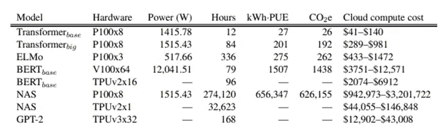
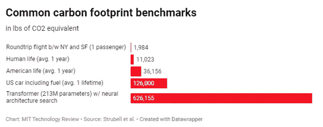
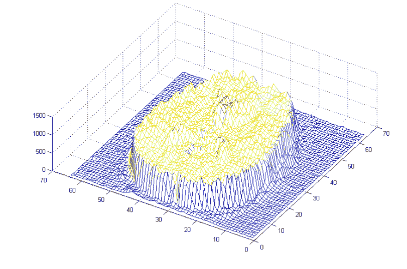
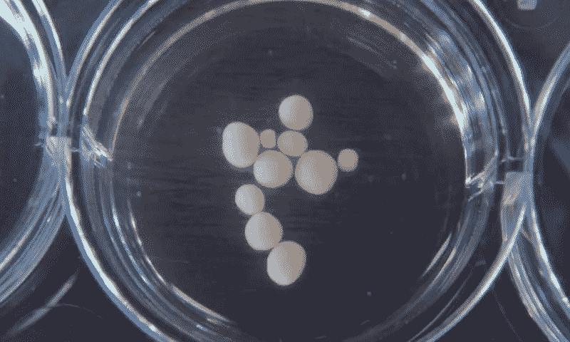

# 人工智能的未来是生物的

> 原文：<https://towardsdatascience.com/future-of-ai-is-biological-b512d6c40fe6?source=collection_archive---------15----------------------->

自然智能是有机的/生物的。今天，我们认为人工智能(AI)是机器、机器人和软件代码。会保持不变还是发生变化成为生物神器？

迄今为止，尽管受到人脑的启发，但人工智能的旅程正在偏离它，而且越来越看起来不可持续。不可持续的能源和数据消耗，与大脑皮层和学习瓶颈相比的表现差异，为基于干细胞的神经网络提供了一个有前途的案例。

消耗太多能量:基于人工智能的机器可以计算得更快，但是消耗太多能量。马萨诸塞大学阿姆赫斯特分校的研究人员最近建立了人工智能训练的基准(如下图)。虽然这些型号需要 1000 瓦，但大脑需要 20W。对，就是这样。AI-1000 瓦；镍— 20W。再加上云计算的成本，云计算运行在由可再生能源和不可再生能源驱动的大型服务器群中。

Source: [https://arxiv.org/pdf/1906.02243.pdf](https://arxiv.org/pdf/1906.02243.pdf)

**不可持续的气候变化:**如你所见，训练一个大型人工智能模型比一辆普通美国汽车排放的 5X 二氧化碳还要多。这不可持续。

**这是一个最小值:**专业人士不会调优一个模型，而是做 100 个或 1000 个模型，以达到最佳的人工智能模型。同样的研究人员分析了一个典型的 R & D 调优模型，发现它需要运行 1000 次。所以上面提供的数字是最小值。它乘以运行次数。

Source: [https://arxiv.org/pdf/1906.02243.pdf](https://arxiv.org/pdf/1906.02243.pdf)

**不像大脑:**燃烧了所有的能量，我们得到了什么？狭隘的单任务问题解决者。多种人工智能模型需要通过管道连续进行复杂的对话。这与 NI 非常不同，NI 可以是串行的，也可以是大规模并行的。下次你看电影的时候，记得你是在同时听、看和想象。下面是来自脑成像研究[的图像](https://www.technologyreview.com/s/532291/fmri-data-reveals-the-number-of-parallel-processes-running-in-the-brain/)，显示了 50 个独立的过程为一项视觉运动任务并行运行。

fMRI… brain parallel processing Source: MIT Technology Review

**构造不同:**这是因为越来越多的大脑研究指出，大脑的构造不同于我们的深度学习架构。首先，深度学习中的数据以密集的形式表示，而大脑似乎具有稀疏的表示。这是什么意思？对于你见过的每个人，你都有一套大脑人工制品来维持他们的面孔。当你再次看到它们时，那组神经元被触发。它与基于一系列特征、轮廓等网络来识别面部的面部识别系统非常不同。AI 没有一个地方…所有的脸都混在同一个网络里。具有更稀疏表示的大脑因此可以更好地处理[噪声](https://arxiv.org/pdf/1903.11257.pdf)。通过遮住你的半张脸，你不能欺骗大脑，但即使引入几个像素，人工智能也可以被欺骗，因为网络的不同部分被触发。

**不像人类一样学习:**这对于学习是如何发生的有着巨大的影响。今天的人工智能系统需要 1000 张猫的图像来识别一只猫。NI/ brain 没有。我们根据自己的知识进行推断。这意味着显著降低计算和能源。

在你童年时，父母什么时候教过你如何利用重力工作？从来没有。当你还是个婴儿的时候，你就在和它一起工作，并且在生命的早期就知道当你释放它们的时候，东西就会掉下来。NI 拥有像重力和其他物理知识的多层编码，我们可以无缝地并行连接稀疏矩阵的其他部分，从而在未知的场景中扩展我们的知识。

**边缘案例弄巧成拙:**这击中了边缘案例今天 AI 问题的核心。为了制造一辆坚固的自动驾驶汽车，它应该被训练成不会掉下悬崖。倪似乎与生俱来…我们看到重力神经元触发的悬崖，我们知道我们将会坠落。AI 需要训练。你不能把一辆车推下悬崖去训练。你永远不会有足够的数据点来训练。在这种情况下，人工智能在模拟中学习。边缘案例永远没有足够的数据，这就是为什么它们被称为边缘。这是人工智能中一个基本的自相矛盾的问题，而 NI 结构克服了这个问题。

新大脑皮层是一个复杂但可复制的结构:大脑中的 NI 结构很复杂，仍在研究中。但是在某些方面我们有着一致的看法。新皮层是大脑中与高级功能相关的部分。我们开始相信大脑的不同部分处理不同的感觉。但是越来越多的证据表明，这些不同区域的底层结构(柱子、连接等)是[相似的](https://numenta.com/blog/2019/01/16/the-thousand-brains-theory-of-intelligence/?gclid=CjwKCAjw5_DsBRBPEiwAIEDRW7Suc3B1hqz_llfngzqEzRjMOtpqiqknK_NXJpaj0YcHUnuavhV8ZhoCu4EQAvD_BwE)。区别它们的是输入，而不是内在结构。用音频改变视觉区域的输入，它仍然会学习和工作。甚至每平方毫米皮层表面的神经元数量看起来也与[相似](https://www.pnas.org/content/110/4/1488)。同样的组织是重复的。和 AI 很不一样。这能造出来吗？

大脑器官看起来很有希望:在实验室里，这已经在使用干细胞了。见下图的迷你大脑/ [类脑器官](https://phys.org/news/2019-08-brain-mini-brains-grown-dish.html)。

Pea-size brain organoids at 10 months old. Credit: Muotri Lab/UCTV Source: [phys.org/](https://phys.org/news/2019-08-brain-mini-brains-grown-dish.html)

它们正在培养皿中生长。该组织类似于大脑，是一个低能耗的神经网络。它们自我组织成神经组织。科学家们已经取得了长足的进步，通过提供血管系统/血管的生长来反复创造它们并稳定它们以保持更长时间。它们还被培养成具有多种功能，如视网膜细胞(原始的眼睛)引领我们进入一个传感成为可能的时代。这些类器官像人脑一样产生脑电波。最近，一个人工智能系统未能区分 9 个月大的大脑器官和早产儿大脑的电模式。

**生物计算即将到来:**这些类器官组织将在数月内自我组织和发展。可以指导他们做特定的活动吗？一系列平行的活动表明答案是肯定的。[最近](https://go.skimresources.com/?id=138113X1601993&isjs=1&jv=13.23.5-stackpath&sref=https%3A%2F%2Ffuturism.com%2Fworlds-first-reprogrammable-dna-computer&url=https%3A%2F%2Fwww.nature.com%2Farticles%2Fs41586-019-1014-9&xguid=1bf2c80ca54f6c2e2a5c77c7956a33be&xs=1&xtz=-330&xuuid=be3a787e6ab475c398788d77c5bf8aa9)加州大学戴维斯分校&哈佛大学的一个团队展示了一台运行 21 种不同程序的 DNA 计算机(例如:复制、排序、识别回文和 3 的倍数等)。

可持续的低能耗、自组织、类脑学习系统越来越有可能实现。

在分子编程/生物计算、干细胞和类器官、用于[特定开发](https://www.technologynetworks.com/neuroscience/news/brain-organoid-boost-replicates-human-cerebral-cortex-growth-320303)的基因编辑(CRISPR)以及从这些结构中推导神经计算模型方面的进步将需要人工智能生物。

激动人心。