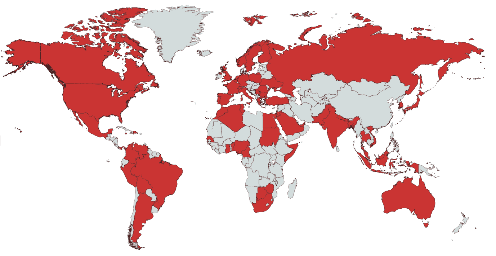

# 创新的未来将由社区自下而上推动，而不是由政府或企业自上而下推动

> 原文：<https://towardsdatascience.com/future-of-innovation-will-be-driven-bottom-up-by-communities-not-top-down-by-governments-or-273d3650f1ec?source=collection_archive---------23----------------------->

一群从未谋面、位于世界不同地区(不同大陆、不同时区)的爱好者能否走到一起，合作解决社会中的大问题？

这是一个引起我兴趣的问题，我想启动 Omdena 来看看这种自下而上的模式是否可行。

这半年发生的事情很神奇。来自 63 个国家的 400 多名爱好者不仅合作应对重大的社会挑战，如战胜尼泊尔的饥饿，索马里的冲突，巴西的森林火灾，印度的性骚扰，而且他们还能够建立非常复杂的人工智能模型，同时相互帮助。更有经验的开发人员开始分享他们的工作，并帮助不太有经验的开发人员，而新的开发人员开始生成数据。

> 尽管面临各种挑战，但所有发烧友都有一个共同点。他们都被极大地激励着，渴望构建一个现实世界的产品来解决现实世界的问题。

# 合作而不是竞争

这是一种新的创新模式。一种模式，在这种模式下，社区可以聚集在一起解决他们的问题，共享他们的数据，并构建解决方案。

在大数据和机器学习的世界里，数据是关键。这不是复杂的算法或更好的团队，而是拥有更好(和更多)数据的团队获胜。此外，由于在线课程的泛滥，教育，特别是人工智能和人工智能等新兴技术的教育变得容易获得。现在，对于世界上任何地方的任何人来说，从像 Udemy，Coursera 这样的网站开始学习是非常容易的。通过访问数据和开源代码，人们拥有了构建自己解决方案的所有工具。

对社区驱动的方法感兴趣的人如何开始构建他们的解决方案？以下是步骤:

1.  建立一个由拥有共同愿景、动机和使命的高度积极的人组成的社区。社区应该拥有多样化的经验和技能。
2.  把他们带到一个平台下，可以懈怠。
3.  遵循协作工作的最佳实践、流程和工具。
4.  定期举办活动，让社区成员展示他们的工作并分享知识。
5.  写下他们正在做的工作，以保持动力。每个人都喜欢被认可。

# 管理社区

社区很难管理和维护。最好的策略是用一种有共同价值观和动机的语言说话。这是建立“部落”[1]的唯一方法:一群拥有共同意义和联系的人。

另一件重要的事情是有人能把社区粘在一起。Scott Adams 在他的书《如何在几乎所有事情上都失败的情况下仍然赢得巨大成功》中谈到了建立多样化的技能，这样整体就大于部分之和。

# 社区外的价值

由社区构建的解决方案几乎肯定会被采用。他们知道要解决什么问题，如何获取数据，甚至知道如何构建这些解决方案。他们需要的是支持、指导和鼓励。

> 一个社区创造授权，建立信任，提供数据访问，产生不同的意见，并刺激创新。

但是如果创造的模型产生了经济价值会怎么样呢？这是如何分配的，特别是当一个公司把它的项目外包给社区的时候？当公司正在使用经过训练的模型时，数据和代码保留在社区中。因此，如果有经济价值，从产出中获益对社区和公司都更有意义。

> 公司的利益是短期的。社区的利益是长远的。

这种利用社区的方式甚至可以更大。在观看一部关于一些暴虐政权的纪录片时，我意识到暴虐政权(或公司)的目标是控制人民。这是一种经典的自上而下的方法，一些精英告诉我们其余的人什么时候做什么。

社区驱动的方法正好相反。这不是关于控制，而是关于激发自由思想。这是推动真正创新的动力，也是我认为世界应该走向的地方，我想成为其中的一部分。

> *当我们接触到自己的感觉和需求时，我们人类就不再是好的奴隶和下属了*——*非暴力沟通:马歇尔·罗森博格的一种生活语言。*