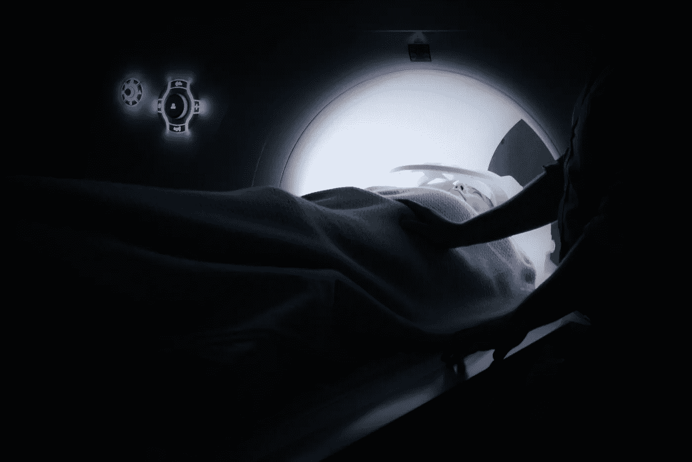
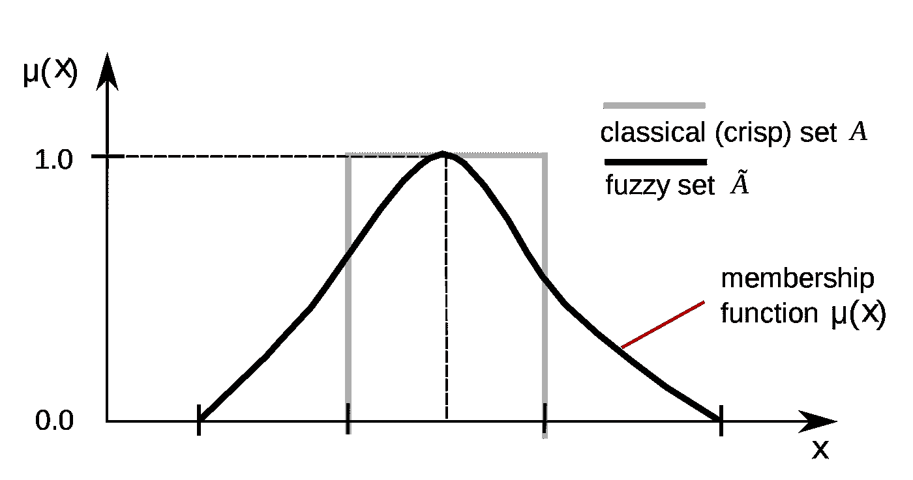

# 模糊逻辑及其如何治愈癌症

> 原文：<https://towardsdatascience.com/fuzzy-logic-and-how-it-is-curing-cancer-dc6bcc961ded?source=collection_archive---------19----------------------->

## 简要介绍软计算、模糊逻辑以及这两者如何帮助我们治愈肿瘤！

# 什么是软计算？

它是一切不脆/不实的东西。一门不能给出 100%准确答案的科学，但更合适的是它不需要 100%明确的输入。一个简单的例子是一个根据照片预测一个人年龄的程序。它研究照片中的多种特征，如头发颜色、皮肤纹理、皱纹等。并估计他们的年龄。
输入:可能不是高分辨率的照片/侧面照片。
输出:一个大概接近这个人年龄的数字。
**软计算基于*模糊逻辑*，后面会解释。**

硬计算是传统的计算方法，你们大多数人可能已经很熟悉了。一个例子是将两个数相加的程序。明确的输入和绝对的答案。

Eva Volná写的《软计算简介》****是一本很棒的免费书籍，可以让你在软计算和模糊逻辑方面有一个很好的开端。****

> ****以下是本书对软计算的定义** 软计算是一组方法，旨在利用对不精确性、不确定性和部分真实性的容忍来实现易处理性、健壮性和低解决方案成本。它由三种计算范式组成，即*模糊* *计算、神经计算*和*概率推理*。软计算的角色模型是人脑。**

# **什么是模糊逻辑？**

**传统的方法是将一杯咖啡分成两类，冷的或热的。一个温暖的接近热的杯子会属于热的类别。在模糊世界中，这个暖杯对热杯的隶属度为 70%，对冷杯的隶属度为 30%。**

****

**sketch made using [sketchboard](https://sketchboard.io/)**

***模糊逻辑*是一种基于**真实度**而不是通常的真或假的计算方法。使得对于每个元素，它对于包含在问题中的每个集合都有一个**隶属度**。**

**这种计算在我们的日常生活中非常有用。例如，一所学校正在为校队选拔篮球运动员，他们宣布需要身高 5 英尺 5 英寸以上的人。这会让一个 5 尺 4 的非常优秀的球员失去资格吗？还是他会被试镜因为其实差别不大？如果一个 5 英尺 3 英寸的人申请。他只比最后一个被录取的人矮一英寸。永远都是这样。这就是为什么更合适的应用程序会在身高字段中有分数，其中相对较矮的人会有较低的分数(属于高个子集的程度< 100%)，而较高的人会得到满分(完全属于高个子集)。**

****

**seriousfacts.com**

**自然本身是不脆的，当你看到彩虹时，你会看到红色，然后是橙色。你盯着一个点，你可以发誓它是红色的，百分之百的红色。而且，你看到它变得越来越轻，直到它平稳地变成橙色。你说不出它到底是从哪一点停止变红，开始变成橙色的。它不是一个纯红色的笔画后面跟着一个纯橙色的笔画，相反，它是一个从 100%到 0%递减的红色百分比和从 0%到 100%递增的橙色百分比。**

# **这和肿瘤有什么关系？**

**文献(以前/当前关于检测肿瘤的论文/研究)中有 3 个缺陷:**

*   **没有考虑包含在肿瘤区域内的每个细胞中的癌症百分比。在大多数情况下，肿瘤由大量癌细胞组成，这些癌细胞在各个维度上逐渐消失，直到不再有癌细胞。**
*   **假设肿瘤的形状是规则的几何形状(球形),其直径为 MRI 扫描中肿瘤的长度。因此，肿瘤体积的计算是错误的，因为肿瘤通常以不规则的形状存在。**
*   **指定癌症级别以及治疗计划是基于依赖于肿瘤直径大小的清晰集合。意味着治疗中的剧烈改变可能基于阶段边界周围的轻微移动。**

****

**Photo by [Damon Hall](https://www.pexels.com/@damodigital?utm_content=attributionCopyText&utm_medium=referral&utm_source=pexels) from [Pexels](https://www.pexels.com/photo/aerial-photo-of-seashore-1310004/?utm_content=attributionCopyText&utm_medium=referral&utm_source=pexels)**

## **忽略癌变区域内癌症的不同强度(癌症分级)**

**在海滩上，你看不到海水以一条完美的直线结束。相反，海水的深度逐渐减少。从齐肩到齐膝，再到湿脚趾，然后是湿沙子，最后是完全干燥的沙子。对于肿瘤来说也是一样，当你检查核磁共振扫描时，你会看到一个癌块(水)，癌细胞会逐渐消失，直到你到达完全健康的器官部分(沙子)。文学不能解释这一点。他们没有考虑到肿瘤固有的模糊性。一般来说，生物系统，尤其是癌性肿瘤，并不显示出清晰的边界。因此，为了精确描述肿瘤，必须考虑内在分级，以评估初始肿瘤结构和追踪治疗进展。一些细胞可能仅包含 40%癌组织的模糊部分将被认为是 100%的癌细胞。这高估了病人的情况，并可能导致不必要的沉重的愈合过程。**

## **假设肿瘤是规则的球形，这种情况很少发生**

**癌症检测文献中的另一个大错误是，他们假设肿瘤是规则的球形，具有肿瘤本身中最长线的直径。这可能导致非常错误的尺寸，特别是在肿瘤形状不规则或者最长和最短尺寸之间的差异很大的情况下。通常基于最长直径的体积估计导致比实际情况大得多的体积大小。这种测量技术只能对完美或接近完美的球形病变精确。**

## **主要基于肿瘤直径长度来定义癌症的明确阶段**

****

**source: [wikimedia commons](https://commons.wikimedia.org/wiki/File:Fuzzy_crisp.svg)**

**癌症分期用于描述和排列癌症的严重程度。从阶段 0 到阶段 4。其中 IV 是最严重的。第四阶段意味着疾病已经扩散到其他器官。自从洛菲·扎德提出模糊集合论以来，人们就认识到了生物系统的模糊性，从那以后，生物现象的层次性得到了广泛的重视和应用。例如，如果一个阶段落在分别作为下限和上限的肿瘤直径 2 cm 和 4 cm 的值之间，那么值 1.99 和 4.01 呢？对于这样一个微小的偏离边界的情况，我们应该把整个治疗计划或药物设计从一个阶段转移到另一个阶段吗？如果我们不这样做，那么我们应该在什么指数值设置限制？这是一个典型的悖论的例子，模糊集合论就是为此而发明的。**

**我在这里写的很多东西，都是从这篇[智能癌症分期的肿瘤体积模糊化](https://www.researchgate.net/publication/280306543_Tumor_Volume_Fuzzification_for_Intelligent_Cancer_Staging)论文中学到的。**