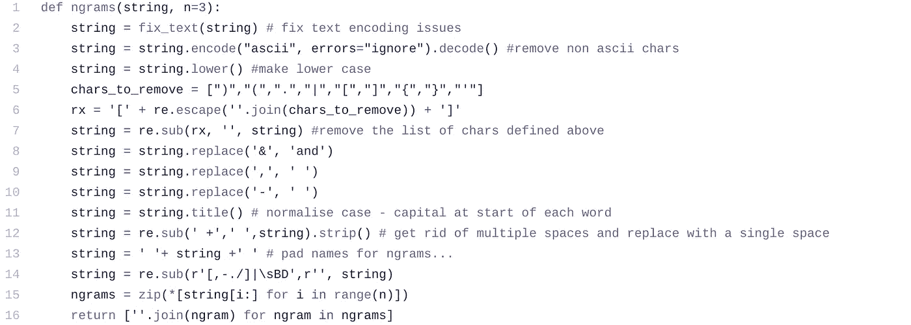
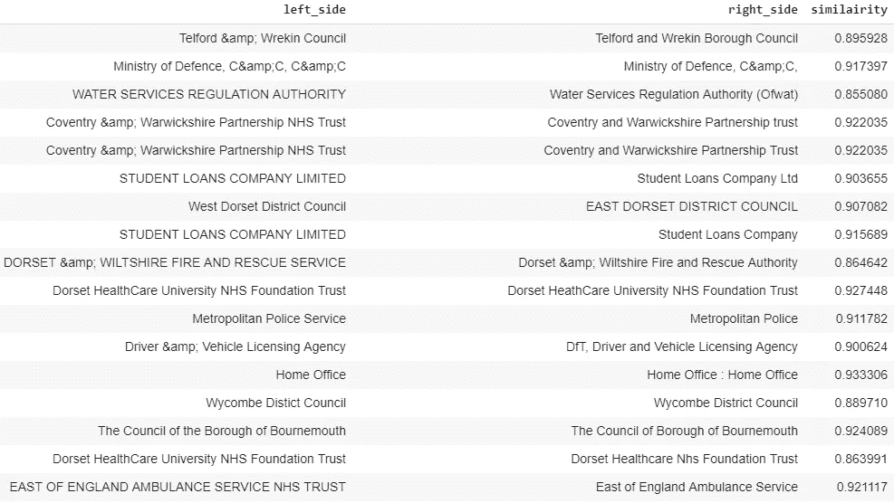
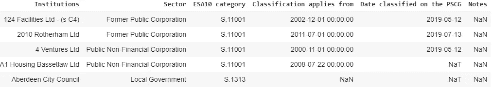
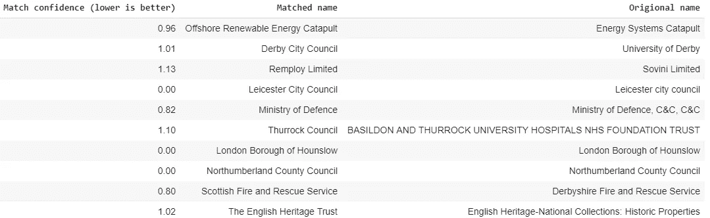

# 尺度模糊匹配

> 原文：<https://towardsdatascience.com/fuzzy-matching-at-scale-84f2bfd0c536?source=collection_archive---------2----------------------->

## 从 3.7 小时到 0.2 秒。如何以一种甚至可以扩展到最大数据集的方式执行智能字符串匹配。


Same but different. Fuzzy matching of data is an essential first-step for a huge range of data science workflows.

***# # # 2020 年 12 月更新:一种更快、更简单的模糊匹配方法现已包含在本文末尾，并提供了在任何数据集上实现该方法的完整代码###***

D 现实世界中的 ata 是杂乱无章的。处理乱七八糟的数据集是痛苦的，耗费了大量时间，而这些时间本可以用来分析数据本身。

本文重点关注“模糊”匹配，以及它如何通过以下方式帮助自动化大量数据科学工作流中的重大挑战:

1.  **重复数据删除。**对齐数据集中相似的类别或实体(例如，我们可能需要将“D J Trump”、“D. Trump”和“Donald Trump”组合成同一个实体)。
2.  **记录联动。**连接特定实体上的数据集(例如，将‘D . J . Trump’的记录连接到他的维基百科页面的 URL)。

通过使用从自然语言处理领域借用的新方法，我们可以在大型数据集上执行这两项任务。

## 大数据的模糊匹配问题

有许多算法可以提供模糊匹配([参见这里如何用 Python](/natural-language-processing-for-fuzzy-string-matching-with-python-6632b7824c49) 实现)，但是当用于超过几千条记录的适度数据集时，它们很快就失效了。

这样做的原因是，他们将每个记录与数据集中的所有其他记录进行比较。在计算机科学中，这被称为二次时间，在处理较大的数据集时会很快形成障碍:


Number of records on the left against the number of operations required for an algorithm that works in quadratic time. A relativity small data set of 10k records would require 100m operations.

更糟糕的是，大多数字符串匹配函数还依赖于被比较的两个字符串的长度，因此在比较长文本时速度会更慢。

## 众所周知的 NLP 算法如何帮助解决这个问题

这个问题的解决方案来自一个众所周知的 NLP 算法。*词频，逆文档频率*(或 tf-idf)从 1972 年开始用于语言问题。

这是一个简单的算法，它将文本分成“块”(或 ngrams)，对给定样本的每个块的出现次数进行计数，然后根据该块在数据集的所有样本中的稀有程度对其进行加权。这意味着有用的单词从文本中出现的更常见单词的“噪音”中过滤出来。

虽然这些组块通常应用于整个单词，但是没有理由为什么相同的技术不能应用于单词中的字符集。例如，我们可以将每个单词分成 3 个字符的 ngrams，对于单词“Department ”,将输出:

```
' De', 'Dep', 'epa', 'par', 'art', 'rtm', 'tme', 'men', 'ent', 'nt '
```

然后，我们可以在代表我们的数据集的项目矩阵中比较这些块，以寻找接近的匹配。这种寻找接近匹配的方法应该非常有效，并且通过其对数据中不太常见的字符组给予更大重视的能力，还可以产生高质量的匹配。让我们来测试一下吧！

## 真实世界的例子

我们将用来测试该算法的例子是一组在 [Contracts Finder](https://www.gov.uk/contracts-finder) 上发布合同的英国公共组织。这些组织的名称非常混乱，看起来好像是通过自由文本字段输入系统的。


A sample of the data set — there are 3,651 different buying organisations in total

## 智能重复数据删除

我们将首先探讨如何对相近的匹配项进行重复数据删除。使用 Python 的 Scikit-Learn 库可以使这个过程变得轻松:

1.  创建一个函数将字符串分割成字符。
2.  使用 Scikit-Learn 从这些字符创建一个 tf-idf 矩阵。
3.  使用余弦相似度来显示总体中最接近的匹配。

**ngram 功能**

below 函数既用作文本数据的清理函数，也用作将文本拆分成 ngrams 的方法。代码中添加了注释以显示每一行的用途:



The function used to turn a string into a series of ngrams for matching on

**应用函数并创建 tf-idf 矩阵**

Scikit 中 tf-idf 实现的伟大之处在于它允许向其中添加自定义函数。因此，我们可以添加上面创建的函数，只用几行代码就可以构建矩阵:

```
from sklearn.feature_extraction.text import TfidfVectorizerorg_names = names['buyer'].unique()
vectorizer = TfidfVectorizer(min_df=1, analyzer=ngrams)
tf_idf_matrix = vectorizer.fit_transform(org_names)
```

**通过余弦相似度找到接近的匹配**

您可以在这里使用 Scikit 中的余弦相似性函数，但是这并不是查找接近匹配的最有效的方法，因为它会返回每个样本的数据集中每个项目的接近度分数。相反，我们将使用一个更快的实现，可以在这里找到:

```
import numpy as np
from scipy.sparse import csr_matrix
!pip install sparse_dot_topn 
import sparse_dot_topn.sparse_dot_topn as ctdef awesome_cossim_top(A, B, ntop, lower_bound=0):
    # force A and B as a CSR matrix.
    # If they have already been CSR, there is no overhead
    A = A.tocsr()
    B = B.tocsr()
    M, _ = A.shape
    _, N = B.shape

    idx_dtype = np.int32

    nnz_max = M*ntop

    indptr = np.zeros(M+1, dtype=idx_dtype)
    indices = np.zeros(nnz_max, dtype=idx_dtype)
    data = np.zeros(nnz_max, dtype=A.dtype)ct.sparse_dot_topn(
        M, N, np.asarray(A.indptr, dtype=idx_dtype),
        np.asarray(A.indices, dtype=idx_dtype),
        A.data,
        np.asarray(B.indptr, dtype=idx_dtype),
        np.asarray(B.indices, dtype=idx_dtype),
        B.data,
        ntop,
        lower_bound,
        indptr, indices, data)return csr_matrix((data,indices,indptr),shape=(M,N))
```

将所有这些放在一起，我们得到以下结果:



Witchcraft! The algorithm is eerily good at identifying duplicate records.

非常令人印象深刻，但它有多快？让我们比较一下使用“fuzzywuzzy”库计算近似匹配的更传统的方法:

```
!pip install fuzzywuzzy
from fuzzywuzzy import fuzz
from fuzzywuzzy import processt1 = time.time()
print(process.extractOne('Ministry of Justice', org_names)) #org names is our list of organisation names
t = time.time()-t1
print("SELFTIMED:", t)
print("Estimated hours to complete for full dataset:", (t*len(org_names))/60/60)**Outputs:**
SELFTIMED: 3.7s 
Estimated hrs to complete for full dataset: 3.78hrs
```

使用传统方法的基线时间大约是 3.7 小时。我们的算法用了多长时间来发挥它的魔力？

```
import time
t1 = time.time()
matches = awesome_cossim_top(tf_idf_matrix, tf_idf_matrix.transpose(), 10, 0.85)
t = time.time()-t1
print("SELFTIMED:", t)**Outputs:
**  SELFTIMED: 0.19s
```

哇——我们已经将预计时间从 3.7 小时减少到大约五分之一秒(大约 66，000 倍的速度提升！)

## 记录链接和不同的方法

如果我们想使用这种技术来匹配另一个数据源，那么我们可以回收大部分代码。在下面的部分，我们将看到这是如何实现的，并使用 K 最近邻算法作为一种替代的接近度测量。

我们想要加入的数据集是由英国国家统计局(ONS)创建的一组“干净”的组织名称:



The clean data set we would like to join against.

如下面的代码所示，这种方法的唯一区别是使用 tdif 矩阵来转换杂乱的数据集，该矩阵是在干净的数据集上学习的。

“getNearestN”然后使用 Scikit 的 K 最近邻实现来查找数据集中最接近的匹配:

```
from sklearn.metrics.pairwise import cosine_similarity
from sklearn.feature_extraction.text import TfidfVectorizer
import reclean_org_names = pd.read_excel('Gov Orgs ONS.xlsx')
clean_org_names = clean_org_names.iloc[:, 0:6]org_name_clean = clean_org_names['Institutions'].unique()print('Vecorizing the data - this could take a few minutes for large datasets...')
vectorizer = TfidfVectorizer(min_df=1, analyzer=ngrams, lowercase=False)
tfidf = vectorizer.fit_transform(org_name_clean)
print('Vecorizing completed...')from sklearn.neighbors import NearestNeighbors
nbrs = NearestNeighbors(n_neighbors=1, n_jobs=-1).fit(tfidf)org_column = 'buyer' #column to match against in the messy data
unique_org = set(names[org_column].values) # set used for increased performance###matching query:
def getNearestN(query):
  queryTFIDF_ = vectorizer.transform(query)
  distances, indices = nbrs.kneighbors(queryTFIDF_)
  return distances, indicesimport time
t1 = time.time()
print('getting nearest n...')
distances, indices = getNearestN(unique_org)
t = time.time()-t1
print("COMPLETED IN:", t)unique_org = list(unique_org) #need to convert back to a list
print('finding matches...')
matches = []
for i,j in enumerate(indices):
  temp = [round(distances[i][0],2), clean_org_names.values[j][0][0],unique_org[i]]
  matches.append(temp)print('Building data frame...')  
matches = pd.DataFrame(matches, columns=['Match confidence (lower is better)','Matched name','Origional name'])
print('Done')
```

这会产生以下结果:



Not all items exist across the data sets. Thankfully the closeness score can be used to apply a threshold to what counts as a positive match.

从这个例子中可以看出，并不是所有的项目都出现在两个数据集中，但是 K 个最近邻仍然可以找到最接近的匹配。因此，我们需要对接近度分数应用一个阈值来确定什么算匹配。

使用这种方法，将 3，651 个实体与我们的干净数据集(包含 3，000 个实体)匹配不到一秒钟。

## 2020 年 12 月更新，这是一种使用 NMSLIB 的更快、更可扩展的新方法

虽然我们在本帖中构建了自己的函数来寻找向量间的近似匹配，但还有许多库存在，它们的唯一目的是加速这一过程。

不幸的是，大部分这些要求向量是密集的，并且不能处理我们在这篇文章中创建的大型稀疏(大部分是空的)矩阵。幸运的是，有一个库可以很好地处理稀疏矩阵；NMSLIB。我已经在这里更详细地写了这个库，但是本质上，NMSLIB 可以在一个矩阵上创建一个索引，并在给定的输入上执行极快的查询。在任何数据集上实现这一点的完整、有文档记录的代码可以在下面找到:

[](https://drive.google.com/file/d/1Z4-cEabpx7HM1pOi49Mdwv7WBOBhn2cl/view?usp=sharing) [## 模糊 _ 匹配 _ 更新. ipynb

### 合作笔记本

drive.google.com](https://drive.google.com/file/d/1Z4-cEabpx7HM1pOi49Mdwv7WBOBhn2cl/view?usp=sharing) 

**总之，**在处理大量记录时，tf-idf 是一种高效、高性能的数据清理、重复数据删除和匹配方法。

***代码，参考资料及进一步阅读:***

请参见下面的 colab 文档，查看这篇文章的完整代码:

[](https://colab.research.google.com/drive/1qhBwDRitrgapNhyaHGxCW8uKK5SWJblW) [## 快速匹配

### 快速模糊匹配

colab.research.google.com](https://colab.research.google.com/drive/1qhBwDRitrgapNhyaHGxCW8uKK5SWJblW) 

这篇文章的灵感来自范登博客上的以下帖子:

 [## Python 中的超快速字符串匹配

### 传统的字符串匹配方法，如 Jaro-Winkler 或 Levenshtein 距离度量，对于…

bergvca.github.io](https://bergvca.github.io/2017/10/14/super-fast-string-matching.html) 

关于 tf-idf 的更多信息可以在下面的文章中找到

[](https://medium.com/free-code-camp/how-to-process-textual-data-using-tf-idf-in-python-cd2bbc0a94a3) [## 如何在 Python 中使用 TF-IDF 处理文本数据

### 计算机擅长处理数字，但不太擅长处理文本数据。最广泛使用的处理技术之一…

medium.com](https://medium.com/free-code-camp/how-to-process-textual-data-using-tf-idf-in-python-cd2bbc0a94a3)