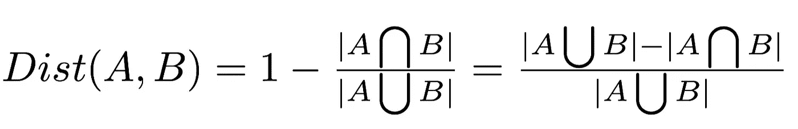
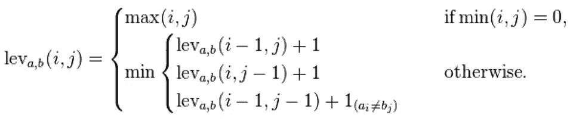

# FuzzyWuzzy:如何在 Python 上测量字符串距离

> 原文：<https://towardsdatascience.com/fuzzywuzzy-how-to-measure-string-distance-on-python-4e8852d7c18f?source=collection_archive---------14----------------------->


Some fuzzy plant leaves. Source: [Pixabay](https://pixabay.com/photos/lambs-ear-texture-fuzzy-plant-53664/).

Python 的 *FuzzyWuzzy* 库用于测量两个字符串之间的相似性。以下是你也可以开始使用它的方法。

有时候，我们需要看两个字符串是否相同。当将输入的密码与你的登录数据库中存储的密码进行比较时，“相似性”是不够的。

然而，其他时候，事情会变得有点… *模糊*。

如果我的顾客的名字是*艾伯特·汤普森*，但是他用一张名为*艾伯特·g·汤普森*的信用卡付款，我应该报警举报欺诈吗？《魔戒 2:双塔》和《魔戒 2:双塔》是否应该被一个网站当做两部完全独立的书？奥地利和澳大利亚真的是两个不同的国家吗？

好吧，我可能被最后一个问题冲昏了头脑，但是你明白了。

# 字符串距离度量

我们想要的是一个测量两个字符串有多相似的函数，但是对小的变化是健壮的。这个问题听起来很普通:科学家们已经想出了很长时间的解决方案。

# 雅克卡距离:第一种方法

最直观的一个就是 Jaccard 距离。它可以推广到任意两个集合的距离度量。它通过以下公式进行测量:



也就是说，有多少个元素在任一集合上，但不被两者共享，除以不同元素的总数。

例如，给定字符串“Albert”和“Alberto”，它将报告 85.7%的相似性，因为它们共享总共 7 个字母中的 6 个。

然而，这不是一个专门为字符串定制的措施。

它将在许多用例中失败，因为它没有真正考虑排序。例如，两个变位词，如“铁路安全”和“童话”，总是 100%匹配，即使这些字符串完全不同。

# 莱文斯坦距离

俄罗斯科学家 Vladimir Levenshtein 在 60 年代发明了这种方法，这种方法更加直观:它计算需要多少次替换，给定一个字符串 *u* ，将其转换为 *v* 。

对于这种方法，替代被定义为:

*   擦除字符。
*   添加一个。
*   用一个字符替换另一个字符。

需要对 *u* 进行的这些操作的最小数量，以便将其转换为 *v，*对应于这两个串之间的 Levenshtein 距离。

它可以通过以下公式递归获得:



其中 *i* 和 *j* 是我们将要比较的子串的最后一个字符的索引。如果这些字符不同，最后一个表达式中的第二项等于 1，如果相同，则等于 0。

这是 Python 的 FuzzyWuzzy 库使用的度量。

# 在 Python 中使用 FuzzyWuzzy

要获得两个字符串之间的相似率，我们要做的就是:

```
from fuzzywuzzy import fuzzsimilarity = fuzz.ratio("hello","world")
```

你可能注意到了我说的比率。ratio 方法将总是返回一个介于 0 和 100 之间的数字(是的，我更希望它介于 0 和 1 之间，或者称之为百分比，但是各有各的)。

可以证明，Levenshtein 距离至多是最长字符串的长度:用较长字符串的第一部分替换较短字符串中的所有字符，然后添加其余的字符。

这就是我们如何将距离归一化以返回一个比率，以便在给定不同大小的输入的情况下，该数字不会大幅波动。

这解决了前面提到的一些问题:

```
fuzz.ratio("Albert Thompson", "Albert G. Thompson") #91%fuzz.ratio("The Lord of the Rings II: The Two Towers",
           "The Lord of the Rings 2: the 2 Towers") #88%
```

即使这可能会带来一些新的问题:

```
#88% for two different countries
fuzz.ratio("Austria","Australia")#57% but it's the same country
fuzz.ratio("Czechia","Czech Republic")
```

# 其他模糊不清的方法

Python 的 FuzzyWuzzy 库不仅为我们提供了普通的 Levenshtein 距离，还提供了一些我们可以利用的其他方法。

## 部分比率

*partial_ratio* 方法用较短字符串的长度计算较长字符串的所有子字符串的 FuzzyWuzzy 比率，然后返回最高匹配。

举个例子，

```
fuzz.partial_ratio("abc","a") == 
      min([fuzz.ratio( char, "a") for char in "abc"])
```

这有一些有趣的影响:

```
fuzz.partial_ratio("Thomas and His Friends", "Thomas") #100%fuzz.partial_ratio("Batman vs Superman", "Batman") #100%
```

实际上，partial_ratio 方法可以是对【T2 包含】字符串方法的模糊替换，就像常规比率可以替换【T4 等于】方法一样。

但是，对于相似但单词出现顺序不同的字符串，它将失败。即使是轻微的顺序变化也会破坏它。

```
#72% with basically the same idea
fuzz.partial_ratio("Peanut Butter and Jelly", 
                   "Jelly and Peanut Butter")

#86% with a random (carefully selected) string
fuzz.partial_ratio("Peanut Butter and Jelly", "Otter and Hell")
```

## 令牌 _ 排序 _ 比率

Token Sort Ratio 将两个字符串分成单词，然后在对它们调用常规 Ratio 之前，再次按字母数字顺序将它们连接起来。

这意味着:

```
fuzz.partial_ratio("Batman vs Superman", "Superman vs Batman") #100%fuzz.partial_ratio("a b c", "c b a") #100%
```

## 令牌 _ 集合 _ 比率

记号集比率将每个字符串分成单词，将两个列表都变成集合(丢弃重复的单词)，然后在进行比率之前对它们进行排序。

这样，我们不仅排除了共享单词，还考虑到了重复。

```
fuzz.token_set_ratio("fun","fun fun fun") #100%fuzz.token_set_ratio("Lord the Rings of", "Lord of the Rings") #100%
```

# 结论

Python 的 FuzzyWuzzy 库是一个非常有用的工具。无论是对于客户的姓名匹配，还是充当穷人的单词嵌入，都可以省去你很多麻烦，或者对你的机器学习模型的特征工程有帮助。

然而，由于它需要预处理(比如将两个字符串都转换成小写)，并且不考虑同义词，所以对于可能需要实际 NLP 或[聚类方法](https://strikingloo.github.io/wiki-articles/machine-learning/clustering)的情况，它可能不是最佳解决方案。

我希望这篇文章对你有所帮助，如果你在工作中发现 FuzzyWuzzy 的其他用途，请告诉我！

*关注我的*[*Twitter*](http://www.twitter.com/strikingloo)*或*[*Medium*](http://medium.com/@strikingloo)*了解更多 Python 教程、技巧和窍门。*

*你可以在我的* [*个人网站*](https://strikingloo.github.io/blog/) *中看到我正在做的事情以及我最近的文章和笔记。*