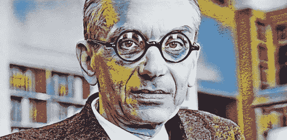

# 哥德尔不完全性定理及其对构建强人工智能的启示

> 原文：<https://towardsdatascience.com/g%C3%B6dels-incompleteness-theorems-and-the-implications-to-building-strong-ai-1020506f6234?source=collection_archive---------14----------------------->

## 数据科学之道

## 关于制造智能机器，数学逻辑最深刻的结果告诉了我们什么

[*数据科学之道*](https://medium.com/tag/the-tao-of-data-science) *专栏探讨了几个世纪以来哲学家们是如何攻克机器学习和数据科学的关键问题的。*

Gödel’s proofs suggest strong AI may not be possible with modern computing.

# **定理的要旨**

*   在现代逻辑中，可以表达算术语句，例如，“给定任意数 x 和 y，x + y = y + x”。
*   公理*是被认为是正确的陈述。例如，概率论的一个公理是，这个叫做“概率”的东西是一个介于 0 和 1 之间的实数。公理作为进一步推理的前提，例如“如果 0 ≤ p ≤ 1，那么……”。*
*   几个公理放在一起形成一个公理系统(如概率公理)，从中可以证明许多算术真理(如贝叶斯规则)。
*   哥德尔提出的问题是，一个人是否可以用一个公理系统来证明所有的算术真理，而不会与*不一致*——其中*不一致*意味着系统产生矛盾。
*   哥德尔证明了对于任何一致的公理系统，都有那个系统无法证明的真理。
*   这表明数学家所能知道的是有界限的。

# **对 AI 的影响**

AI 研究的目标之一是实现“强人工智能”，即人类级别的通用 AI。目前，我们在图灵机中构建 AI 作为算法，图灵机是一致的公理系统，因此服从定理。

[罗杰·彭罗斯](https://en.wikipedia.org/wiki/Roger_Penrose#Physics_and_consciousness)和 [J.R. Lucas](https://en.wikipedia.org/wiki/John_Lucas_(philosopher)) 认为人类意识超越图灵机是因为人类的头脑通过内省可以认识到自己的不一致，这在哥德尔定理下对图灵机来说是不可能的。他们认为这使得图灵机不可能复制人类思维的特征，例如数学洞察力。

# 了解更多信息

*   [哥德尔的不完全性定理](http://Gödel's incompleteness theorems) —斯坦福哲学百科全书
*   [彭罗斯论物理学与意识](https://en.wikipedia.org/wiki/Roger_Penrose#Physics_and_consciousness) —维基百科