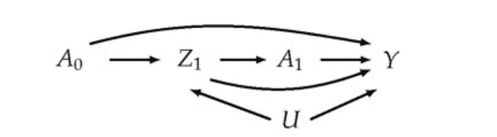
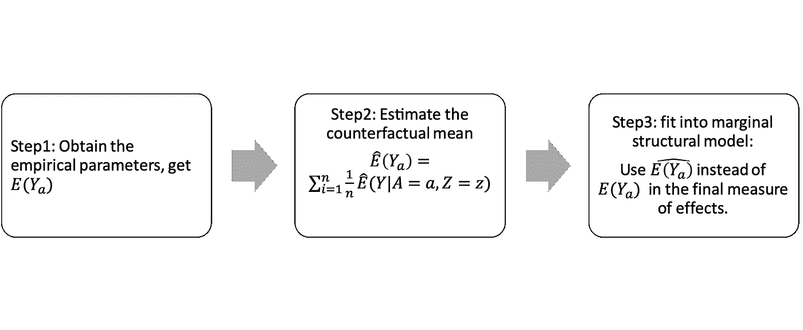

# 因果推理中的 g-计算

> 原文：<https://towardsdatascience.com/g-computation-in-causal-inference-774099da3631?source=collection_archive---------6----------------------->

## 因果推理的反事实方法

g-计算算法最早由 Robins 于 1986 年[1]引入，用于在存在受暴露影响的时变混杂因素的情况下估计时变暴露的因果效应，在这种情况下，传统的基于回归的方法将失效。

G-计算或 G-公式属于 G-方法家族[2]，它还包括逆概率加权边际结构模型和结构嵌套模型的 G 估计。它们在比标准回归方法更少限制的识别条件下，提供平均潜在结果的对比(如差异、比率)的一致估计。

在这篇文章中，我将详细解释 G-计算在因果分析中的工作原理。

# 例子

想一个例子——治疗艾滋病毒，衡量治疗效果的方法是检测 CD4 计数，你血液中的 CD4 计数越多，治疗效果越好。我们将结果(CD4 计数)命名为 **Y** 。我们有两组病人， **A** =1 表示接受特定治疗， **A** =0 表示不接受特定治疗。我们在任何治疗前对患者进行测试作为基线，同时还会进行后续测试**a1**。我们还有一个协变量**Z**——升高的 HIV 病毒载量，它在基线时是恒定的，在第二次治疗前的随访中测量一次(Z_1)。除此之外，我们还有一个无法测量的共同原因(**U**)HIV 病毒载量(Z)和 CD4(Y)。

为了测量差异，我们通常使用平均因果效应 E(Y1-Y0)，它是一个*边际*效应，因为它是总体中所有个体水平效应的平均值。

我们如何识别 CD4 计数的变化( **Y** )是由治疗( **A=1** )引起的**而不是其他原因？**

# 假设

Causal diagram representing the relation between a treatment at time 0 (A0), HIV viral load just prior to the second round of treatment (Z1), the treatment status at time 1 (A1), the CD4 count measured at the end of follow-up (Y), and an unmeasured common cause (U) of HIV viral load and CD4.

我们使用平均效应来衡量差异，然而，我们无法获得所有信息，因为有些人接受了治疗，有些人没有。我们没有进行倾向评分匹配，所以我们不能保证个人的所有其他条件都是相同的。我们需要证明我们用来测量的平均效应会在整个人口中观察到。这是通过以下假设实现的:

**假设 1:反事实一致性**

一致性规则指出，一个人在碰巧实现的假设条件下的潜在结果正是该人经历的结果。这允许我们写出:P(Yx = y|Z = z，X = x) = P(Y = y|Z = z，X = x)，并确定我们的平均因果效应

**假设 2:互换性**

可交换性意味着暴露下的潜在结果与实际暴露 A0 或 a1 无关。这是说“数据来自随机对照试验”的假设。如果这个假设成立，你会在 a=0 的组中观察到 Ya=0 的分布的随机子集，在 a=1 的组中观察到 Ya=1 的分布的随机子集。

**假设 3:积极性**

阳性是假设任何个体都有接受治疗变量所有值的正概率。这种假设是有用的，这样影响就会存在。当在所有混杂因素中存在暴露和未暴露的个体时，该假设将被满足。

在这些假设下，g 方法可以用来估计观测数据的反事实量

# G 计算的步骤:

为了评估治疗对 CD4 计数的不同影响，我们实施了以下步骤:

3 steps for G-computation

这个想法是使用反事实(如果接受治疗的患者没有接受治疗，而没有接受治疗的患者接受了治疗，结果会是什么)来创建平均效果的估计，以适应我们的差异测量模型。

感谢阅读我的帖子！在后面的帖子中，我将解释另一种 G 方法，即 IPWC，并解释 TMLE，G 公式和 IPWC 是如何不同和相关的。

直到下一次！

[1] Robins J .在持续暴露期死亡率研究中进行因果推断的新方法——应用于控制健康工人幸存者效应。数学模型。1986;7(9–12):1393–1512.

[2] Robins J 和 Hernan M .时变暴露的因果效应估计。在:菲茨莫里斯 G，大卫 M，韦贝克 G，和莫伦伯格 G(编辑。)纵向数据分析的进展。佛罗里达州博卡拉顿:查普曼&霍尔。2009;553–599.