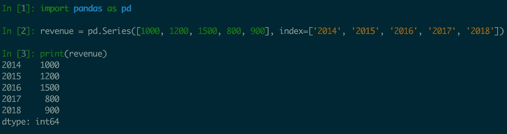

# 深入了解熊猫系列

> 原文：<https://towardsdatascience.com/gaining-a-solid-understanding-of-pandas-series-893fb8f785aa?source=collection_archive---------15----------------------->


Photo by [Stone Wang](https://unsplash.com/@stonewyq?utm_source=medium&utm_medium=referral) on [Unsplash](https://unsplash.com?utm_source=medium&utm_medium=referral)

# 议程

Pandas 的两个主要数据结构是序列和数据帧。这篇文章试图对熊猫系列有一个正确的理解。

数据帧的基础是一个系列。DataFrame 的 docstring 将 DataFrame 定义为:

```
Can be thought of as a dict-like
container for Series objects
```

dataframe 上的许多操作返回系列实例。因此，我们必须对级数有一个扎实的了解。

# 什么是系列

熊猫有两种概念。可以把它想象成一列表格数据。它也可以被想象成一行表格数据。

让我们假设有一个名为`accounting`的数据库表，它存储不同年份的`revenue`和`expenses`。

```
 year   revenue   expense
 2017   1000      800
 2018   1200      900
 2019   1500      1100
```

所有收入的集合是一个`Series`，即`[1000, 1200, 1500]`是一个数列。系列是不同对象/行/实例的相同属性的集合。

`Series`也可以被认为是表格中的一行，也就是说`[2017, 1000, 800]`也是一个系列。在这种情况下，系列是单个对象的不同属性的集合。

# 创建系列

在现实世界中，您很少会创建一个系列。您可能会获得一个 csv 或其他数据源，您可以从中读取数据。pandas 有从这些数据源读取数据的工具。

读取的数据将是熊猫数据帧。您将从数据帧中提取一些序列，并对这些序列进行操作。

这是一个简单的任务。现在，让我们明确地创建一个系列

可以使用`pandas.Series`创建一个`Series`。



我们在 ipython shell 上试试吧。

```
In [2]: revenue = pd.Series([1000, 1200, 1500, 800, 900], index=['2014', '2015', '2016', '2017', '2018'])
```

`index`关键字参数将标签分配给系列的不同值。这些标签在从系列中检索数据时很方便。

# 索引系列

让我们从这个系列中获取信息。让我们检索 2016 年的收入。

```
In [8]: revenue['2016']
Out[8]: 1500
```

系列也有两种索引方法，分别是`.loc`和`.iloc`。

`.loc`执行基于标签的索引。

```
In [9]: revenue.loc['2016']
Out[9]: 1500
```

`.iloc`执行基于整数的索引。2016 是第三个条目，即索引 2。

```
In [10]: revenue.iloc[2]
Out[10]: 1500
```

`revenue.iloc['2016']`将失败，并出现`KeyError`。`revenue.loc[2]`将失败，并出现`IndexError`。

# 切片系列

我们可以使用与列表切片相同的语法对序列进行切片。我们想从 2014 年到 2016 年分一杯羹。

```
In [17]: revenue['2014': '2016']
Out[17]:
2014    1000
2015    1200
2016    1500
dtype: int64
```

注意，返回的数据结构也是一个`pandas.Series`。

```
In [18]: type(revenue['2014': '2016'])
Out[18]: pandas.core.series.Series
```

如果要使用整数位置进行切片，就必须使用`.iloc`。整数位置只能与`iloc`一起使用。它不能与`loc`一起使用。

```
In [20]: revenue.iloc[0:3]
Out[20]:
2014    1000
2015    1200
2016    1500
dtype: int64
```

返回的对象又是一个序列。

如果我们需要多年的信息，我们必须将一个列表传递给索引语法。让我们看看 2014 年和 2017 年的收入。

```
In [23]: revenue[['2014', '2017']]
Out[23]:
2014    1000
2017     800
dtype: int64
```

我们也可以使用`revenue.loc[['2014', '2017']]`。

2014 年是该系列的第一个条目，2017 年是第四个条目。我们也可以使用`revenue.iloc[[0, 3]]`。

```
In [25]: revenue.iloc[[0, 3]]
Out[25]:
2014    1000
2017     800
dtype: int64
```

您应该已经注意到，对一个系列进行切片总是会返回另一个系列。

# 获取系列的标签

我们想要一份我们有收入的所有年份的清单。

```
In [93]: revenue.index
Out[93]: Index(['2014', '2015', '2016', '2017', '2018'], dtype='object')In [94]: list(revenue.index)
Out[94]: ['2014', '2015', '2016', '2017', '2018']
```

正如我们所见，`Series`对象有一个名为`index`的属性，它返回标签。

# 过滤系列

我们希望获得收入大于 1000 的所有年份。

```
In [50]: revenue[revenue > 1000]
Out[50]:
2015    1200
2016    1500
dtype: int64
```

我们将在下一节了解它是如何工作的。

# 使用布尔列表进行过滤

布尔列表是支持对序列进行过滤的底层机制。

我们希望获得 2014 年和 2017 年的收入。2014 定位 0，2017 定位 3。

我们必须创建一个与收入相同长度的列表，并将第 0 和第 3 个元素设置为真。

```
In [75]: l = [True, False, False, True, False] # Set 0th and 3rd element TrueIn [76]: revenue[l]
Out[76]:
2014    1000
2017     800
dtype: int64
```

我们向索引语法传递了一个布尔值列表，它过滤了这个系列，返回另一个系列。返回的序列只包含布尔列表中相应元素为真的值。

代替列表，我们可以用布尔值创建一个长度为 5 的序列，并使用带有`revenue`的布尔序列。

```
In [78]: boolean_series = pd.Series([True, False, False, True, False], index=['2014', '2015', '2016', '2017', '2018'])In [79]: revenue[boolean_series]
Out[79]:
2014    1000
2017     800
dtype: int64
```

因为我们想对收入使用布尔序列，所以我们必须确保两个序列的索引匹配。

让我们看看`revenue > 1000`给了我们什么:

```
In [80]: revenue > 1000
Out[80]:
2014    False
2015     True
2016     True
2017    False
2018    False
dtype: bool
```

它返回给我们一个序列，类似于我们显式创建的 boolean_series。

既然是一个系列，我们可以直接用这个和`revenue`做`revenue[revenue > 1000]`。这正是我们在上一节过滤中所做的。

# 更多过滤

我们希望获得收入大于 1000 但小于 1300 的所有年份。

```
In [68]: revenue[(revenue > 1000) & (revenue < 1300)]
Out[68]:
2015    1200
dtype: int64
```

# 级数的算术运算

假设我们意识到每年的收入减少了 100 英镑。我们想每年增加 100 的收入来弥补。

```
In [81]: revenue + 100
Out[81]:
2014    1100
2015    1300
2016    1600
2017     900
2018    1000
dtype: int64
```

请注意序列的每个值是如何增加 100 的。

对序列的任何算术运算都应用于序列的所有值。

# 按系列订购

我们希望按升序对收入进行排序。

```
In [87]: revenue.sort_values()
Out[87]:
2017     800
2018     900
2014    1000
2015    1200
2016    1500
dtype: int64
```

我们想按降序排列收入。

```
In [88]: revenue.sort_values(ascending=False)
Out[88]:
2016    1500
2015    1200
2014    1000
2018     900
2017     800
dtype: int64
```

我们想知道哪一年的收入最高。

```
In [92]: revenue.sort_values(ascending=False).index[0]
Out[92]: '2016'
```

`revenue.sort(ascending=False)`返回一个有序序列。由于一个系列有属性`index`，我们可以使用它并获得年度最大收入的标签。

不过，有一种更好的方法可以实现这一点。我们将在下一节看到`idxmax()`。

# 序列上的聚合

让我们找出这些年的总收入。

```
In [96]: revenue.sum()
Out[96]: 5400
```

系列有工具可以很容易地找到平均值，最大值和最小值。

```
In [102]: revenue.mean()
Out[102]: 1080.0In [103]: revenue.max()
Out[103]: 1500In [104]: revenue.min()
Out[104]: 800
```

我们想知道哪一年的收入最高。

```
In [106]: revenue.idxmax()
Out[106]: '2016'
```

# 序列的分组和聚合

让我们假设某一年的收入可能有多行。

```
In [2]: revenue_with_multiple_entries = pd.Series([1000, 1200, 1500, 800, 900, 500], index=['2014', '2015', '2016', '2017', '2018', '2017'])In [3]: print(revenue_with_multiple_entries)
2014    1000
2015    1200
2016    1500
2017     800
2018     900
2017     500
dtype: int64
```

我们有多行 2017 年收入。我们想知道不同年份的总收入。

我们可以通过做一个`groupby`然后做一个`sum`来实现它。

```
In [4]: revenue_with_multiple_entries.groupby(revenue_with_multiple_entries.index).sum()
Out[4]:
2014    1000
2015    1200
2016    1500
2017    1300
2018     900
dtype: int64
```

# 数列的最常见值

让我们创建一系列班级学生的名字。

```
In [6]: names = pd.Series(['steve jobs', 'bill gates', 'mark twain', 'charles darwin', 'charles dickens', 'mark zuckerberg', 'charles darwin'])In [7]: print(names)
0         steve jobs
1         bill gates
2         mark twain
3     charles darwin
4    charles dickens
5    mark zuckerberg
6     charles darwin
```

你应该已经注意到了，我们没有给这个系列提供明确的`index`。所以会自动分配一个整数标签。

我们来找一个最常见的名字。

```
In [10]: names.value_counts()
Out[10]:
charles darwin     2
bill gates         1
mark zuckerberg    1
mark twain         1
steve jobs         1
charles dickens    1
```

# 系列上的字符串操作

让我们找出所有以`mark`开头的名字。

```
In [16]: names[names.str.startswith('mark')]
Out[16]:
2         mark twain
5    mark zuckerberg
dtype: object
```

`names.str.startswith('mark')`返回一个布尔数组，我们将该数组传递给索引语法以过滤序列。

熊猫系列有`str`属性，允许执行字符串操作。

# 运用方法

Series 有一个叫做`apply`的方法，允许进行高级过滤。

我们想找到所有姓氏为`darwin`的名字。

```
In [27]: names[names.apply(lambda x: x.split(' ')[-1] == 'darwin')]
Out[27]:
3    charles darwin
6    charles darwin
dtype: object
```

`apply`方法需要一个函数传递给它。这就是为什么我们给它传递了一个 lambda 函数。

调用 names.apply()将 lambda 函数应用于序列的所有值。`.apply()`的返回值是布尔值的一个`series`。

```
In [26]: names.apply(lambda x: x.split(' ')[-1] == 'darwin')
Out[26]:
0    False
1    False
2    False
3     True
4    False
5    False
6     True
dtype: bool
```

我们使用布尔型`series`来过滤原始系列。

在 [Twitter](https://twitter.com/_akshar) 上与我联系，我[在 Twitter 上发布](https://twitter.com/_akshar)关于信息丰富且有价值的编程文章和建议。