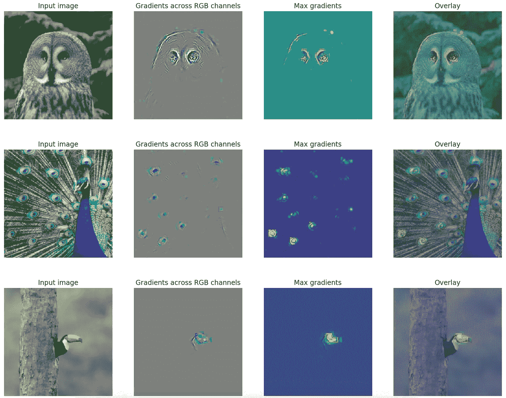

# 使用 FlashTorch 深入了解迁移学习

> 原文：<https://towardsdatascience.com/gaining-insights-on-transfer-learning-with-flashtorch-de344df0f410?source=collection_archive---------45----------------------->

## PyTorch 中用于神经网络的开源特征可视化工具包

Visualisation of what AlexNet “sees” in these images of birds, using FlashTorch. [Source](/feature-visualisation-in-pytorch-saliency-maps-a3f99d08f78a)

# 设置场景

在我的[上一篇文章](/feature-visualisation-in-pytorch-saliency-maps-a3f99d08f78a)中，我概述了**特征可视化**作为一个研究领域，并介绍了`FlashTorch` — *一个用于 PyTorch 内置神经网络的开源特征可视化工具包*。

该软件包可以通过`pip`进行安装。查看 [GitHub repo](https://github.com/MisaOgura/flashtorch) 获取源代码。你也可以在 Google Colab 的笔记本上使用它，而不需要安装任何东西！

# 使用闪光灯进行特征可视化

[在之前的](/feature-visualisation-in-pytorch-saliency-maps-a3f99d08f78a)中，我向你展示了如何使用`FlashTorch`来可视化卷积神经网络(CNN)在输入图像中“感知”了什么。我是通过从 AlexNet 创建显著图**来做到这一点的，Alex net 在 ImageNet 分类任务上进行了预训练。我从任务中挑选了三个类别(大灰猫头鹰、孔雀和巨嘴鸟),并使用这些类别的图像来检查*Alex net 在识别这些对象时已经学会了如何在图像中最集中注意力*。**

本质上，我选择了一个我*知道*会在我要求它做的事情上表现良好的网络，并检查了它的感知:我希望我们**将我们的注意力从只关注测试精度**转移到**开始询问**这个网络*实际上*在做什么。

> *什么是神经网络*感知*？*
> 
> 为什么*会这样？*
> 
> 我们如何解释它的决定/预测？

我创造了`FlashTorch`来让回答这样的问题变得更容易。而且这些问题*不是*只是针对你有表现良好的网络的时候！

事实上，网络表现不尽如人意的情况更为常见。但是在这里，我们经常被准确性所困扰。当我们看到糟糕的表现时，我们倾向于直接进行培训，而没有花太多时间去理解*为什么它表现如此糟糕。*

我可以帮你做到这一点，我想在**迁移学习**的背景下用一个例子来演示一下。

# 迁移学习

[机器学习中的迁移学习](https://papers.nips.cc/paper/5347-how-transferable-are-features-in-deep-neural-networks)是*知识转移*的一种形式——一种在一项任务上训练的模型被用于另一项任务的方法，通常作为起点。新任务所需的额外培训量取决于原始&新任务的相似性、培训数据的可用性等。

Traditional Learning vs Transfer Learning. [Source](/a-comprehensive-hands-on-guide-to-transfer-learning-with-real-world-applications-in-deep-learning-212bf3b2f27a)

迁移学习经常在[计算机视觉](http://cs231n.github.io/transfer-learning/)和[自然语言处理](/deep-transfer-learning-for-natural-language-processing-text-classification-with-universal-1a2c69e5baa9)任务中使用，因为它通过利用之前的培训帮助我们节省计算/时间资源。

例如，在 ImageNet (1000 个类)上训练的网络可以在没有太多额外训练的情况下重新用作狗识别器。或者，可以将在大型文本语料库(例如来自 Google 的 [Word2Vec](https://code.google.com/archive/p/word2vec/) )上训练的单词嵌入引入另一个深度神经网络，以从新的语料库中提取单词的向量表示。

# ImageNet →花卉分类器

为了测试迁移学习的能力，我决定使用 [102 类别花卉数据集](http://www.robots.ox.ac.uk/~vgg/data/flowers/102/index.html)将 [DenseNet](https://arxiv.org/abs/1608.06993) (在 ImageNet 任务上预先训练过)制作成花卉分类器。

事实证明，在没有任何进一步训练的情况下，该模型的表现*非常糟糕*——高达 0.1%的测试精度！如果你已经算过了…我自己随机猜会更好。

直觉上，这也许是有道理的。原始 ImageNet 数据集中只有少数花卉类，因此不难想象让模型识别 102 种花卉是一件轻而易举的事情。

直觉很好，但是我想在继续训练之前把它具体化。

让我们使用`FlashTorch`来创建显著图，并可视化网络是什么(*不是*)看到的。我们将用这张毛地黄的图片作为例子。

这里我们可以欣赏的是，网络，不需要额外的训练，就是*关注花杯的形状*。但是有许多花有相似的形状(例如，想想风信子)。

对于我们人类来说，很明显(即使我们不知道这个物种的名字)，这种花的独特之处在于花杯内的**斑驳图案**。但是，网络目前的*除了花的大致形状之外，不知道在哪里关注*，因为在旧任务(ImageNet 分类)中从来没有真正需要过。

既然我们已经了解了*为什么*网络表现不佳，我觉得已经准备好训练它了。最终，经过反复试验，经过训练的模型成功实现了 98.7%的测试准确率。

这太好了！…但是*我们能解释为什么*吗？

网络现在*看到的*是什么，以前不是？

很不一样，对吧？

网络*学会了*不太关注花的形状，而强烈关注那些斑驳的图案:)

显示*神经网络已经学会的*是有用的。将它带到另一个层次，并解释神经网络如何学习的过程是特征可视化技术的另一个强大的应用。

# 向前一步(不是走开！)从准确性

利用**特征可视化**技术，我们不仅可以更好地理解神经网络对物体的感知，而且*我们还能更好地*进行:

*   诊断网络出了什么问题以及*为什么*
*   发现并纠正算法中的*偏差*
*   从只看准确性向前迈一步
*   理解网络行为的原因
*   阐明神经网络如何学习的机制

# 今天就使用闪光灯吧！

如果你有在 PyTorch 中使用 CNN 的项目，`FlashTorch`可以帮助你*使你的项目更易理解和解释。*

如果用了请告诉我你的想法！我将非常感谢您的建设性意见、反馈和建议🙏

谢谢，祝编码愉快！