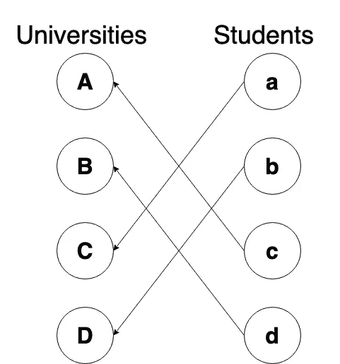

# gale-Shapley 算法简单解释

> 原文：<https://towardsdatascience.com/gale-shapley-algorithm-simply-explained-caa344e643c2?source=collection_archive---------4----------------------->



从这篇文章中，你将了解稳定的配对或稳定的婚姻问题。你将学习如何使用[博弈论](https://en.wikipedia.org/wiki/Game_theory)和[盖尔-沙普利算法](https://en.wikipedia.org/wiki/Stable_marriage_problem)来解决这个问题。我们将使用 Python 来创建我们自己的解决方案，使用 1962 年原始论文中的定理。

# 什么是稳定的婚姻或配对问题？

在现实世界中，有些情况下我们会面临配对问题:学生选择他们未来的大学，男人和女人互相寻求建立家庭，互联网服务需要在最短的时间内与用户连接。在所有这些情况下，我们都需要创建满足特定标准的稳定对。我们可以把(A，A)的*稳定对*想象成一对，其中没有 **A** 或 **a** 有任何更好的选择。

理解它的最好方法是解决实际的例子，我可以推荐《博弈论的洞察》这本书，它包含了大量你可以在纸上解决的练习。但是这里我想用 Python 来解决这个问题:)

# 问题定义:

在我们的例子中，我们将有两个组，女性和男性。女性名字会以大写字母开头: **A、B、C、D** 而男性以小写后者: **a、B、C、d** 。我们需要创造稳定的组合。在此之前，我们做了一个调查，收集一些信息作为我们的出发点。他们每个人都被要求根据个人的同情心给异性排序。其中 1 个是他们最喜欢的人，4 个是他们最不喜欢的人。

比如女人 A 这样回答: **d，c，A，b**

在 python 中，我们可以创建两个数据框男性和女性:

在数据框中，为了方便起见，用数字代替了等级。例如，如果我们想知道女性 **A** 的偏好，我们可以读取女性数据框中的列 **A** :分别为男性 **a、b、c、d** 的 **3、4、2、1** 。如果我们想知道男性 **a** 的偏好，我们可以读取男性数据框中的 **a** 行: **1、2、3、4** 分别对应女性 **A、B、C、D** 。

因此，一对男女可以表示为一对数字，例如，对 **A** 和 **a** 将创建一对数字(3，1)。对女人来说，T4 是第三位，但对男人来说，女人是第一位。

因此，在这种情况下，男人 **a** 完全快乐，但是女人 **A** 可以尝试与她名单中更高的人创造一对，例如，男人 **c，**如果对于 **c 而言****与 **A** 创造一对比与他当前的伴侣创造一对更好，那么这两对都会崩溃并创造新的一对。**

**这就是不稳定配对的一个例子，在这种配对中，一个或两个参与者可以改善情况，但会为他们创造更好的配对。**

**所以任务是为所有参与者找到稳定的配对。事实证明有一种方法可以达到平衡！**

# **Python 中的 Gale-Shapley 算法**

**大卫·盖尔和劳埃德·沙普利证明了当两个集合相等时，总有办法产生稳定的配对。我推荐阅读原文[2]来熟悉他们提供的优雅证明。**

**Python 中有不同的 Gale-Shapley 算法实现[3，4，5]，让我们创建一个更接近伪代码解决方案的算法，而不是进入复杂的 OOP。**

**伪代码解决方案看起来是这样的[6]:**

```
**function** stableMatching {
    Initialize all *m* ∈ M and *w* ∈ W to *free*
    **while** ∃ *free* man *m* who still has a woman w to propose to {
       w = first woman on m’s list to whom m has not yet proposed
       **if** w is *free*
         (m, w) become *engaged*
       **else** some pair (m', w) already exists
         **if** w prefers m to m'
            m' becomes *free*
           (m, w) become *engaged* 
         **else**
           (m', w) remain *engaged*
    }
}
```

**在 Python 中，我能够创建这个解决方案:**

# **总结:**

**博弈论非常有趣，因为它是根据现实世界的情况来操作的。而且它在大多数时候也不需要复杂的数学仪器，尤其是在合作游戏中。**

**关于 Gale-Shapley 算法有很多东西我们没有触及:男性人数不等于女性人数时的一般情况以及这个算法可能需要多少次最大迭代。**

**在看了开源解决方案后，我确信我将能够创建更简约甚至更 Pythonic 化的解决方案。但是我结束了一个相当混乱的*而*周期...🤷‍♂️**

## **你认为盖尔-沙普利算法最 Pythonic 化的写法是什么？**

# **参考资料:**

1.  **《对策论的洞见:另一种数学体验》，剑桥大学出版社，即将出版，与 Ein-Ya Gura 合著**
2.  **Gale D .、Shapley L.S. [大学录取与婚姻的稳定性](http://www.eecs.harvard.edu/cs286r/courses/fall09/papers/galeshapley.pdf) //美国数学月刊。1962.第 69 卷。第 9-15 页。**
3.  **[https://rosettacode.org/wiki/Stable_marriage_problem#Python](https://rosettacode.org/wiki/Stable_marriage_problem#Python)**
4.  **[https://pypi.org/project/matching/](https://pypi.org/project/matching/)**
5.  **【https://github.com/QuantEcon/MatchingMarkets.py 号**
6.  **【https://en.wikipedia.org/wiki/Stable_marriage_problem **