# 非数学家的伽罗瓦理论

> 原文：<https://towardsdatascience.com/galois-theory-for-non-mathematicians-3bc08cd40c4a?source=collection_archive---------1----------------------->

## 一个少年如何发明了一个新的数学分支来解决一个长期悬而未决的方程问题

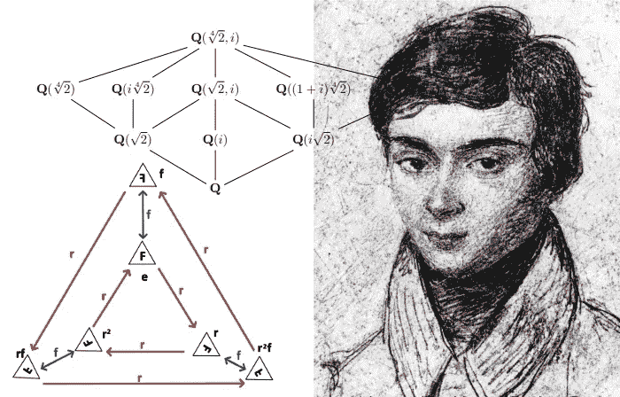

[Image from Wikipedia](https://upload.wikimedia.org/wikipedia/commons/thumb/5/53/Evariste_galois.jpg/440px-Evariste_galois.jpg) and [Keith Conrad](https://kconrad.math.uconn.edu/blurbs/galoistheory/galoiscorrexamples.pdf)

你可能知道，要解一个 2 次方程，a *x +bx+c = 0，*我们用的是二次公式。

对于 3 次和 4 次方程存在类似的公式，但是对于 5 次或更高次，它们神秘地消失了。更具体地说，似乎我们不能只用加法、减法、乘法、除法和根式(平方根、立方根等)来构造五次或更高次的解。为什么，数字 5 有什么特别的？这些问题在 19 世纪早期一直困扰着年轻的法国人[埃瓦里斯特·伽罗瓦](https://www.wikiwand.com/en/%C3%89variste_Galois)，在他在一场决斗中受致命伤的前一天晚上，他写下了一个新的数学对象“群”的理论，以一种令人惊讶的优雅方式解决了这个问题。

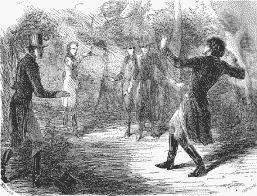

Galois being shot in a duel. [Image from Wikimedia.](https://commons.wikimedia.org/wiki/File:Duel_pistolet.JPG)

这就是他做这件事的方法。

# TL；速度三角形定位法(dead reckoning)

不同方程的根的集合具有不同的复杂性。有些集合非常复杂，以至于不能只用简单的物体如部首来表达。但是如果我们甚至不能计算它们，我们如何测量根的复杂性，我们应该使用什么样的复杂性度量？

# 置换根和对称性

答案在于根的对称性。

你可能会问，这有什么关系？这到底是什么意思？

让我们画出两个方程的根，看看我们是否能理解它:

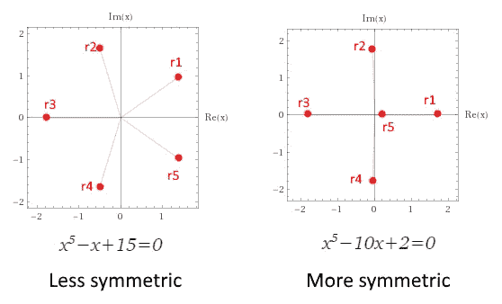

Images from [WolframAlpha](https://www.wolframalpha.com/)

据说左边的没有右边的对称。这可能会让你感到惊讶，因为在这个词的口语意义上，如果一个人可以反射或旋转物体而不改变其外观，通常会使用对称。从这个意义上说，左图看起来更对称。

例如:星星比心脏更对称，因为除了反射它之外，还可以旋转它。

Image inspired by [Pinterest](https://i.pinimg.com/originals/18/bf/74/18bf74122f93eb5281469e3793c26f51.jpg)

但是在我们的例子中，我们将对对称性有一个更一般的看法。我们不仅仅局限于反射和旋转，任何改变物体外观的功能都是公平的。对于根，这意味着任何以任何方式交换(置换)根的函数都是有效的。更多的功能意味着更对称。

事实证明，在正确的情况下，有函数可以按照任何可以想象的顺序排列所有的根，多达 *5 个！=120* ，所以高度对称。但是在左边的例子中，如果我们使用变换互换*r*₂*↔r*₄*i↔−i*我们必然也互换 *r* ₁ *↔r* ₅.这限制了我们，因此所有可能的排列都不可能。它不太对称。

置换根的函数称为“自同构”，如果我们将这些自同构组合在一起，我们就得到所谓的“群”(稍后我将回到自同构和群的更好的定义)。

这意味着在正确的情况下，代表根的对称性的组更大更复杂。事实上，右例中的组非常复杂，以至于不能用部首来描述根。

我们怎么知道一个群体有多复杂？为了理解这一点，我们需要更多的理论。

## 五分位数的大小

首先，我们来看看一个群体的规模。我怎么知道有些五次方有一个 *5！*大集团？

一般的五重奏通常是这样的:

*x⁵+ax⁴+bx +cx +dx+e=0*

但是如果我们采用一种更“以根为中心”的方法，我们可以说它看起来像这样:

*(x−r₁)(x−r₂)(x−r₃)(x−r₄)(x−r₅)=
x⁵−(r₁+r₂+r₃+r₄+r₅)x⁴+
(r₁r₂+r₁r₃+r₁r₄+r₂r₄+r₃r₄+r₁r₅+r₂r₅+r₃r₅+r₄r₅)x……r₁r₂r₃r₄r₅=0*

也就是说，第一个等式中的常数 *a，b，c，d，e* 被替换为根的对称组合:

*r₁+r₂+r₃+r₄+r₅=a
r₁r₂+r₁r₃+r₁r₄+r₂r₄+r₃r₄+r₁r₅+r₂r₅+r₃r₅+r₄r₅=b
(为简洁起见省略了 c 和 d)
r₁r₂r₃r₄r₅= e*

仔细观察所有的项，你会发现交换根并不影响等式(例如，试试上面的 *b* )。对于任何次数的多项式都是如此。由于我们能够交换所有的根，我们可以得出结论，这个一般的五次对称群实际上是所有的置换，也称为 s₅(5 阶对称群)。

# 域和自同构

现在我们要扩展一下自同构的定义，因为它们不仅仅是置换根的函数。在这个过程中我们需要引入一个叫做“场”的东西。你会说，我们为什么要这么做？原因是，虽然处理根和它们的排列很有趣，但是处理场和它们的自同构更容易一些。这是完全相同的功能，不要担心，只是看它们的另一种方式。

所以，如果等式是，比如说 x–2 = 0，我们将引入字段**(√2)*，而不是处理根、*、*【r₂=−√2】和*。这是所有的有理数 ***Q*** 加上一个 *√2* 。 *√2* 称为“场扩展”。看起来是这样的: *a+b√2 a，b∈* ***Q*** 。为了能够描述方程的根，我们需要字段***Q****(√2)*。对于每个域扩展(以及其他数学对象)，我们有一堆函数，σₙ，它们将一个数发送给同一域中的另一个唯一数，并遵循条件 *σ(a+b)=σ(a)+σ(b)* 和 *σ(ab)=σ(a)σ(b)* 。 *σ* 是扩展的函数，不触及底层字段 ***Q*** 。这些函数称为自同构。顺便说一下，他们也允许根。这是因为对于根 *r* :**

***r⁵+ar⁴+br+Cr+dr+e=0⟹
σ(r⁵+ar⁴+br+Cr+dr+e)=σ(0)⟹
σ(r)⁵+aσ(r)⁴+bσ(r)+cσ(r)+dσ(r)+e = 0(*自 *σ* 不触及 ***Q*** (其中 *a、b、c、d、e* 住))**

**这意味着 *σ(r)* 也是方程的一个解。因为:**

***σ(r₁)−σ(r₂)=σ(r₁)+σ(−1)σ(r₂)=σ(r₁−r₂)≠0***

**词根分明，所以我们有 5 个，一定是原来的 5 个。因此 *σ* 必须置换根。**

**当然，这适用于任何次数的方程。**

**因此:**

1.  **我们有自己的方程式。**
2.  **那个方程有一个域，可能包含几个根式的延伸**
3.  **那个域扩张有一个群，是它的所有自同构的集合。**

# **三度的两个例子**

## **示例 1**

**等式:*x x 2x+2 = 0***

**根是( *1，√2，–√2*)(你只要插上就可以自己验证这个了)，所以字段一定是***Q****(√2)***

**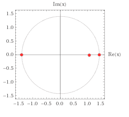**

**From [WolframAlpha](https://www.wolframalpha.com/)**

**写下我们能想到的所有排列根的方法( *e* 表示单位排列，它没有任何作用):**

***(e)
(√2↔–√2)
(1↔√2)
(1↔–√2)
(√2→√2 和 1→√2)
(√2↔−√2 和 1↔−√2)***

**来测试一个:设 *(√2↔−√2)* 为 *σ₁* :**

***σ₁(√2+−√2)=σ₁(0)=0=σ₁(√2)+σ₁(−√2)
σ₁((√2)(−√2))=σ₁(−2)=−2=σ₁(√2)σ₁(–√2)***

**到目前为止一切顺利。又一个。**

**让 *(1↔√2)* 成为 *σ₂* :**

***σ₂(√2+−√2)=σ₂(0)=0≠σ₂(√2)+σ₂(−√2)=1+−√2
σ₂((√2)(−√2))=2≠σ₂(√2)σ₂(−√2)=1(−√2)***

**显然 *σ₂* 不是一个自同构，所以我们将不得不放弃它。其他的 *σ* 也遇到了类似的问题，剩下的只有 *e* 和 *σ₁* 。这被称为循环群 C *₂* ，因为我们只能在一个循环中置换(在这种情况下是一个很小的循环)。**

## **示例 2**

**等式:x 2 = 0**

**根是**

****

**所以字段必须是**

****

**为简洁起见，使用 *ζ* 。这是它的样子:**

****

**From [WolframAlpha](https://www.wolframalpha.com/)**

**人们可以稍微摆弄一下根排列，很快就会注意到在这种情况下它们都是自同构的。于是就有了 *3！*自同构，即所有的根置换，所以群一定是 *S₃* 。**

**关于上面的图像，另一个有趣的事情是，它看起来像一个等边三角形，并且自同构正好对应于旋转和反射三角形。如果自同构以这种方式对应于正多边形的对称性，则该群称为“二面体群”。在这种情况下 *D₃* 。通常所有排列的群 *Sₙ* 和二面体群 *Dₙ* 是不一样的，但是在 *n=3* 的情况下是一样的。**

# **组**

**这似乎是一个很好的地方，可以继续进行关于组的更长的讨论。所以，群最初是根的排列的集合，但也可以看作是自同构的集合，或者对称几何对象的旋转和反射。任何改变一个对象使其看起来相同的函数集合都可以被认为是一个组。但是，我们实际上可以看到变换本身，而不必担心它们所作用的对称对象。就像我们做算术时不用担心成堆的苹果一样，我们只是简单地遵循规则，类似地，我们可以定义一些规则，一个组的变换遵循这些规则，并使用它们。**

**规则大概是这样的:**

**如果我们先做一个变换，然后再做一个，我们会得到第三个变换，它仍然在这个组中。例如， *C₄* 群是一个人在正方形上可以做的所有旋转的群。如果 a 正在旋转 *90∘* ，b 正在旋转 *180∘* ，c 正在旋转 *270∘* ，那么*a∫b = c*。这里的意思是，先做 b，再做 a，通常称为乘法，因为它(有点)类似于数字的乘法。根据上面的规则，c 必须在组中。这就叫完结。**

**必须有一个身份元素 *(e)* 不做任何事情。**

**每个元素都有一个相反的元素。**

**现在，我们可以研究不同组的特征，而不必担心根或多边形。**

# **可视化群组**

**可视化组两种有趣的方法是:**

## **凯莱表**

**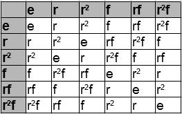**

**Image inspired [Wikipedia](https://www.wikiwand.com/en/Cayley_table)**

**上面是等边三角形的凯雷表， *D₃* 组。就是这个组的所有元素，以及我们把它们相乘得到什么元素。例如，如果我们首先做一个 *120∘* 旋转 *(r)* ，然后再次做同样的旋转，我们得到一个 *240∘* 旋转 *rr=r* ，如表中所示。如果我们做一个 120∘旋转翻转 *rf* 和一个 *r* 我们最终只是翻转。请注意元件 *f* 和 *r* 不交换。元素交换的群称为阿贝尔群。**

**这个特殊的表仍然是非常对称的，但是不需要这样。遵循规则的元素周围的任何加扰都是有效的。**

## **凯莱图**

**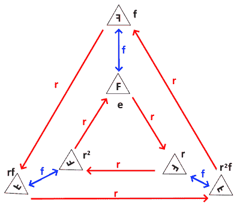**

**Image inspired by [wikimedia](https://upload.wikimedia.org/wikipedia/commons/thumb/9/97/Dih_4_Cayley_Graph%3B_generators_a%2C_b.svg/440px-Dih_4_Cayley_Graph%3B_generators_a%2C_b.svg.png)**

**以上是 *D₃* 凯莱图。这里的元素以某种方式显示，显示如何从一个元素到下一个元素，其中边是操作。在这种情况下， *120∘* 旋转和翻转是必要的，这些( *r* 和 *f* )也被称为群的生成器，因为可以用它们从单位元素开始生成整个群。**

## **组的用法**

****

**Image from [Wikipedia](https://upload.wikimedia.org/wikipedia/commons/thumb/e/ef/SymBlend_p6m.svg/440px-SymBlend_p6m.svg.png)**

**在对称的地方，群体往往是有用的。例如，壁纸组用于描述对称壁纸。有一些壁纸可以旋转 180∘和一些壁纸可以反映和一些我们可以做到这两者，等等。原来只有 17 种，所以这是一种很好的壁纸分类方式。**

**以上壁纸都属于一个叫 *p6m* 的群体。**

**另一个更令人惊讶的是，群体的用途是在物理学中。似乎自然法则遵循一定的对称性。例如，如果一个人变换牛顿第二定律 F=ma，10 分钟后还是一样。自然法则一天不变，似乎表明它们在时间转换方面是对称的。它们也不会从一个地方改变到下一个地方，所以空间的转换也是允许的。因为时间和空间可以变换成任意大小的块，所以描述这些块的群，李群，包含了无限多的元素。**

**有趣的是，这些对称性都与一个守恒定律有关。时间对称意味着能量守恒，空间对称意味着动量守恒，角对称意味着角动量守恒，等等。艾米·诺特通过将对称性与最小作用原理相结合证明了这一点，最小作用原理是一条自然法则，它表明自然倾向于“走最短的路”。**

**我觉得有趣的是，大自然的所有复杂和明显的混乱有多少可以用“自然法则不会每天都改变”和“自然倾向于走最短的路”这样的直观概念来解释。**

# **返回字段**

**间奏曲结束，我们说到哪了？对，我们在讨论*x3*= 0 及其根和场。**

**该方程的场是 **Q** ( √2，ζ)，很自然地认为它看起来像这样:a+b √2+cζ，但这是错误的。这样做的原因是我们希望我们的领域是“封闭的”。也就是说，如果我们将场中的两个元素相加或相乘，我们希望它们留在该场中。例如√2 和ζ都在上面的区域，但是√2ζ不在。**

****

# **子字段和子组**

**看一下上面 3 级的例子，我们有**

****

**第二个域和组似乎比第一个域和组更复杂。我们可以通过计算场情况下的项数或群情况下的自同构数来猜测这一点。但是仅仅计数似乎并不能真正抓住复杂的含义。以小组 *C₁₂* 为例。很多元素，但它只是旋转了根，所以看起来并不复杂。一个对应的字段是***q****(e^π/6)*。它将包含 e^π/6,e^2π/6…，但同样不会很复杂。**

**记住，担心一个群体有多复杂是理解为什么有些根不能只用偏旁部首来描述的关键。**

**为了更好地理解复杂性，我们将引入“子场”和“子群”的概念。子字段是指当你删除一些术语，但你仍然有一个封闭的字段。类似地，子群是当你去掉一些自同构，但仍然有一个封闭群。**

**第一种情况 ***Q*** *(√2)，*唯一能做的就是去掉场中的 *√2* 和群中的两个自同构中的一个(我们不能去掉 *(e)* 仍然有群)。**

**至于第二种情况 ***Q*** *( √2，ζ)* ，就变得有点复杂了。可以通过一次仅移除一个元素来手动提取子字段/组，并查看结果字段/组是否是封闭的。过了一会儿，我们得出这样的结论:**

**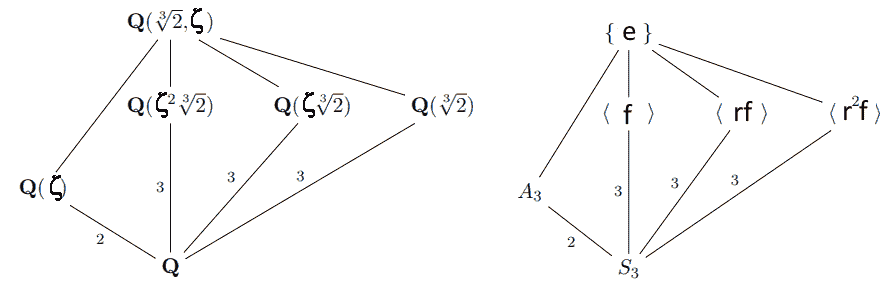**

**Images by [Keith Conrad](https://kconrad.math.uconn.edu/blurbs/galoistheory/galoiscorrexamples.pdf)**

**有趣的是，场和组都有四个组成部分。现在，一个合理的猜测是子群总是包含子域的自同构。但是他们没有。**

# **固定字段**

**别担心，我们就快到了，只是稍微复杂一点。要了解这一点，我们来看看字段 ***Q*** *(⁴√2，我)*及其子字段。**

**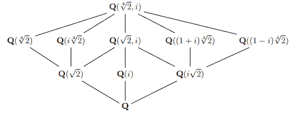**

**Image by [Keith Conrad](https://kconrad.math.uconn.edu/blurbs/galoistheory/galoiscorrexamples.pdf)**

**字段 ***Q*** *(⁴√2，i)* 具有置换群 D₄(与正方形相同)。让我们看看 *D₄* 及其子群。**

**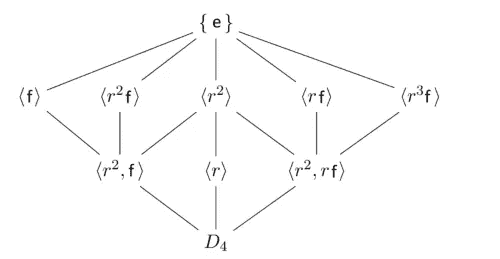**

**Images by [Keith Conrad](https://kconrad.math.uconn.edu/blurbs/galoistheory/galoiscorrexamples.pdf)**

**在这幅图中，子群晶格是颠倒的，D₄在底部，我将很快谈到这一点，但让我们先来看看子群的子域。 ***Q*** *(⁴√2，i)* 有 5 个大的子场和 3 个小的子场，而 *D₄* 只有 3 个大的子场和 5 个更小的子场。**

**似乎没有足够大的组来排列 5 个大字段。如果你想研究子组和子字段，你最终会得出这样的结论:子组实际上置换的不是子字段，而是不在子字段中的所有东西，它们“固定”或不接触子字段。**

**所以比如 *(f)* 修复***q****【⁴√2】**(r，f)* 修复***q****(√2)*。**

**为什么像我们最初猜测的那样，是这样而不是反过来？**

**我没有一个直观的方法来解释这个问题，我的看法是，我们凭经验发现了它，现在我们可以尝试证明它。证据大概是这样的:**

# **伽罗瓦理论手动波动基本定理证明草图**

**我们想证明，如果我们把子群格颠倒过来，我们得到与子域格一一对应，其中域是群的固定域。**

**首先，我想指出，这种情况是合理的。在底部的组中，我们有所有的自同构，它们当然围绕着除了 ***Q*** (修复 ***Q*** )之外的所有东西移动，在顶部，我们只有 e-自同构，它不围绕任何东西移动(修复所有东西)。**

**如果我们从底部群开始，去掉几个自同构，去掉的自同构将不再围绕一小部分场移动，因此将固定那部分场。随着我们移除更多的自同构，越来越多的场将不受影响，因此我们将有一个更大的固定场。**

**更严格地说，我们需要能够比较团队和领域的规模。当然，群的大小就是其中自同构的个数。字段的大小是术语的数量。这两个恰好相同，但为什么会这样呢？**

**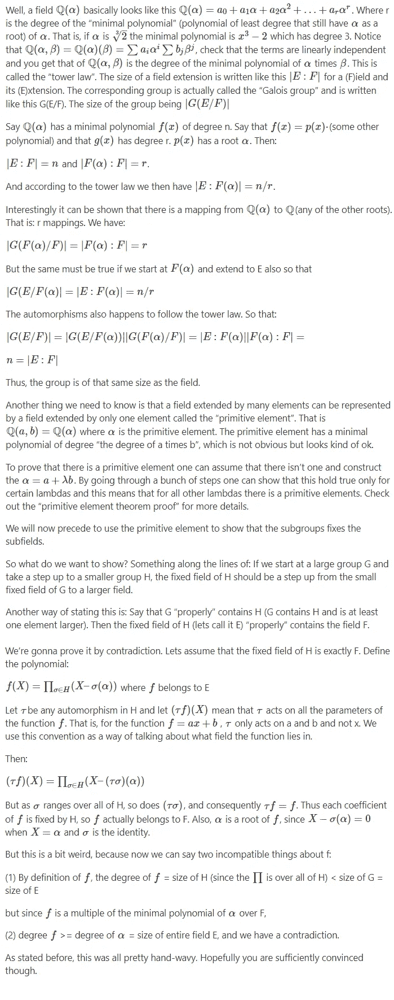**

# **商**

**现在，我们可以看看五次的 S₅子群晶格，看到它看起来确实很复杂。但是为了把这和部首联系在一起，我们需要一种方法来分析群和它的子群之间的复杂性。那就是:举例来说，D₄比 C₄复杂多少？为此，我们引入了“商”的概念。商基本上就是群除。这是怎么回事？**

**在普通的除法中，我们做这样的事情:将 15 个苹果分成 5 个人，我们将苹果集中的苹果分成 5 等份，每一份对应一个人。问题 15/5 的答案是 3，其中一堆，任何一堆都可以，因为它们相等。**

**当我们分组时，类似的事情也会发生。为了将 D₄除以 C₄，我们将 D₄的 8 种元素分成 4 个相等的组，C₄.的每种元素一组我们如何使各组平等？并不是所有的元素都是相同的苹果。例如，它们可以是非常不同的自同构。因为这个原因，商并不总是可能的。但有时一个组可以分成“陪集”。假设我们把 D₄分成 4 等份，每份 2 个元素。如果幸运的话，我们可以有 4 堆元素，其中所有堆中两个元素之间的关系都是相同的。为了做到这一点，原始群体必须表现出高度的自我相似性。要了解这一点，让我们来看看 D₄.的凯莱曲线图**

**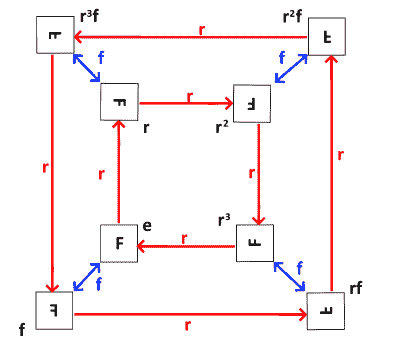**

**Image inspired by [wikimedia](https://upload.wikimedia.org/wikipedia/commons/thumb/9/97/Dih_4_Cayley_Graph%3B_generators_a%2C_b.svg/440px-Dih_4_Cayley_Graph%3B_generators_a%2C_b.svg.png)**

**正如你所看到的，事实上这里有高度的自相似性。左上角、右上角、左下角和右下角看起来都一样。这是我们的陪集。**

**所以 D₄/C₄基本上是 C₂.的陪集之一因此:D₄/C₄=C₂.**

**现在，通过引入商，我们实际上有了一个如何从头开始建立群体的概念。正如 21 由 3 和 7 组成一样，群也由它们的子群组成。正如我们可以通过除法得到一个数的组成，21/7=3，所以我们可以通过商得到一个组的组成。因为 D₄/C₄=C₂，这意味着如果我们有一个 C₄群，我们必须乘以 C₂得到 D₄.由于字段和组之间存在对应关系，这将在我们如何构造字段时发挥作用。**

# **激进分子**

**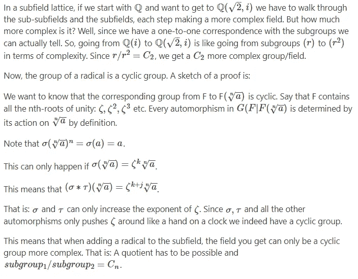**

# **五元组的子组**

**现在，我不会展示 S₅的群格的图片，因为它太大了，但是我会说一些关于它的子群的事情。其中一个分组是 *A₅* (交替组)，很容易检查。为了从 A₅的*到 S₅的*，我们需要 S₅/A₅=C₂的*。因此，我们可以通过根来达到目的，但是:A₅的一个子群是 A₅/e 的循环群。顺便说一下，这对于任何一个 n≥5 的 An 都是成立的。因此，我们不能通过根来达到目的，唉，任何次数≥5 的多项式都不能通过根来求解。*****

**这就是十几岁的伽罗瓦如何发明了群的概念来证明一个长期存在的关于五次⁹的不可解性的公开问题。**

# **三等分角**

**我们从围绕伽罗瓦理论的机器中得到一个有趣的额外事实，在这种情况下，领域的塔定律，是一个自古希腊以来就困扰人类的问题的很好的证明，即:不可能用直尺和指南针将一个角分成三份。显然，希腊人喜欢用这种方式绘画，并对这种方法的局限性感到好奇。**

**一个例子是在另外两个点中间找到一个点。要做到这一点，把指南针放在两个点上，先围绕一个点画一个圆，然后围绕另一个点。用直尺作为尺子，在两点之间画一条线，然后在两个圆相交的点之间画一条线。中间是线交叉的地方。**

**但是这种作图方式如何转化为场论呢？嗯，我们可以把上面的问题看成，假设我们有一个两点的场， *(x₁,y₁)* 和 *(x₂,y₂)* 。我们希望扩展该字段，使其也包含中间点。为此，我们找到圆的交点 *(x−x₁) +(y−y₁) =r* 和 *(x−x₂) +(y−y₂) =r* 。我们得到两个新点 *(x₃，y₃)* 和 *(x₄,y₄)* 。他们之间的界线是*y=(y₄−y₃)/(x*₄*−x₃)x*前两点之间的线是 *y=(y₂−y₁)/(x₂−x₁)x* 。求解 x 得到它们的交点。**

**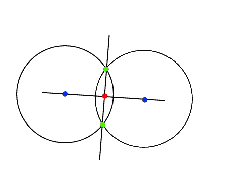**

**Image inspired by [Visual Group theory](https://www.youtube.com/watch?v=8k5AJoqHZJ4&list=PLwV-9DG53NDxU337smpTwm6sef4x-SCLv&index=37)**

**显然，直尺和圆规的构造相当于解一次和二次方程。**

**但是三等分一个角等于什么呢？**

**三倍角公式得出:**

****

**但是由于使用直尺和圆规与解一维和二维方程是一样的，所以对于一次运算来说，唯一可能的域扩展是 2，然后使用新的点，我们可以得到 2 的幂: *4，8，16* 等，但永远不会是 3。**

**虽然只使用直尺和圆规不可能将角度分成三份，但使用折纸术是可能的。**

# **求解一般五次方程**

**应该说，虽然一般的五次项不能用根式求解，但可以用“[雅可比θ函数](http://mathworld.wolfram.com/JacobiThetaFunctions.html)”来求解。**

# **参考**

1.  **初学者的伽罗瓦理论:历史透视。约尔格·贝维尔斯多夫**
2.  **[http://pi.math.cornell.edu/~kbro...](http://pi.math.cornell.edu/~kbrown/6310/primitive.pdf)**
3.  **[场自同构](http://abstract.ups.edu/aata/section-field-automorphisms.html)**
4.  **https://kconrad.math.uconn.edu/b...**
5.  **[https://faculty . math . Illinois . ed...](https://faculty.math.illinois.edu/~r-ash/Algebra/Chapter6.pdf)**
6.  **Wolfram|Alpha:让世界的知识变得可计算**
7.  **[https://www.wikiwand.com/en/Galois_theory](https://www.wikiwand.com/en/Galois_theory)**
8.  **[https://www.wikiwand.com/en/%C3%89variste_Galois](https://www.wikiwand.com/en/%C3%89variste_Galois)**
9.  **[https://www.youtube.com/watch?v=8qkfW35AqrQ&list = PLwV-9dg 53 ndxu 337 smptwm 6 sef 4x-SCLv&index = 36](https://www.youtube.com/watch?v=8qkfW35AqrQ&list=PLwV-9DG53NDxU337smpTwm6sef4x-SCLv&index=36)**