# 游戏人工智能与极大极小和蒙特卡罗树搜索

> 原文：<https://towardsdatascience.com/game-ais-with-minimax-and-monte-carlo-tree-search-af2a177361b0?source=collection_archive---------6----------------------->

## [内部 AI](https://medium.com/towards-data-science/inside-ai/home)

## 极大极小和蒙特卡罗树搜索直观指南


Photo by [veeterzy](https://unsplash.com/@veeterzy?utm_source=medium&utm_medium=referral) on [Unsplash](https://unsplash.com?utm_source=medium&utm_medium=referral)

你还记得你发现了臭名昭著的游戏[井字游戏](https://en.wikipedia.org/wiki/Tic-tac-toe)并和你的朋友一遍又一遍地玩它的童年时光吗？

你可能想知道是否有某种策略可以利用，让你一直赢(或者至少强迫和棋)。有没有这样一种算法可以告诉你如何在任何给定的时间打败你的对手？

原来是有的。准确地说，有几种算法可以用来预测游戏中的最佳可能走法，例如[井字游戏](https://en.wikipedia.org/wiki/Tic-tac-toe)、[连接四个](https://en.wikipedia.org/wiki/Connect_Four)、[国际象棋](https://en.wikipedia.org/wiki/Chess)和[围棋](https://en.wikipedia.org/wiki/Go_(game))等等。一个这样的算法家族利用树搜索并在游戏状态树上操作。

在这篇博文中，我们将讨论两种著名的树搜索算法，分别叫做[极小极大](https://en.wikipedia.org/wiki/Minimax)和[蒙特卡罗树搜索](https://en.wikipedia.org/wiki/Monte_Carlo_tree_search)(缩写为 MCTS)。我们将通过发现其内部工作背后的直觉来开始我们的树形搜索算法之旅。之后，我们将看到如何在现代游戏实现中使用极小极大和 MCTS 来构建复杂的游戏人工智能。我们还将阐明我们将面临的计算挑战，以及如何通过性能优化技术来应对这些挑战。

# 树搜索背后的直觉

让我们想象你正在和你的朋友玩一些井字游戏。玩的时候，你想知道最佳策略可能是什么。在任何情况下，你应该采取什么样的最佳行动？

一般来说，在决定下一步该怎么走时，有两种模式可供选择:

**咄咄逼人:**

1.  下一步棋，这一步棋会立即赢得胜利(如果可能的话)
2.  下一步棋，这一步棋将为未来的胜利创造条件

**防守:**

1.  下一步棋阻止你的对手赢(如果可能的话)
2.  下一步棋，阻止你的对手在下一轮建立未来的胜利局面

这些模式和它们各自的行动基本上是你赢得井字游戏唯一需要遵循的策略。

你需要做的“唯一”的事情就是看看你现在所处的游戏状态，并通过所有可能的下一步行动进行模拟。你通过假装你已经下了一个给定的棋，然后继续玩游戏直到结束，在 **X** 和 **O** 玩家之间交替。在这样做的同时，你正在建立一个你和你的对手可能采取的所有行动的博弈树。

下图显示了这种游戏树的简化版本:

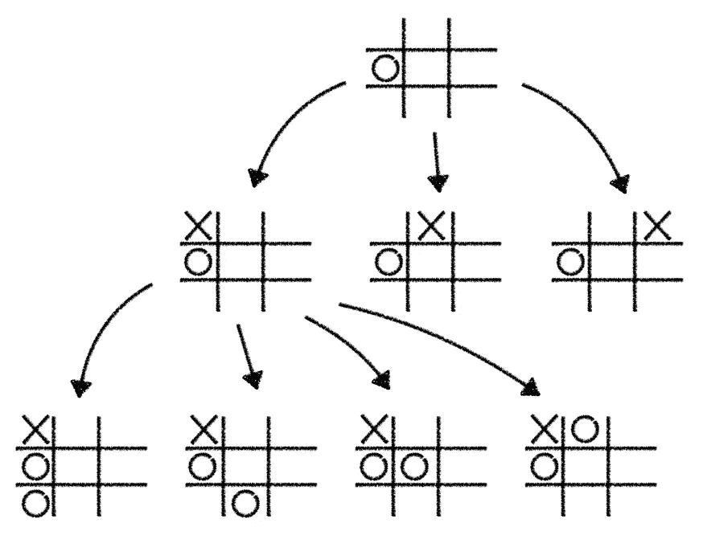

*注意，在这篇文章的剩余部分，我们将只使用简化的游戏树例子来节省屏幕空间*

当然，我们在上面讨论的策略规则是专门为井字游戏量身定制的。然而，我们可以推广这种方法，使其适用于其他棋盘游戏，如国际象棋或围棋。让我们来看看 [Minimax](https://en.wikipedia.org/wiki/Minimax) ，一种树搜索算法，它抽象了我们的井字游戏策略，以便我们可以将其应用于其他各种双人棋盘游戏。

# 极大极小算法

鉴于我们已经建立了对树搜索算法的直觉，让我们把注意力从简单的游戏如井字游戏转移到更复杂的游戏如国际象棋。

在我们开始之前，让我们简单回顾一下国际象棋游戏的属性。国际象棋是一个 2 人的完全信息确定性博弈。听起来很困惑？让我们打开包装:

在国际象棋中，两个玩家(黑和白)互相对战。执行的每一步都确保“完成”，没有任何随机性(游戏不使用任何随机元素，如骰子)。在游戏过程中，每个玩家都可以观察整个游戏状态。没有隐藏的信息，因此每个人在任何给定的时间都有关于整个游戏的完美信息。

由于这些属性，我们总是可以计算出哪个玩家现在领先，哪个玩家落后。在国际象棋比赛中，有几种不同的方法可以做到这一点。评估当前游戏状态的一种方法是将棋盘上所有剩余的白色棋子相加，然后减去所有剩余的黑色棋子。这样做将产生单个值，其中大值偏向白色，小值偏向黑色。这种类型的函数被称为**评估函数**。

基于这个评估函数，我们现在可以为每个玩家单独定义游戏中的总体目标。白棋试图最大化这个目标，而黑棋试图最小化它。

让我们假设我们正深陷于一场正在进行的国际象棋比赛中。我们是玩家白，已经下了几个聪明的棋，通过我们的评估函数计算出了一个很大的数字。现在轮到我们了，但是我们被卡住了。哪一个可能的步骤是我们能做的最好的？

我们将用我们在井字游戏中遇到的同样的方法来解决这个问题。我们建立了一个潜在的行动树，可以根据我们所处的游戏状态来执行。为了简单起见，我们假设只有两种可能的走法(在国际象棋中，每个给定的游戏状态平均有 30 种不同的选择)。我们从代表当前状态的(白色)根节点开始。从那里开始，我们分支出 2 个(黑色)子节点，代表我们在采取 2 个可能的行动之一后所处的游戏状态。从这两个子节点，我们再次分支出两个独立的(白色)子节点。每一个都代表了我们从黑色节点采取两种可能的行动之一后的游戏状态。这种节点的分支一直持续下去，直到我们到达游戏的结尾或者达到预定义的最大树深度。

生成的树看起来像这样:

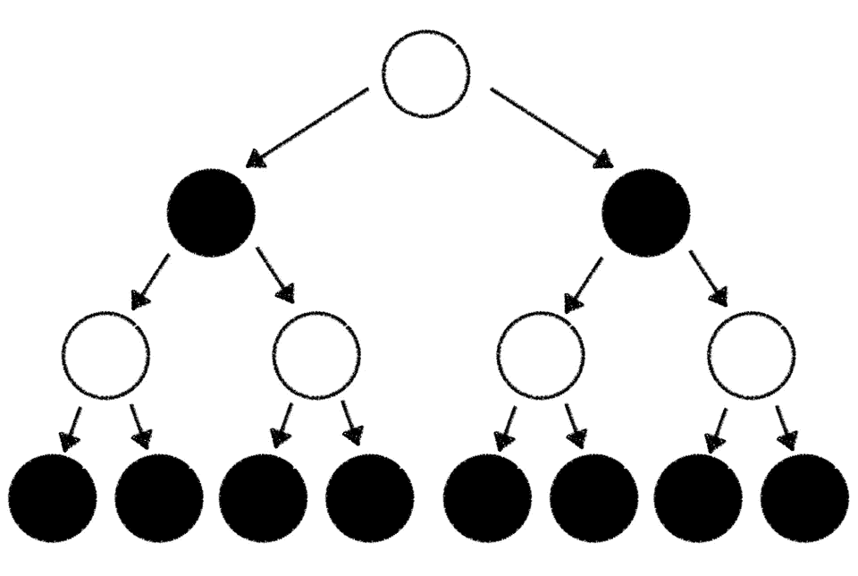

假设我们在树的末尾，我们现在可以用我们的评估函数计算每个结束状态的游戏结果:

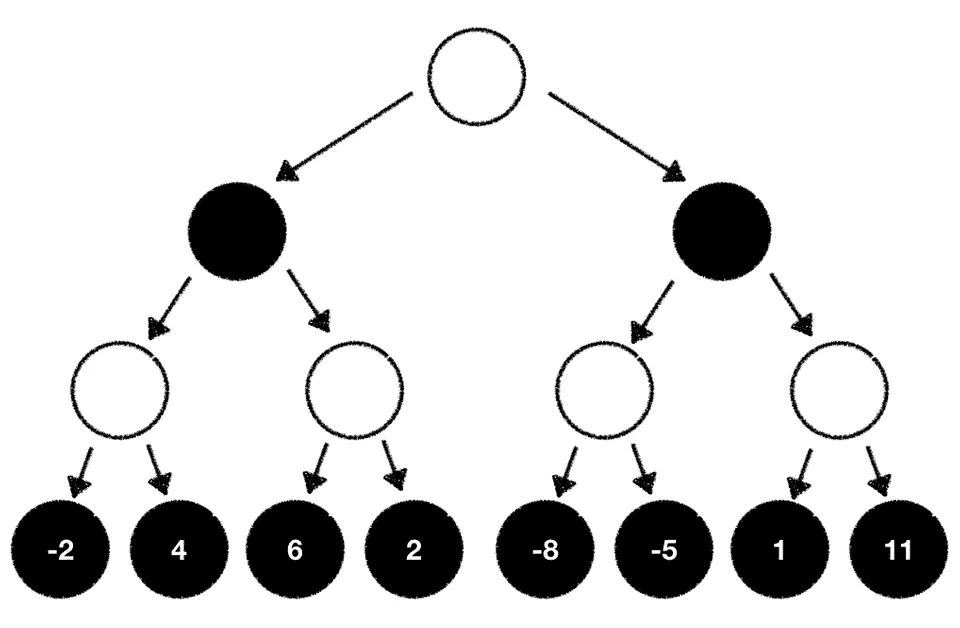

有了这些信息，我们现在知道了当我们从根节点开始，到我们计算游戏评估的最后一个节点结束时，我们可以预期的游戏结果。因为我们是白牌玩家，看起来最好的选择是让我们最终以我们的评估函数计算出的最高结果结束游戏。

虽然这是真的，但有一个问题。仍然有一个黑人玩家参与其中，我们不能直接操纵她会选择什么行动。如果我们不能操纵这一点，为什么我们不根据我们的评估函数来估计黑人玩家可能会做什么呢？作为一名白人球员，我们总是试图最大化我们的结果。黑人玩家总是试图最小化结果。有了这些知识，我们现在可以遍历我们的游戏树，一步一步地计算所有单个树节点的值。

怀特试图最大化结果:

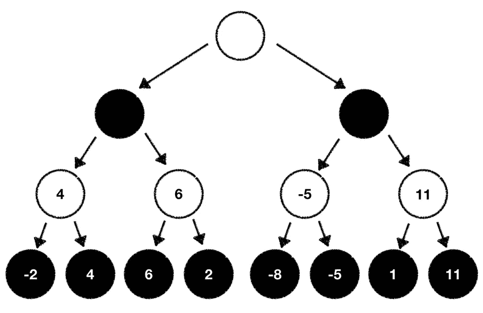

而布莱克想把它最小化:

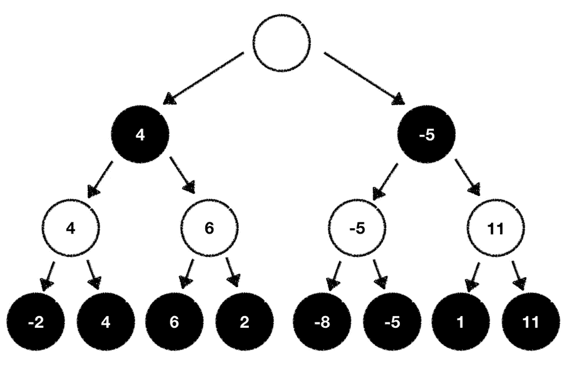

完成后，我们现在可以根据刚刚计算的评估值选择下一步行动。在我们的案例中，我们选择最大化我们结果的下一个可能的行动:

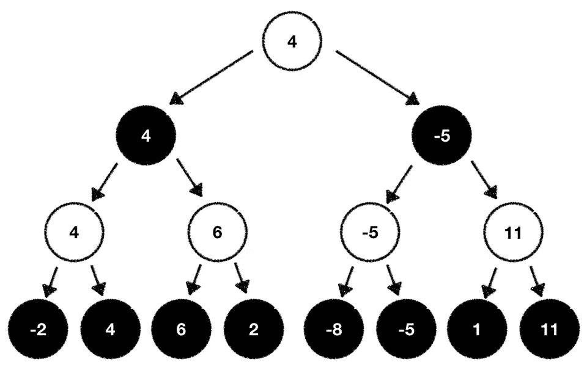

我们刚刚学的是所谓的[极小极大算法](https://en.wikipedia.org/wiki/Minimax)的一般流程。极大极小算法得名于这样一个事实，即一个玩家想要**最小化**-结果，而另一个玩家试图**最大化**-结果。

# 密码

```
def minimax(state, max_depth, is_player_minimizer):
  if max_depth == 0 or state.is_end_state():
    return evaluation_function(state) if is_player_minimizer:
    value = -math.inf
    for move in state.possible_moves():
      evaluation = minimax(move, max_depth - 1, False)
      min = min(value, evaluation)
    return value value = math.inf
  for move in state.possible_moves():
    evaluation = minimax(move, max_depth - 1, True)
    max = max(value, evaluation)
  return value
```

# 通过修剪减少搜索空间

Minimax 是一个简单而优雅的树搜索算法。只要有足够的计算资源，它总能找到最佳的下一步棋。

但是有一个问题。虽然这种算法对于像井字游戏这样简单的游戏来说是完美的，但是对于像国际象棋这样更复杂的游戏来说，在计算上是不可行的。其原因是所谓的树分枝因子。我们之前已经简要地谈到了这个概念，但是让我们再看一看。

在我们上面的例子中，我们人为地限制了一个人可以玩的潜在移动到 2，以保持树的表示简单和容易推理。然而，现实情况是，通常有两个以上的可能下一步行动。平均来说，一个棋手在任何给定的游戏状态下可以走大约 30 步。这意味着树中的每个节点都有大约 30 个不同的子节点。这叫做树的宽度。我们将树的宽度表示为 *w* 。

但是还有更多。大约要连续 85 回合才能下完一盘棋。将此转化为我们的树意味着它的平均深度为 85。我们将树的深度表示为 *d* 。

给定 *w* 和 *d* ，我们可以定义公式 *w^d* ，它将显示我们平均需要评估多少个不同的位置。

输入国际象棋的数字，我们得到了 30^85.以围棋棋盘游戏为例，其宽度 *w* 约为 250，平均深度 *d* 约为 150，我们得到 250^150.我鼓励你把这些数字输入计算器，然后按回车键。不用说，当代计算机甚至大规模分布式系统将“永远”处理所有这些计算。

这是否意味着 Minimax 只能用于井字游戏等游戏？绝对不行。我们可以运用一些巧妙的技巧来优化搜索树的结构。

一般来说，我们可以通过修剪单个节点和分支来减少搜索树的宽度和深度。让我们看看这在实践中是如何工作的。

# 阿尔法-贝塔剪枝

回想一下，Minimax 是建立在一个前提上的，即一个玩家试图根据评估函数最大化游戏的结果，而另一个玩家试图最小化它。

这种游戏性行为直接转化为我们的搜索树。在从底部到根节点的遍历过程中，我们总是为任何给定的玩家选择各自的“最佳”移动。在我们的例子中，白人玩家总是选择最大值，而黑人玩家选择最小值:

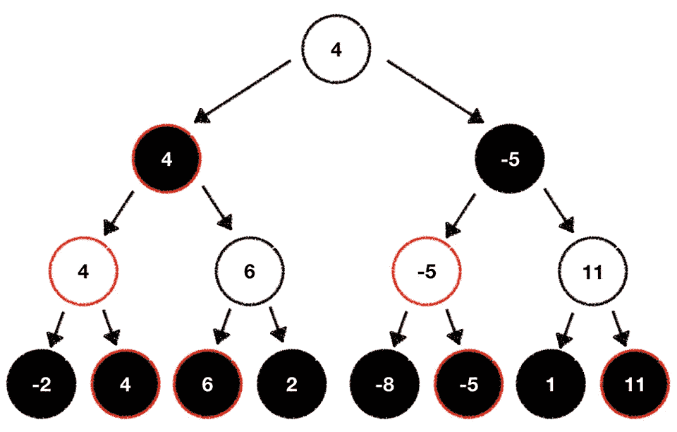

看看上面的树，我们可以利用这个行为来优化它。方法如下:

考虑到目前的游戏状态，我们应该以深度优先的方式构建我们的树。这意味着我们应该从一个节点开始，并通过从头到尾玩游戏来扩展它，然后再返回并选择我们想要探索的下一个节点:

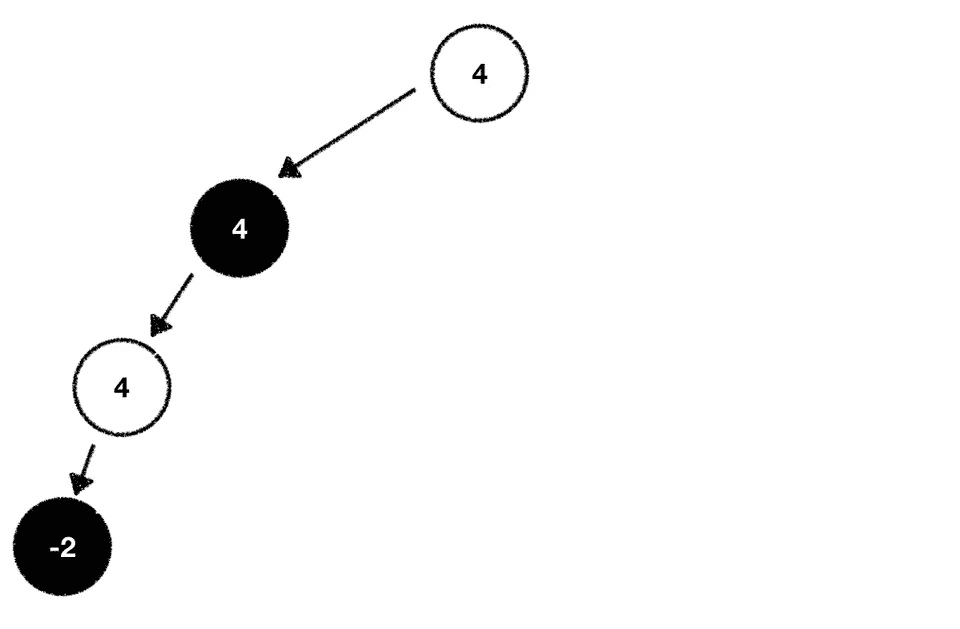

遵循这个程序可以让我们识别出永远不会在早期使用的招式。毕竟，一个玩家最大化结果，而另一个玩家最小化结果。在搜索树中，根据评估函数，玩家会在更糟糕的情况下结束的部分可以从我们想要扩展和探索的节点列表中完全删除。我们从搜索树中删除这些节点，从而减少树的宽度。

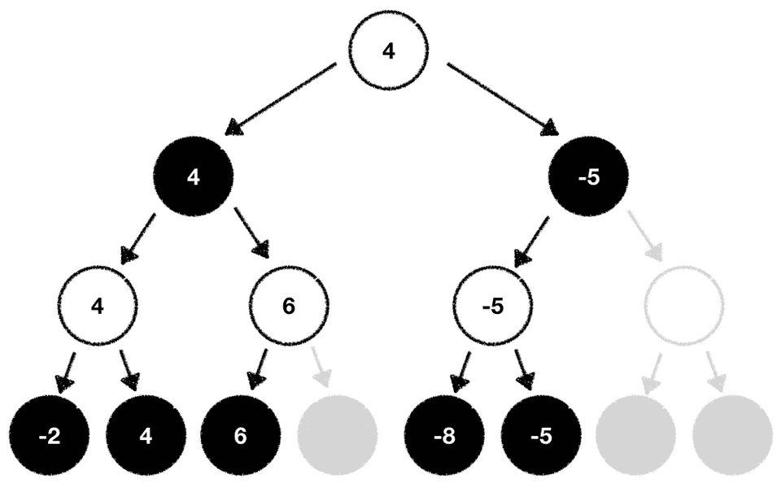

树的分支因子越大，我们可能节省的计算量就越大！

假设我们可以将宽度平均减少 10，那么我们将不得不进行 *w^d* =(30−10)^85 = 20^85 计算。这已经是一个巨大的胜利了。

这种修剪搜索树中在游戏过程中永远不会被考虑的部分的技术被称为[阿尔法-贝塔修剪](https://en.wikipedia.org/wiki/Alpha%E2%80%93beta_pruning)。Alpha-Beta 修剪得名于参数α和β，这两个参数用于记录玩家在树上行走时可以获得的最佳分数。

## 密码

```
def minimax(state, max_depth, is_player_minimizer, alpha, beta):
  if max_depth == 0 or state.is_end_state():
    return evaluation_function(state) if is_player_minimizer:
    value = -math.inf
    for move in state.possible_moves():
      evaluation = minimax(move, max_depth - 1, False, alpha , beta)
      min = min(value, evaluation)
      beta = min(beta, evaluation)
      if beta <= alpha:
        break
      return value value = math.inf
  for move in state.possible_moves():
    evaluation = minimax(move, max_depth - 1, True, alpha, beta)
    max = max(value, evaluation)
    alpha = max(alpha, evaluation)
    if beta <= alpha:
      break
    return value
```

使用 Alpha-Beta 剪枝来减少树的宽度有助于我们在具有大分支因子的游戏中利用 Minimax 算法，这在以前被认为是计算上太昂贵了。

事实上，[深蓝](https://en.wikipedia.org/wiki/Deep_Blue_(chess_computer))，由 [IBM](https://www.ibm.com/) 开发的国际象棋计算机[在 1997 年击败了](https://en.wikipedia.org/wiki/Deep_Blue_versus_Garry_Kasparov)国际象棋世界冠军[加里·卡斯帕罗夫](https://en.wikipedia.org/wiki/Garry_Kasparov)大量使用了并行化的基于阿尔法-贝塔的搜索算法。

# 蒙特卡罗树搜索

似乎极小极大结合阿尔法-贝塔剪枝足以构建复杂的游戏人工智能。但是有一个主要问题会使这些技术变得无用。这是定义一个稳健合理的评价函数的问题。回想一下，在国际象棋中，我们的评估函数把棋盘上所有的白棋加起来，减去所有的黑棋。这导致当白色有优势时的高值，以及当情况有利于黑色时的低值。虽然这个函数是一个很好的基线，绝对值得尝试，但通常需要包含更多的复杂性和微妙之处，才能得到一个合理的评估函数。

一旦底层的内部情况浮出水面，简单的评估指标很容易被欺骗和利用。对于围棋等更复杂的游戏更是如此。设计一个足够复杂的评估函数来捕捉大部分必要的游戏信息，需要大量的思考以及软件工程、数学、心理学和游戏方面的跨学科领域的专业知识。

难道没有一个普遍适用的评估函数，我们可以利用它来评估所有的游戏，不管它们有多简单或多复杂？

有，有！这叫做随机性。有了随机性，我们就让机会成为我们的向导，来决定下一步该怎么走。

在下文中，我们将探索所谓的[蒙特卡洛树搜索(MCTS)](https://en.wikipedia.org/wiki/Monte_Carlo_tree_search) 算法，该算法严重依赖随机性(名称“蒙特卡洛”源于[蒙特卡洛](https://en.wikipedia.org/wiki/Monte_Carlo)中的赌博区)作为值近似值的核心组件。

顾名思义，MCTS 还建立了一个博弈树，并对其进行计算，以找到最高潜在结果的路径。但是这棵树的构造有一点不同。

让我们再一次假装我们正在作为玩家怀特下棋。我们已经玩了几轮了，现在又轮到我们来选择我们想玩的下一步棋了。此外，让我们假设我们不知道任何评估函数，我们可以利用来计算每一个可能的移动的价值。有没有什么方法可以让我们知道哪一步棋可以让我们最终获胜？

事实证明，有一个非常简单的方法可以解决这个问题。为什么我们不让两个玩家从我们现在所处的状态开始玩几十个随机游戏呢？虽然这听起来可能违反直觉，但仔细想想，还是有道理。如果两个玩家都从给定的游戏状态开始，玩数千次随机游戏，并且玩家白赢得 80%的时间，那么这个状态一定有什么东西给了白优势。我们在这里所做的基本上是利用[大数定律(LLN)](https://en.wikipedia.org/wiki/Law_of_large_numbers) 来为我们可能的每一步棋找到“真实的”游戏结果。

以下描述将详细概述 MCTS 算法如何工作。为了简单起见，我们再次只关注任何给定状态下的 2 个可走的棋步(因为我们已经发现平均有 30 个不同的棋步可供我们选择)。

在我们继续之前，我们需要弄清楚一些次要的定义。在 MCTS，我们为树中的每个节点记录 2 个不同的参数。我们称这些参数为 *t* 和 *n* 。 *t* 代表“总计”，代表该节点的总值。 *n* 是“访问次数”,它反映了我们在遍历树时访问这个节点的次数。当创建一个新节点时，我们总是用值 0 初始化这两个参数。

除了我们为每个节点存储的 2 个新参数，还有所谓的“置信上限 1”(UCT)公式，如下所示

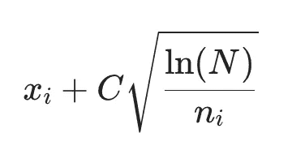

这个公式基本上帮助我们决定我们应该从哪个即将到来的节点和潜在的游戏移动开始我们的随机游戏系列。在公式*中，xi* 代表我们正在处理的游戏状态的平均值， *C* 是一个我们需要手动定义的叫做“温度”的常数(我们在这里的例子中只是将其设置为 1.5。稍后将详细介绍)， *N* 表示父节点访问量， *ni* 表示当前节点访问量。当在候选节点上使用这个公式来决定进一步探索哪个节点时，我们总是对最大的结果感兴趣。

不要被数学吓倒，只要注意到这个公式是存在的，并且在我们使用我们的树时会有用。在遍历我们的树时，我们将更详细地了解它的用法。

解决了这个问题之后，是时候让 MCTS 找出我们可以采取的最佳行动了。

我们从我们已经熟悉的树的同一个根节点开始。这个根节点是我们的起点，反映了当前的游戏状态。基于这个节点，我们分支出两个子节点:

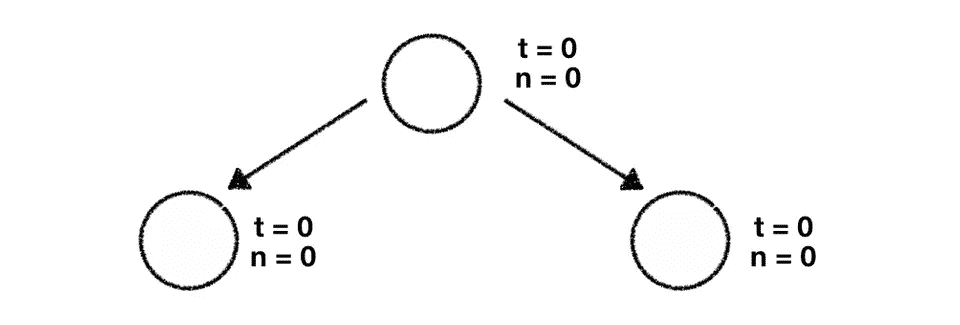

我们需要做的第一件事是使用上面的 UCT 公式，计算两个子节点的结果。事实证明，我们需要为 UCT 公式中的几乎每个变量插入 0，因为我们还没有对树及其节点做任何事情。这将导致两种计算的∞结果。

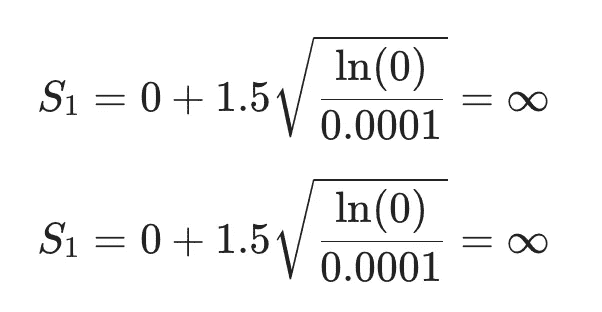

*我们已经用一个很小的数字替换了分母中的 0，因为零除没有定义*

考虑到这一点，我们可以自由选择要进一步探索的节点。我们从最左边的节点开始，执行我们的首次展示阶段，这意味着我们从这个游戏状态开始玩几十个随机游戏。

一旦完成，我们就得到这个特定首次展示的结果(在我们的例子中，玩家白的获胜百分比)。我们需要做的下一件事是沿着树向上传播这个结果，直到到达根节点。在这样做的时候，我们用我们遇到的每个节点各自的值来更新 *t* 和 *n* 。一旦完成，我们的树看起来像这样:

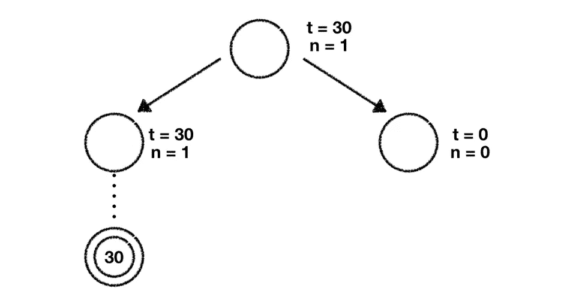

接下来，我们再次从根节点开始。我们再次使用 UCT 公式，代入我们的数字，计算两个节点的得分:

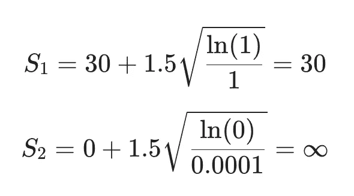

假设我们总是选择具有最高值的节点，我们现在将探索最右边的一个。我们再一次基于这个节点提议的移动来执行我们的首次展示，并且在我们完成所有的随机游戏之后收集最终结果。

我们需要做的最后一件事是传播这个结果，直到我们到达树的根。在此过程中，我们会更新遇到的每个节点的参数。

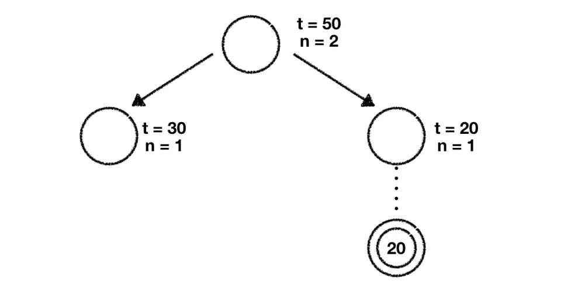

现在，我们已经成功探索了树中的 2 个子节点。你可能已经猜到了。我们将再次从根节点开始，计算每个子节点的 UCT 分数，以确定我们应该进一步探索的节点。这样做，我们得到以下值:

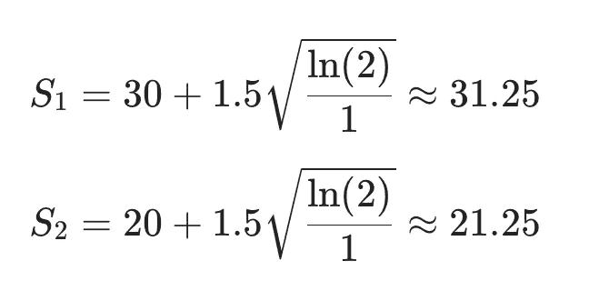

最大值是我们为最左边的节点计算出的值，所以我们决定进一步研究这个节点。

假设这个节点没有子节点，我们添加两个新节点，这两个新节点表示我们可以对树进行的潜在移动。我们用 0 初始化它们的两个参数( *t* 和 *n* )。

现在我们需要决定我们应该进一步探索这两个节点中的哪一个。你是对的。我们使用 UCT 公式来计算它们的值。假设两者的 *t* 和 *n* 值都为零，那么它们都是∞，所以我们决定选择最左边的节点。我们再一次进行展示，检索这些游戏的值，并将该值向上传播到树，直到到达树的根节点，同时更新所有节点参数。

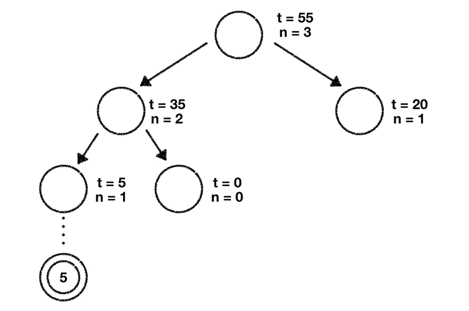

下一次迭代将再次从根节点开始，在这里我们使用 UCT 公式来决定我们想要进一步探索哪个子节点。因为我们可以在这里看到一个模式，我不想让你感到厌烦，所以我不打算详细描述接下来的步骤。我们要做的是遵循我们在上面使用的完全相同的程序，可以总结如下:

1.  从根节点开始，使用 UCT 公式计算每个子节点的分数
2.  选择您已经计算出最高 UCT 分数的子节点
3.  检查孩子是否已经被探访过
4.  如果没有，进行首次展示
5.  如果是，从那里确定潜在的下一个状态，使用 UCT 公式来决定选择哪个子节点并进行展示
6.  将结果传播回整个树，直到到达根节点

我们迭代这个算法，直到用完时间或者达到预定的访问、深度或迭代的阈值。一旦发生这种情况，我们评估我们的树的当前状态，并挑选使值 *t* 最大化的子节点。多亏了我们玩过的几十个游戏和大数定律，我们可以非常肯定这一步是我们可能玩的最好的一步。

就这些了。我们刚刚学习、应用和理解了蒙特卡罗树搜索！

你可能会同意 MCTS 是一个计算密集型的地方，因为你必须运行成千上万的随机游戏。这绝对是真的，我们需要非常聪明地知道我们应该在哪里投入资源，以便在我们的树中找到最有希望的路径。我们可以用前面提到的 UCT 公式中的“温度”参数 *C* 来控制这种行为。通过这个参数，我们可以平衡“勘探与开发”之间的权衡。

大的 *C* 值使我们进入“探索”模式。我们将花更多的时间访问探索最少的节点。 *C* 的一个小值将我们置于“利用”模式，在这种模式下，我们将重新访问已经浏览过的节点，以收集更多关于它们的信息。

鉴于利用随机性的简单性和适用性，MCTS 是一种广泛使用的博弈树搜索算法。 [DeepMind](https://deepmind.com/) 使用[深度神经网络](https://en.wikipedia.org/wiki/Deep_learning#Deep_neural_networks)扩展了 MCTS，以优化其在寻找最佳围棋走法方面的性能。最终的游戏 AI 非常强大，达到了超人的水平，并且[以 4 比 1 击败了](https://en.wikipedia.org/wiki/AlphaGo_versus_Lee_Sedol)围棋世界冠军李·塞多尔。

# 结论

在这篇博文中，我们研究了两种不同的树搜索算法，它们可以用来构建复杂的游戏人工智能。

虽然 [Minimax](https://en.wikipedia.org/wiki/Minimax) 与 [Alpha-Beta 剪枝](https://en.wikipedia.org/wiki/Alpha%E2%80%93beta_pruning)相结合是一种可靠的解决方案，可以很容易地定义评估游戏结果的评估函数，但是[蒙特卡罗树搜索(MCTS)](https://en.wikipedia.org/wiki/Monte_Carlo_tree_search) 是一种普遍适用的解决方案，因为它依赖于随机性，所以不需要评估函数。

原始的极小极大和 MCTS 只是开始，可以很容易地扩展和修改，以在更复杂的环境中工作。 [DeepMind](https://deepmind.com/) 聪明地[将 MCTS 与深度神经网络](https://storage.googleapis.com/deepmind-media/alphago/AlphaGoNaturePaper.pdf)结合起来预测围棋棋步，而 [IBM](https://ibm.com/) 将阿尔法-贝塔树搜索扩展到[计算可能的最佳棋步](https://en.wikipedia.org/wiki/Deep_Blue_(chess_computer))来下棋。

我希望这种对游戏人工智能算法的介绍激发了你对人工智能的兴趣，并帮助你理解下次你在电脑上玩棋盘游戏时会遇到的底层机制。

你有任何问题/反馈吗？请随时通过电子邮件或 Twitter 联系我！

*最初发表于*[*philippmuens.com*](https://philippmuens.com/minimax-and-mcts)*。*