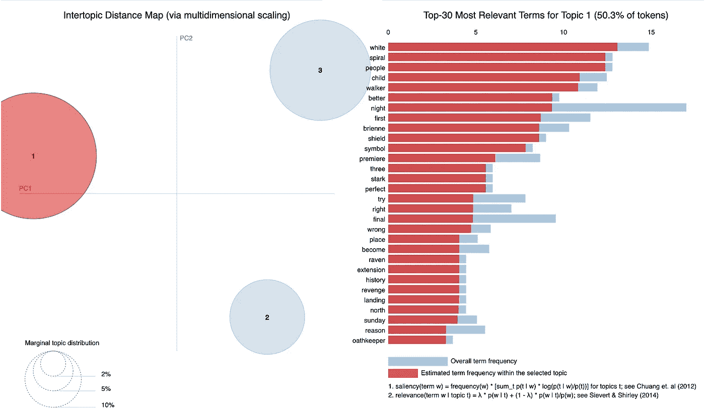

# 《权力的游戏》第八季情感分析

> 原文：<https://towardsdatascience.com/game-of-thrones-sentiment-analysis-1d3e158704cc?source=collection_archive---------21----------------------->

SPOILERS ARE COMING!

作为这本书和这部剧的超级粉丝，我忍不住分析了粉丝们对播出的最后一季的反应。这项分析的数据来自三个子网站(r/gameoftrones、r/freefolk 和 r/asoiaf)和冰与火论坛。我和我在梅蒂斯大学的一位同学，T2 大学的德雷克·巴洛一起进行分析，因为我们渴望剖析社交媒体上明显泛滥的各种反应。

[Source: Washington Post](https://www.washingtonpost.com/opinions/2019/05/20/game-thrones-season-episode-review-iron-throne-melts)

每集都有多次失误，像这样的引用已经在社交媒体上到处分享。这是一个苛刻的判断，我们将调查球迷们在观看最后一季时的情绪，看看事实是否如此。

我们从使用 [VADER 情感分析](https://github.com/cjhutto/vaderSentiment)工具分析所有四个平台的评论开始，从该季首播前两周开始，到大结局播出后的第二天结束。VADER 特别适合情感分析，因为它可以识别大写字母、表情符号和标点符号等元素。首先，我们检查了总的结果:

Aggregate fan reactions over the course of the season

很容易看到这一季中产生强烈意见的剧集，如《长夜》(夜王)、《钟声》(君临)和《铁王座》(大结局)。然而，以这种方式可视化数据的一个缺陷是，它淡化了低容量论坛的情绪。例如，冰与火论坛里的观点在这个观点里看起来基本上是一集比一集平。我们想探究这是否是真的，所以决定也看看卑鄙的情绪。

[Mean sentiment over time](https://public.tableau.com/profile/natasha1586#!/vizhome/GameofThronesSeason8SentimentAnalysis/GameofThronesSentimentAnalysis)

一旦我们考虑到四个频道的人数差异，并取每个频道每天的平均情绪，得到的图片就更加平衡，很容易观察到论坛上的粉丝的表达能力，以及他们的反应比三个子主题上的粉丝更加极端。整个赛季的总体情绪没有我们预期的那么消极。

将各频道的反应分开来看，与论坛和自由民 redditors 的反应相比,《权力的游戏》subreddit 似乎总体上更积极。《七国骑士》中感觉良好的一集引发了本季最高水平的积极反应，其次是《临冬城》首播前的整体预期水平。

在分析的这一点上，我很兴奋地发现粉丝们并不像社交媒体反应的那样讨厌这部剧。但是我们也很想知道他们在每集之后到底在讨论什么。尽管我们这次只拿到了六个，但每个都充满了内容和 OMG 时刻，因此详细剖析它们似乎是显而易见的。我将一集一集地给你详细分析(可以在我的 [GitHub](https://github.com/natashaborders/Game_of_Thrones_Sentiment_Analysis) 上找到),但是强调一些我们最好奇的发现。

pyLDAviz helps us look at the results topic by topic

看看这一季首播前的话题——显然每个人都在想白行者，令人兴奋的是，当粉丝们讨论夜王的象征以及如何通过牺牲卡斯特的孩子来制造白行者的过程时，观察到“螺旋”和“孩子”这样的词就在列表的顶部附近。

另一个奇怪的话题来自《钟声激越》这一集，对我来说这是最有争议的一集，丹妮似乎心血来潮决定烧毁一座城市。这一集的主题之一是杰米和瑟曦戏剧性的结局，以及君临和大部分人民的毁灭。

pyLDAviz depicting the topics of the Bells episode, which deals with the destruction of King’s Landing

在一个季度内发生了这么多史诗般的毁灭场景和这么多主要角色的死亡之后，第八季结束了我们所有人在许多周日都屏住呼吸观看的一场演出，聚集在一起观看更多我们心爱的角色遭遇他们经常不合时宜的死亡。正如我们在该系列最后一集《铁王座》之后看到的粉丝评论一样，最严厉的反应听起来最响亮，但负面反应中也有对该剧和演员的赞赏，人们感谢该剧将他们最喜爱的小说带入生活。

pyLDAviz for The Iron Throne highlights the fans saying good-bye to the series

总的来说，我们了解到社交媒体上的帖子很难解读，因为它们充满了情感和讽刺。《权力的游戏》这部剧承载了很多粉丝的希望，任何结局都可能让他们失望。

《权力的游戏》为奇幻类型进入主流媒体铺平了道路，并为流行奇幻小说的其他高预算改编打开了大门。我们已经走到了一个时代的尽头，这是一段令人惊叹的旅程。

上面分析的所有可视化和代码都可以在这里找到:

 [## natashaborders/Game _ of _ Thrones _ 情操 _ 分析

### 我们使用自然语言处理来检查粉丝对该系列最后一季的反应'。然后进一步…

github.com](https://github.com/natashaborders/Game_of_Thrones_Sentiment_Analysis) 

请随时在 LinkedIn 或 Twitter 上找到我，进行《权力的游戏》聊天:

 [## Natasha Borders，MBA -数据科学家- Metis | LinkedIn

### 加入 LinkedIn 数据科学家，具有市场研究和品牌管理、CPG、pet 和沉浸式活动的背景…

www.linkedin.com](https://www.linkedin.com/in/natashaborders/)  [## 娜塔莎(@natalissaelil) |推特

### 娜塔莎的最新推文(@natalissaelil)。数据科学家|分析师。加利福尼亚州旧金山

twitter.com](https://twitter.com/natalissaelil)