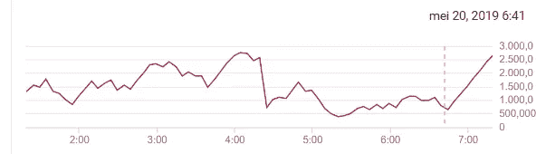

# 《权力的游戏》Twitter 情绪与谷歌云平台和 Keras

> 原文：<https://towardsdatascience.com/game-of-thrones-twitter-sentiment-with-keras-apache-beam-bigquery-and-pubsub-382a770f6583?source=collection_archive---------12----------------------->

## 具有 AI 平台、Apache Beam / DataFlow、BigQuery 和 Pub/Sub 的端到端管道

Photo by [Tyler Lastovich](https://unsplash.com/@lastly?utm_source=medium&utm_medium=referral) on [Unsplash](https://unsplash.com?utm_source=medium&utm_medium=referral)

《权力的游戏》的最后一季显然引起了很多人的关注，所以我想通过转向从不轻声细语的 Twitter 社区，更深入地了解人们在《权力的游戏》最后一集之前、期间和之后的感受。

在这篇博文中，我们将看看如何利用谷歌云平台上可用的技术栈来构建一个端到端的解决方案来解决这个问题。

我们走吧！

source: created Blackbringer on GIFER ([source](https://gifer.com/en/6Aqy))

重点是实现一个完全可行的解决方案，而不是完善整个流程中的单个组件。所以任何一个单独的积木都可以被完善！

为了保持可读性，我没有包括所有的代码，但一切都可以在 [**这个 Github repo**](https://github.com/TDehaene/blogposts/tree/master/got_sentiment) 上找到，完全注释。

# 基本思想

整个管道的大致轮廓如下:

general architecture (source: own creation)

基本上，想要做到的是:

1.  在虚拟机上运行一个脚本，抓取《权力的游戏》上的推文
2.  有一个发布消息的发布订阅主题
3.  有一个服务的 ML 模型来分类推文情绪
4.  让阿帕奇波束流管道提取推文并分类
5.  将分类的推文输出到 BigQuery，进行分析

在这篇文章的其余部分，我们将分别浏览所有不同的组件，以一个和谐的管道富矿的大型管弦乐队来结束！

我们将非常依赖谷歌云平台，包括以下组件:

*   计算引擎:在上运行 tweepy 脚本
*   Cloud PubSub:缓冲推文
*   云数据流:托管 Apache Beam runner
*   人工智能平台:通过 API 服务于我们的 ML 模型
*   BigQuery:存储我们的推文

# 1.GCE 上捕获推文的脚本

Google Compute Engine logo ([source](https://download.logo.wine/logo/Google_Compute_Engine/Google_Compute_Engine-Logo.wine.png))

使用 tweepy API 可以很容易地捕获与几个搜索词相关的推文，如下所示:

要将其发送到 Google Cloud PubSub，我们只需使用客户端库:

这样做之后，事情就简单了:

*   在 Google 计算引擎上设置虚拟机(我使用了一个简单的 n1-standard-1)
*   将脚本复制到 Google 云存储的一个存储桶中
*   SSH 到虚拟机
*   将脚本从存储桶复制到环境中
*   在虚拟机上安装 python3
*   运行 python 脚本

# 2.作为消息代理的云发布主题

Google Cloud PubSub ([source](https://techlab.bol.com/app/files/2020/02/1200px-Cloud-Pub-Sub-Logo.svg_.jpg))

Pub/Sub 是一个很棒的消息中间件，它充当整个管道中的事件接收和交付系统。

特别是在这种情况下，推文的流入速度可能会比流媒体管道获得推文的速度快得多，这是一个很好的工具，因为接收和交付是异步解耦的。

Pub/Sub 还可以将收到的消息存储几天，因此，如果您的下游任务难以跟上，也不用担心。

创建一个主题非常简单:只需导航到你的 GCP 控制台，进入发布/订阅菜单:

PubSub console UI (source: own screen-capture)

从这里开始，只需点击**创建主题**按钮，并为您的主题填写一个名称。为了将来参考，我把我的命名为“got_tweets”。

# 3.人工智能平台上的服务 ML 模型

Google Cloud ML Engine ([source](https://miro.medium.com/max/320/1*j55G2ObYgDVyeanO9XPbng.png))

对于收到的每条推文，我们想要确定所表达的情绪(大概是对该集的)是积极的还是消极的。这意味着我们必须:

*   寻找合适的数据集
*   训练一个机器学习模型
*   服务于这个机器学习模型

## 资料组

当想到情感分析时，我们很快就会想到“IMDB 电影评论”数据集。然而对于这个特定的目的，这个经典似乎不太适合，因为我们在这里处理的是 tweets。

幸运的是，包含 160 万条带标签(正面和负面)推文的 Sentiment140 数据集似乎非常适合这种情况。更多信息和数据集，请访问[这个视频页面](https://www.kaggle.com/kazanova/sentiment140)。一些例子:

sample from the Sentiment140 dataset

对文本的预处理是在一个单独的类中完成的，这样以后调用模型时可以重用它:

## 模型

对于分类模型本身，我基于 2014 年著名的 Yoon Kim 关于多频道 CNN 文本分类的论文([来源](https://www.aclweb.org/anthology/D14-1181))。为了便于开发(以及以后的部署)，我使用 Keras 作为高级 API。

CNN architecture overview ([source](https://arxiv.org/pdf/1408.5882.pdf))

基于 CNN 的模型提供了额外的好处，即在我的小型本地工作站(NVidia GTX 1050Ti，4GB 内存)上训练该模型仍然是可行的。而基于 RNN 的模型(通常用于情感分类)将具有长得多的训练时间。

我们可以尝试通过加载一些预训练的单词嵌入来给模型增加一些活力。在这种情况下:Glove 2.7B Twitter 嵌入看起来是一个不错的选择！

完整的代码可以在[这本笔记本](https://github.com/TDehaene/blogposts/blob/master/got_sentiment/3_sentiment_analysis/training_and_serving.ipynb)中找到。

我们为 25 个时期训练了模型，其中有两个 Keras 回调机制:

*   当确认损失达到稳定水平时，回调以降低 LR
*   当验证损失在一段时间内没有改善时，提前停止回调，这导致它在 10 个时期后停止训练

这里可以看到训练和测试曲线:

因此我们获得了大约 82.5%的准确度。

## 为模型服务

人工智能平台为机器学习模型提供了一个可管理的、可扩展的服务平台，其中内置了一些很好的好处，如版本控制。

现在对于主机来说，我们的模型有一个特殊的方面，这使得它在人工智能平台中的服务变得不那么微不足道:事实上，我们需要以我们在训练时所做的相同方式来规范化、标记化和索引我们的文本。

尽管如此，还是有一些选项可供选择:

*   将 tf.keras 模型包装在一个 tf 模型中，并添加一个 **Hashtable** 层来保持标记化 dict 的状态。更多信息[在这里](https://www.tensorflow.org/api_docs/python/tf/contrib/lookup/HashTable)。
*   全力以赴，为您的数据实现一个 **tf.transform** 预处理管道。关于这个的伟大博客文章[在这里](https://blog.ml6.eu/pre-processing-for-tensorflow-pipelines-with-tf-transform-on-google-cloud-25b283bd47ea)。
*   稍后在**流管道**本身中实现预处理。
*   使用 AI 平台 Beta 功能，拥有一个**自定义模型预测**类。

鉴于既没有时间也没有资源来完成 tf.transform，而且用额外的预处理可能会使流管道过载，这似乎是一个糟糕的选择，最后一个看起来是可行的。

轮廓看起来像这样:

overview of the serving architecture (source: own creation)

自定义模型预测类非常简单，Google 的 peeps 在这里有一个很棒的博客。我的看起来像这样:

要由此创建一个人工智能服务平台模型，我们只需:

*   打包自定义预测和预处理。py 文件
*   将这个包连同持久模型和预处理类实例一起上传到 bucket
*   从这里开始，创建一个你想命名的模型
*   在这个模型中，基于上传的项目创建一个新版本，并使用一些测试版魔法:

# 4.阿帕奇光束流管道

Cloud Dataflow ([source](https://codelabs.developers.google.com/codelabs/dataflow-notebooks-streamingwordcount/img/62b0919755804bea.png))

推文以流的形式出现，这实际上是一个无限的数据集。因此，流管道似乎是从发布/订阅主题中捕获 tweets 并处理它们的完美工具。

我们将使用 Apache Beam 作为编程模型，并在 data flow runner(Google Cloud 上用于运行 Beam 管道的托管环境)上运行管道。如果你想了解更多关于 Apache Beam 及其范例的内容，可以访问网站。

首先，在流式传输时，我们必须考虑窗口策略。这里，我们只使用 10 秒的固定窗口。

Fixed windowing strategy ([source](https://beam.apache.org/documentation/programming-guide/))

也可以采用其他策略，例如移动窗口策略。这可能会导致对托管 ML 模型的额外调用。所以固定窗口似乎是最容易开始的。

我们管道中的主要步骤是:

*   以 10 秒为间隔拉入发布/订阅消息
*   将它们分批，每批 50 条消息(不要太大，否则请求的正文会太大)
*   通过调用托管的 ML 模型对它们进行分类
*   将它们写入 BigQuery 集合
*   同时，对这 10 秒钟的平均情绪进行分组，并将其写入第二个 BigQuery 集合

在云数据流上运行时，它看起来如下:

screen capture of the created dataflow pipeline

完整代码粘贴在这里有点长，不过可以在 [**我的 Github repo**](https://github.com/TDehaene/blogposts/tree/master/got_sentiment) 上找到完整的。

# 5.有一个 BigQuery 集合来接收结果

BigQuery ([source](https://cdn.worldvectorlogo.com/logos/google-bigquery-logo-1.svg))

如前所述，我们有两个 BigQuery 表来将结果流式传输到:

*   一个是单独的帖子，带有情感标签，将来可能会重新标记它们，并微调我们的分类器
*   一个用于每 10 秒窗口的平均预测情绪

screen capture of the created dataset and tables

您可以从 UI 中创建它们，并指定一个模式(当然，该模式必须映射到您的 Beam pipeline 作业中指定的模式)。

# 跑步

我花了几个小时运行整个管道，以捕捉这一集之前、之中和之后的情绪。

鉴于 tweets 的数量可能会很快变得相当大，观察所有组件的扩展能力也是很好的:

*   **人工智能平台**:这个故事中真正的 MVP，当负载增加时，在后端扩展得非常好，试图保持响应时间稳定:

Requests per second for calls to AI Platform model

Response times during the run, nice n’ stable

*   **云数据流**:事后看来，Java 流感觉比 Python 流更扎实一点。当流式传输 Python 管道时，自动缩放当前不工作；这导致系统延迟时间在整个运行过程中不断增加:

System delay (in second, right hand side axis)

*   **BigQuery** :完全不是问题。BQ 使用流缓冲区操作，并定期将数据卸载到表本身。同样对于后期分析，BQ 从来都不是问题。

在 7 个小时的时间里，总共收集了大约 50 万条推文。下面是一些例子，以及他们预测的情绪(警告:剧透警报！)

([source](https://static.gofugyourself.com/uploads/2019/05/source-1557101865-500x281.gif))

# 结果呢

至于主要问题，我们可以试着把它框定为:

> 每分钟在推文中表达的平均情绪是多少。在发作前、发作中和发作后的一小时内。

通过一些 SQL 查询魔术(参见回购中的笔记本)，再加上一些注释，就足够简单了:

*   分数被标准化为平均值 0 和标准偏差 1
*   移动平均和原始平均情绪都被显示
*   提到了该剧的一些关键场景

👉所以很明显，社区在节目开始前对 GoT 非常敌视，在剧集开始时逐渐放下了他们的干草叉和火把。

👉可以这么说，布兰被封为国王很受欢迎，我也认为这是一个非常好的情节转折😃！

👉另一个积极的场景是塔斯的布蕾妮在《骑士书》中写詹姆的时候。

👉在这一集之后，社区似乎对最后一集相当消极，大约 45 分钟后，在再次变得消极之前，他们改变了主意…

他们最终对这一集相当负面，这似乎反映在 IMDB 评分只有 4.4 分😮。有人可能会说，这一集没有机会，因为社区在这一集之前就已经相当负面了，所以这种情绪多少是从不利的偏见开始的。

这是事实吗？没有人确切知道，但我对结果很满意👍。

([source](https://66.media.tumblr.com/09dc83bae883cdc4788a9cbb9a3fae9d/tumblr_nc38lh8qGz1tq4of6o1_500.gif))

所以我们有它！使用谷歌云提供的工具箱来回答我们的问题。仅供参考:手术的总成本最终大约为 5 美元，我认为这是相当合理的！