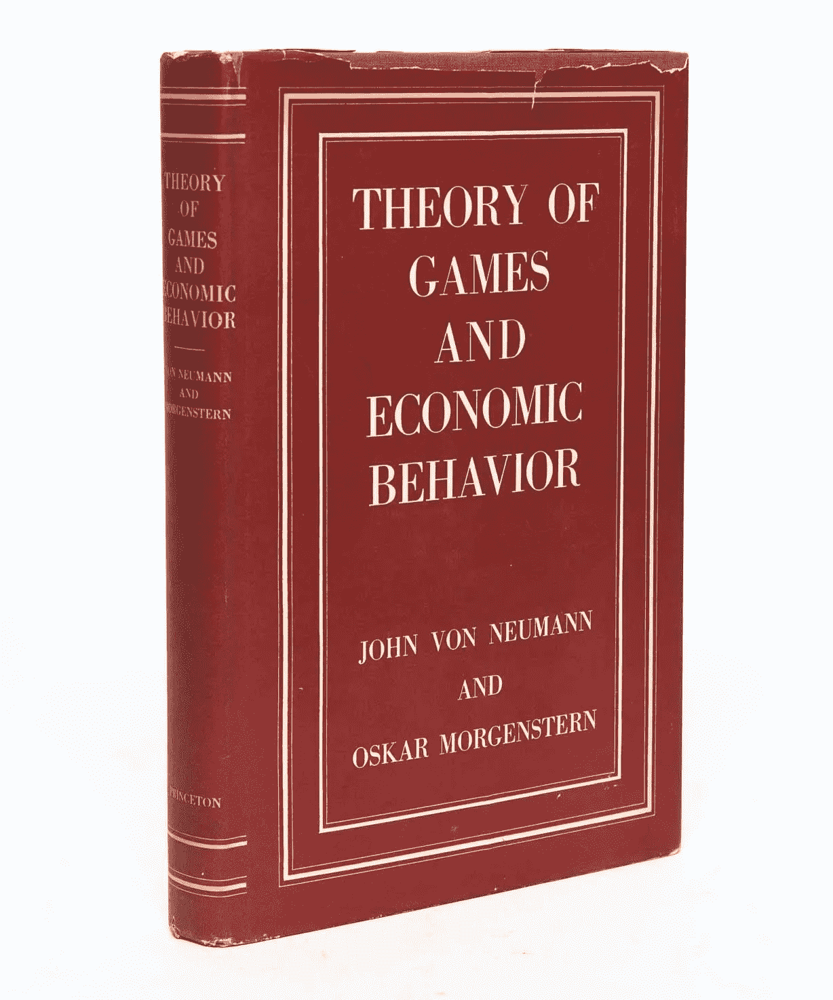

# 博弈论——历史和概述

> 原文：<https://towardsdatascience.com/game-theory-history-overview-5475e527cb82?source=collection_archive---------15----------------------->

## 什么是博弈论&为什么它与今天相关？

Published On [Setzeus](https://www.setzeus.com/)

生活就是生存&生存就是竞争。每当两个或两个以上的实体面临限制，如固定数量的资源，在赢/输的情况下，竞争就出现了。这是必然的&自然的。从生态系统中的食物链平衡来看，这是一种进化——当然，这种天生的行为同样适用于人类。任何形式的竞争都源于战略。

博弈论是应用数学的一个分支，用于创建最佳策略，以便在不确定和知识不完整的竞争环境中取得成功(就像大多数现实生活场景一样)。这是在所有行业和学科的日常生活中发现的冲突情况下决策和建模的数学研究。

Published On [Setzeus](https://www.setzeus.com/)

国家为领土而战，企业为市场份额而战，动物为资源而战，政党为选票而战。在一个由相互依赖的代理人统治的世界里，这些代理人旨在增加他们在动态系统中的“价值”，博弈论有着极其密切的关系。

虽然这一学术学科&这一领域本身在 20 世纪 50 年代才正式建立，但博弈论般的见解在数百年的历史中清晰可见。下面，我们将回顾古代的背景& 20 世纪 50 年代的加速发展。

# 古代

事后看来，博弈论的基本思想在历史上多次出现。从《孙子兵法》到查尔斯·达尔文的进化发现，它一直是人类行为的驱动力。然而，古代博弈论的基础通常归功于以下三部具体著作的流行:

*   [奥古斯丁·古诺](http://www.gametheory.net/dictionary/People/AugustinCournot.html)的*研究财富理论的数学原理*
*   [弗朗西斯·伊西德罗·埃奇沃思](http://www.gametheory.net/dictionary/People/FrancisEdgeworth.html)笔下的*数学灵媒*
*   埃米尔·波莱尔的算法和概率计算，

这些经典著作中的每一部都简要地窥视了博弈论的未来；他们每个人都站在(他们那个时代的)知识的边缘&试图用数学来描绘一些背景下(比如财富)的人类行为。尽管如此，正如上文所详述的，这些都只是学科在阴影中前进的低语——该领域直到 20 世纪 50 年代才获得正式认可。

# 巨人队——诺伊曼和纳什

虽然许多贡献者在博弈论的历史中占有一席之地，但人们普遍认为现代分析始于约翰·冯·诺依曼，并由约翰·纳西进一步提供了其方法框架。

很可能博弈论在约翰·冯·诺依曼第一次在战略 (1928 年)的 ***博弈论*** *上发表论文*之前并没有名字。虽然不是他的巨著，但这篇论文极大地推进了这个领域——它的意义最好通过回顾博弈论中提出的**基本定理来理解:****

博弈论的基本定理表明，在两人游戏的大类中， ***总是有可能*** 找到一个双方都不应该单方面偏离的均衡。这种均衡存在于任何满足以下标准的双人游戏中:

1.  **游戏是*有限的***
2.  **游戏之一*完整信息***
3.  这是一个零和游戏

今天被称为[极大极小定理](http://mathworld.wolfram.com/MinimaxTheorem.html)，它仍然非常相关&是任何博弈论 101 课程的关键部分。然而，诺伊曼的下一篇文章是&仍然是博弈论的圣杯。

Published On [Setzeus](https://www.setzeus.com/)

***博弈论与经济行为*** ，由约翰·冯·诺依曼&经济学家奥斯卡·莫根施特恩于 1944 年出版，被认为是将博弈论正式确立为一个跨学科研究领域的开创性文本。事实上，在该书 60 周年纪念的介绍中，普林斯顿大学出版社将其描述为“现代博弈论所基于的经典著作”

第二个浪子回头的人不是别人，正是《美丽心灵》的[约翰·纳西。作为诺贝尔奖获得者，约翰·纳西声称博弈论的名声来自于扩展诺依曼先前定义的 ***两人*** 博弈均衡。纳什均衡被称为](http://www.abeautifulmind.com/)&适用于更多种类的游戏，纳什证明了*非零和博弈中的每一个有限的 n 人(不仅仅是 2 人零和博弈)都有一个明确定义的最优策略。*

## *最后—基础知识&囚徒困境*

*在诺依曼和纳什的肩膀上，博弈论凶猛地推进到所有的行业和学科。在 50 年代早期，一连串的活动导致了进一步的发展(重复博弈& Shapley 值)以及最初的应用(见于哲学和政治学)。将近 70 年后，博弈论仍然非常活跃。*

*我们走吧！我们探索了应用&浏览了博弈论的历史。现在自然的下一步是用一个例子来说明。在应用数学的这个角落里,“囚徒困境”是最受关注的经典博弈论问题。为了边做边学，我们接下来会解决这个问题。*