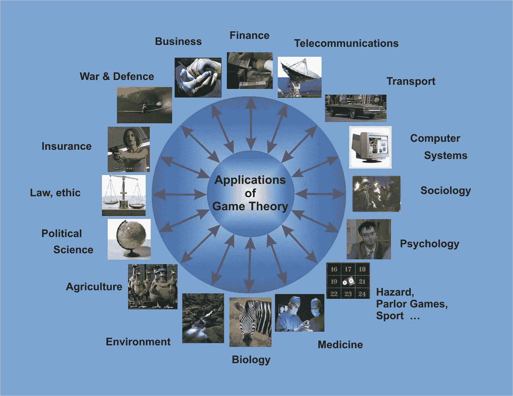
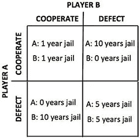
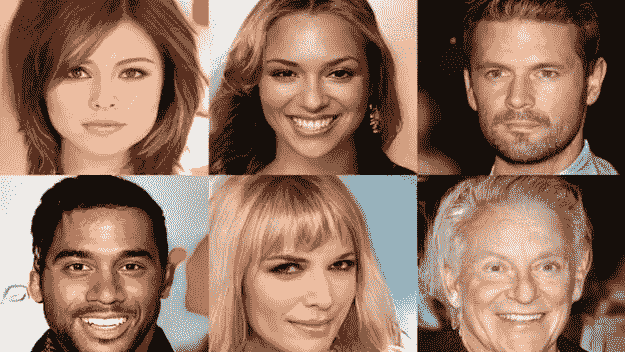

# 人工智能中的博弈论

> 原文：<https://towardsdatascience.com/game-theory-in-artificial-intelligence-57a7937e1b88?source=collection_archive---------1----------------------->

## 博弈论的介绍以及它如何应用于人工智能的不同领域。

(Source: [https://www.thegreatcourses.com/media/catalog/product/cache/1/plus_image/800x451/0f396e8a55728e79b48334e699243c07/1/4/1426.1549051731.jpg](https://www.thegreatcourses.com/media/catalog/product/cache/1/plus_image/800x451/0f396e8a55728e79b48334e699243c07/1/4/1426.1549051731.jpg))

# 介绍

博弈论是数学的一个分支，用于在具有预定义规则和结果的上下文中对不同参与者之间的战略交互进行建模。

博弈论可以应用于人工智能的不同领域:

*   多智能体人工智能系统。
*   模仿和强化学习。
*   生成对抗网络中的对手训练。

博弈论也可以用来描述我们日常生活和机器学习模型中的很多情况(图 1)。

例如，诸如 [SVM(支持向量机)](/svm-feature-selection-and-kernels-840781cc1a6c)的分类算法可以用两人游戏来解释，其中一个玩家挑战另一个玩家，以找到给他最难分类的点的最佳超平面。然后，游戏将收敛到一个解决方案，这将是两个玩家的战略能力之间的权衡(例如，第一个玩家挑战第二个玩家对困难数据点进行分类的能力有多强，第二个玩家识别最佳决策边界的能力有多强)。

Figure 1: Game Theory Applications [1]

# 博弈论

博弈论可以分为 5 种主要类型的游戏:

*   **合作与非合作游戏:**在合作游戏中，参与者可以建立联盟以最大化他们赢得游戏的机会(例如谈判)。在非合作游戏中，参与者不能结成联盟(例如战争)。
*   **对称与非对称游戏:**在对称游戏中，所有参与者都有相同的目标，而他们为实现这些目标而实施的策略将决定谁赢得游戏(如国际象棋)。相反，在非对称游戏中，参与者有不同或冲突的目标。
*   **完美与不完美信息博弈:**在完美信息博弈中，所有的参与者都可以看到其他参与者的行动(例如国际象棋)。相反，在不完美信息游戏中，其他玩家的行动是隐藏的(如纸牌游戏)。
*   **同时游戏 vs 顺序游戏:**在同时游戏中，不同的玩家可以同时采取行动。相反，在顺序游戏中，每个玩家都知道其他玩家之前的行为(例如棋盘游戏)。
*   **零和与非零和游戏:**在零和游戏中，如果一个玩家获得了某些东西，而导致其他玩家的损失。相反，在非零和游戏中，多个玩家可以从另一个玩家的收益中获益。

博弈论的不同方面通常用于人工智能，我现在将向您介绍纳什均衡，逆博弈论，并给你一些实际的例子。

如果您对用 Python 实现博弈论算法感兴趣， [Nashpy 库](https://nashpy.readthedocs.io/en/stable/)是一个很好的起点。

## 纳什均衡

纳什均衡是这样一种状态，参与博弈的所有参与者都同意，除了他们此时所处的实际情况之外，没有其他最优解。没有一个玩家会在改变他们当前的策略(基于其他玩家所做的决定)中获得优势。

按照我们之前的例子，纳什均衡的一个例子可以是当 SVM 分类器同意使用哪个超平面来分类我们的数据。

用来解释纳什均衡的一个最常见的例子是囚徒困境。让我们想象一下，两个罪犯被捕了，他们被关在牢房里，没有任何可能互相交流(图 2)。

*   如果两个囚犯中的任何一个承认另一个犯了罪，第一个将被释放，而另一个将在监狱度过 10 年。
*   如果两人都不承认，他们每人只需在监狱里呆一年。
*   如果他们都坦白，他们都要在监狱里呆 5 年。

Figure 2: Payoff Matrix [2]

在这种情况下，当两个罪犯都背叛对方时，纳什均衡就达到了。

一个简单的方法来找出一个游戏是否达到了纳什均衡，可以向你的对手透露你的策略。如果在你的启示之后，没有人改变他们的策略，纳什均衡就被证明了。

不幸的是，纳什均衡在对称博弈中比在非对称博弈中更容易达到。不对称游戏实际上在现实世界的应用和人工智能中是最常见的。

## 逆博弈理论

博弈论旨在理解游戏的动态，以优化参与者的可能结果。相反，反向博弈理论旨在根据玩家的策略和目标来设计游戏。逆博弈理论在设计人工智能主体环境中起着重要的作用。

# 实际例子

## 生成对抗网络中的对手训练

GANs 由两个不同的模型组成:一个 ***生成型模型*** 和一个 ***判别型*** 模型(图 3)。

Figure 3: GAN Architecture [3]

生成模型将一些特征作为输入，检查它们的分布，并试图理解它们是如何产生的。生成模型的一些例子是隐马尔可夫模型(hmm)和受限玻尔兹曼机器(RBM)。

判别模型采用输入特征来预测样本可能属于哪个类别。支持向量机(SVM)是判别模型的一个例子。

在 GANs 中，生成模型使用输入特征来创建新样本，新样本旨在非常接近地模仿原始样本的主要特征。然后，新生成的样本与原始样本一起被传递到判别模型，该模型必须识别哪些样本是真的，哪些是假的[4]。

GANs 的一个示例应用是生成图像，然后区分真假图像(图 4)。

Figure 4: Images generated by NVIDIA GAN! [5]

这个过程非常类似于游戏的动态。在这场比赛中，我们的球员(两个模型)正在相互挑战。第一个玩家制造假样本来迷惑另一个玩家，而第二个玩家试图越来越好地识别正确的样本。

这个游戏然后被迭代地重复，并且在每次迭代中，学习参数被更新，以便减少整体损失。

这个过程将继续下去，直到达到纳什均衡(这两个模型在执行它们的任务时变得熟练，并且它们不再能够改进)。

## **多智能体强化学习**

强化学习(RL)的目的是让一个主体(我们的“模型”)通过与环境(可以是虚拟的，也可以是真实的)的交互来学习。

RL 最初被开发来遵循[马尔可夫决策过程](/stochastic-processes-analysis-f0a116999e4)。在这个范围内，一个智能体被放置在一个随机稳定的环境中，并试图通过奖惩机制学习一个策略。在这种情况下，证明了代理将收敛到一个满意的策略。

但是，如果将多个代理放在同一个环境中，这个条件就不再成立。事实上，以前智能体的学习只依赖于智能体与环境的交互，现在它也依赖于智能体之间的交互(图 5)。

让我们想象一下，我们正在试图使用一组人工智能驱动的自动驾驶汽车来改善城市的交通流量。就其本身而言，每辆车都可以与外部环境完美互动，但如果我们想让汽车作为一个群体来思考，事情会变得更加复杂。例如，一辆车可能会与另一辆车发生冲突，因为对双方来说，沿着某条路线行驶是最方便的。

这种情况可以很容易地用博弈论来模拟。在这种情况下，我们的汽车将代表不同的球员和纳什均衡的平衡点之间的合作，不同的汽车。

Figure 5: Multi-Agents Reinforcement Learning Tennis [6]

用大量的代理对系统建模可能会成为一项非常困难的任务。这是因为，增加代理的数量，使得不同代理相互作用的可能方式的数量呈指数增长。

在这些情况下，用[平均场场景(MFS)](https://arxiv.org/pdf/1803.05028.pdf) 建模多智能体强化学习模型可能是最好的解决方案。事实上，平均场方案可以通过预先假设所有代理都具有相似的报酬函数来降低 MARL 模型的复杂性。

# 联系人

如果你想了解我最新的文章和项目[，请通过媒体](https://medium.com/@pierpaoloippolito28?source=post_page---------------------------)关注我，并订阅我的[邮件列表](http://eepurl.com/gwO-Dr?source=post_page---------------------------)。以下是我的一些联系人详细信息:

*   [领英](https://uk.linkedin.com/in/pier-paolo-ippolito-202917146?source=post_page---------------------------)
*   [个人博客](https://pierpaolo28.github.io/blog/?source=post_page---------------------------)
*   [个人网站](https://pierpaolo28.github.io/?source=post_page---------------------------)
*   [中等轮廓](https://towardsdatascience.com/@pierpaoloippolito28?source=post_page---------------------------)
*   [GitHub](https://github.com/pierpaolo28?source=post_page---------------------------)
*   [卡格尔](https://www.kaggle.com/pierpaolo28?source=post_page---------------------------)

# 文献学

[1]博弈论和最优决策。访问地点:[http://euler.fd.cvut.cz/predmety/game_theory/](http://euler.fd.cvut.cz/predmety/game_theory/)

[2]量子概率模型再探:认知中的分离效应。Catarina Moreira 等人。访问:[https://www . research gate . net/publication/304577699 _ Quantum _ probabilical _ Models _ Revisited _ The _ Case _ of _ 析取 _Effects_in_Cognition/figures？lo=1](https://www.researchgate.net/publication/304577699_Quantum_Probabilistic_Models_Revisited_The_Case_of_Disjunction_Effects_in_Cognition/figures?lo=1)

[3] GAN 深度学习架构—综述，Sigmoidal。访问地址:[https://sigmoidal.io/beginners-review-of-gan-architectures/](https://sigmoidal.io/beginners-review-of-gan-architectures/)

[4]概述:生成性对抗网络——当深度学习遇上博弈论。艾哈迈德·哈尼·易卜拉欣。访问位置:[https://ahmedhanibrahim . WordPress . com/2017/01/17/generative-adversarial-networks-when-deep-learning-meets-game-theory/comment-page-1/](https://ahmedhanibrahim.wordpress.com/2017/01/17/generative-adversarial-networks-when-deep-learning-meets-game-theory/comment-page-1/)

[5]英伟达人工智能根据真实的名人 Geek.com 生成假脸。访问:[https://www . geek . com/tech/NVIDIA-ai-generates-fake-faces-based-on-real-celes-1721216/](https://www.geek.com/tech/nvidia-ai-generates-fake-faces-based-on-real-celebs-1721216/)

[6]大卫·布朗，网球环境——多智能体强化学习。访问地点:【https://github.com/david-wb/marl 