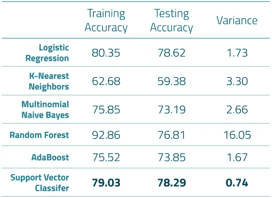

# Reddit 上的游戏，重温

> 原文：<https://towardsdatascience.com/gaming-on-reddit-revisited-74f12c8a95d2?source=collection_archive---------51----------------------->


Photo by [JESHOOTS.COM](https://unsplash.com/@jeshoots?utm_source=medium&utm_medium=referral) on [Unsplash](https://unsplash.com?utm_source=medium&utm_medium=referral)

## 自然语言处理和迭代数据科学的练习

大会数据科学沉浸式项目中最受欢迎的项目之一是围绕 reddit 展开的。你的目标是:选择两个子编辑，从每个子编辑中收集一千篇文章，然后建立一个模型，将文章分类到标题中正确的子编辑中。很容易看出为什么这是一个如此受欢迎的项目，它在 5 个项目中排名第 3，所以我们开始适应我们的新技能，我们可以选择自己的子项目，所以我们也可以从中获得一些乐趣。这是对数据科学家触手可及的强大技术的一个很好的体验。

对于我的实现，我选择了一个主题中的两个子主题，在这个主题中我有相当多的领域知识——游戏！至少从我出生的那一天起，我就已经是一名游戏玩家了(有传言但未经证实)，所以我非常兴奋能够找到自己对游戏世界的见解。我选择了两个主题相似但不同的子主题，r/gaming 和 r/pcgaming。


Photo by [Abdul Barie](https://unsplash.com/@abdulbarie_91?utm_source=medium&utm_medium=referral) on [Unsplash](https://unsplash.com?utm_source=medium&utm_medium=referral)

如果这两个子主题之间的区别不是很明显，其中一个涉及一般的游戏，可以包括任何家用游戏机、手机，甚至棋盘游戏。另一个子编辑专门处理电脑游戏，不仅仅是游戏本身，还有硬件、软件、外围设备等等，这往往是在电脑上玩游戏的独特体验。当然，两个子网格之间有很多重叠，这就是为什么这是一个很大的问题！

我最近决定花些时间再次运行这个项目，不仅是为了收集更多的数据，也是为了尝试实现一些我最初没有实现的改进。作为一名程序员，我确实成长了，所以即使从效率和可读性的角度来看，我也知道我想做很多改变。在项目中循环不仅仅是提高 ML 训练的机会，也是提高你的代码的好时机！

# 数据收集

和往常一样，第一步是实际获取将要使用的数据。最初，我只是编写了进行拉操作的代码，并就此打住。这一次，我想把它变成一个真正的函数，这样我就可以继续做这些事情，而不会用大量复制的代码块堵塞笔记本。

```
**def** reddit_puller(url, params, user_agent, pulls, post_list):
    *# adapting code from Boom Devahastin Na Ayudhya*

    **for** pull_num **in** range(int(pulls)):

        *# stating which pull is being attempted*
        print("Pulling data attempted", pull_num+1, "times")

        *# establishing the request code*
        res = requests.get(url, headers=user_agent, params=params)

        *# pull the correct data if the code is good*
        **if** res.status_code == 200:
            json_data = res.json()                      *#  Pull JSON*
            post_list.extend(json_data['data']['children']) *#  Get posts and extend the `posts` list* 

            *# updating url with the id of the last post in the pull*
            *# next pull will grab the following entries*
            after = json_data['data']['after']
            params["after"] = after

        **else**:
            print("There has been an error. The code is: ", res.status_code)
            **break**

        *# sleeping the func so we aren't locked out*
        time.sleep(2)
```

当我第一次从每个子编辑中提取帖子时，大量返回的内容都是重复的，第二次也是如此。在第二次搜索结束时，总共有大约 2400 个不同的条目。

# 清洁和分析

随着新数据的增加，我最初采取的清理步骤基本上没有改变。还有一些交叉帖子(帖子显示在两个子编辑中)和离群值(只有表情符号/表情符号的标题)，所以在我以前手动解决这些问题的地方，我编写了一些新的可扩展代码，不必在每次数据变化时都进行更改。

```
*# saving the cross-posts as new dfs*
gaming_cross_posts = gaming_df[gaming_df["title"].isin(pcgaming_df["title"]) == **True**]
pc_cross_posts = pcgaming_df[pcgaming_df["title"].isin(gaming_df["title"]) == **True**]*# dropping all the cross-posts*
gaming_df.drop(gaming_cross_posts.index, inplace=**True**)
pcgaming_df.drop(pc_cross_posts.index, inplace=**True**)
```

我还从上一次迭代中创建了一个新列，计算每个标题的字数。我已经制作了一个总字符长度的特性，但是我想给这个信息添加另一个维度。它不仅有助于深入了解数据和子数据本身，还可以在以后的建模阶段作为一个预测器。将数据可视化在直方图上，我可以清楚地看到标题长度的大量重叠，以及与 r/gaming 相比，r/pcgaming 中帖子的标题长度的明显变化。


事实上，越来越多的帖子标题在 10-15 个单词范围内，这表明 r/pcgaming 中讨论的内容可能更复杂。从建模的角度来看，这可能意味着一个较长的标题可能更有可能来自 r/pcgaming 而不是 r/gaming，但其有效性仍有待观察。

我还深入研究了单词本身，以便更好地了解哪些类型的语言构成了目标。我通过一个简单的`CountVectorizer`来运行数据，找出哪些单词是最常见的。然后通过几次迭代，我决定使用`PorterStemmer`来简化单词，并确定要删除的典型停用词，包括一些特定于该数据的附加停用词。


有了新数据，我不得不将这个过程重复几次，找出更多的停用词添加到我的列表中。最终，r/gaming 中大约有一半的热门词汇这次有所不同，r/pcgaming 的变化较少，其热门词汇的领先优势要高得多。


在经历数据科学项目的生命周期时，获取新数据并直接跳回建模阶段可能很有诱惑力，但 EDA 是重要的一步。并非每种情况都是一样的，因此，向已经有数百万条记录的数据集中添加几千条记录可能不会产生很大的影响，但在这种情况下，我将数据加倍，因此可能会有很大的变化。

# 建模

第一次，建模已经是一个相当复杂的过程。我对高度过度拟合的模型有很大的问题，但最终得到了一个方差很低、精确度在 70%左右的`AdaBoostClassifier`。我将矢量化步骤与带有`GridSearchCV`的`Pipeline`中的模型训练相结合，以便能够充分优化每种类型的分类算法。

这次我做了一些改变。因为我想添加我的工程功能——标题的字数和字符数——我知道我不能只保留我的旧管道。我还发现使用`TfidfVectorizer`比`CountVectorizer`给我带来了更好的结果，所以我决定做一个永久的改变，把它转移到预处理步骤，而不是网格搜索的一部分(这可能不是最好的主意，但是我会再回来)。因此，随着我的单词矢量化(现在是一个稀疏矩阵)，我将它们和我的额外数字列转换为数组，并将它们堆叠在一起，以获得我的新训练数据。

我再次运行了我所有的旧模型(逻辑回归、随机森林等等)，我注意到的第一件事是之前在这些模型中看到的过度拟合大幅下降。然而，对准确性分数似乎没有太大的影响(在任一方向上)。自从我第一次做这个项目以来，我遇到了更多类型的算法，所以我也想尝试一些新的东西，可能会更好地解决这个 NLP 问题。我在我的队列中添加了一个支持向量分类器，并希望得到一个惊人的结果。

我没有得到一个。我找出了我所有模型的度量标准——我在这个项目中做得很准确，因为这些类很好地平衡了，并且对假阳性或假阴性没有更大的损害——并对它们进行了比较。虽然 SVC 在我的列表中排在首位，但它实际上与逻辑回归模型有着相似的性能。



因此，在挑选“最佳”模型时，基本上取决于这两个模型，因为它们似乎给出了最佳的偏差/方差平衡(不像 KNN 或随机森林)。最后，我选择了 SVC 作为“最好的”,因为它使方差最小化的程度超过了逻辑回归对性能的改善。然而，由于 SVC 是一个“黑盒”模型，我仍然想利用逻辑回归来解释它。将系数与特征进行匹配，我能够找到在为模型做出决策时最重要的因素。


我们可以看到，我们在 EDA 中看到的单词最终在建模过程中非常重要——“Steam”、“trailer”和“release”是 r/pcgaming 中使用最多的三个单词。另一方面，有“快乐”和“朋友”这样的词意味着帖子不太可能来自 r/pcgaming。我不认为我想深究这可能会对 PC 游戏玩家说些什么，但我知道这对这个模型很有帮助。我还注意到，我制作的两个额外特性没有出现在系数列表的顶部，这有点令人失望。

# 包扎

那么，这个新的和改进的迭代(带有新的数据、特性和模型)实际上给我带来了什么呢？事实证明，并不多。我没有对性能产生很大的影响(我已经在 78%的准确范围内了)，但是我能够进一步减少我的方差，老实说，它并不是很大。

发生了什么事？我想到了几种可能性。一个是我没有给**足够的**新信息——也许 2400 个帖子不足以有效地训练一个关于这个问题的模型——但这感觉像是一种逃避，因为你几乎总是可以说你“需要更多数据”，我已经看到两次迭代之间相当一致的性能。另一个原因是我没有做足够的功能工程——也许我需要更深入地挖掘，并添加关于有多少评论的数据，或者隐藏在原始 JSON 文件中的这些帖子的另一个方面。我也可能对此过于简单，它需要更高级的 NLP，如 Word2Vec 和使用嵌入而不是“单词包”。

我看到的另一个大问题是我的建模。在最初的版本中，我测试和优化了不同的矢量器，作为网格搜索/管道功能的一部分。这一次，我添加了单独设计的功能，并决定重新配置我的预处理以使其更容易。在这样做的过程中，我删除了与新功能一起优化矢量化的能力——也许有了这些附加信息，TF-IDF 会有一组不同的参数来提高某些模型的精度，或者也许 CVEC 实际上是正确的选择。我最近了解到 ScitKit-Learn 的`ColumnTransformer`正是为了将不同的特性转换组合成一个管道，所以我想下一次我会修改我的代码来使用它

这绝对值得在 GA 课程结束后再来一次，并提供了一个很好的经验，让我们了解经历一个项目的多个周期是什么样的(并降低期望)。当然，你总是带着改善的意图回到某件事情上，但是有时你并没有产生太大的影响。不管怎样，这是一个学习和成长的机会，所以不要错过。

一如既往，感谢您乘坐数据科学列车，并让我知道您对该项目的想法 SVC 真的是最好的模型吗？我不应该设计更多的功能吗？下面评论！

请点击查看[完整项目回购。](https://github.com/ondovj/subreddit_classification)

也可以在 LinkedIn 上找我[。](https://www.linkedin.com/in/jeremy-ondov/)