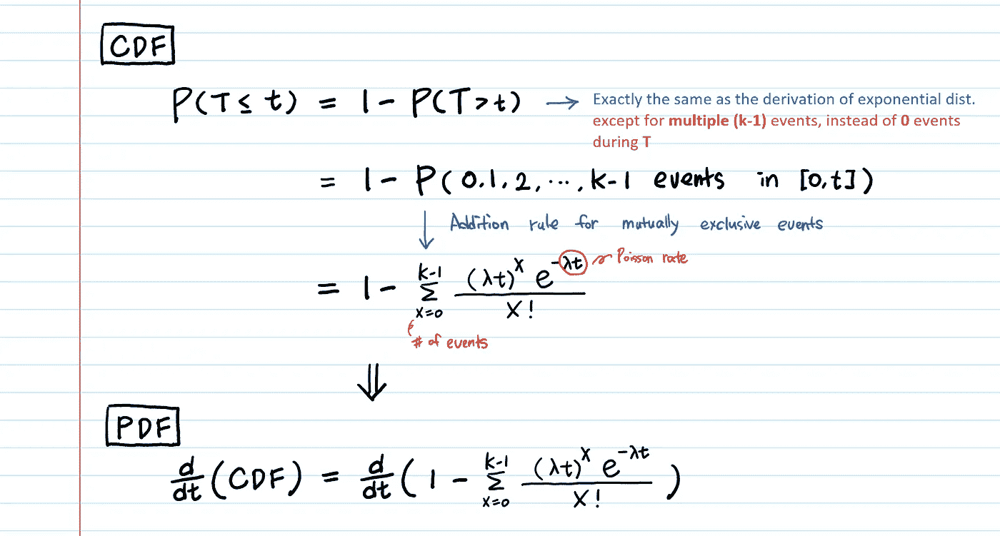
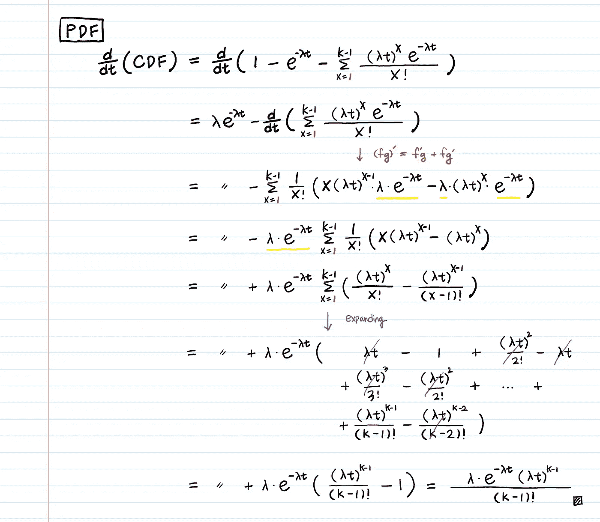
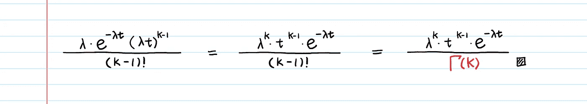
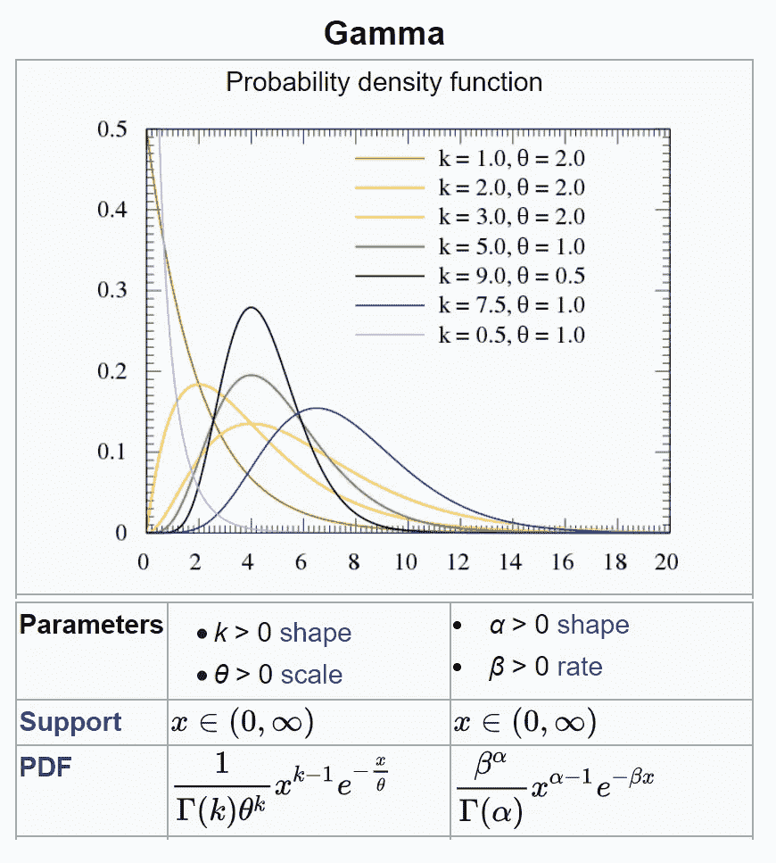
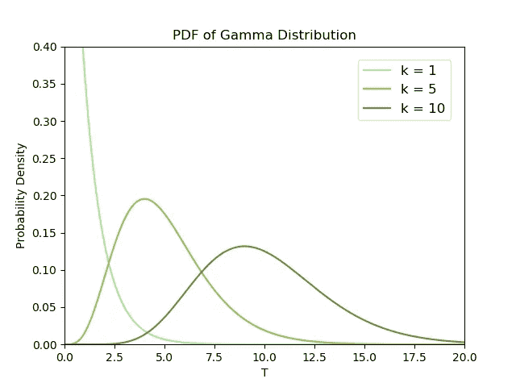
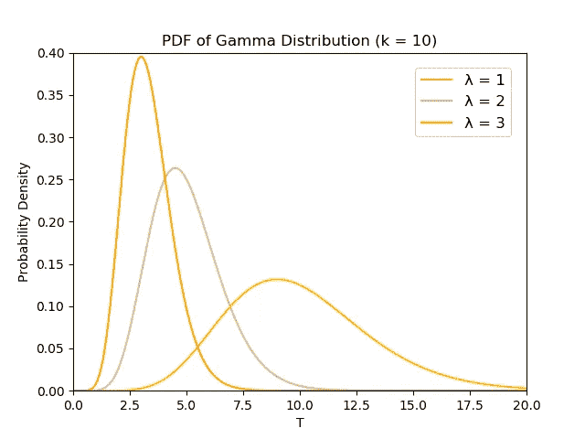
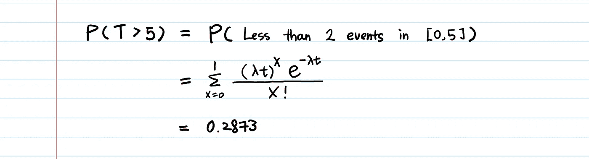

# 伽马分布——直觉、推导和例子

> 原文：<https://towardsdatascience.com/gamma-distribution-intuition-derivation-and-examples-55f407423840?source=collection_archive---------0----------------------->

## 为什么这很重要？

在设置伽马的两个参数 ***α，β*** 并将其代入公式之前，我们先暂停一下，问几个问题…

> 为什么我们必须发明伽马分布？(即为什么会存在这种分布？)
> 
> 伽玛分布应该在什么时候用于建模？

# 1.我们为什么要发明伽马分布？

**答:预测未来事件发生前的等待时间。**

> 嗯，好吧，但我认为这就是指数分布的用途。
> 那么，**指数分布和伽玛分布有什么区别？**

指数分布预测等待时间，直到***第一个*** 事件。另一方面，伽马分布预测等待时间，直到第*** k ***事件发生。

# 2.让我们从零开始推导伽玛的 PDF！

在我们之前的[文章](/what-is-exponential-distribution-7bdd08590e2a)中，我们从泊松过程中推导出了指数分布的 PDF。如果你还没有学过，我强烈推荐你学习泊松分布。很好地理解它们对于理解伽马井是绝对必要的。你阅读的顺序应该是 1。[阿松](/poisson-distribution-intuition-and-derivation-1059aeab90d)，2。[指数](/what-is-exponential-distribution-7bdd08590e2a)，3。伽马射线。

**伽玛分布的 PDF 的推导与指数分布的 PDF 非常相似，除了一点**——它是直到第 k 个事件的**的等待时间，而不是第一个事件**的**。**

```
< Notation! >* **T** : the random variable for **wait time until the k-th event** (This is the random variable of interest!)
* **Event arrivals are modeled by a Poisson process with rate λ.*** **k** : the 1st parameter of Gamma. **The # of events** for which you are waiting.
* **λ** : the 2nd parameter of Gamma. **The rate of events** happening which follows the Poisson process.* **P(T > t) :** The probability that the waiting time until the **k**-th event is greater than **t** time units
* **P(X = k in t time units) :** The Poisson probability of **k** events occuring during **t** time units
```

[和往常一样](/what-is-exponential-distribution-7bdd08590e2a#170d)，为了得到 PDF，我们会先找到 CDF，然后微分。



现在，我们来区分一下。

为了便于微分，我们从求和中去掉 x = 0 时的项(**【e^(-λt】)**)。



我们得到了伽玛分布的 PDF！

推导看起来很复杂，但我们只是重新排列变量，应用微分的乘积法则，展开求和，并划掉一些。

如果你看看求导的最终输出，你会注意到它和指数分布的 PDF 是一样的，当 **k** =1 时。

由于 **k** 是正整数(事件 **k** 的数量)，**𝚪(k)=(k1)！**其中𝚪表示伽玛函数。最终产品可以改写为:



> 如果事件的到达遵循速率为λ的泊松过程，则直到 k 个到达的等待时间遵循γ(k，λ)。

# 3.伽玛的参数:形状还是尺度？！

伽马的参数化有两个方面让我们困惑！



From [https://en.wikipedia.org/wiki/Gamma_distribution](https://en.wikipedia.org/wiki/Gamma_distribution)

一个是它有两个不同的参数化集合——(**k**， **θ** ) & ( **α** ，**β**)——以及不同形式的 PDF。另一个原因是，对于“**标度**”参数应该是什么，还没有普遍的共识。

让我们澄清这一点。

第一个问题很容易解决。

对于( **α** ， **β** )参数化:使用我们的符号 **k** (事件数量)& **λ** (事件发生率)，简单地用 **k** 代替 **α** ，用 **λ** 代替 **β** 。PDF 保持和我们推导的一样的格式。
对于 **(k，θ)** 参数化 **:** **θ** 是**事件率λ** 的倒数，也就是[平均等待时间](/what-is-exponential-distribution-7bdd08590e2a#a19e)(事件到达的平均间隔时间)。

即使 pdf 有不同的格式，两个参数化生成相同的模型。就像为了定义直线，一些使用斜率和 y 截距，而另一些使用 x 截距和 y 截距，选择一个参数化而不是另一个参数化是一个品味问题。在我看来，使用λ作为速率参数更有意义，考虑到我们如何使用泊松速率λ推导出指数和伽马。我还发现( **α** ， **β** )参数化更容易集成。

第二，一些作者称 **λ** 为标度参数，而另一些作者称 **θ=1/λ** 为标度参数。依我看，“形状”或“比例”参数实际上更像是用词不当。我用不同的 **k** & **λ** 集合绘制了多个 Gamma pdf(k**k**和 **λ** 有无限多种参数选择，因此有无限多种可能的 Gamma 分布)，并实现了 **k** (和 **λ)同时改变“形状”和“比例”**。无论是谁认真地给它们命名，都可以给出更直观的名字，例如——事件的数量和泊松比！

眼见为实！让我们想象一下🌈

```
Recap:**k** : **The number of events** for which you are waiting to occur.
**λ** : **The rate of events** happening which follows the Poisson process.
```



对于一个固定的速率 **λ** ，如果我们等待更多的事件( **k** )发生，等待时间( **T** )会更长。



对于固定数量的事件 **k** ，当事件率 **λ** 较高时，我们等待的时间 **T** 较短。

下面是生成上面美丽情节的 Python 代码。(自己画出来，看看两个参数是怎么改变“比例”和“形状”的！)

```
import numpy as np
from scipy.stats import gamma
import matplotlib.pyplot as pltdef plot_gamma_k():
    """
    k : the number of events for which you are waiting to occur.
    λ : the rate of events happening following Poisson dist.
    """
    x = np.linspace(0, 50, 1000)
    a = 1  # k = 1
    mean, var, skew, kurt = gamma.stats(a, moments='mvsk')
    y1 = gamma.pdf(x, a)
    a = 5  # k = 5
    mean, var, skew, kurt = gamma.stats(a, moments='mvsk')
    y2 = gamma.pdf(x, a)
    a = 10  # k = 15
    mean, var, skew, kurt = gamma.stats(a, moments='mvsk')
    y3 = gamma.pdf(x, a)plt.title("PDF of Gamma Distribution")
    plt.xlabel("T")
    plt.ylabel("Probability Density")
    plt.plot(x, y1, label="k = 1", color='palegreen')
    plt.plot(x, y2, label="k = 5", color='yellowgreen')
    plt.plot(x, y3, label="k = 10", color='olivedrab')
    plt.legend(bbox_to_anchor=(1, 1), loc='upper right',
               borderaxespad=1, fontsize=12)
    plt.ylim([0, 0.40])
    plt.xlim([0, 20])
    plt.savefig('gamma_k.png')
    plt.clf()def plot_gamma_lambda():
    """
    k : the number of events for which you are waiting to occur.
    λ : the rate of events happening following Poisson dist.
    """
    a = 10  # k = 10
    x = np.linspace(0, 50, 1000)
    lambda_ = 1
    mean, var, skew, kurt = gamma.stats(a, scale=1/lambda_, moments='mvsk')
    y1 = gamma.pdf(x, a, scale=1/lambda_)
    lambda_ = 2
    mean, var, skew, kurt = gamma.stats(a, scale=1/lambda_, moments='mvsk')
    y2 = gamma.pdf(x, a, scale=1/lambda_)
    lambda_ = 3
    mean, var, skew, kurt = gamma.stats(a, scale=1/lambda_, moments='mvsk')
    y3 = gamma.pdf(x, a, scale=1/lambda_)plt.title("PDF of Gamma Distribution (k = 10)")
    plt.xlabel("T")
    plt.ylabel("Probability Density")
    plt.plot(x, y1, label="λ = 1", color='gold')
    plt.plot(x, y2, label="λ = 2", color='burlywood')
    plt.plot(x, y3, label="λ = 3", color='darkorange')
    plt.legend(bbox_to_anchor=(1, 1), loc='upper right',
               borderaxespad=1, fontsize=12)
    plt.ylim([0, 0.40])
    plt.xlim([0, 20])
    plt.savefig('gamma_lambda.png')
    plt.clf()
```

ipynb 中的代码:[https://github . com/aerinkim/towards data science/blob/master/Gamma % 20 distribution . ipynb](https://github.com/aerinkim/TowardsDataScience/blob/master/Gamma%20Distribution.ipynb)

# 4.示例 IRL🔥

我们可以在使用指数分布的每个应用中使用伽马分布— [**等待时间建模、可靠性(故障)建模、服务时间建模(排队论)等。**](/what-is-exponential-distribution-7bdd08590e2a#f4b9) —因为指数分布是伽马分布的特例(只需将 **1** 插入 **k** )。

***【排队论举例】*** *你去了 Chipotle，排在你前面的是两个人的队。一个在被服务，另一个在等待。他们的服役时间***和* ***S2*** *都是独立的，指数随机变量用一个* ***的 2 分钟平均值*** *表示。(因此平均服务率为****. 5/分钟*** *)。如果这个“速率对时间”的概念让你困惑，读读* [*这个*](/what-is-exponential-distribution-7bdd08590e2a#a19e) *就能搞清楚。)**

****你排队等 5 分钟以上的概率是多少？****

**

*我们所做的只是将 **t = 5** 和 **λ = 0.5** 代入我们已经导出的伽马分布的 CDF 中。这就是我们在[中提到的指数随机变量之和](/sum-of-exponential-random-variables-b023b61f0c0f)的例子。如你所见，我们也可以用伽玛的 CDF 来解决这个问题。*

*我在 Chipotle 等 5 分钟以上的几率不到 30%？我要那个！*

*需要注意一些事情:*

1.  *泊松、指数和伽玛分布对同一过程(泊松过程)的不同方面进行建模。
    泊松分布用于模拟未来事件的数量，指数分布用于预测直到第一个事件的等待时间**，伽马分布用于预测直到第 k 个事件**的等待时间**。***
2.  *伽马的两个参数都是严格正的，因为一个是事件数，一个是事件率。他们不可能是消极的。*
3.  *伽玛分布的特殊情况*

```
*╔═════════════╦══════════════════════╦══════════════════════╗
║    Dist.    ║           **k**          ║           **λ**          ║
╠═════════════╬══════════════════════╬══════════════════════╣
║ Gamma       ║ **positive** **real number** ║ positive realnumber ║
║ Exponential ║           **1**          ║"║
║ Erlang      ║   **positive** **integer** ║           "          ║
╚═════════════╩══════════════════════╩══════════════════════╝*
```

*Erlang 和 Gamma 的区别在于，在 Gamma 分布中， **k** 可以是**非整数(正实数)**，而在 Erlang 中， **k** 只能是**正整数。***

## *你可能喜欢的其他直观的文章:*

*[](/poisson-distribution-intuition-and-derivation-1059aeab90d) [## 泊松分布直觉(和推导)

### …为什么会有这种分布？(=泊松为什么要发明这个？)…](/poisson-distribution-intuition-and-derivation-1059aeab90d) [](/gamma-function-intuition-derivation-and-examples-5e5f72517dee) [## 伽马函数——直觉、推导和例子

### …什么样的函数可以平滑地连接这些点，并给出所有实数值的阶乘？…](/gamma-function-intuition-derivation-and-examples-5e5f72517dee) [](/what-is-exponential-distribution-7bdd08590e2a) [## 什么是指数分布

### …指数参数λ与泊松中的参数相同吗？…](/what-is-exponential-distribution-7bdd08590e2a) [](/beta-distribution-intuition-examples-and-derivation-cf00f4db57af) [## 贝塔分布——直觉、例子和推导

…二项式和贝塔式的区别在于前者模拟成功的次数，而后者模拟成功的概率…](/beta-distribution-intuition-examples-and-derivation-cf00f4db57af)*