# 伽马函数——直觉、推导和例子

> 原文：<https://towardsdatascience.com/gamma-function-intuition-derivation-and-examples-5e5f72517dee?source=collection_archive---------3----------------------->

## 它的性质、证明和图形

我为什么要在乎？

**许多概率分布都是用伽玛函数**定义的——如伽玛分布、贝塔分布、狄利克雷分布、卡方分布、学生 t 分布等。对于数据科学家、机器学习工程师、研究人员来说，伽马函数可能是**使用最广泛的函数之一**，因为它在许多分布中被采用。然后，这些分布用于贝叶斯推理、随机过程(如排队模型)、生成统计模型(如潜在的狄利克雷分配)和变分推理。所以，**如果你很好的理解了伽马函数，你就会对它出现的很多应用有更好的理解！**

# 1.为什么我们需要伽马函数？

> 因为我们要推广阶乘！

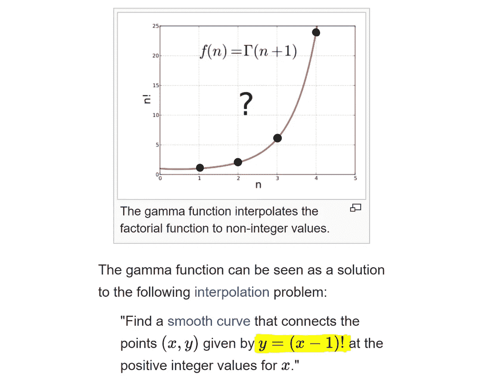

**f(1) = 1, f(2) = 2!, f(3) = 3!, f(4) = 4!,** … [https://en.wikipedia.org/wiki/Gamma_function](https://en.wikipedia.org/wiki/Gamma_function)

阶乘函数仅针对离散点定义(正整数的**——上图中的黑点**),但是**我们想要连接黑点**。我们希望将阶乘函数扩展到所有复数。阶乘的简单公式， **x！= 1 * 2 *……* x**，不能直接用于小数值，因为它仅在 **x** 为整数时有效。

所以数学家们一直在寻找…

> "什么样的函数能平滑地连接这些点，并给出所有实数值的阶乘？"


然而，他们找不到可以表达 x 的和、积、幂、指数或对数的有限组合。对于实数，直到…

# 2.欧拉发现了伽马函数。(在 18 世纪)

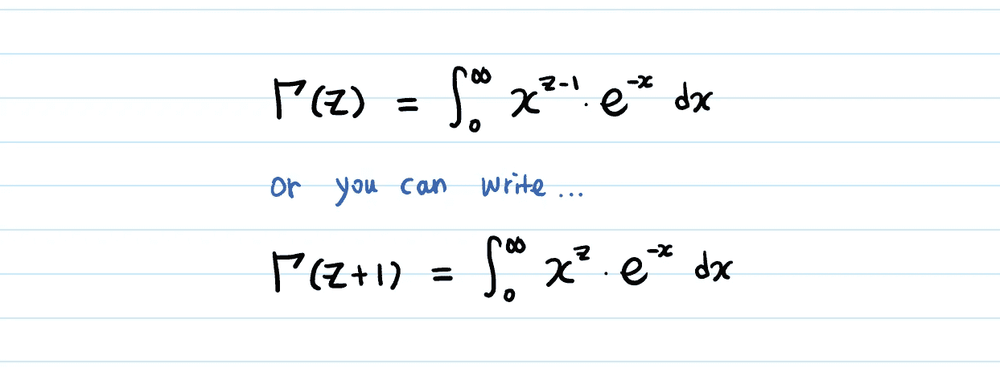

[The Gamma Function: Euler integral of the second kind](https://en.wikipedia.org/wiki/Euler_integral)

上面的公式用于为 **z** 的任何真实值找到伽马函数的值。

假设你要计算**γ(4.8)**。你会如何解决上面的整合？
**可以手算γ(4.8)吗？也许用分部积分？**

试试看，如果你找到了一个有趣的方法，请告诉我！对我来说(到目前为止还有很多人)，没有快速简单的方法来手动计算分数的伽玛函数。(如果有兴趣手工解决，这里有一个很好的[起点](https://math.stackexchange.com/questions/215352/why-is-gamma-left-frac12-right-sqrt-pi)。)

好吧，那么，忘掉分析吧。**能不能用编程的方式实现这个从 0 到无穷大的积分——加上无限次这个项？**

您可以通过几种方式实现这一点。最常用的两种实现是 [**斯特林近似**](https://en.wikipedia.org/wiki/Stirling%27s_approximation) 和 [**兰佐斯近似**](https://en.wikipedia.org/wiki/Lanczos_approximation) 。

```
For implementation addicts: [the codes of Gamma function (mostly Lanczos approximation) in 60+ different language - C, C++, C#, python, java, etc.](https://rosettacode.org/wiki/Gamma_function)
```

让我们使用已经实现的[计算器](https://www.medcalc.org/manual/gamma_function.php)来计算**γ(4.8)**。

我们得到了 **17.837** 。

**17.837 落在 3！(=γ(4)= 6)**和 **4！(=γ(5)= 24)**—不出我们所料。

> (当 **z** 为自然数时，**γ(z)=(z-1)！我们很快就会证明这一点。)**

与阶乘只取正整数不同，我们可以在 **z** 中输入任何实数/复数，包括负数。Gamma 函数连接黑点，并很好地绘制曲线。

```
**Confusion-buster**: We are **integrating over x (NOT z)** from 0 to infinity. • **x** is a helper variable that is being integrated out.
• We are NOT plugging 4.8 into **x**. We are plugging 4.8 into **z**.
```

# 3.伽玛函数如何插值阶乘函数？


如果你看一下伽玛函数，你会注意到两件事。

首先，它肯定是一个关于 z 的递增函数**。**

二、当 **z** 为自然数时，**γ(z+1)= z！**
(我保证我们很快就会证明这一点！)

因此，我们可以期望伽马函数连接阶乘。

**伽马函数怎么会以现在的术语 x^z 和 e^-x 结束？**

我不知道欧拉的思想过程到底是怎样的，但他是发现自然数 **e** 的人，所以他一定做了很多实验，用 **e** 乘以其他函数来找到现在的形式。

# 4.伽马函数的图形会是什么样子？


**当 x 趋于无穷大时∞，第一项(x^z)也趋于无穷大∞，但第二项(e^-x)趋于零。**

> 那么，伽玛函数会收敛到有限值吗？

我们可以用洛必达法则严格证明它是收敛的。但我们也可以毫不费力地看到它的收敛。你想想，我们是在积分一个 **x^z** — **的乘积一个多项式递增函数** — 和 **e^-x** — **一个** **指数递减函数**。**因为 e^-x** **的值比 x^z 的值下降得更快，所以伽马函数很可能收敛并具有有限的值。**

让我们画出每个图表，从眼见为实开始。

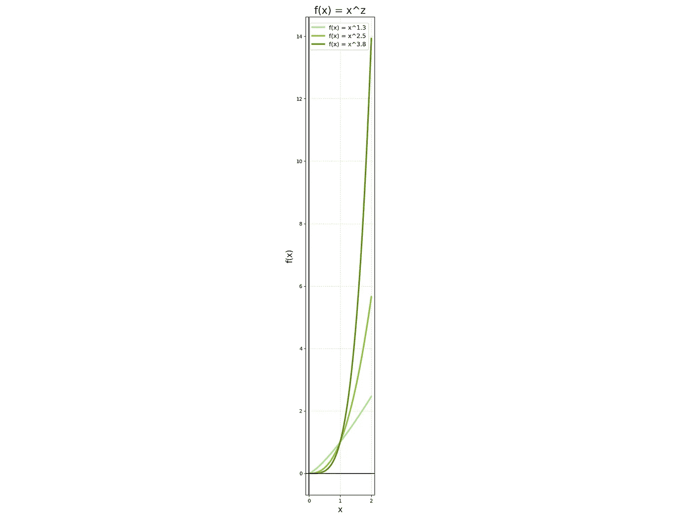

The first term **x^z** — polynomially increasing function.

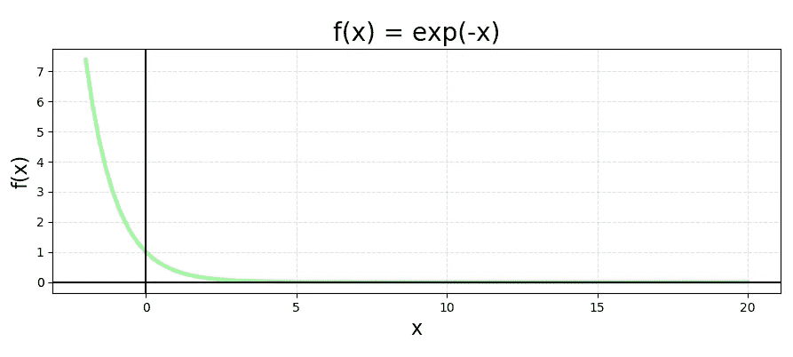

The second term **e^-x** — exponentially decreasing function.

## x^z * e^-x 的图

再来看**γ(4.8)**的情况。

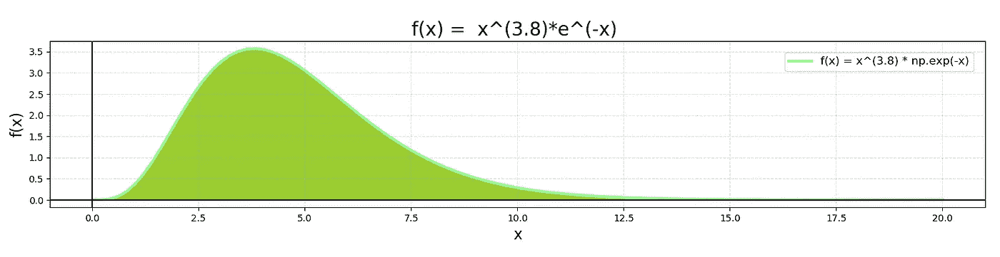

## 图下绿色阴影区域，表示从 0 到无穷大，为**γ(4.8)= 3.8！**

Python 代码用于生成上面的美丽情节。自己画出来，看看 **z** 如何改变伽玛函数的形状！

```
**########################
# f(x) = exp(-x) graph #
########################**import matplotlib.pyplot as plt
import numpy as np# Create x and y
x = np.linspace(-2, 20, 100)
y = np.exp(-x)# Create the plot
fig, ax = plt.subplots()
plt.plot(x, y, label='f(x) = exp(-x)', linewidth=3, color='palegreen')# Make the x=0, y=0 thicker
ax.set_aspect('equal')
ax.grid(True, which='both')
ax.axhline(y=0, color='k')
ax.axvline(x=0, color='k')# Add a title
plt.title('f(x) = exp(-x)', fontsize=20)# Add X and y Label
plt.xlabel('x', fontsize=16)
plt.ylabel('f(x)', fontsize=16)# Add a grid
plt.grid(alpha=.4, linestyle='--')# Show the plot
plt.show()**####################
# f(x) = x^z graph #
####################**import matplotlib.pyplot as plt
import numpy as np# Create x and y
x = np.linspace(0, 2, 100)
y1 = x**1.3
y2 = x**2.5 
y3 = x**3.8# Create the plot
fig, ax = plt.subplots()
plt.plot(x, y1, label='f(x) = x^1.3', linewidth=3, color='palegreen')
plt.plot(x, y2, label='f(x) = x^2.5', linewidth=3, color='yellowgreen')
plt.plot(x, y3, label='f(x) = x^3.8', linewidth=3, color='olivedrab')# Make the x=0, y=0 thicker
ax.set_aspect('equal')
ax.grid(True, which='both')
ax.axhline(y=0, color='k')
ax.axvline(x=0, color='k')# Add a title
plt.title('f(x) = x^z', fontsize=20)# Add X and y Label
plt.xlabel('x', fontsize=16)
plt.ylabel('f(x)', fontsize=16)# Add a grid
plt.grid(alpha=.4, linestyle='--')# Add a Legend
plt.legend(bbox_to_anchor=(1, 1), loc='best', borderaxespad=1, fontsize=12)# Show the plot
plt.show()**###############################
# f(x) = x^(3.8)*e^(-x) graph #
###############################**import matplotlib.pyplot as plt
import numpy as np# Create x and y
x = np.linspace(0, 20, 100)
y = x**3.8 * np.exp(-x)# Create the plot
fig, ax = plt.subplots()
plt.plot(x, y, label='f(x) = x^(3.8) * np.exp(-x)', linewidth=3, color='palegreen')
ax.fill_between(x, 0, y, color='yellowgreen')# Make the x=0, y=0 thicker
ax.set_aspect('equal')
ax.grid(True, which='both')
ax.axhline(y=0, color='k')
ax.axvline(x=0, color='k')# Add a title
plt.title('f(x) =  x^(3.8)*e^(-x) ', fontsize=20)# Add X and y Label
plt.xlabel('x', fontsize=16)
plt.ylabel('f(x)' ,fontsize=16)# Add a grid
plt.grid(alpha=.4, linestyle='--')# Add a Legend
plt.legend(bbox_to_anchor=(1, 1), loc='upper right', borderaxespad=1, fontsize=12)# Show the plot
plt.show()
```

ipynb 中的代码:[https://github . com/aerinkim/towards data science/blob/master/Gamma % 20 function . ipynb](https://github.com/aerinkim/TowardsDataScience/blob/master/Gamma%20Function.ipynb)

# 5.伽玛函数属性

如果你从这篇文章中拿走一样东西，那应该是这一部分。

```
**Property 1.****given z > 1****Γ(z)   = (z-1) * Γ(z-1)** or you can write it as
**Γ(z+1) =  z    * Γ(z)**
```

让我们用分部积分和伽玛函数的定义来证明它。

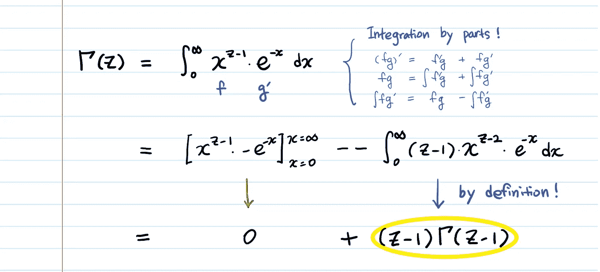

Red Arrow: the value of **e^-x** decreases much more quickly than that of **x^z**

证明得很漂亮！

```
**Property 2\.** If **n** is a positive integer**Γ(n) = (n-1)!**
```

让我们用性质 1 来证明它。

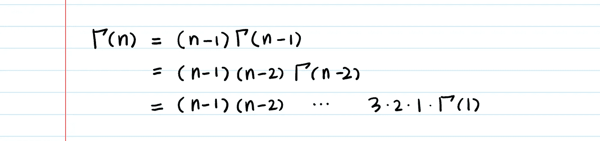

什么是**γ(1)**？

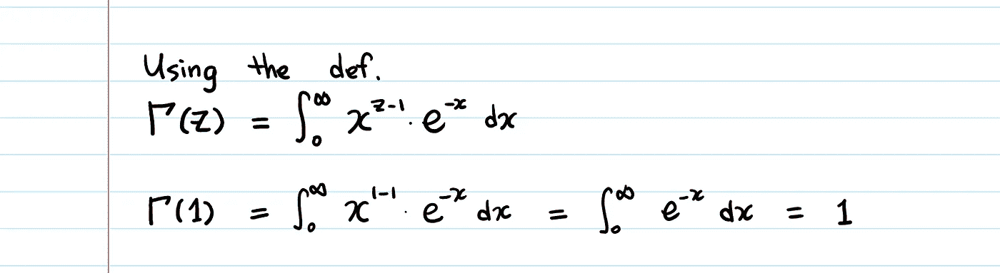

所以，**γ(n)=(n-1)！**

```
You might have also seen the expression **Γ(n+1) = n!** instead of 
**Γ(n) = (n-1)!**.This is just to make the right hand side **n!**, instead of **(n-1)!** 
All we did was to shift n by 1.
```

# 6.利用伽玛函数的性质，显示伽玛分布的 PDF 积分为 1。

快速回顾一下伽马“分布”(不是伽马“功能”！):[伽玛分布直觉和推导。](https://medium.com/@aerinykim/gamma-distribution-intuition-derivation-and-examples-55f407423840)

证据如下:

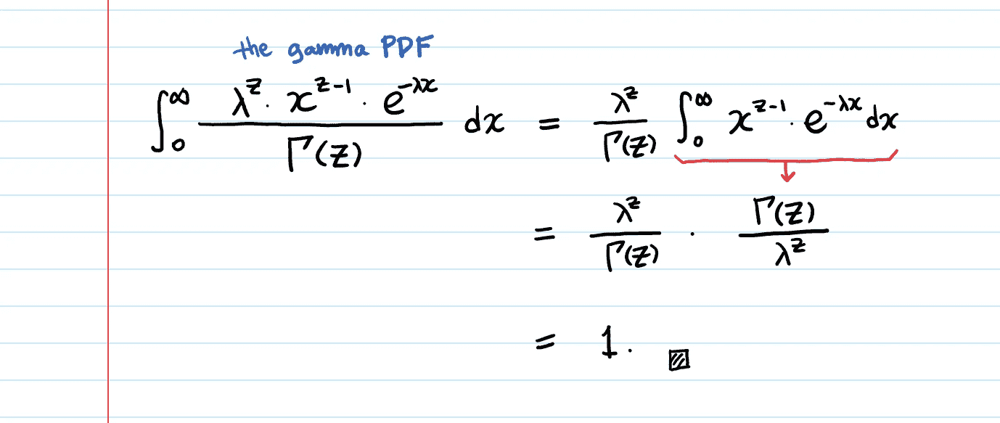

对于证明上瘾者:让我们证明上面的红色箭头。


我们将使用代换积分。

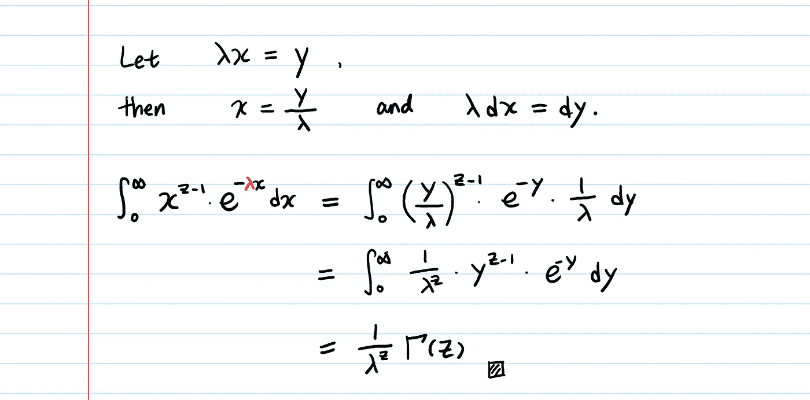

再次漂亮证明！

需要注意一些事情:

1.  伽马函数有多老了？

很老了。大约 300 年了。(你今天是不是在做一件 300 年后还会用到的东西？；)

一个有趣的旁注:欧拉在 64 岁时失明，但他在失明后创作了几乎一半的作品。

2.一些有趣的值:

```
**Γ(1/2) = sqrt(𝜋)**Many interesting ways to show this:
[https://math.stackexchange.com/questions/215352/why-is-gamma-left-frac12-right-sqrt-pi](https://math.stackexchange.com/questions/215352/why-is-gamma-left-frac12-right-sqrt-pi)**Γ(-1/2) = -2 * sqrt(𝜋)****Γ(-1) = Γ(-2) = Γ(-3) = infinity ∞**
```

你能证明这些吗？

3.这是实数伽马函数的图表。

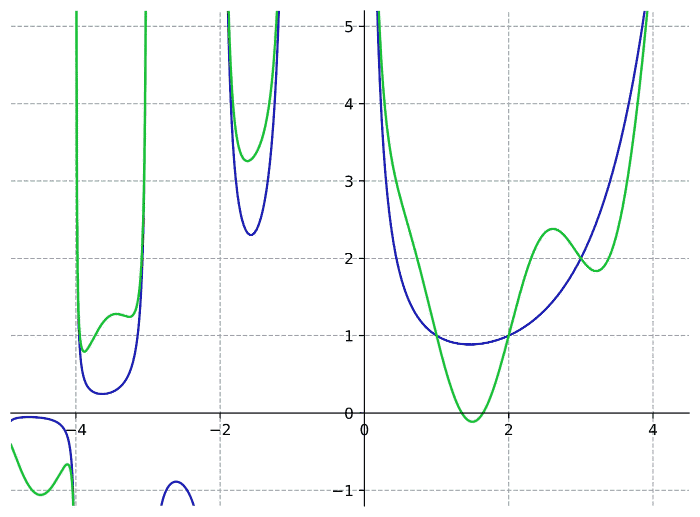

[https://en.wikipedia.org/wiki/Gamma_function](https://en.wikipedia.org/wiki/Gamma_function)

伽马函数，蓝色的**γ(z)**，以及绿色的**γ(z)+sin(πz)**。(注意**正整数**处的交集，因为 **sin(πz)为零**！)两者都是非整数阶乘的有效解析延拓。

4.伽马函数也出现在[n 球体积的一般公式](https://en.wikipedia.org/wiki/Volume_of_an_n-ball)中。