# GAN 基因座

> 原文：<https://towardsdatascience.com/gan-loci-e2bbd1b4926f?source=collection_archive---------13----------------------->

## 神经网络能揭示使“空间”成为“场所”的隐性属性吗？

这个项目应用生成性对抗网络(或 GANs)来制作合成图像，捕捉城市场所的主要视觉特性。以这种方式描绘城市代表了第一次尝试用计算机来记录一个城市的场所精神:那些形式、空间和光的质量，它们体现了一个特定的位置，并使它区别于类似的地方。

Nine synthetic images of urban places.

本文介绍了收集城市图像数据的方法，对这些数据进行必要的处理和格式化的方法，以及训练两种已知的计算统计模型( [StyleGAN](https://github.com/NVlabs/stylegan) 和 [Pix2Pix](https://arxiv.org/abs/1611.07004) )的方法，这两种模型可以识别特定地点的视觉模式，并复制这些模式以生成新的图像。这些方法已经被应用到美国和欧洲的六个城市的九个不同的城市环境中，其结果将在我们的下一篇文章中展示。

> 当一个城镇因其独特的个性而让我们高兴时，通常是因为它的大多数建筑都以同样的方式与大地和天空联系在一起；它们似乎表达了一种常见的生活形式，一种地球上常见的生存方式。因此，它们构成了一个允许人类识别的场所。克里斯蒂安·诺伯格-舒尔茨，《场所精神:走向建筑现象学》，第 63 页

# 动机

虽然对于许多建筑师和城市设计师来说 ***设计意图是一个必然默认的概念*** ，但大多数 CAD 工具只支持明确表达其作者的意图。相比之下，该项目代表了向基于机器学习技术的 ***CAD 工具的新方法迈出的一小步，这些工具旨在更好地支持隐性或难以表达的设计意图*** 。为了清楚地展示这样的设计意图的需要，我们在这里考虑一个场景，它提供了一个特别难以明确表达的建筑环境的质量:“场所”现象。

克里斯蒂安·诺伯格-舒尔茨(Christian Norberg-Schulz)在他定义现象学方法的开创性著作《场所精神:走向建筑现象学》中指出，城市和建筑的设计必须以“场所”的建设为中心，他将其定义为“具有独特特征的空间”(诺伯格-舒尔茨 94)。但是，这种“独特的特征”是如何定义的呢？如何使用数字工具以提供计算媒体优势的方式捕捉它呢？在对更好地支持隐性设计意图发展的未来工具的预期中，**我们寻求利用机器学习中的方法来试图捕捉“位置”**，正如 Norberg-Schulz 所描述的。

这个项目的目标是使用 GAN 作为隐性设计的工具，并应用这种技术的能力来捕捉一组图像的隐含而突出的视觉属性。我们推测，这种能力将被证明有助于揭示和编码对场所的现象学理解。本文概述了训练生成性对抗网络(GAN)以生成捕捉城市环境主要视觉属性的图像所需的步骤。这项工作分三个阶段进行:数据准备、模型训练和潜在空间探索。

# 数据准备

在数据准备阶段，我们首先收集、清理和整理大量与城市环境相关的图像，这些城市环境是明显不同类型的地方，并将这些图像编辑成不同的集合。然后，这些图像的每一组被处理以用作两个 ML 模型之一的训练数据。

为此，开发了一个 Python 库，支持使用 Google 的 StreetView API 收集、管理和处理全景图像。本节详细描述了这一过程，包括:与识别期望的地理位置相关的任务，从该位置收集大量不同的图像集，管理该图像集以定义有效图像的相关子集，以及最后，处理这些图像以使它们被适当地格式化用于训练。

Coordinate locations of 560 requests for panoramic images in Cambridge, MA (left) and the actual geo-locations from which 470 panoramic images were taken (right)

数据收集从识别感兴趣的地理位置开始。由于拍摄全景图的图像可能与感兴趣的给定地理位置不一致，因此必须考虑许多故障情况。例如:不是所有感兴趣的位置都与全景相关，也不是所有的全景都描绘外部城市环境(也有内部全景)。对于下面列出的九个城市环境中的每一个，大约有 500 个全景被采样。

*   [荷兰鹿特丹 Blijdorp](https://www.google.com/maps/place/51%C2%B055'38.6%22N+4%C2%B027'58.3%22E/@51.9274137,4.4662052,3a,75y,90t/data=!3m4!1e1!3m2!1s*211m2*211y5171316202178896221*212y17851083259198634954*215m2*211x0*212x0!6s%2F%2Fgeo3.ggpht.com%2Fmaps%2Fphotothumb%2Ffd%2Fv1%3Fbpb%3DChAKDnNlYXJjaC5UQUNUSUxFEiAKEgldYRjkrzTERxHK-3Qopcm79yoKDQAAAAAVAAAAABoFCHgQ6AI%26gl%3DUS!4m5!3m4!1s0x0:0x0!8m2!3d51.92738!4d4.466203)
*   [佛罗里达州杰克逊维尔匹克威克公园](https://www.google.com/maps/place/30%C2%B012'25.6%22N+81%C2%B037'40.5%22W/@30.2068691,-81.6282694,3a,75y,59.09h,84.69t/data=!3m4!1e1!3m2!1s*211m2*211y9864511613807048521*212y16051689557954240538*215m2*211x0*212x0!6s%2F%2Fgeo3.ggpht.com%2Fmaps%2Fphotothumb%2Ffd%2Fv1%3Fbpb%3DChAKDnNlYXJjaC5UQUNUSUxFEiAKEglJN69fDMnliBEaoLWCmw7D3ioKDQAAAAAVAAAAABoECFYQVg%26gl%3DUS!4m5!3m4!1s0x0:0x0!8m2!3d30.207098!4d-81.627929)
*   [纽约州布鲁克林区威廉斯堡](https://www.google.com/maps/place/40%C2%B042'56.2%22N+73%C2%B056'54.5%22W/@40.7155441,-73.9487997,3a,75y,90t/data=!3m4!1e1!3m2!1s*211m2*211y9926594771599410009*212y4942418715199128142*215m2*211x0*212x0!6s%2F%2Fgeo1.ggpht.com%2Fmaps%2Fphotothumb%2Ffd%2Fv1%3Fbpb%3DChAKDnNlYXJjaC5UQUNUSUxFEiAKEglZw272WVnCiRFOwq-qov-WRCoKDQAAAAAVAAAAABoECFYQVg%26gl%3DUS!4m5!3m4!1s0x0:0x0!8m2!3d40.715607!4d-73.948484)
*   [佛罗里达州盖恩斯维尔东校区](https://www.google.com/maps/place/29%C2%B038'57.4%22N+82%C2%B020'08.2%22W/@29.6492916,-82.3358402,3a,75y,90t/data=!3m4!1e1!3m2!1s*211m2*211y9865314776326021231*212y5955640966679219282*215m2*211x0*212x0!6s%2F%2Fgeo3.ggpht.com%2Fmaps%2Fphotothumb%2Ffd%2Fv1%3Fbpb%3DChAKDnNlYXJjaC5UQUNUSUxFEiAKEglvIFM4haPoiBFSzK2k56-mUioKDQAAAAAVAAAAABoECFYQVg%26gl%3DUS!4m5!3m4!1s0x0:0x0!8m2!3d29.649282!4d-82.335609)
*   [加州旧金山阿拉莫广场](https://www.google.com/maps/place/37%C2%B046'31.4%22N+122%C2%B025'58.1%22W/@37.7752163,-122.4327636,3a,75y,90t/data=!3m4!1e1!3m2!1s*211m2*211y9260949654923171901*212y12850982228471970350*215m2*211x0*212x0!6s%2F%2Fgeo3.ggpht.com%2Fmaps%2Fphotothumb%2Ffd%2Fv1%3Fbpb%3DChAKDnNlYXJjaC5UQUNUSUxFEiAKEgk92HgApYCFgBEu-u3WP9xXsioKDQAAAAAVAAAAABoECFYQVg%26gl%3DUS!4m5!3m4!1s0x0:0x0!8m2!3d37.775383!4d-122.432817)
*   [加利福尼亚州奥克兰市亚当斯角](https://www.google.com/maps/place/37%C2%B048'38.1%22N+122%C2%B015'15.4%22W/@37.8106013,-122.254488,3a,75y,179.66h,90t/data=!3m7!1e1!3m5!1siAynKUQqMsdqj8SyRUHTsA!2e0!6s%2F%2Fgeo3.ggpht.com%2Fcbk%3Fpanoid%3DiAynKUQqMsdqj8SyRUHTsA%26output%3Dthumbnail%26cb_client%3Dsearch.TACTILE.gps%26thumb%3D2%26w%3D86%26h%3D86%26yaw%3D179.65723%26pitch%3D0%26thumbfov%3D100!7i16384!8i8192!4m5!3m4!1s0x0:0x0!8m2!3d37.810573!4d-122.254269)
*   [马萨诸塞州剑桥中心广场](https://www.google.com/maps/place/42%C2%B021'54.8%22N+71%C2%B005'46.0%22W/@42.3650867,-71.0962033,3a,75y,90t/data=!3m4!1e1!3m2!1s*211m2*211y9935909090226922999*212y14946996123325815429*215m2*211x0*212x0!6s%2F%2Fgeo0.ggpht.com%2Fmaps%2Fphotothumb%2Ffd%2Fv1%3Fbpb%3DChAKDnNlYXJjaC5UQUNUSUxFEiAKEgn35YzDrHDjiRGF2vkVyGVuzyoKDQAAAAAVAAAAABoECFYQVg%26gl%3DUS!4m5!3m4!1s0x0:0x0!8m2!3d42.365222!4d-71.096106)
*   [加州柏克莱克拉克·克尔社区](https://www.google.com/maps/place/37%C2%B051'42.6%22N+122%C2%B015'04.3%22W/@37.8618353,-122.2512115,3a,75y,90t/data=!3m4!1e1!3m2!1s*211m2*211y9260944767957832181*212y15251076096403678744*215m2*211x0*212x0!6s%2F%2Fgeo2.ggpht.com%2Fmaps%2Fphotothumb%2Ffd%2Fv1%3Fbpb%3DChAKDnNlYXJjaC5UQUNUSUxFEiAKEgn1kaMqM3yFgBEYppfw57Sm0yoKDQAAAAAVAAAAABoECFYQVg%26gl%3DUS!4m5!3m4!1s0x0:0x0!8m2!3d37.861839!4d-122.251198)
*   [纽约布鲁克林布什维克](https://www.google.com/maps/place/40%C2%B042'19.5%22N+73%C2%B055'15.6%22W/@40.7054438,-73.9210136,3a,75y,90t/data=!3m4!1e1!3m2!1s*211m2*211y9926597811016014575*212y9550161167841897871*215m2*211x0*212x0!6s%2F%2Fgeo2.ggpht.com%2Fmaps%2Fphotothumb%2Ffd%2Fv1%3Fbpb%3DChAKDnNlYXJjaC5UQUNUSUxFEiAKEgnvmsehHVzCiRGPLfK0-_yIhCoKDQAAAAAVAAAAABoECFYQVg%26gl%3DUS!4m5!3m4!1s0x0:0x0!8m2!3d40.705412!4d-73.920998)

除了上面提到的基本验证之外，由于返回数据的结构，即使成功调用了 API，也需要许多辅助处理步骤。这些辅助处理步骤中最值得注意的是收集与每个街景全景相关的深度信息。虽然没有从谷歌街景界面中明确，但这项服务提供的许多[二维全景图也保存了一些描述城市场景中物体的基本三维数据](https://medium.com/@nocomputer/creating-point-clouds-with-google-street-view-185faad9d4ee)(通常是建筑形式)。

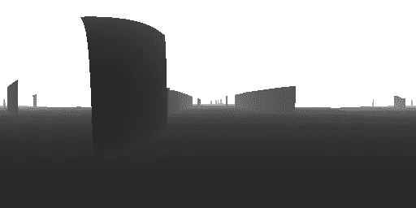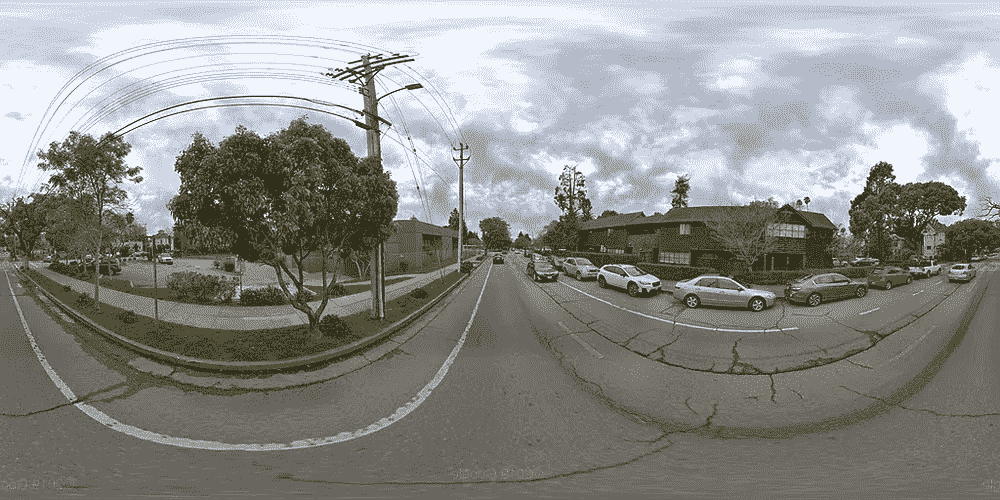

A greyscale depthmap image (left) and sceneographic image (right) of a scene in downtown Berkeley, CA.

总之，数据的收集始于对感兴趣的单个地理点的定义，并导致数百个样本的汇编，这些样本可被进一步处理用于训练。

每个样品包括:

*   等矩形全景图像。
*   描述所描述场景中遮挡对象的一组三维平面，编码为 base-64 字符串。
*   一组相关的元数据。

通过收集和管理与给定城市地点相关的一组图像，数据处理步骤的任务是为这组图像在训练 GAN 模型中的作用做准备。总之，该训练数据最好被描述为成对的相关方形裁剪光栅图像:一个 RGB 图像表示较大全景图像场景的裁剪，另一个灰度图像表示该场景的“深度图”,每个像素的值表示从相机到任何遮挡物体的最小距离。

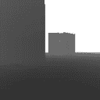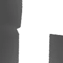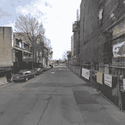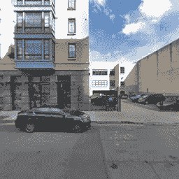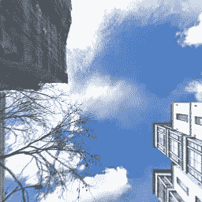

Pairs of corresponding depthmap (top) and sceneographic (bottom) images.

场景图像的产生在很大程度上是简单的，只有一个过程值得一提:全景图像的等矩形投影必须被转换以获得更好地接近我们期望产生的合成图像的立方体环境图。这是根据之前描述相关转换的工作完成的( [Bourke，2006](http://paulbourke.net/miscellaneous/cubemaps/) )。值得注意的是，相同的全景图像可以沿着 z 轴任意旋转(相当于立方体水平旋转的变换),以产生相同场景的微小变化，这些变化仍然可以无缝地平铺在一起。以这种方式通过轻微的转换来扩展训练集的宽度，这种做法被称为“数据扩充”，是 ML 中的一种常见做法。

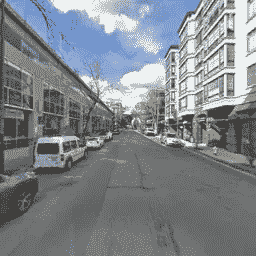

Data augmentation by rotation by 0 degrees (left) 30 degrees (middle) 60 degrees (right)

总之，任何给定城市地点的数据准备步骤从全景等矩形图像和相关信息(包括遮挡平面的描述)的精选集合开始，并产生两组立方体图投影图像:一组描述城市场景的 RGB 图像，一组描述该场景中物体的有效深度的灰度图像。

# 模特培训

在模型训练阶段，我们使用收集的图像集来训练 GAN 模型，该模型能够生成与每个选定的城市背景相关的新图像。为此，采用了两种不同的 GAN 架构:StyleGAN 和 Pix2Pix，其具体实现将在下面讨论。一旦经过训练，这些模型中的每一个都以自己的方式证明是有价值的，因为每一个都为合成城市图像的制作提供了一个独特的界面。

## Pix2Pix

[Pix2Pix](https://phillipi.github.io/pix2pix/) (Isola et al .，2016)是一种特定类型的 GAN 的架构:一种条件对抗网络，它学习从给定的输入图像到期望的输出图像的映射。从一个经过训练的 Pix2Pix 模型的用户的角度来看，我们提供一个符合某种映射约定的输入图像(比如一个正面的彩色编码图，或者一只猫的边缘图)，并作为回报接收一个将该输入转换成某种所需输出的图像(比如一个正面或一只猫的照片表示)。

指导 Pix2Pix 模型训练的细节很大程度上取决于所采用的实现的细节。该项目依托于[在 Pytorch](https://github.com/NVIDIA/pix2pixHD) (王，2019)中实现的该架构的“高清”版本。需要对该实现进行一些修改:特别是为了纠正在低对比度源图像的情况下形成的不想要的伪影的问题(如下图所示)。根据 Pix2Pix 用户社区提供的[建议，零填充被替换为反射填充，学习率暂时调整为 0.0008。](https://github.com/NVIDIA/pix2pixHD/issues/46)

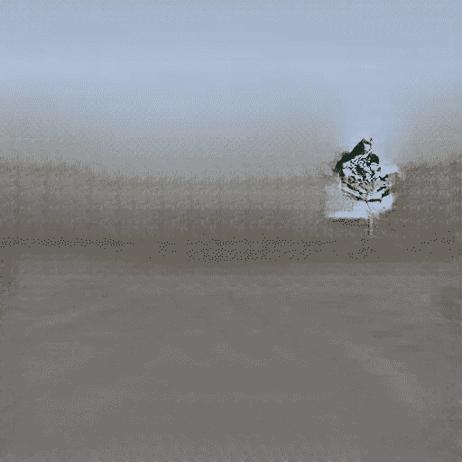

Synthetic image artifacts encountered while training.

一旦被训练，每个模型如条件 GAN 的性质和训练数据的结构所暗示的那样操作:给定描述期望的三维城市场景的灰度深度图图像，返回合成的 RGB 场景地理图像。由于这些模型是在按地点划分的数据子集上训练的，因此每个模型都只生成一个城市特定的合成图像:鹿特丹模型生成的图像“感觉”像鹿特丹，而旧金山模型生成的图像看起来更像旧金山。该特征允许进行直接比较。

Results derived from Pix2Pix model: synthetic images of San Francisco, CA (left) and Rotterdam, NL (right).

## StyleGAN

与传统的 GAN 架构相比， [StyleGAN](https://github.com/NVlabs/stylegan) (Karras 等人，2018 年)借鉴了“风格转移”技术，为 GAN 的生成器部分提供了一种替代设计，可以将粗糙的图像特征(如在人脸上训练时的头部姿势)与精细或纹理特征(如头发和雀斑)分开。这里，与 Pix2Pix 模型相比，用户体验非常不同:用户不是通过将输入图像映射到期望的输出来操作，而是从训练模型的潜在空间中选择一对图像，并将它们混合。然而，这些混合对应于给定对的粗略和精细特征，而不是潜在空间中的点之间的简单插值。

Fake images drawn from all nine sites studied.

如上所述，指导 StyleGAN 模型训练的细节很大程度上取决于实现的细节。该项目依赖于 StyleGAN 的官方 TensorFlow 实现，该实现在没有修改的情况下被用于在从所有九个城市地点提取的 RGB 场景数据的组合上训练单个模型。一旦被训练，可以通过对潜在空间中的位置进行采样，或者通过提供潜在空间中的粗-细位置对来查询模型，以更精确地控制合成图像的不同方面。

建立在前一种在潜在空间中采样的技术上，可以组合样本的线性序列来产生诸如下面讨论的动画。

# 图象生成

在图像生成阶段，我们开发了以有用的方式与经过训练的模型进行交互的方法。这项任务并不简单，因为每个 GAN 模型一旦被训练，就能够产生大量的合成图像，这些图像是用高维潜在空间来描述的。StyleGAN 模型提供了一种独特的形式来指导图像的生成，这些图像是从潜在空间中选择的其他图像中提取的特征的组合。Pix2Pix 模型提供了一个完全不同的界面，通过任意给定源图像的变换生成新的合成图像:在我们的例子中，这些是城市空间的深度图。我们在这里对这些方法做一个简要的概述，并在以后的文章中对结果图像进行更完整的解包和可视化分析。

## Pix2Pix 图像生成

这里，灰度深度图图像是通过对 3d CAD 模型中描述的场景进行采样而产生的。这些构建场景的深度图随后被用作源图像，通过该源图像，每个城市地点的 Pix2Pix 模型产生合成的摄影场景。通过向在不同城市地点训练的模型提供精确的相同输入，可以在由转换模型拾取的显著特征之间进行直接比较。

例如，虽然下面的每个合成图像都是通过采样相同的深度图产生的，但我们可以清楚地看到这些表征每个采样城市的意象属性。鹿特丹模型将深度图中出现的一大片地块解释为一大片砖房，这在荷兰城市中是很典型的，而皮克威克公园模型以北佛罗里达植物区系的典型方式呈现了这一地块，暗示了一片长满苔藓的活橡树。阿拉莫广场模型将一堵长长的后退的城墙分割成一系列小比例的形式，这种解释表达了主导这个旧金山社区的一排爱德华时代的联排别墅的聚集；这种相同的城市形式被布鲁克林布什维克地区的图像训练模型理解为类似红砖工业仓库建筑的东西。

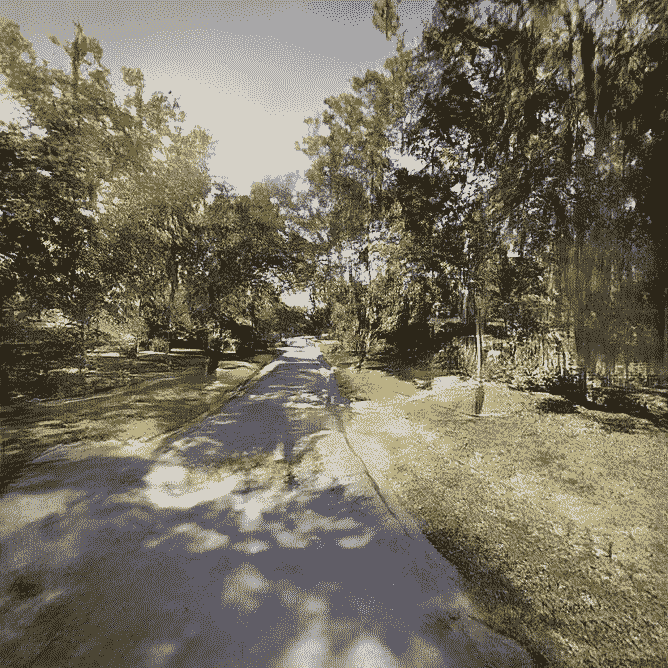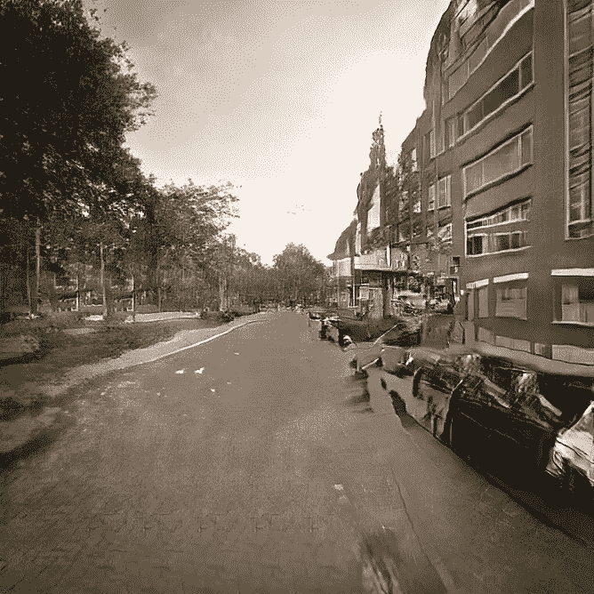

A depthmap (left) and cooresponding images for Jacksonville, FL (middle) and Rotterdam, NL (right)

## StyleGAN 图像生成

这里开发的另外两种图像生成方法依赖于 StyleGAN 模型。

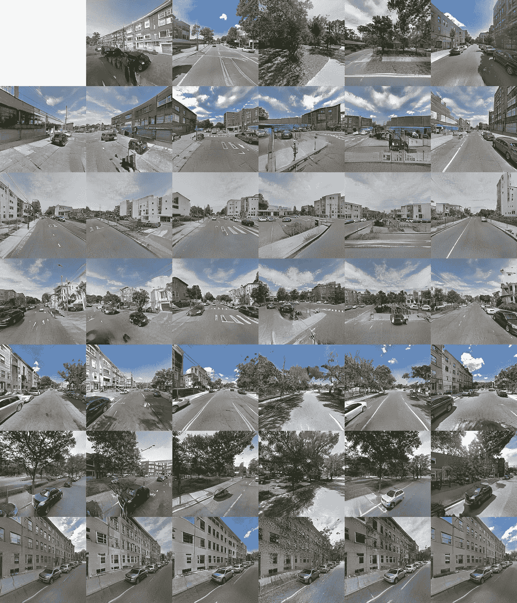

Synthetic urban places generated by StyleGAN. Vertical columns define course features, such as camera direction and orientation, while horizontal rows define fine features, such as textures, colors, and lighting effects of each urban place.

与上面讨论的方法一样，这两种方法中的第一种提供了在被抽样的城市地点之间进行比较的机会。按照作者的意图使用 StyleGAN 接口，可以分别断言对生成图像的精细和粗糙方面的控制。由此产生的界面可以被看作是城市场景的“示例”设计:用户只需要提供包含某个地方所需特征的图像示例，而无需明确说明这些是什么，它们来自哪里，或者如何构建它们。在这项研究的背景下，如上所述，这使得可以在城市地区之间进行比较。例如，附近的图展示了粗糙特征和精细特征可以如何组合以形成混合现有场景的各方面的新场景。

最后，开发了一种通过对 StyleGAN 模型所隐含的图像潜在空间的线性序列进行采样来生成动画的方法。虽然没有直接支持对城市场所的受控比较研究，但这些动画确实提供了对 StyleGAN 模型潜在空间结构的洞察，包括哪些特征和场景被类似地参数化，以及哪些彼此远离。

# 反射

如上所述，GAN 利用了两个相关神经网络之间的竞争。由于这一竞赛的有效结果是给定图像集所共有的隐性属性的编码，该项目建议对 GAN 生成的合成图像进行询问，将揭示某些有助于揭示城市场所本质的属性。根据诺伯格-舒尔茨对“场所”的描述，场所被理解为“具有独特特征的空间”，并包括体现特定城市位置的形式、纹理、颜色和光的质量，我们可以看到直接的目标已经达到，因为上面记录的初步结果展示了每个研究地点独特的意象特征。然而，要实现这个项目的更大目标——开发支持建筑设计中隐含意图的工具，还有许多工作要做。这一领域的未来工作包括将“范例设计”范式从城市场所的图像(如本文所示)扩展到更直接的建筑表现，如三维形式和空间。

# 文献学

艾西，罗伯特，鲁拉里·格林和鲍勃·谢尔。“前言。”制作 2011:制作数字建筑，DGO-数字原创。, 10–11.UCL 出版社，2017。

柏克德、威廉和阿黛尔.亚伯拉罕森。网络中的并行处理、动力学和进化。威利-布莱克威尔，2002 年。

程，池莉，还有侯君豪。"仿生机器人建造过程:一种适应大量不规则形状自然材料的方法."第 34 届 ECAADe 会议论文集。2016 年，芬兰奥卢。

钟，贾珍和郑泰生。“智能城市的网络抓取信息提取方法:使用机器学习训练智能城市的空气质量监测员。”在 ca adria 2018–第 23 届亚洲计算机辅助建筑设计研究国际会议上，由 Suleiman Alhadidi，Tomohiro Fukuda，黄卫新，帕特里克·让桑和 Kristof Crolla 编辑，2:515–524。亚洲计算机辅助建筑设计研究协会(CAADRIA)，2018。

古德菲勒、伊恩、让·普吉-阿巴迪、迈赫迪·米尔扎、徐炳、戴维·沃德-法利、谢尔吉尔·奥泽尔、亚伦·库维尔和约舒阿·本吉奥。"生成性对抗网络。"神经信息处理系统进展 27，Z. Ghahramani，M. Welling，C. Cortes，N. D. Lawrence 和 K. Q. Weinberger 编辑，2672-2680。柯伦联合公司，2014 年。[http://papers . nips . cc/paper/5423-generative-adversarial-nets . pdf](http://papers.nips.cc/paper/5423-generative-adversarial-nets.pdf)。

伊索拉、菲利普、、周廷辉和阿列克谢·埃夫罗斯。"用条件对抗网络进行图像到图像的翻译."CoRR abs/1611.07004 (2016 年)。http://arxiv.org/abs/1611.07004[。](http://arxiv.org/abs/1611.07004)

卡拉斯，泰罗。斯泰勒根。英伟达，2019。【https://github.com/NVlabs/stylegan】T4。

卡拉斯、泰罗、萨穆利·莱恩和蒂莫·艾拉。"一种基于风格的生成对抗网络生成器体系结构."CoRR abs/1812.04948 (2018)。[http://arxiv.org/abs/1812.04948](http://arxiv.org/abs/1812.04948)。

基利安阿克塞尔。"设计探索和设计导向."在内部 Smartgeometry 中，122–29。约翰威利父子有限公司，2014 年。[https://doi.org/10.1002/9781118653074.ch10](https://doi.org/10.1002/9781118653074.ch10)。

Ledig，Christian，Lucas Theis，Ferenc Huszar，Jose Caballero，安德鲁·坎宁安，Alejandro Acosta，Andrew Aitken 等人，“使用生成式对抗网络的照片级单幅图像超分辨率”，105–14，2017。[https://doi.org/10.1109/CVPR.2017.19](https://doi.org/10.1109/CVPR.2017.19)。

Ng，Andrew Y，和 Michael I. Jordan。"区别性与生成性量词的比较:逻辑回归和朴素贝叶斯."《第 14 届神经信息处理系统国际会议论文集:自然与合成》, 841–848。NIPS 01。美国麻省剑桥:麻省理工学院出版社，2001 年。[http://dl.acm.org/citation.cfm?id=2980539.2980648](http://dl.acm.org/citation.cfm?id=2980539.2980648)。

克里斯蒂安·诺伯格-舒尔茨。走向建筑现象学。学院版，1980 年。

彭、、和长仓武彦。“机器对空间的感知。建筑计算机辅助设计协会(ACADIA)第 37 届年会论文集。麻省剑桥:建筑计算机辅助设计协会，2017 年。

斯卡利博士、贾斯珀·斯诺克、亚历克斯·威尔特施科和阿里·拉希米。“胜利者的诅咒？速度、进度和经验严谨性。”加利福尼亚州温哥华，2018 年。https://openreview.net/forum?id=rJWF0Fywf[。](https://openreview.net/forum?id=rJWF0Fywf)

斯坦菲尔德，凯尔。“梦想可能会实现。”建筑计算机辅助设计协会(ACADIA)第 37 届年会论文集。麻省剑桥:建筑计算机辅助设计协会，2017 年。

保罗·瓦格纳。街景探索者，2013。【https://github.com/PaulWagener/Streetview-Explorer】T4。

王，杰森，路易斯·佩雷斯。"使用深度学习的图像分类中数据扩充的有效性."卷积神经网络。Recognit，2017。

王，丁俊。Pix2PixHD:用条件 gan 合成和操作 2048x1024 图像。英伟达，2017。[https://github.com/NVIDIA/pix2pixHD](https://github.com/NVIDIA/pix2pixHD)。