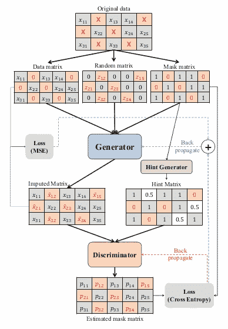
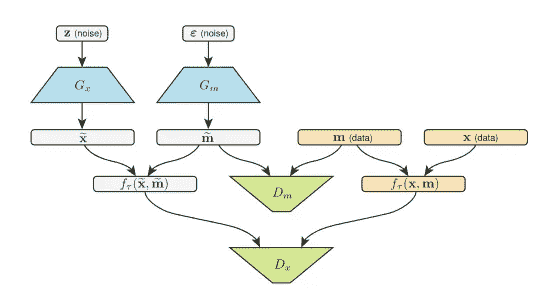
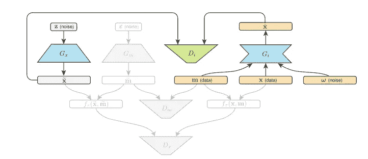
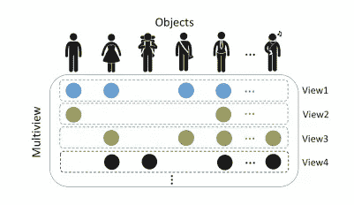

# GANs 和缺失数据插补

> 原文：<https://towardsdatascience.com/gans-and-missing-data-imputation-815a0cbc4ece?source=collection_archive---------12----------------------->

## 基于生成对抗网络的缺失数据填补新方法

[https://www.flickr.com/photos/crdot/6212236687/](https://www.flickr.com/photos/crdot/6212236687/)

# 介绍

看看 GANs 令人印象深刻的表现，他们变得如此受欢迎也就不足为奇了。它们广泛用于编辑或生成图像、安全目的以及许多其他领域，优于大多数神经网络架构。它们也有一些不太重要的应用，比如将马变成斑马，或者将城市景观渲染成 GTA 风格。

Rendering cityscape into GTA style. [[Source]](https://junyanz.github.io/CycleGAN/)

看来它们被用于输入缺失数据只是时间问题。使用 GANs 处理缺失数据的想法相对较新，主要存在于研究文献中。然而，这是一种非常有前途的方法，我们可能很快就会看到用于缺失数据插补的现成 GAN 模型。事实上，Github 上现有的实现很少，我将在文章的底部提到。在本文中，我将解释缺失数据插补最流行的 GAN 架构，同时摒弃科学术语，以更简单、直观的方式进行解释😉让我们开始吧！

## 开始之前

在我们研究处理缺失数据的不同 GAN 架构之前，我们需要确保基础知识是正确的。

在处理真实数据集时，缺失数据是一个常见问题。我们中的一些人只能在 Kaggle 上使用近乎理想且格式良好的数据。不幸的是，现实生活中并不是这样。数据经常会丢失，它可能以三种不同的方式发生:MCAR(完全随机丢失)，马尔(随机丢失)和 NMAR(非随机丢失)。如果你想了解更多细节，可以看看这篇文章。幸运的是，有各种方法可以处理缺失数据。为了深入了解现有的插补算法(例如 KNN、老鼠、MissForest)和它们各自的 Python 包，我推荐阅读[我以前的文章](/why-using-a-mean-for-missing-data-is-a-bad-idea-alternative-imputation-algorithms-837c731c1008)。

gan 非常适合处理缺失数据。他们很好地学习隐藏的数据分布，并且发生器和鉴别器之间的反馈回路产生非常高精度的结果。如果你觉得你需要刷新一下关于甘斯的记忆，看看下面欧文·凯里在这篇[惊人文章](/generative-adversarial-networks-gans-a-beginners-guide-5b38eceece24)中写的一小段话。

> 一个称为生成器的神经网络生成新的数据实例，而另一个称为鉴别器的神经网络评估它们的真实性。
> 
> 你可以把一个 GAN 想象成造假者(发生者)和警察(鉴别者)之间的猫捉老鼠的游戏。伪造者正在学习制造假币，而警察正在学习检测假币。两个人都在学习，都在提高。造假者在不断学习制造更好的假货，而警察在检测假货方面也在不断进步。最终结果是伪造者(制造者)现在被训练来创造超现实的货币！

# GAN 架构

## 增加

GAIN 代表生成式对抗插补网。在撰写本文时，它似乎是处理缺失数据的最流行的 GAN 架构。其背后的思想很简单:生成器获取一些缺失值的真实数据的向量，并相应地对它们进行估算。估算的数据被反馈给鉴别器，鉴别器的工作是找出最初丢失的数据。下图更详细地解释了该架构。

GAIN architecture [1]

有一个*屏蔽矩阵*，它告诉发生器哪些值缺失或存在。*随机矩阵*增加了估算值的随机性(所以它们每次都不一样)。还有*提示向量*，提供给鉴别器，确保鉴别器强制发生器学习。

增益插补的准确性与其他最先进的插补算法进行了比较，并证明其明显优于所有算法[1]。听起来是个不错的估算，是吧？

## 米斯甘

MisGAN 是另一个处理缺失数据的 GAN 框架。它的架构与 GAIN 略有不同，因为它有 2 个发生器和 2 个鉴别器[2]。下图展示了 MisGAN 架构。

The overall structure of the MisGAN framework [2]

发生器 *Gx* 产生完整的数据，发生器 *Gm* 产生缺失数据的掩码(它是一个二进制矩阵，其中‘1’代表非缺失数据，而‘0’代表缺失数据)。然后在鉴别器 *Dx* 和 *Dm* 中对其进行比较，以检查其是否可以与真实数据矩阵 *x* 和真实缺失值掩码矩阵*m*区分开来。这里需要注意的重要一点是，在成功训练 MisGAN 架构后，我们可以分别生成完整的数据和缺失值掩码。很酷吧。

对上面的架构有一个调整，可以直接创建一个缺失数据估算器。在这种情况下，我们有可以生成完整数据的预训练生成器 *Gx* 和充当估算器的生成器 *Gi* 。它被馈送到单个鉴别器 *Di* 并检查 *Gi* 是否从带有缺失值的数据中产生令人满意的结果。下图更详细地展示了该架构。

Architecture for MisGAN imputation [2]

## 维甘

VIGAN 以不同的方式处理缺失数据的问题。为了向你介绍这个问题，让我们想象我们有一个实验，在这个实验中，一家医院为某个样本的病人收集神经图像，为一个完全不同的样本的病人收集大脑信号。这导致了不成对的数据，从而导致多模态([，即以不同的方式表达同一事物；图像和文字描述就是一个很好的例子)](/multimodal-deep-learning-ce7d1d994f4)数据分析。使用这两个数据集时，患者数据没有一对一的映射。我们不能简单地将它们结合起来，因为患者在数据集中是独一无二的。它需要不同的数学建模来解决这个问题，这通常是大数据中的一个常见问题[3]。通常，您甚至不能将不同来源的数据集组合在一起(所谓的多视图数据)，因为它们实在太大了。

The missing view problem extremely limits the cross-view collaborative learning [3]

这种 GAN 架构解决了多模态或多视图数据集中缺失数据的问题。作者声称他们的解决方案是高度可扩展的，并且是将域映射与缺失数据的跨视图插补相结合的第一种方法[3]。

其背后的思想比 GAIN 和 MisGAN 更复杂，解释其背后的数学概念需要很长时间。如果你想冒险，看看这里的论文。

It can take a while to read — you’ve been warned! [[Source]](https://makeameme.org/meme/after-finishing-this)

## 科拉根

协作 GAN 处理稍微不同类型的丢失数据。它用于缺失图像数据插补。根据论文作者的观点，该架构在图像领域优于其他 GAN 架构的优势如下:

*   缺失数据估计更加准确
*   单发生器架构仍然存在，这使得它更节省内存

该框架的新颖之处在于，它“将图像插补问题转化为多域图像到图像的转换任务，使得单个生成器和鉴别器网络可以使用剩余的干净数据集成功地估计缺失数据。[4]"

在我个人看来，这篇论文的措辞有点模糊，我发现很难完全理解他们是如何实现他们的 GAN 架构的。如果你觉得这个想法很有趣，可以在这里看一下最初的[论文。](https://arxiv.org/abs/1901.09764)

# Github 仓库

在 Github 中快速浏览之后，我发现这些 GAN 架构已经有了一些实现！为了方便起见，我在下面列出了它们。

## **增益**

这个库似乎是 GAIN 中最受欢迎的，它使用了 Tensorflow。它在 Github 上有> 70 颗星，但是从 2019 年 3 月开始就没有更新过。

## **维甘**

VIGAN 已经在 PyTorch 中实现了，但是它在拥有 20 颗星的情况下似乎不是很受欢迎。回购的链接是[这里的](https://github.com/chaoshangcs/VIGAN)。

# 最后几句话要说

虽然用 GANs 输入缺失数据是一个相对较新的概念，但它显示了非常有前途的结果。在不久的将来，我们可能会看到更多的 GAN 架构以更高的精度处理缺失数据。

希望你觉得我的文章有用。如果你有任何问题，请在评论中告诉我，或者随时在 LinkedIn 上与我联系。

# 参考

[1]增益，[https://arxiv.org/abs/1806.02920](https://arxiv.org/abs/1806.02920)

[2]米斯根，[https://openreview.net/pdf?id=S1lDV3RcKm](https://openreview.net/pdf?id=S1lDV3RcKm)

[3]维根，[https://arxiv.org/abs/1708.06724](https://arxiv.org/abs/1708.06724)

[4]科拉甘，[https://arxiv.org/abs/1901.09764](https://arxiv.org/abs/1901.09764)