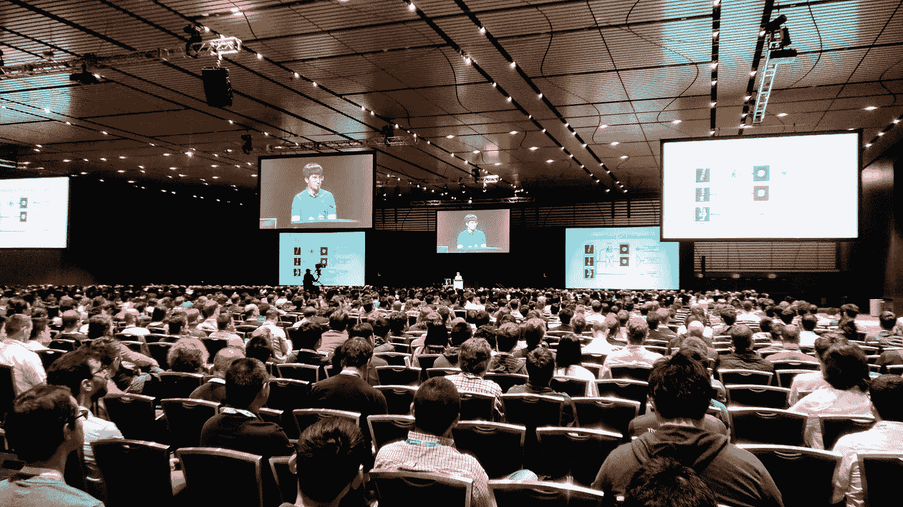
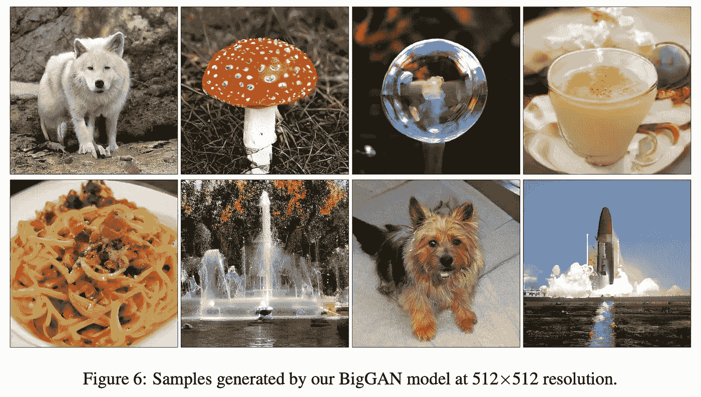
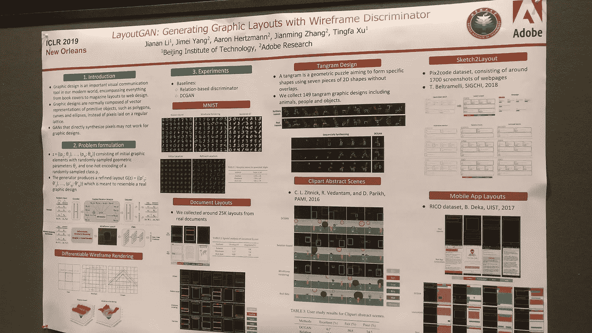

# 甘斯与应用 ML @ ICLR 2019

> 原文：<https://towardsdatascience.com/gans-applied-ml-iclr-2019-20d16cade735?source=collection_archive---------21----------------------->

Ian Goodfellow filled the whole Great Hall at New Orleans.

**TL；大卫:在底部。**

我刚刚从 2019 年在纽奥良举行的国际学习代表大会回来，这是甘论文硕果累累的一年。在第一部分中，我讨论了图像合成(BigGAN)、音频(WaveGAN)、特征选择(KnockoffGAN)、3D、文本&表格和许多其他主题的论文。然后，本文的第二部分重点关注更实际的 ML 考虑事项。

# 幸运偏爱有准备的人

在去 ICLR 之前，我列了一个清单，上面列出了所有我想学的东西。这意味着一个非常忙碌的星期一——在这一点上，四个有趣的研讨会同时进行(更多研讨会在“应用 ML”部分)。这也意味着一个繁忙的星期二，组织者在这一天投入了 37 篇 GAN 论文。这意味着海报会议开始得早，结束得晚。我用一个[电子表格](https://docs.google.com/spreadsheets/d/1H6Atx9GRflN94fOt1Eil5UqHMWWReWUksjVqqbKhtmU/edit#gid=0)记录了这一切。

我包含了我提到的所有论文的链接，甚至还有到[直播研讨会](https://slideslive.com/iclr)以及[全体会议的链接，其中也包含了大量的 GANs](https://www.facebook.com/pg/iclr.cc/videos/?ref=page_internal) 。

# 生成的对抗部分

在这里，我想探讨这些变化，特别是讨论生成性对抗网络。正如许多人所说，这是一项令人兴奋的新技术，与大多数其他 ML 不同，它出现的时间还不到 5 年。本着之前 [ICML 2018 文章](/all-icml-gans-generative-papers-2018-62b4521bf92)的精神，我与学术界人士进行了交谈，所以你不必这样做，但鉴于内容的量，不可能再浏览每篇论文，所以我只会挑选一些主题。

Brock et al. presented even better BigGAN-deep at ICLR ‘19.

# 主题 1:图像合成日趋成熟

[Ian Goodfellow 经常谈论](http://www.iangoodfellow.com/slides/)2012 年的深度学习革命如何实现了机器学习应用的“寒武纪大爆发”。这是因为在任何技术领域，首要任务是让一项技术可靠地工作，并使大量下游应用成为可能。

这种情况在图像合成中有所发生。现在 [BigGAN 可以可靠地生成非常多样的高保真图像](https://arxiv.org/abs/1809.11096)，我们可以开始考虑将其应用于其他用例。一个例子是使用 BigGAN 作为增加现有训练数据的方式(即，通过合成新的数据点来人工增加数据点的数量)。尽管有[的另一篇论文在 ICLR 被接受，它显示了这项技术的局限性](https://openreview.net/forum?id=rJMw747l_4)。在这种平衡数据集的情况下，GAN 数据增加似乎对下游任务的影响有限。但这是一个被认真研究的提议，这一事实似乎是一个好迹象，但仍有许多数据增强途径未被探索。

我们可能关心的另一个下游任务是使用较少标签的图像合成。在最初的 BigGAN 中，我们使用 ImageNet 中的所有标签来合成 1000 种类型的对象。[然而在另一篇 ICLR 论文](https://arxiv.org/pdf/1903.02271.pdf)中，我们可以看到同样高质量的图片，只有 10%的标签，甚至比 BigGAN 只有 20%的标签使用自我和半监督学习的结果更好。

此外，ICLR 还展示了几篇 [论文](https://openreview.net/forum?id=ryxwJhC9YX)，它们提出了对生成的图像进行更精细控制的有趣建议。所以现在，你一直想在照片中出现的长颈鹿，而不是你的前任，可以出现在正确的位置了。

我只是惊讶于这个领域发展的如此之快，在不到 5 年的时间里，我们已经成功制作了 1000 类 512x512 的图像，这些图像足够逼真，可以在下游应用中使用。用 Károly Zsolnai-Fehér 的话说，活着是多么美好的时光啊！

# 主题 2:外来数据类型/应用。

今年 ICLR 的另一个重要主题是更多“奇异”数据类型和应用的出现。我只讲几个更有趣的例子。对我来说，这似乎再次表明了 GANs 作为一个领域的日益成熟。

*   [WaveGAN](https://openreview.net/forum?id=ByMVTsR5KQ) :是一种使用扩展卷积和 DCGAN 类架构的 GAN 的音频条件合成。
*   [TimbreTron](https://openreview.net/forum?id=S1lvm305YQ) :使用 CycleGAN 将音乐从一个乐器(域)传输到另一个(域)乐器。
*   [PateGAN](https://openreview.net/forum?id=S1zk9iRqF7) :生成合成数据的 GAN，具有不同的隐私保证。
*   [山寨版](https://openreview.net/forum?id=ByeZ5jC5YQ):是一种用山寨版的 GANs 进行健壮特征选择的方法。总的来说，这篇论文将会是比较复杂的论文之一。
*   [LayoutGAN](https://openreview.net/forum?id=HJxB5sRcFQ) :通过在 2D 空间中合理地组合不同的 UI 元素，使用 GANs 生成 UI 线框的方法。
*   [合成 GAN](https://openreview.net/group?id=ICLR.cc/2019/Workshop/DeepGenStruct) :通过匹配不同的 3D 对象并合成它们以产生具有真实照明和遮挡的新场景来生成真实外观合成的方法。
*   [3D 点云生成](https://openreview.net/forum?id=SJeXSo09FQ)，[蛋白质骨架生成](http://jakublangr.com/iclr19-gans.html) & [生成标签图](https://openreview.net/group?id=ICLR.cc/2019/Workshop/DeepGenStruct):这些论文超出了我的专业领域，也超出了 ICML 2018 上展示的这一广泛领域的论文，但很高兴看到这项工作仍在继续。

# 主题 3:理论进展

一如既往，有许多论文涉及训练的某些方面([拒绝采样](https://openreview.net/forum?id=S1GkToR5tm)、[相对论甘](https://openreview.net/forum?id=S1erHoR5t7)、[变分鉴别器瓶颈](https://openreview.net/forum?id=HyxPx3R9tm))或生成模型的某些理论性质(例如[潜在空间插值](https://openreview.net/forum?id=SyMhLo0qKQ)或[甘](https://arxiv.org/pdf/1802.05701.pdf)的可逆性)。

虽然学者们倾向于热爱这一领域，但在 ICML 大学 18 届毕业生中，结果却有些喜忧参半。我觉得许多论文引入了大量额外的复杂性来推导一些我不认为非常有趣或不期望它们以同样的方式成为事实上的标准的属性，例如 Wasserstein GAN 或 gradient penalties。

幸运的是，在 ICLR，情况并非如此。上面的三种技术加上训练中的平均技术看起来都很简单有效，很容易成为未来艺术的标准模式。

# 应用机器学习

Many industry presentations at ICLR ’19.

作为一个经常不得不担心如何生产我正在建造的系统的人。令我非常惊喜的是，甚至来自 ICLR 的研讨会组织者也认为这很重要。因此，我试图从以下研讨会中捕捉所有有趣的内容:

*   [ML 中的再现性](https://sites.google.com/view/icml-reproducibility-workshop/home):这最终成为一个非常有用的研讨会。顺便提一下，我在那里的时候只有 7 个人，所以我想知道这说明了我们领域的状况。一般来说，我认为再现性是一个非常重要的话题，因为再现性实际上是理解已部署的 ML 系统如何运行的 0 级水平。因此，如果我们不能正确对待这一点，所有这些关于公平偏见的谈论几乎毫无意义。
*   [调试 ML](https://debug-ml-iclr2019.github.io/) :这是一个非常有用的研讨会，但遗憾的是，许多演示要么没有发布代码，要么非常学术性。我肯定会尝试研究[模型断言](https://dawn.cs.stanford.edu//2019/03/11/modelassertions/)，因为这个想法对我来说很有意义。总的来说，再次调试对我们来说非常关键，以确保我们多少理解了模型是如何构建的。从对立的例子到神经网络能够适应随机分配的标签，一切都表明我们需要更多的工具来理解深度学习。
*   [从有限的标记数据中学习](https://lld-workshop.github.io/):这非常有趣，因为很少的数据是常见的商业现实。克里斯托弗·雷的参与让我很受鼓舞，但是，我并不觉得有什么特别重要的收获。
*   [生成高度结构化的数据](https://deep-gen-struct.github.io/):尽管本吉奥一开始的演讲很拥挤，但我并不觉得口头报告有什么用处，尽管我强烈建议查看已被接受的论文。

# 结论

总的来说，我一直对 ML 的进展速度感到惊讶，学术会议也有其缺点，但如果你相应地计划和准备，你会比我参加过的任何其他会议获得更多。

**TL；博士:**

*   我们生成各种各样的逼真的 512x512，这导致了进一步的应用。
*   GANs 似乎在其他数据类型中得到更多的关注，但是成熟度大约是。影像在 2016 年的位置。
*   甚至学者们现在也更多地考虑实际问题& ML 工具——尽管他们并不总是这样称呼它。

感谢丹尼尔·杜马博士和哈帕尔·辛格博士的精彩反馈。