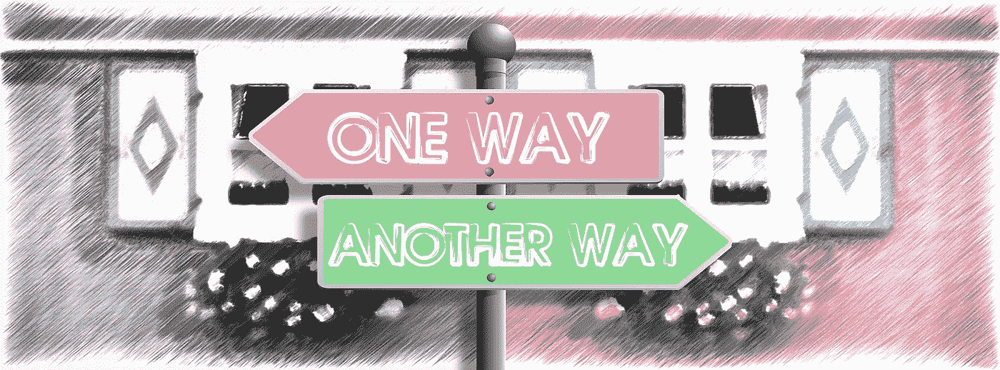
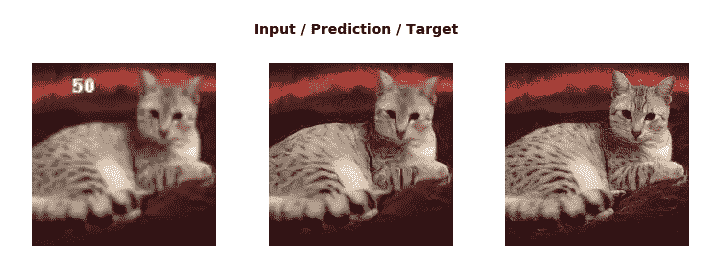
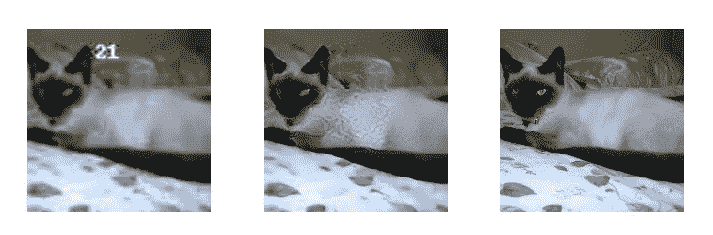
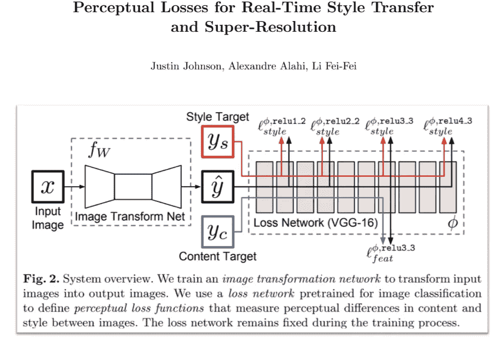
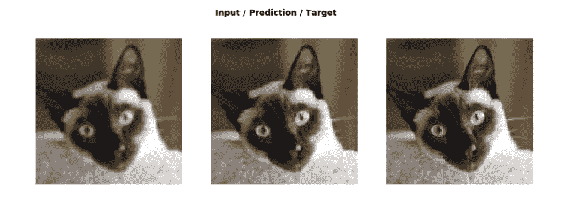

# 除了甘

> 原文：<https://towardsdatascience.com/gans-or-d0fb38ff8ddb?source=collection_archive---------35----------------------->

## 在这篇博文中，我将讨论更精确地使用 GANs 的替代方法。我建议读者阅读 GANs 来理解和比较下面解释的策略。让我们开始吧。



Image by [Gerd Altmann](https://pixabay.com/users/geralt-9301/?utm_source=link-attribution&utm_medium=referral&utm_campaign=image&utm_content=1991865) from [Pixabay](https://pixabay.com/?utm_source=link-attribution&utm_medium=referral&utm_campaign=image&utm_content=1991865)

我希望到现在为止，你们都非常熟悉 GANs 的概念。但是，我们仍然不能用 GANs 达到很高的精确度。如果你看过我在 GANs 上的博客，下面是最后阶段的输出。



中间的图像是 GAN 预测的。虽然它有点类似于目标图像，但仍然不是可接受的图像，因为预测图像中猫的眼睛不亮，猫的爪子不清晰。如果我们开始根据特征来区分猫，这些小事情就很重要了。

我们可能会在更大程度上改进结果，但 GANs 仍然无法提供足够的特征间隙，因为我们没有以这种方式训练模型。甘不在乎猫的眼睛，也不在乎猫的爪子和其他东西。

## 我们能摆脱甘一家吗？

Fastai 想出了一些更好的东西，恢复图像的力量。现在，当我们谈论一个更好的模型时，首先想到的是改进 loff 函数。如果我们可以增强损失函数，那么我们的模型将训练得更好，从而得到更准确的结果。所以，我们的主要目的是创建一个更好的损失函数。现在，我们还可以提出更复杂的架构设计，但这无疑是最后一个要实施的选项。

我在这里关心的事情在[实时风格转换和超分辨率的感知损失](https://arxiv.org/abs/1603.08155)中有所解释。



Image source — research paper mentioned above

*   图像转换网络——它基本上是 GANs 的 UNet 或生成器部分。它产生输出，即预测的图像。
*   上述类型的模型被称为生成模型。在这些类型的模型中，我们有一个下采样部分，也称为编码器，还有一个上采样部分，称为解码器。
*   `Ŷ`是预测图像。`Yc`是我们想要得出的目标图像。
*   现在，我们将预测图像和目标图像通过预先训练的图像分类模型，如 ResNet34、VGG-16 等。这些模型在许多类别的图像上被预先训练，并且它们对输入图像进行分类。
*   通常，它的输出会告诉你，“嘿，这个生成的东西是狗，猫，飞机，还是别的什么。”但是在最终分类的过程中，它会经过许多不同的层次。在这种情况下，他们使用相同的格网大小对所有图层进行了颜色编码，并使用相同的颜色对要素地图进行了颜色编码。所以每次我们改变颜色，我们就改变了网格的大小。所以有一个跨步二卷积，或者在 VGG 的情况下，他们使用最大池层。
*   现在，我们可以做的是，我们可以比较中间层的激活，然后找出预测图像层和目标图像层之间的像素损失，而不是比较最后几层。如果我们可以这样做，那么我们就可以引导模型的中间层变得更加具体和准确。
*   让我们用一个例子来理解这个比较中间层的概念。

> max-pooling 层之前的输出中的层的结构是 216*28*28。这意味着我们有 216 个通道，图像大小为 28*28。每个通道告诉我们图像中不同种类的特征。可能第 100 个频道比较了猫形象的眼球。如果我们可以比较预测图像和目标图像的第 100 层，那么我们的模型将为期望的结果准备得更好。

*   在我们的例子中，特征图会说，“这里有眼球(在目标图像中)，但在生成的版本中没有，所以请多训练，做得更好。制造更好的眼球。”这就是我们的想法。这就是 fastai 所说的特征损失或 Johnson 等人所说的感知损失。

这就是我们如何在不使用 GANs 的情况下改进图像恢复的方法。

让我们了解损失在实际中是如何起作用的。我正在使用 fastai 库的代码。

```
class class **FeatureLoss**(nn.Module):
    def __init__(self, m_feat, layer_ids, layer_wgts):
        super().__init__()
        **self.m_feat** = m_feat
        **self.loss_features** = [self.m_feat[i] for i in layer_ids]
        **self.hooks** = hook_outputs(self.loss_features, detach=False)
        **self.wgts** = layer_wgtsdef **make_features**(self, x, clone=False):
        **self.m_feat**(x)
        **return** [(o.clone() if clone else o) for o in self.hooks.stored]

    def **forward**(self, input, target):
        **out_feat** = self.make_features(target, clone=True)
        **in_feat** = self.make_features(input)
        **self.feat_losses** = [base_loss(input,target)]
        **self.feat_losses** += [base_loss(f_in, f_out)*w
                             for f_in, f_out, w in zip(in_feat, out_feat, self.wgts)]
        **self.feat_losses** += [base_loss(gram_matrix(f_in), gram_matrix(f_out))*w**2 * 5e3
                             for f_in, f_out, w in zip(in_feat, out_feat, self.wgts)]
       ** self.metrics** = dict(zip(self.metric_names, self.feat_losses))
        **return sum(self.feat_losses)**

    def __del__(self): self.hooks.remove()(nn.Module):
```

*   `m_feat` —是预训练的模型；在我们的例子中，我们使用的是 VGG。
*   `layer_ids` —这是变化前的图层 id 列表。这是我们在最大池层数之前的层数列表。毫不奇怪，所有这些都是 ReLU 的。这些是我们想要抓住一些特征的地方。只是一串身份证。
*   `out_feat` —它包括目标图像中 layer_ids 中提到的相关层的列表。
*   `in_feat` —由预测图像的 layer_ids 中指定的相关图层列表组成。
*   `self.feat_losses` —它是发生在 out_feat 和 in_feat 层的损失以及预测图像和目标图像之间的基本 MSE 损失的总和，也在 GANs 中定义。

这就是我们如何改进损失函数。在对模型进行了相当长时间的训练后，我们得到了下面的输出。



现在，我们预测图像，它与目标图像非常相似。目前，与目标图像相比，我们预测的猫具有更合理的特征。

值得注意的是，这就是我们如何使用不同于 GANs 的东西。如上所述，我建议用户更多地探索 fastai 库，以了解该方法背后的更多信息。