# GANs 与自动编码器:深度生成模型的比较

> 原文：<https://towardsdatascience.com/gans-vs-autoencoders-comparison-of-deep-generative-models-985cf15936ea?source=collection_archive---------0----------------------->

## 想把马变成斑马？制作 DIY 动漫人物或名人？生成敌对网络是你新的最好的朋友。

生成对抗网络是过去 10 年机器学习中最有趣的想法——**扬·勒村，脸书人工智能研究中心主任**

本教程的第 1 部分可以在这里找到:

[](/comprehensive-introduction-to-turing-learning-and-gans-part-1-81f6d02e644d) [## 图灵学习和 GANs 简介

### 想把马变成斑马？制作 DIY 动漫人物或名人？生成敌对网络是…

towardsdatascience.com](/comprehensive-introduction-to-turing-learning-and-gans-part-1-81f6d02e644d) 

本教程的第 2 部分可以在这里找到:

[](/comprehensive-introduction-to-turing-learning-and-gans-part-2-fd8e4a70775) [## GANs 中的高级主题

### 想把马变成斑马？制作 DIY 动漫人物或名人？生成敌对网络是…

towardsdatascience.com](/comprehensive-introduction-to-turing-learning-and-gans-part-2-fd8e4a70775) 

这些文章基于哈佛大学关于 [AC209b](https://harvard-iacs.github.io/2019-CS109B/) 的讲座，主要归功于哈佛大学 IACS 系的讲师 [Pavlos Protopapas](https://iacs.seas.harvard.edu/people/pavlos-protopapas) 。

这是专门使用生成性对抗网络创建深度生成模型的三部分教程的第三部分。这是上一个关于变型自动编码器主题的自然延伸(在这里找到)。我们将看到，与可变自动编码器相比，GANs 作为深度生成模型通常更优越。然而，众所周知，它们很难使用，并且需要大量的数据和调整。我们还将研究一种称为 VAE-GAN 的混合 GAN 模型。


Taxonomy of deep generative models. This article’s focus is on GANs.

教程的这一部分将主要是变分自动编码器(VAEs)的编码实现，也将向读者展示如何制作 VAEs 甘。

*   CelebA 数据集的 VAE
*   西里巴数据集的 DC-甘
*   动漫数据集 DC-甘
*   动漫数据集 VAE-甘

我强烈建议读者在进一步阅读之前，至少先阅读一下 GAN 教程的第 1 部分，以及我的自动编码器变化演练，否则，读者可能对实现没有太多的了解。

所有相关代码现在都可以在我的 GitHub 存储库中找到:

[](https://github.com/mrdragonbear/GAN-Tutorial) [## 龙熊先生/甘-教程

### GitHub 是超过 5000 万开发人员的家园，他们一起工作来托管和审查代码、管理项目和构建…

github.com](https://github.com/mrdragonbear/GAN-Tutorial) 

我们开始吧！

# **CelebA 数据集的 VAE**

CelebFaces 属性数据集(CelebA)是一个大规模的人脸属性数据集，拥有超过 20 万张名人图像，每张图像都有 40 个属性注释。该数据集中的图像覆盖了较大的姿态变化和背景混乱。西里巴有很大的多样性，数量大，注释丰富，包括

*   10177 个身份，
*   202，599 个面部图像，以及
*   5 个标志位置，每幅图像 40 个二元属性注释。

你可以从 Kaggle 这里下载数据集:

[](https://www.kaggle.com/jessicali9530/celeba-dataset) [## 名人面孔属性(CelebA)数据集

### 超过 200，000 张名人图片，带有 40 个二元属性注释

www.kaggle.com](https://www.kaggle.com/jessicali9530/celeba-dataset) 

第一步是导入所有必要的函数并提取数据。

**进口**

```
import shutil
import errno
import zipfile
import os
import matplotlib.pyplot as plt
```

**提取数据**

```
# Only run once to unzip images
zip_ref = zipfile.ZipFile('img_align_celeba.zip','r')
zip_ref.extractall()
zip_ref.close()
```

**自定义图像生成器**

这一步可能是大多数读者以前没有用过的。由于我们的数据非常庞大，可能无法将数据集加载到 Jupyter 笔记本的内存中。在处理大型数据集时，这是一个很正常的问题。

解决这一问题的方法是使用流生成器，它将成批的数据(本例中是图像)按顺序流入内存，从而限制该函数所需的内存量。需要注意的是，理解和编写它们有点复杂，因为它们需要对计算机内存、GPU 架构等有合理的理解。

```
# data generator
# source from https://medium.com/@ensembledme/writing-custom-keras-generators-fe815d992c5a
from skimage.io import imread

def get_input(path):
    """get specific image from path"""
    img = imread(path)
    return img

def get_output(path, label_file = None):
    """get all the labels relative to the image of path"""
    img_id = path.split('/')[-1]
    labels = label_file.loc[img_id].values
    return labels

def preprocess_input(img):
    # convert between 0 and 1
    return img.astype('float32') / 127.5 -1

def image_generator(files, label_file, batch_size = 32):
    while True:

        batch_paths = np.random.choice(a = files, size = batch_size)
        batch_input = []
        batch_output = []

        for input_path in batch_paths:

            input = get_input(input_path)
            input = preprocess_input(input)
            output = get_output(input_path, label_file = label_file)
            batch_input += [input]
            batch_output += [output]
        batch_x = np.array(batch_input)
        batch_y = np.array(batch_output)

        yield batch_x, batch_y

def auto_encoder_generator(files, batch_size = 32):
    while True:
        batch_paths = np.random.choice(a = files, size = batch_size)
        batch_input = []
        batch_output = []

        for input_path in batch_paths:
            input = get_input(input_path)
            input = preprocess_input(input)
            output = input
            batch_input += [input]
            batch_output += [output]
        batch_x = np.array(batch_input)
        batch_y = np.array(batch_output)

        yield batch_x, batch_y
```

关于用 Keras 编写定制生成器的更多信息，我在上面的代码中引用了一篇很好的文章:

 [## 编写定制的 Keras 生成器

### 使用 Keras 生成器背后的想法是在训练期间动态地获得成批的输入和相应的输出…

medium.com](https://medium.com/@ensembledme/writing-custom-keras-generators-fe815d992c5a) 

**加载属性数据**

我们不仅有这个数据集的图像，而且每个图像还有一个与名人的各个方面相对应的属性列表。例如，有描述名人是否涂口红或戴帽子、他们是否年轻、他们是否有黑头发等的属性。

```
# now load attribute

# 1.A.2
import pandas as pd
attr = pd.read_csv('list_attr_celeba.csv')
attr = attr.set_index('image_id')

# check if attribute successful loaded
attr.describe()
```

**完成发电机的制作**

现在我们完成了发电机的制作。我们将图像名称长度设置为 6，因为我们的数据集中有 6 位数的图像。阅读定制 Keras 生成器文章后，这部分代码应该有意义。

```
import numpy as np
from sklearn.model_selection import train_test_splitIMG_NAME_LENGTH = 6file_path = "img_align_celeba/"
img_id = np.arange(1,len(attr.index)+1)
img_path = []
for i in range(len(img_id)):
    img_path.append(file_path + (IMG_NAME_LENGTH - len(str(img_id[i])))*'0' + str(img_id[i]) + '.jpg')# pick 80% as training set and 20% as validation set
train_path = img_path[:int((0.8)*len(img_path))]
val_path = img_path[int((0.8)*len(img_path)):]train_generator = auto_encoder_generator(train_path,32)
val_generator = auto_encoder_generator(val_path,32)
```

我们现在可以选择三个图像，并检查属性是否有意义。

```
fig, ax = plt.subplots(1, 3, figsize=(12, 4))
for i in range(3):    
    ax[i].imshow(get_input(img_path[i]))
    ax[i].axis('off')
    ax[i].set_title(img_path[i][-10:])
plt.show()

attr.iloc[:3]
```

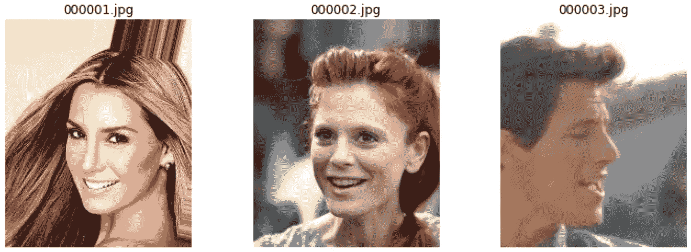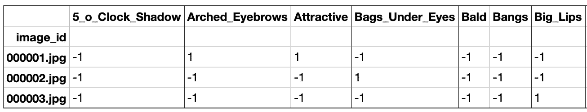

Three random images along with some of their attributes.

## 建立和训练一个 VAE 模型

首先，我们将为名人面孔数据集创建并编译一个卷积 VAE 模型(包括编码器和解码器)。

**更多进口商品**

```
from keras.models import Sequential, Model
from keras.layers import Dropout, Flatten, Dense, Conv2D, MaxPooling2D, Input, Reshape, UpSampling2D, InputLayer, Lambda, ZeroPadding2D, Cropping2D, Conv2DTranspose, BatchNormalization
from keras.utils import np_utils, to_categorical
from keras.losses import binary_crossentropy
from keras import backend as K,objectives
from keras.losses import mse, binary_crossentropy
```

**模型架构**

现在，我们可以创建并总结该模型。

```
b_size = 128
n_size = 512
def sampling(args):
    z_mean, z_log_sigma = args
    epsilon = K.random_normal(shape = (n_size,) , mean = 0, stddev = 1)
    return z_mean + K.exp(z_log_sigma/2) * epsilon

def build_conv_vae(input_shape, bottleneck_size, sampling, batch_size = 32):

    # ENCODER
    input = Input(shape=(input_shape[0],input_shape[1],input_shape[2]))
    x = Conv2D(32,(3,3),activation = 'relu', padding = 'same')(input)    
    x = BatchNormalization()(x)
    x = MaxPooling2D((2,2), padding ='same')(x)
    x = Conv2D(64,(3,3),activation = 'relu', padding = 'same')(x)
    x = BatchNormalization()(x)
    x = MaxPooling2D((2,2), padding ='same')(x)
    x = Conv2D(128,(3,3), activation = 'relu', padding = 'same')(x)
    x = BatchNormalization()(x)
    x = MaxPooling2D((2,2), padding ='same')(x)
    x = Conv2D(256,(3,3), activation = 'relu', padding = 'same')(x)
    x = BatchNormalization()(x)
    x = MaxPooling2D((2,2), padding ='same')(x)

    # Latent Variable Calculation
    shape = K.int_shape(x)
    flatten_1 = Flatten()(x)
    dense_1 = Dense(bottleneck_size, name='z_mean')(flatten_1)
    z_mean = BatchNormalization()(dense_1)
    flatten_2 = Flatten()(x)
    dense_2 = Dense(bottleneck_size, name ='z_log_sigma')(flatten_2)
    z_log_sigma = BatchNormalization()(dense_2)
    z = Lambda(sampling)([z_mean, z_log_sigma])
    encoder = Model(input, [z_mean, z_log_sigma, z], name = 'encoder')

    # DECODER
    latent_input = Input(shape=(bottleneck_size,), name = 'decoder_input')
    x = Dense(shape[1]*shape[2]*shape[3])(latent_input)
    x = Reshape((shape[1],shape[2],shape[3]))(x)
    x = UpSampling2D((2,2))(x)
    x = Cropping2D([[0,0],[0,1]])(x)
    x = Conv2DTranspose(256,(3,3), activation = 'relu', padding = 'same')(x)
    x = BatchNormalization()(x)
    x = UpSampling2D((2,2))(x)
    x = Cropping2D([[0,1],[0,1]])(x)
    x = Conv2DTranspose(128,(3,3), activation = 'relu', padding = 'same')(x)
    x = BatchNormalization()(x)
    x = UpSampling2D((2,2))(x)
    x = Cropping2D([[0,1],[0,1]])(x)
    x = Conv2DTranspose(64,(3,3), activation = 'relu', padding = 'same')(x)
    x = BatchNormalization()(x)
    x = UpSampling2D((2,2))(x)
    x = Conv2DTranspose(32,(3,3), activation = 'relu', padding = 'same')(x)
    x = BatchNormalization()(x)
    output = Conv2DTranspose(3,(3,3), activation = 'tanh', padding ='same')(x)
    decoder = Model(latent_input, output, name = 'decoder')

    output_2 = decoder(encoder(input)[2])
    vae = Model(input, output_2, name ='vae')
    return vae, encoder, decoder, z_mean, z_log_sigma

vae_2, encoder, decoder, z_mean, z_log_sigma = build_conv_vae(img_sample.shape, n_size, sampling, batch_size = b_size)
print("encoder summary:")
encoder.summary()
print("decoder summary:")
decoder.summary()
print("vae summary:")
vae_2.summary()
```

**定义 VAE 损失**

```
def vae_loss(input_img, output):
    # Compute error in reconstruction
    reconstruction_loss = mse(K.flatten(input_img) , K.flatten(output))

    # Compute the KL Divergence regularization term
    kl_loss = - 0.5 * K.sum(1 + z_log_sigma - K.square(z_mean) - K.exp(z_log_sigma), axis = -1)

    # Return the average loss over all images in batch
    total_loss = (reconstruction_loss + 0.0001 * kl_loss)    
    return total_loss
```

**编译模型**

```
vae_2.compile(optimizer='rmsprop', loss= vae_loss)
encoder.compile(optimizer = 'rmsprop', loss = vae_loss)
decoder.compile(optimizer = 'rmsprop', loss = vae_loss)
```

**训练模型**

```
vae_2.fit_generator(train_generator, steps_per_epoch = 4000, validation_data = val_generator, epochs=7, validation_steps= 500)
```

我们随机选择训练集的一些图像，通过编码器运行它们以参数化潜在代码，然后用解码器重建图像。

```
import random
x_test = []
for i in range(64):
    x_test.append(get_input(img_path[random.randint(0,len(img_id))]))
x_test = np.array(x_test)
figure_Decoded = vae_2.predict(x_test.astype('float32')/127.5 -1, batch_size = b_size)
figure_original = x_test[0]
figure_decoded = (figure_Decoded[0]+1)/2
for i in range(4):
    plt.axis('off')
    plt.subplot(2,4,1+i*2)
    plt.imshow(x_test[i])
    plt.axis('off')
    plt.subplot(2,4,2 + i*2)
    plt.imshow((figure_Decoded[i]+1)/2)
    plt.axis('off')
plt.show()
```

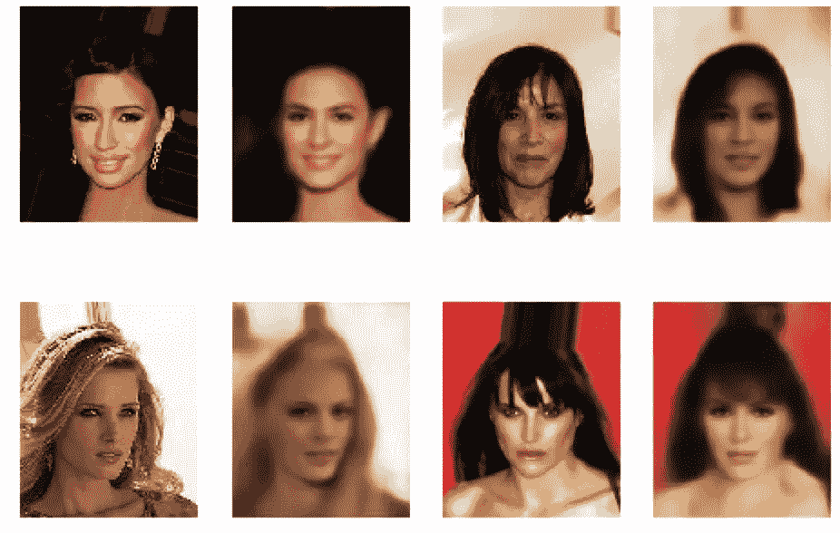

Random samples from training set compared to their VAE reconstruction.

请注意，重建的图像与原始版本有相似之处。然而，新的图像有点模糊，这是一个已知的 VAEs 现象。这被假设是由于变分推理优化了似然性的下限，而不是实际的似然性本身。

**潜在空间表征**

我们可以选择两个不同属性的图像，并绘制它们的潜在空间表示。请注意，我们可以看到潜在代码之间的一些差异，我们可以假设解释原始图像之间的差异。

```
# Choose two images of different attributes, and plot the original and latent space of it

x_test1 = []
for i in range(64):
    x_test1.append(get_input(img_path[np.random.randint(0,len(img_id))]))
x_test1 = np.array(x_test)
x_test_encoded = np.array(encoder.predict(x_test1/127.5-1, batch_size = b_size))
figure_original_1 = x_test[0]
figure_original_2 = x_test[1]
Encoded1 = (x_test_encoded[0,0,:].reshape(32, 16,)+1)/2 
Encoded2 = (x_test_encoded[0,1,:].reshape(32, 16)+1)/2

plt.figure(figsize=(8, 8))
plt.subplot(2,2,1)
plt.imshow(figure_original_1)
plt.subplot(2,2,2)
plt.imshow(Encoded1)
plt.subplot(2,2,3)
plt.imshow(figure_original_2)
plt.subplot(2,2,4)
plt.imshow(Encoded2)
plt.show()
```

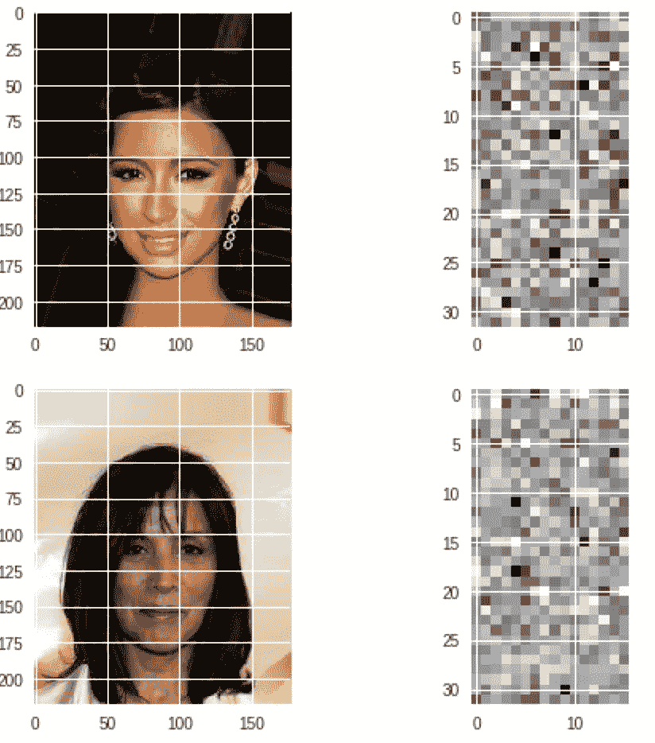

**从潜空间取样**

我们可以随机抽取 15 个潜在代码，解码后生成新的名人面孔。我们可以从这个表示中看到，由我们的模型生成的图像与我们训练集中的那些图像具有非常相似的风格，并且它也具有良好的真实性和变化性。

```
# We randomly generated 15 images from 15 series of noise informationn = 3
m = 5
digit_size1 = 218
digit_size2 = 178
figure = np.zeros((digit_size1 * n, digit_size2 * m,3))

for i in range(3):
    for j in range(5):
        z_sample = np.random.rand(1,512)
        x_decoded = decoder.predict([z_sample])
        figure[i * digit_size1: (i + 1) * digit_size1,
               j * digit_size2: (j + 1) * digit_size2,:] = (x_decoded[0]+1)/2 plt.figure(figsize=(10, 10))
plt.imshow(figure)
plt.show()
```

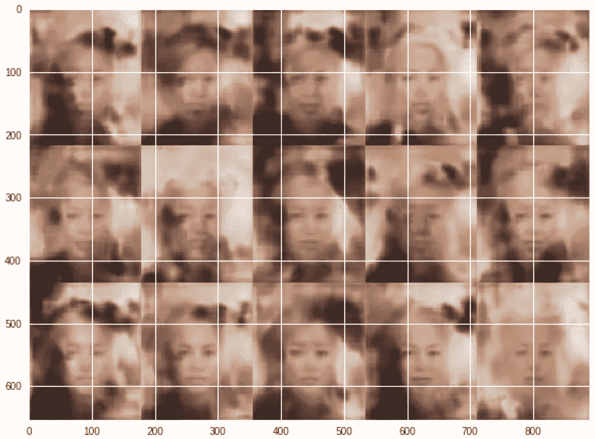

所以看起来我们的 VAE 模式并不是特别好。如果有更多的时间和更好地选择超参数等等，我们可能会取得比这更好的结果。

现在让我们将这个结果与相同数据集上的 DC-甘进行比较。

# **CelebA 数据集上的 DC-甘**

因为我们已经设置了流生成器，所以没有太多的工作要做来启动和运行 DC-甘模型。

```
# Create and compile a DC-GAN model, and print the summary

from keras.utils import np_utils
from keras.models import Sequential, Model
from keras.layers import Input, Dense, Dropout, Activation, Flatten, LeakyReLU,\
      BatchNormalization, Conv2DTranspose, Conv2D, Reshape
from keras.layers.advanced_activations import LeakyReLU
from keras.optimizers import Adam, RMSprop
from keras.initializers import RandomNormal
import numpy as np
import matplotlib.pyplot as plt
import random
from tqdm import tqdm_notebook
from scipy.misc import imresize

def generator_model(latent_dim=100, leaky_alpha=0.2, init_stddev=0.02):

    g = Sequential()
    g.add(Dense(4*4*512, input_shape=(latent_dim,),
                kernel_initializer=RandomNormal(stddev=init_stddev)))
    g.add(Reshape(target_shape=(4, 4, 512)))
    g.add(BatchNormalization())
    g.add(Activation(LeakyReLU(alpha=leaky_alpha)))
    g.add(Conv2DTranspose(256, kernel_size=5, strides=2, padding='same',
                kernel_initializer=RandomNormal(stddev=init_stddev)))
    g.add(BatchNormalization())
    g.add(Activation(LeakyReLU(alpha=leaky_alpha)))
    g.add(Conv2DTranspose(128, kernel_size=5, strides=2, padding='same', 
                kernel_initializer=RandomNormal(stddev=init_stddev)))
    g.add(BatchNormalization())
    g.add(Activation(LeakyReLU(alpha=leaky_alpha)))
    g.add(Conv2DTranspose(3, kernel_size=4, strides=2, padding='same', 
                kernel_initializer=RandomNormal(stddev=init_stddev)))
    g.add(Activation('tanh'))
    g.summary()
    #g.compile(loss='binary_crossentropy', optimizer=Adam(lr=0.0001, beta_1=0.5), metrics=['accuracy'])
    return g

def discriminator_model(leaky_alpha=0.2, init_stddev=0.02):

    d = Sequential()
    d.add(Conv2D(64, kernel_size=5, strides=2, padding='same', 
               kernel_initializer=RandomNormal(stddev=init_stddev),
               input_shape=(32, 32, 3)))
    d.add(Activation(LeakyReLU(alpha=leaky_alpha)))
    d.add(Conv2D(128, kernel_size=5, strides=2, padding='same', 
               kernel_initializer=RandomNormal(stddev=init_stddev)))
    d.add(BatchNormalization())
    d.add(Activation(LeakyReLU(alpha=leaky_alpha)))
    d.add(Conv2D(256, kernel_size=5, strides=2, padding='same', 
               kernel_initializer=RandomNormal(stddev=init_stddev)))
    d.add(BatchNormalization())
    d.add(Activation(LeakyReLU(alpha=leaky_alpha)))
    d.add(Flatten())
    d.add(Dense(1, kernel_initializer=RandomNormal(stddev=init_stddev)))
    d.add(Activation('sigmoid'))
    d.summary()
    return d

def DCGAN(sample_size=100):
    # Generator
    g = generator_model(sample_size, 0.2, 0.02)

    # Discriminator
    d = discriminator_model(0.2, 0.02)
    d.compile(optimizer=Adam(lr=0.001, beta_1=0.5), loss='binary_crossentropy')
    d.trainable = False
    # GAN
    gan = Sequential([g, d])
    gan.compile(optimizer=Adam(lr=0.0001, beta_1=0.5), loss='binary_crossentropy')

    return gan, g, d
```

以上代码只是针对发生器和鉴别器网络的架构。将这种编码 GAN 的方法与我在第 2 部分中使用的方法进行比较是一个好主意，您可以看到这种方法不太清晰，并且我们没有定义全局参数，因此有许多地方我们可能会有潜在的错误。

现在，我们定义了一些函数来简化我们的工作，这些函数主要用于图像的预处理和绘图，以帮助我们分析网络输出。

```
def load_image(filename, size=(32, 32)):
    img = plt.imread(filename)
    # crop
    rows, cols = img.shape[:2]
    crop_r, crop_c = 150, 150
    start_row, start_col = (rows - crop_r) // 2, (cols - crop_c) // 2
    end_row, end_col = rows - start_row, cols - start_row
    img = img[start_row:end_row, start_col:end_col, :]
    # resize
    img = imresize(img, size)
    return img

def preprocess(x):
    return (x/255)*2-1

def deprocess(x):
    return np.uint8((x+1)/2*255)

def make_labels(size):
    return np.ones([size, 1]), np.zeros([size, 1])  

def show_losses(losses):
    losses = np.array(losses)

    fig, ax = plt.subplots()
    plt.plot(losses.T[0], label='Discriminator')
    plt.plot(losses.T[1], label='Generator')
    plt.title("Validation Losses")
    plt.legend()
    plt.show()

def show_images(generated_images):
    n_images = len(generated_images)
    cols = 5
    rows = n_images//cols

    plt.figure(figsize=(8, 6))
    for i in range(n_images):
        img = deprocess(generated_images[i])
        ax = plt.subplot(rows, cols, i+1)
        plt.imshow(img)
        plt.xticks([])
        plt.yticks([])
    plt.tight_layout()
    plt.show()
```

**训练模型**

我们现在定义训练函数。正如我们之前所做的，请注意，我们在将鉴别器设置为可训练和不可训练之间进行了切换(我们在第 2 部分中隐式地这样做了)。

```
def train(sample_size=100, epochs=3, batch_size=128, eval_size=16, smooth=0.1): batchCount=len(train_path)//batch_size
    y_train_real, y_train_fake = make_labels(batch_size)
    y_eval_real,  y_eval_fake  = make_labels(eval_size)

    # create a GAN, a generator and a discriminator
    gan, g, d = DCGAN(sample_size)

    losses = [] for e in range(epochs):
        print('-'*15, 'Epoch %d' % (e+1), '-'*15)
        for i in tqdm_notebook(range(batchCount)):

            path_batch = train_path[i*batch_size:(i+1)*batch_size]
            image_batch = np.array([preprocess(load_image(filename)) for filename in path_batch])

            noise = np.random.normal(0, 1, size=(batch_size, noise_dim))
            generated_images = g.predict_on_batch(noise) # Train discriminator on generated images
            d.trainable = True
            d.train_on_batch(image_batch, y_train_real*(1-smooth))
            d.train_on_batch(generated_images, y_train_fake) # Train generator
            d.trainable = False
            g_loss=gan.train_on_batch(noise, y_train_real)

        # evaluate
        test_path = np.array(val_path)[np.random.choice(len(val_path), eval_size, replace=False)]
        x_eval_real = np.array([preprocess(load_image(filename)) for filename in test_path]) noise = np.random.normal(loc=0, scale=1, size=(eval_size, sample_size))
        x_eval_fake = g.predict_on_batch(noise)

        d_loss  = d.test_on_batch(x_eval_real, y_eval_real)
        d_loss += d.test_on_batch(x_eval_fake, y_eval_fake)
        g_loss  = gan.test_on_batch(noise, y_eval_real)

        losses.append((d_loss/2, g_loss))

        print("Epoch: {:>3}/{} Discriminator Loss: {:>6.4f} Generator Loss: {:>6.4f}".format(
            e+1, epochs, d_loss, g_loss))  

        show_images(x_eval_fake[:10])

    # show the result
    show_losses(losses)
    show_images(g.predict(np.random.normal(loc=0, scale=1, size=(15, sample_size))))    
    return gnoise_dim=100
train()
```

该函数的输出将为我们提供每个时期的以下输出:

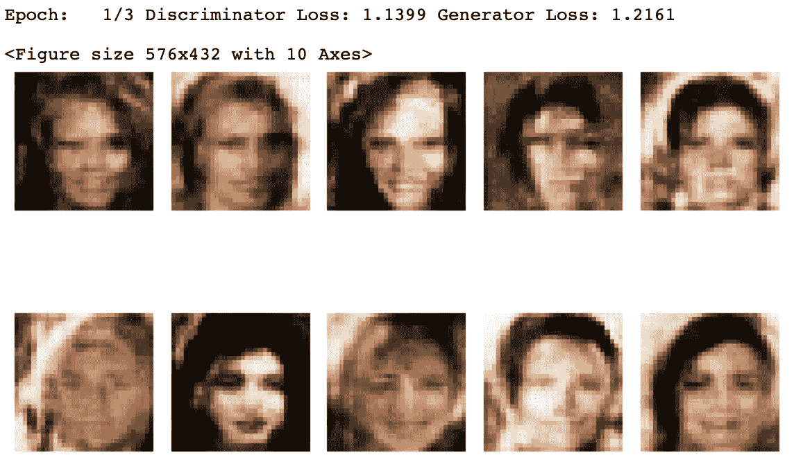

它还将绘制鉴别器和发生器的验证损失。


生成的图像看起来很合理。在这里，我们可以看到我们的模型表现得足够好，尽管图像质量不如训练集中的图像质量好(因为我们对图像进行了整形，使其变得更小，并使它们比原始图像更模糊)。但是，它们足够生动，可以创建有效的人脸，并且这些人脸足够接近现实。此外，与 VAE 制作的图像相比，这些图像更有创意，看起来更真实。

所以看起来 GAN 在这种情况下表现更好。现在，让我们尝试一个新的数据集，看看 GAN 与混合变体 VAE-GAN 相比表现如何。

# **动漫数据集**

在这一节中，我们将使用 GAN 以及另一种特殊形式的 GAN，即 VAE-GAN，来生成与动画数据集风格相同的人脸。术语 VAE-甘首先由 Larsen 等人使用。al 在他们的论文[“使用学习的相似性度量进行像素以外的自动编码”](https://arxiv.org/abs/1512.09300)。VAE-甘模型与甘模型的区别在于它们的**生成器是变异自动编码器**。

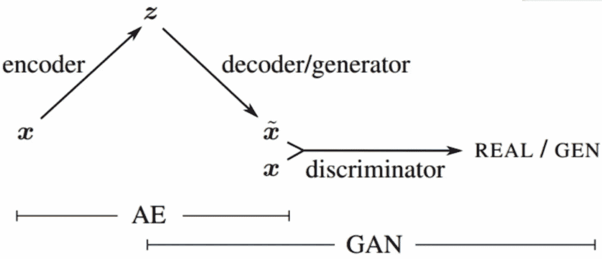

VAE-GAN architecture. Source: [https://arxiv.org/abs/1512.09300](https://arxiv.org/abs/1512.09300)

首先，我们将重点放在 DC-甘。动漫数据集由超过 20K 张 64x64 图像形式的动漫头像组成。我们还需要创建另一个 [Keras 定制数据生成器](https://techblog.appnexus.com/a-keras-multithreaded-dataframe-generator-for-millions-of-image-files-84d3027f6f43)。该数据集的链接可在此处找到:

[](https://github.com/Mckinsey666/Anime-Face-Dataset) [## McKinsey 666/动漫人脸数据集

### 🖼收集了高质量的动漫面孔。为 Mckinsey666/Anime-Face-Dataset 开发做出贡献，创建一个…

github.com](https://github.com/Mckinsey666/Anime-Face-Dataset) 

# **动漫数据集上的甘**

我们需要做的第一件事是创建动漫目录并下载数据。这可以通过上面的链接来完成。在继续之前检查数据总是好的做法，所以我们现在就这样做。

```
from skimage import io
import matplotlib.pyplot as plt

filePath='anime-faces/data/'
imgSets=[]

for i in range(1,20001):
    imgName=filePath+str(i)+'.png'
    imgSets.append(io.imread(imgName))

plt.imshow(imgSets[1234])
plt.axis('off')
plt.show()
```

我们现在创建并编译我们的 DC-甘模型。

```
# Create and compile a DC-GAN modelfrom keras.models import Sequential, Model
from keras.layers import Input, Dense, Dropout, Activation, \
    Flatten, LeakyReLU, BatchNormalization, Conv2DTranspose, Conv2D, Reshape
from keras.layers.advanced_activations import LeakyReLU
from keras.layers.convolutional import UpSampling2D
from keras.optimizers import Adam, RMSprop,SGD
from keras.initializers import RandomNormalimport numpy as np
import matplotlib.pyplot as plt
import os, glob
from PIL import Image
from tqdm import tqdm_notebook image_shape = (64, 64, 3)
#noise_shape = (100,)
Noise_dim = 128
img_rows = 64
img_cols = 64
channels = 3def generator_model(latent_dim=100, leaky_alpha=0.2):
    model = Sequential()

    # layer1 (None,500)>>(None,128*16*16)
    model.add(Dense(128 * 16 * 16, activation="relu", input_shape=(Noise_dim,)))

    # (None,16*16*128)>>(None,16,16,128)
    model.add(Reshape((16, 16, 128)))

   # (None,16,16,128)>>(None,32,32,128)
    model.add(UpSampling2D())
    model.add(Conv2D(256, kernel_size=3, padding="same"))
    model.add(BatchNormalization(momentum=0.8))
    model.add(Activation("relu")) #(None,32,32,128)>>(None,64,64,128)
    model.add(UpSampling2D())

    # (None,64,64,128)>>(None,64,64,64)
    model.add(Conv2D(128, kernel_size=3, padding="same"))
    model.add(BatchNormalization(momentum=0.8))
    model.add(Activation("relu")) # (None,64,64,128)>>(None,64,64,32) model.add(Conv2D(32, kernel_size=3, padding="same"))
    model.add(BatchNormalization(momentum=0.8))
    model.add(Activation("relu"))

    # (None,64,64,32)>>(None,64,64,3)
    model.add(Conv2D(channels, kernel_size=3, padding="same"))
    model.add(Activation("tanh")) model.summary()
    model.compile(loss='binary_crossentropy', optimizer=Adam(lr=0.0001, beta_1=0.5), metrics=['accuracy'])
    return model def discriminator_model(leaky_alpha=0.2, dropRate=0.3):
    model = Sequential()

    # layer1 (None,64,64,3)>>(None,32,32,32)
    model.add(Conv2D(32, kernel_size=3, strides=2, input_shape=image_shape, padding="same"))
    model.add(LeakyReLU(alpha=leaky_alpha))
    model.add(Dropout(dropRate)) # layer2 (None,32,32,32)>>(None,16,16,64)
    model.add(Conv2D(64, kernel_size=3, strides=2, padding="same")) # model.add(ZeroPadding2D(padding=((0, 1), (0, 1))))
    model.add(BatchNormalization(momentum=0.8))
    model.add(LeakyReLU(alpha=leaky_alpha))
    model.add(Dropout(dropRate)) # (None,16,16,64)>>(None,8,8,128)
    model.add(Conv2D(128, kernel_size=3, strides=2, padding="same"))
    model.add(BatchNormalization(momentum=0.8))
    model.add(LeakyReLU(alpha=0.2))
    model.add(Dropout(dropRate)) # (None,8,8,128)>>(None,8,8,256)
    model.add(Conv2D(256, kernel_size=3, strides=1, padding="same"))
    model.add(BatchNormalization(momentum=0.8))
    model.add(LeakyReLU(alpha=0.2))
    model.add(Dropout(dropRate)) # (None,8,8,256)>>(None,8,8,64)
    model.add(Conv2D(64, kernel_size=3, strides=1, padding="same"))
    model.add(BatchNormalization(momentum=0.8))
    model.add(LeakyReLU(alpha=0.2))
    model.add(Dropout(dropRate))

    # (None,8,8,64)
    model.add(Flatten())
    model.add(Dense(1, activation='sigmoid')) model.summary() sgd=SGD(lr=0.0002)
    model.compile(loss='binary_crossentropy', optimizer=Adam(lr=0.0001, beta_1=0.5), metrics=['accuracy'])
    return model def DCGAN(sample_size=Noise_dim):
    # generator
    g = generator_model(sample_size, 0.2) # discriminator
    d = discriminator_model(0.2)
    d.trainable = False
    # GAN
    gan = Sequential([g, d])

    sgd=SGD()
    gan.compile(optimizer=Adam(lr=0.0001, beta_1=0.5), loss='binary_crossentropy')
    return gan, g, d def get_image(image_path, width, height, mode):
    image = Image.open(image_path)
    #print(image.size) return np.array(image.convert(mode)) def get_batch(image_files, width, height, mode):
    data_batch = np.array([get_image(sample_file, width, height, mode) \
                           for sample_file in image_files])
    return data_batch def show_imgs(generator,epoch):
    row=3
    col = 5
    noise = np.random.normal(0, 1, (row * col, Noise_dim))
    gen_imgs = generator.predict(noise) # Rescale images 0 - 1
    gen_imgs = 0.5 * gen_imgs + 0.5 fig, axs = plt.subplots(row, col)
    #fig.suptitle("DCGAN: Generated digits", fontsize=12)
    cnt = 0 for i in range(row):
        for j in range(col):
            axs[i, j].imshow(gen_imgs[cnt, :, :, :])
            axs[i, j].axis('off')
            cnt += 1 #plt.close()
    plt.show()
```

我们现在可以在动画数据集上训练模型。我们将以两种不同的方式来实现这一点，第一种方式将涉及以 1:1 的训练时间比例来训练鉴别器和生成器。

```
# Training the discriminator and generator with the 1:1 proportion of training timesdef train(epochs=30, batchSize=128):
    filePath = r'anime-faces/data/' X_train = get_batch(glob.glob(os.path.join(filePath, '*.png'))[:20000], 64, 64, 'RGB')
    X_train = (X_train.astype(np.float32) - 127.5) / 127.5 halfSize = int(batchSize / 2)
    batchCount=int(len(X_train)/batchSize) dLossReal = []
    dLossFake = []
    gLossLogs = [] gan, generator, discriminator = DCGAN(Noise_dim) for e in range(epochs):
        for i in tqdm_notebook(range(batchCount)):
            index = np.random.randint(0, X_train.shape[0], halfSize)
            images = X_train[index] noise = np.random.normal(0, 1, (halfSize, Noise_dim))
            genImages = generator.predict(noise) # one-sided labels
            discriminator.trainable = True
            dLossR = discriminator.train_on_batch(images, np.ones([halfSize, 1]))
            dLossF = discriminator.train_on_batch(genImages, np.zeros([halfSize, 1]))
            dLoss = np.add(dLossF, dLossR) * 0.5
            discriminator.trainable = False noise = np.random.normal(0, 1, (batchSize, Noise_dim))
            gLoss = gan.train_on_batch(noise, np.ones([batchSize, 1])) dLossReal.append([e, dLoss[0]])
        dLossFake.append([e, dLoss[1]])
        gLossLogs.append([e, gLoss]) dLossRealArr = np.array(dLossReal)
        dLossFakeArr = np.array(dLossFake)
        gLossLogsArr = np.array(gLossLogs)        # At the end of training plot the losses vs epochs
        show_imgs(generator, e) plt.plot(dLossRealArr[:, 0], dLossRealArr[:, 1], label="Discriminator Loss - Real")
    plt.plot(dLossFakeArr[:, 0], dLossFakeArr[:, 1], label="Discriminator Loss - Fake")
    plt.plot(gLossLogsArr[:, 0], gLossLogsArr[:, 1], label="Generator Loss")
    plt.xlabel('Epochs')
    plt.ylabel('Loss')
    plt.legend()
    plt.title('GAN')
    plt.grid(True)
    plt.show()

    return gan, generator, discriminator GAN,Generator,Discriminator=train(epochs=20, batchSize=128)  
train(epochs=1000, batchSize=128, plotInternal=200)
```

输出现在将开始打印一系列的动漫人物。它们起初非常粗糙，随着时间的推移逐渐变得越来越明显。

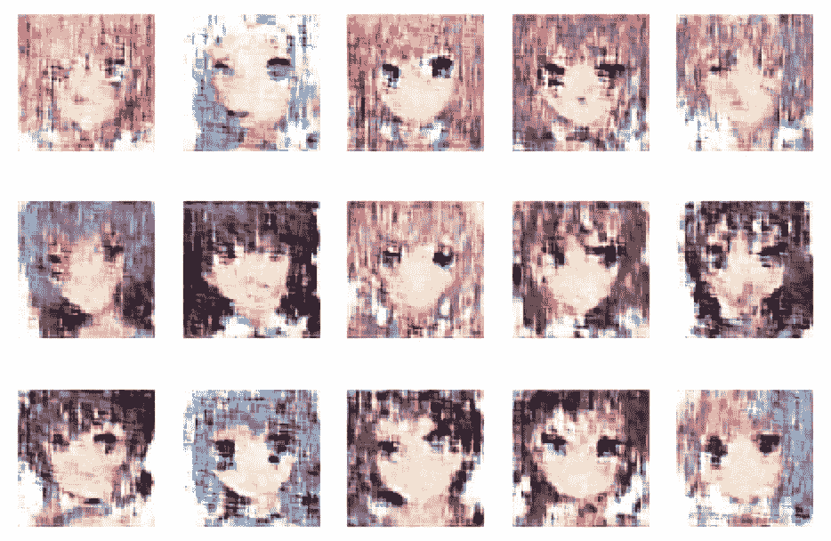

我们还将得到发电机和鉴频器损耗函数的曲线图。

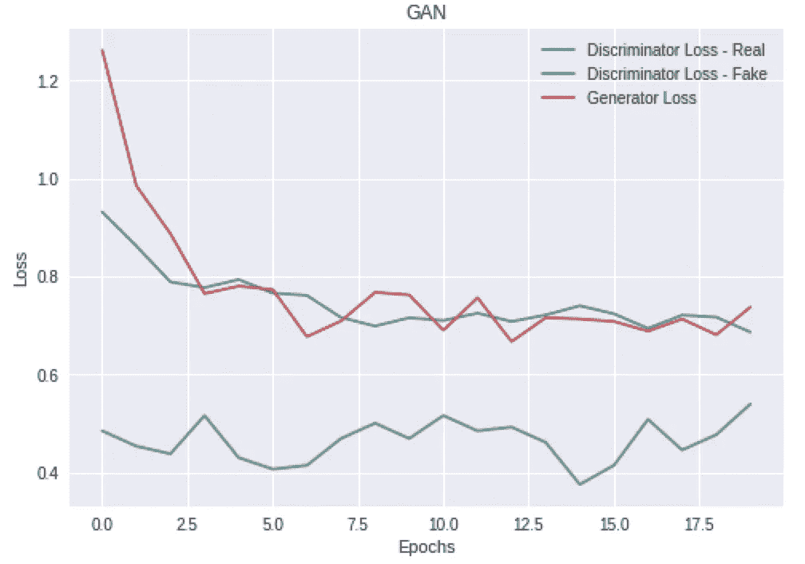

现在我们将做同样的事情，但是用不同的训练时间来训练鉴别器和生成器，看看效果如何。

在继续之前，最好将模型的权重保存在某个地方，这样您就不需要再次运行整个训练，而是可以将权重加载到网络中。

为了节省重量:

```
discriminator.save_weights('/content/gdrive/My Drive/discriminator_DCGAN_lr0.0001_deepgenerator+proportion2.h5')
gan.save_weights('/content/gdrive/My Drive/gan_DCGAN_lr0.0001_deepgenerator+proportion2.h5')
generator.save_weights('/content/gdrive/My Drive/generator_DCGAN_lr0.0001_deepgenerator+proportion2.h5')
```

要加载砝码:

```
discriminator.load_weights('/content/gdrive/My Drive/discriminator_DCGAN_lr0.0001_deepgenerator+proportion2.h5')
gan.load_weights('/content/gdrive/My Drive/gan_DCGAN_lr0.0001_deepgenerator+proportion2.h5')
generator.load_weights('/content/gdrive/My Drive/generator_DCGAN_lr0.0001_deepgenerator+proportion2.h5')
```

现在，我们转到第二个网络实施，而不用担心比之前的网络节省成本。

```
# Train the discriminator and generator separately and with different training timesdef train(epochs=300, batchSize=128, plotInternal=50):
    gLoss = 1
    filePath = r'anime-faces/data/'

    X_train = get_batch(glob.glob(os.path.join(filePath,'*.png'))[:20000],64,64,'RGB')
    X_train=(X_train.astype(np.float32)-127.5)/127.5
    halfSize= int (batchSize/2) dLossReal=[]
    dLossFake=[]
    gLossLogs=[]    for e in range(epochs):
        index=np.random.randint(0,X_train.shape[0],halfSize)
        images=X_train[index] noise=np.random.normal(0,1,(halfSize,Noise_dim))
        genImages=generator.predict(noise)

        if e < int(epochs*0.5):    
            #one-sided labels
            discriminator.trainable=True
            dLossR=discriminator.train_on_batch(images,np.ones([halfSize,1]))
            dLossF=discriminator.train_on_batch(genImages,np.zeros([halfSize,1]))
            dLoss=np.add(dLossF,dLossR)*0.5
            discriminator.trainable=False cnt = e while cnt > 3:
                cnt = cnt - 4 if cnt == 0:
                noise=np.random.normal(0,1,(batchSize,Noise_dim))
                gLoss=gan.train_on_batch(noise,np.ones([batchSize,1]))

        elif e>= int(epochs*0.5) :
            cnt = e while cnt > 3:
                cnt = cnt - 4 if cnt == 0:
                #one-sided labels
                discriminator.trainable=True
                dLossR=discriminator.train_on_batch(images,np.ones([halfSize,1]))
                dLossF=discriminator.train_on_batch(genImages,np.zeros([halfSize,1]))
                dLoss=np.add(dLossF,dLossR)*0.5
                discriminator.trainable=False noise=np.random.normal(0,1,(batchSize,Noise_dim))
            gLoss=gan.train_on_batch(noise,np.ones([batchSize,1])) if e % 20 == 0:
           print("epoch： %d [D loss: %f, acc.: %.2f%%] [G loss: %f]" % (e, dLoss[0], 100 * dLoss[1], gLoss)) dLossReal.append([e,dLoss[0]])
        dLossFake.append([e,dLoss[1]])
        gLossLogs.append([e,gLoss]) if e % plotInternal == 0 and e!=0:
            show_imgs(generator, e)

        dLossRealArr= np.array(dLossReal)
        dLossFakeArr = np.array(dLossFake)
        gLossLogsArr = np.array(gLossLogs)

        chk = e while chk > 50:
            chk = chk - 51 if chk == 0:
            discriminator.save_weights('/content/gdrive/My Drive/discriminator_DCGAN_lr=0.0001,proportion2,deepgenerator_Fake.h5')
            gan.save_weights('/content/gdrive/My Drive/gan_DCGAN_lr=0.0001,proportion2,deepgenerator_Fake.h5')
            generator.save_weights('/content/gdrive/My Drive/generator_DCGAN_lr=0.0001,proportion2,deepgenerator_Fake.h5')
        # At the end of training plot the losses vs epochs
    plt.plot(dLossRealArr[:, 0], dLossRealArr[:, 1], label="Discriminator Loss - Real")
    plt.plot(dLossFakeArr[:, 0], dLossFakeArr[:, 1], label="Discriminator Loss - Fake")
    plt.plot(gLossLogsArr[:, 0], gLossLogsArr[:, 1], label="Generator Loss")
    plt.xlabel('Epochs')
    plt.ylabel('Loss')
    plt.legend()
    plt.title('GAN')
    plt.grid(True)
    plt.show()

    return gan, generator, discriminatorgan, generator, discriminator = DCGAN(Noise_dim)
train(epochs=4000, batchSize=128, plotInternal=200)
```

让我们比较一下这两个网络的输出。通过运行该行:

```
show_imgs(Generator)
```

网络将从生成器输出一些图像(这是我们之前定义的函数之一)。

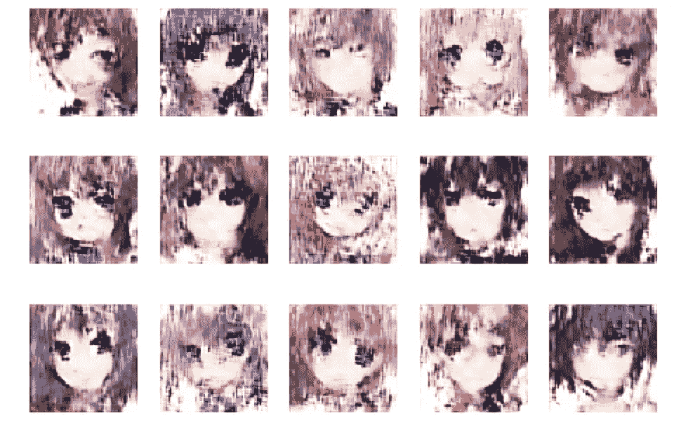

Generated images from 1:1 training of discriminator vs. generator.

现在让我们检查第二个模型。

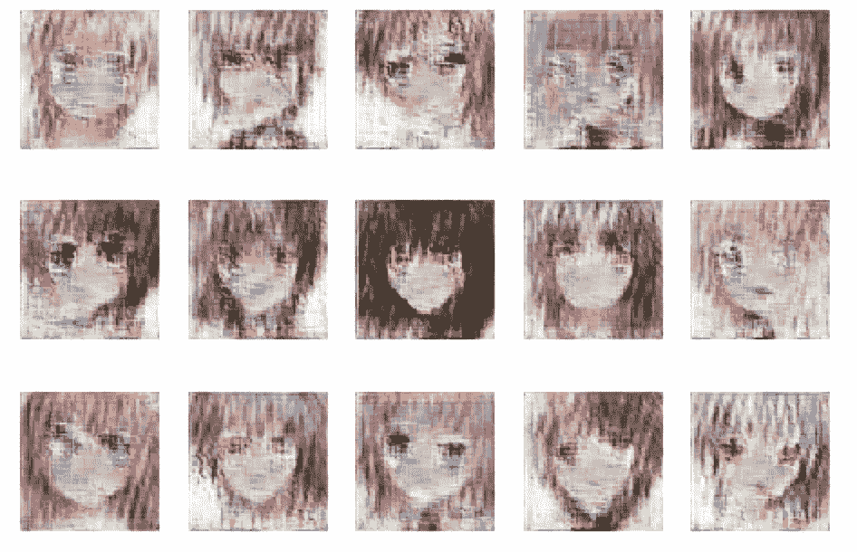

Generated images from the second network with different training times for the discriminator and generator.

我们可以看到，生成的图像的细节得到了改善，它们的纹理稍微更加详细。然而，与训练图像相比，它们仍然是不合格的。

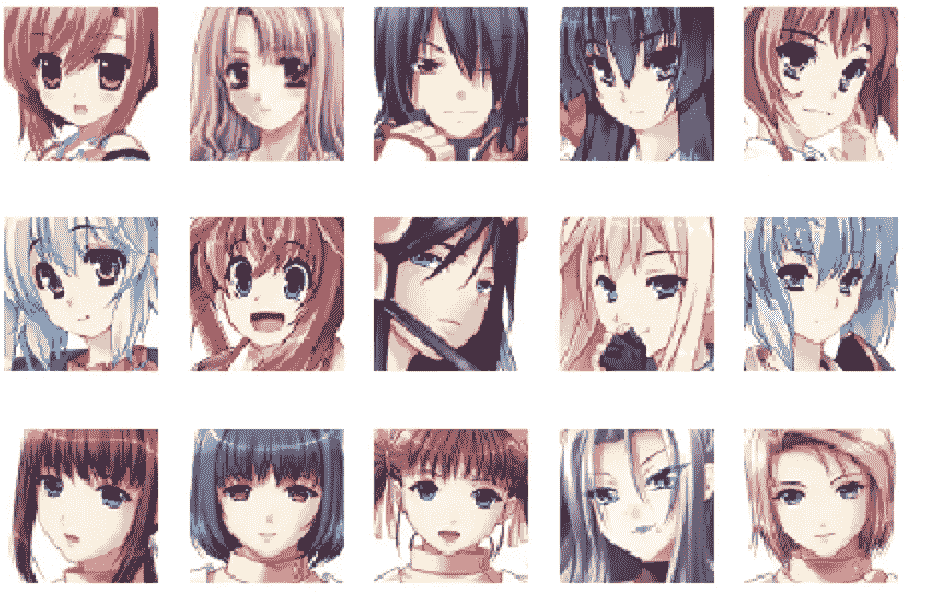

Training images from Anime dataset.

也许 VAE-甘会表现得更好？

# **动漫数据集上的甘**

重申一下我之前说过的关于 VAE-甘的话，术语 VAE-甘首先是由 Larsen 等人使用的。al 在他们的论文[“使用学习的相似性度量进行像素以外的自动编码”](https://arxiv.org/abs/1512.09300)。VAE-甘模型与甘模型的区别在于它们的**生成器是变异自动编码器**。


VAE-GAN architecture. Source: [https://arxiv.org/abs/1512.09300](https://arxiv.org/abs/1512.09300)

首先，我们需要创建并编译 VAE-GAN，并对每个网络进行总结(这是简单检查架构的好方法)。

```
# Create and compile a VAE-GAN, and make a summary for themfrom keras.models import Sequential, Model
from keras.layers import Input, Dense, Dropout, Activation, \
    Flatten, LeakyReLU, BatchNormalization, Conv2DTranspose, Conv2D, Reshape,MaxPooling2D,UpSampling2D,InputLayer, Lambda
from keras.layers.advanced_activations import LeakyReLU
from keras.layers.convolutional import UpSampling2D
from keras.optimizers import Adam, RMSprop,SGD
from keras.initializers import RandomNormal
import numpy as np
import matplotlib.pyplot as plt
import os, glob
from PIL import Image
import pandas as pd
from scipy.stats import norm
import keras
from keras.utils import np_utils, to_categorical
from keras import backend as K
import random
from keras import metrics
from tqdm import tqdm # plotInternal
plotInternal = 50#######
latent_dim = 256
batch_size = 256
rows = 64
columns = 64
channel = 3
epochs = 4000
# datasize = len(dataset)# optimizers
SGDop = SGD(lr=0.0003)
ADAMop = Adam(lr=0.0002)
# filters
filter_of_dis = 16
filter_of_decgen = 16
filter_of_encoder = 16 def sampling(args):
    mean, logsigma = args
    epsilon = K.random_normal(shape=(K.shape(mean)[0], latent_dim), mean=0., stddev=1.0)
    return mean + K.exp(logsigma / 2) * epsilondef vae_loss(X , output , E_mean, E_logsigma):
	# compute the average MSE error, then scale it up, ie. simply sum on all axes
  reconstruction_loss = 2 * metrics.mse(K.flatten(X), K.flatten(output))

	# compute the KL loss
  kl_loss = - 0.5 * K.sum(1 + E_logsigma - K.square(E_mean) - K.exp(E_logsigma), axis=-1) total_loss = K.mean(reconstruction_loss + kl_loss)    

  return total_loss def encoder(kernel, filter, rows, columns, channel):
    X = Input(shape=(rows, columns, channel))
    model = Conv2D(filters=filter, kernel_size=kernel, strides=2, padding='same')(X)
    model = BatchNormalization(epsilon=1e-5)(model)
    model = LeakyReLU(alpha=0.2)(model) model = Conv2D(filters=filter*2, kernel_size=kernel, strides=2, padding='same')(model)
    model = BatchNormalization(epsilon=1e-5)(model)
    model = LeakyReLU(alpha=0.2)(model) model = Conv2D(filters=filter*4, kernel_size=kernel, strides=2, padding='same')(model)
    model = BatchNormalization(epsilon=1e-5)(model)
    model = LeakyReLU(alpha=0.2)(model) model = Conv2D(filters=filter*8, kernel_size=kernel, strides=2, padding='same')(model)
    model = BatchNormalization(epsilon=1e-5)(model)
    model = LeakyReLU(alpha=0.2)(model) model = Flatten()(model) mean = Dense(latent_dim)(model)
    logsigma = Dense(latent_dim, activation='tanh')(model)
    latent = Lambda(sampling, output_shape=(latent_dim,))([mean, logsigma])
    meansigma = Model([X], [mean, logsigma, latent])
    meansigma.compile(optimizer=SGDop, loss='mse')
    return meansigma def decgen(kernel, filter, rows, columns, channel):
    X = Input(shape=(latent_dim,)) model = Dense(2*2*256)(X)
    model = Reshape((2, 2, 256))(model)
    model = BatchNormalization(epsilon=1e-5)(model)
    model = Activation('relu')(model) model = Conv2DTranspose(filters=filter*8, kernel_size=kernel, strides=2, padding='same')(model)
    model = BatchNormalization(epsilon=1e-5)(model)
    model = Activation('relu')(model)

    model = Conv2DTranspose(filters=filter*4, kernel_size=kernel, strides=2, padding='same')(model)
    model = BatchNormalization(epsilon=1e-5)(model)
    model = Activation('relu')(model) model = Conv2DTranspose(filters=filter*2, kernel_size=kernel, strides=2, padding='same')(model)
    model = BatchNormalization(epsilon=1e-5)(model)
    model = Activation('relu')(model) model = Conv2DTranspose(filters=filter, kernel_size=kernel, strides=2, padding='same')(model)
    model = BatchNormalization(epsilon=1e-5)(model)
    model = Activation('relu')(model) model = Conv2DTranspose(filters=channel, kernel_size=kernel, strides=2, padding='same')(model)
    model = Activation('tanh')(model) model = Model(X, model)
    model.compile(loss='binary_crossentropy', optimizer=Adam(lr=0.0001, beta_1=0.5), metrics=['accuracy'])
    return model def discriminator(kernel, filter, rows, columns, channel):
    X = Input(shape=(rows, columns, channel)) model = Conv2D(filters=filter*2, kernel_size=kernel, strides=2, padding='same')(X)
    model = LeakyReLU(alpha=0.2)(model) model = Conv2D(filters=filter*4, kernel_size=kernel, strides=2, padding='same')(model)
    model = BatchNormalization(epsilon=1e-5)(model)
    model = LeakyReLU(alpha=0.2)(model) model = Conv2D(filters=filter*8, kernel_size=kernel, strides=2, padding='same')(model)
    model = BatchNormalization(epsilon=1e-5)(model)
    model = LeakyReLU(alpha=0.2)(model) model = Conv2D(filters=filter*8, kernel_size=kernel, strides=2, padding='same')(model) dec = BatchNormalization(epsilon=1e-5)(model)
    dec = LeakyReLU(alpha=0.2)(dec)
    dec = Flatten()(dec)
    dec = Dense(1, activation='sigmoid')(dec) output = Model(X, dec)
    output.compile(loss='binary_crossentropy', optimizer=Adam(lr=0.0002, beta_1=0.5), metrics=['accuracy'])

    return output def VAEGAN(decgen,discriminator):
    # generator
    g = decgen # discriminator
    d = discriminator
    d.trainable = False
    # GAN
    gan = Sequential([g, d])

#     sgd=SGD()
    gan.compile(optimizer=Adam(lr=0.0001, beta_1=0.5), loss='binary_crossentropy')
    return g, d, gan
```

我们再次定义了一些函数，这样我们就可以打印来自生成器的图像。

```
def get_image(image_path, width, height, mode):
    image = Image.open(image_path)
    #print(image.size)

    return np.array(image.convert(mode))

def show_imgs(generator):
    row=3
    col = 5
    noise = np.random.normal(0, 1, (row*col, latent_dim))
    gen_imgs = generator.predict(noise)

    # Rescale images 0 - 1
    gen_imgs = 0.5 * gen_imgs + 0.5

    fig, axs = plt.subplots(row, col)
    #fig.suptitle("DCGAN: Generated digits", fontsize=12)
    cnt = 0

    for i in range(row):
        for j in range(col):
            axs[i, j].imshow(gen_imgs[cnt, :, :, :])
            axs[i, j].axis('off')
            cnt += 1

    #plt.close()
    plt.show()
```

发生器的参数将受到 GAN 和 VAE 训练的影响。

```
# note: The parameters of the generator will be affected by both the GAN and VAE training

G, D, GAN = VAEGAN(decgen(5, filter_of_decgen, rows, columns, channel),discriminator(5, filter_of_dis, rows, columns, channel))

# encoder
E = encoder(5, filter_of_encoder, rows, columns, channel)
print("This is the summary for encoder:")
E.summary()

# generator/decoder
# G = decgen(5, filter_of_decgen, rows, columns, channel)
print("This is the summary for dencoder/generator:")
G.summary()

# discriminator
# D = discriminator(5, filter_of_dis, rows, columns, channel)
print("This is the summary for discriminator:")
D.summary()

D_fixed = discriminator(5, filter_of_dis, rows, columns, channel)
D_fixed.compile(optimizer=SGDop, loss='mse')

# gan
print("This is the summary for GAN:")
GAN.summary()

# VAE
X = Input(shape=(rows, columns, channel))

E_mean, E_logsigma, Z = E(X)

output = G(Z)
# G_dec = G(E_mean + E_logsigma)
# D_fake, F_fake = D(output)
# D_fromGen, F_fromGen = D(G_dec)
# D_true, F_true = D(X)

# print("type(E)",type(E))
# print("type(output)",type(output))
# print("type(D_fake)",type(D_fake))

VAE = Model(X, output)
VAE.add_loss(vae_loss(X, output, E_mean, E_logsigma))
VAE.compile(optimizer=SGDop)

print("This is the summary for vae:")
VAE.summary()
```

在下面的单元格中，我们开始训练我们的模型。注意，我们使用前面的方法来训练鉴频器以及 GAN 和 VAE 不同的时间长度。我们在训练过程的前半部分强调鉴别器的训练，在后半部分我们更多地训练发生器，因为我们想提高输出图像的质量。

```
# We train our model in this cell

dLoss=[]
gLoss=[]
GLoss = 1
GlossEnc = 1
GlossGen = 1
Eloss = 1

halfbatch_size = int(batch_size*0.5)

for epoch in tqdm(range(epochs)):
    if epoch < int(epochs*0.5):
        noise = np.random.normal(0, 1, (halfbatch_size, latent_dim))
        index = np.random.randint(0,dataset.shape[0], halfbatch_size)
        images = dataset[index]  

        latent_vect = E.predict(images)[0]
        encImg = G.predict(latent_vect)
        fakeImg = G.predict(noise)

        D.Trainable = True
        DlossTrue = D.train_on_batch(images, np.ones((halfbatch_size, 1)))
        DlossEnc = D.train_on_batch(encImg, np.ones((halfbatch_size, 1)))       
        DlossFake = D.train_on_batch(fakeImg, np.zeros((halfbatch_size, 1)))

#         DLoss=np.add(DlossTrue,DlossFake)*0.5

        DLoss=np.add(DlossTrue,DlossEnc)
        DLoss=np.add(DLoss,DlossFake)*0.33
        D.Trainable = False

        cnt = epoch

        while cnt > 3:
            cnt = cnt - 4

        if cnt == 0:
            noise = np.random.normal(0, 1, (batch_size, latent_dim))
            index = np.random.randint(0,dataset.shape[0], batch_size)
            images = dataset[index]  
            latent_vect = E.predict(images)[0]     

            GlossEnc = GAN.train_on_batch(latent_vect, np.ones((batch_size, 1)))
            GlossGen = GAN.train_on_batch(noise, np.ones((batch_size, 1)))
            Eloss = VAE.train_on_batch(images, None)   
            GLoss=np.add(GlossEnc,GlossGen)
            GLoss=np.add(GLoss,Eloss)*0.33
        dLoss.append([epoch,DLoss[0]]) 
        gLoss.append([epoch,GLoss])

    elif epoch >= int(epochs*0.5):
        cnt = epoch
        while cnt > 3:
            cnt = cnt - 4

        if cnt == 0:
            noise = np.random.normal(0, 1, (halfbatch_size, latent_dim))
            index = np.random.randint(0,dataset.shape[0], halfbatch_size)
            images = dataset[index]  

            latent_vect = E.predict(images)[0]
            encImg = G.predict(latent_vect)
            fakeImg = G.predict(noise)

            D.Trainable = True
            DlossTrue = D.train_on_batch(images, np.ones((halfbatch_size, 1)))
        #     DlossEnc = D.train_on_batch(encImg, np.ones((halfbatch_size, 1)))       
            DlossFake = D.train_on_batch(fakeImg, np.zeros((halfbatch_size, 1)))

            DLoss=np.add(DlossTrue,DlossFake)*0.5

#             DLoss=np.add(DlossTrue,DlossEnc)
#             DLoss=np.add(DLoss,DlossFake)*0.33
            D.Trainable = False

        noise = np.random.normal(0, 1, (batch_size, latent_dim))
        index = np.random.randint(0,dataset.shape[0], batch_size)
        images = dataset[index]  
        latent_vect = E.predict(images)[0]

        GlossEnc = GAN.train_on_batch(latent_vect, np.ones((batch_size, 1)))
        GlossGen = GAN.train_on_batch(noise, np.ones((batch_size, 1)))
        Eloss = VAE.train_on_batch(images, None)   
        GLoss=np.add(GlossEnc,GlossGen)
        GLoss=np.add(GLoss,Eloss)*0.33

        dLoss.append([epoch,DLoss[0]]) 
        gLoss.append([epoch,GLoss])

    if epoch % plotInternal == 0 and epoch!=0:
        show_imgs(G)

    dLossArr= np.array(dLoss)
    gLossArr = np.array(gLoss)

#     print("dLossArr.shape:",dLossArr.shape)
#     print("gLossArr.shape:",gLossArr.shape)

    chk = epoch

    while chk > 50:
        chk = chk - 51

    if chk == 0:
        D.save_weights('/content/gdrive/My Drive/VAE discriminator_kernalsize5_proportion_32.h5')
        G.save_weights('/content/gdrive/My Drive/VAE generator_kernalsize5_proportion_32.h5')
        E.save_weights('/content/gdrive/My Drive/VAE encoder_kernalsize5_proportion_32.h5')

    if epoch%20 == 0:    
        print("epoch:", epoch + 1,"  ", "DislossTrue loss:",DlossTrue[0],"D accuracy：",100* DlossTrue[1], "DlossFake loss:", DlossFake[0],"GlossEnc loss:",
          GlossEnc, "GlossGen loss:",GlossGen, "Eloss loss:",Eloss)
#     print("loss:")
#     print("D:", DlossTrue, DlossEnc, DlossFake)
#     print("G:", GlossEnc, GlossGen)
#     print("VAE:", Eloss)

print('Training done,saving weights')
D.save_weights('/content/gdrive/My Drive/VAE discriminator_kernalsize5_proportion_32.h5')
G.save_weights('/content/gdrive/My Drive/VAE generator_kernalsize5_proportion_32.h5')
E.save_weights('/content/gdrive/My Drive/VAE encoder_kernalsize5_proportion_32.h5')

print('painting losses')
# At the end of training plot the losses vs epochs
plt.plot(dLossArr[:, 0], dLossArr[:, 1], label="Discriminator Loss")
plt.plot(gLossArr[:, 0], gLossArr[:, 1], label="Generator Loss")
plt.xlabel('Epochs')
plt.ylabel('Loss')
plt.legend()
plt.title('GAN')
plt.grid(True)
plt.show()
print('end')
```

如果你计划运行这个网络，请注意培训过程需要很长时间。我不会尝试这样做，除非你有一些强大的图形处理器，或者愿意运行一整天的模型。

现在我们的 VAE-GAN 训练已经完成，我们可以检查看看我们的输出图像看起来如何，并与我们以前的 GAN 进行比较。

```
# In this cell, we generate and visualize 15 images. 

show_imgs(G)
```

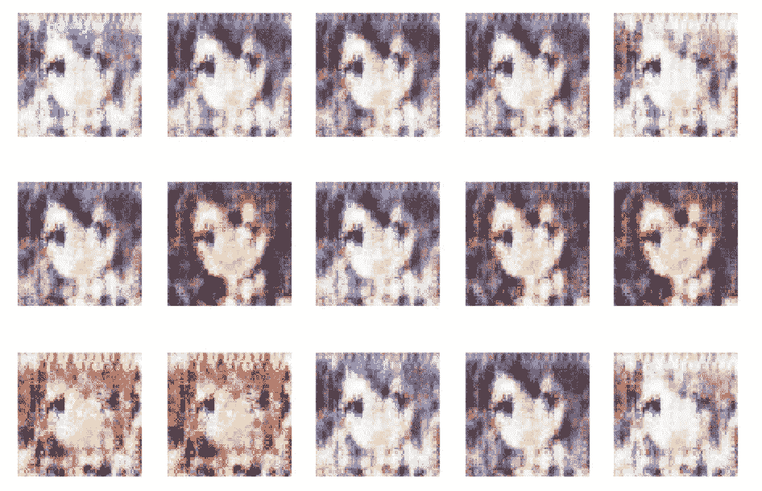

我们可以看到，在 VAE-甘的实现中，我们得到了一个很好的模型，它可以生成清晰的图像，并且具有与原始图像相似的风格。我们的 VAE-甘可以创建更健壮的图像，这可以在没有额外的动画脸噪声的情况下完成。然而，我们模型的概括能力不是很好，它很少改变角色的方式或性别，所以这是我们可以尝试改进的一点。

# **最终点评**

不一定清楚哪个模型比其他模型更好，而且这些方法都没有经过适当的优化，因此很难进行比较。

这仍然是一个活跃的研究领域，所以如果你感兴趣，我建议你投入进去，在你自己的工作中尝试使用 GANs，看看你能想出什么。

我希望你喜欢这个关于 GANs 的文章三部曲，并且现在对它们是什么、它们能做什么以及如何制作你自己的有了更好的了解。

感谢您的阅读！

## 时事通讯

关于新博客文章和额外内容的更新，请注册我的时事通讯。

[](https://mailchi.mp/6304809e49e7/matthew-stewart) [## 时事通讯订阅

### 丰富您的学术之旅，加入一个由科学家，研究人员和行业专业人士组成的社区，以获得…

mailchi.mp](https://mailchi.mp/6304809e49e7/matthew-stewart) 

# 进一步阅读

**在 COLAB 中运行 BigGAN:**

*   [https://colab . research . Google . com/github/tensor flow/hub/blob/master/examples/colab/biggan _ generation _ with _ TF _ hub . ipynb](https://colab.research.google.com/github/tensorflow/hub/blob/master/examples/colab/biggan_generation_with_tf_hub.ipynb)

**更多代码帮助+示例:**

*   [https://www . jessicayung . com/explaining-tensor flow-code-for-a-卷积神经网络/](https://www.jessicayung.com/explaining-tensorflow-code-for-a-convolutional-neural-network/)
*   [https://lilian Weng . github . io/lil-log/2017/08/20/from-GAN-to-wgan . html](https://lilianweng.github.io/lil-log/2017/08/20/from-GAN-to-WGAN.html)
*   [https://py torch . org/tutorials/初学者/dcgan_faces_tutorial.html](https://pytorch.org/tutorials/beginner/dcgan_faces_tutorial.html)
*   [https://github.com/tensorlayer/srgan](https://github.com/tensorlayer/srgan)
*   [https://junyanz.github.io/CycleGAN/](https://junyanz.github.io/CycleGAN/)https://affinelayer.com/pixsrv/
*   [https://tcwang0509.github.io/pix2pixHD/](https://tcwang0509.github.io/pix2pixHD/)

**有影响力的论文:**

*   https://arxiv.org/pdf/1511.06434v2.pdf
*   瓦瑟斯坦甘[https://arxiv.org/pdf/1701.07875.pdf](https://arxiv.org/pdf/1701.07875.pdf)
*   条件生成对抗网(CGAN)[https://arxiv.org/pdf/1411.1784v1.pdf](https://arxiv.org/pdf/1411.1784v1.pdf)
*   使用对抗网络的拉普拉斯金字塔的深度生成图像模型(拉普根)[https://arxiv.org/pdf/1506.05751.pdf](https://arxiv.org/pdf/1506.05751.pdf)
*   使用生成式对抗网络(SRGAN)的照片级单幅图像超分辨率[https://arxiv.org/pdf/1609.04802.pdf](https://arxiv.org/pdf/1609.04802.pdf)
*   使用循环一致对抗网络的不成对图像到图像翻译[https://arxiv.org/pdf/1703.10593.pdf](https://arxiv.org/pdf/1703.10593.pdf)
*   InfoGAN:通过信息最大化生成对抗网络的可解释表示学习[https://arxiv.org/pdf/1606.03657](https://arxiv.org/pdf/1606.03657)
*   https://arxiv.org/pdf/1704.00028.pdf 的 DCGAN
*   瓦瑟斯坦·甘斯的强化训练(WGAN-GP)【https://arxiv.org/pdf/1701.07875.pdf T4
*   基于能量的生成对抗网络(EBGAN)[https://arxiv.org/pdf/1609.03126.pdf](https://arxiv.org/pdf/1609.03126.pdf)
*   使用学习的相似性度量(VAE-甘)对像素之外的内容进行自动编码[https://arxiv.org/pdf/1512.09300.pdf](https://arxiv.org/pdf/1512.09300.pdf)
*   对抗性特征学习(https://arxiv.org/pdf/1605.09782v6.pdf[甘比](https://arxiv.org/pdf/1605.09782v6.pdf)
*   堆叠生成敌对网络(SGAN)[https://arxiv.org/pdf/1612.04357.pdf](https://arxiv.org/pdf/1612.04357.pdf)
*   StackGAN++使用堆叠式生成对抗网络进行现实图像合成[https://arxiv.org/pdf/1710.10916.pdf](https://arxiv.org/pdf/1710.10916.pdf)
*   通过对抗训练(SimGAN)从模拟和无监督图像中学习[https://arxiv.org/pdf/1612.07828v1.pdf](https://arxiv.org/pdf/1612.07828v1.pdf)