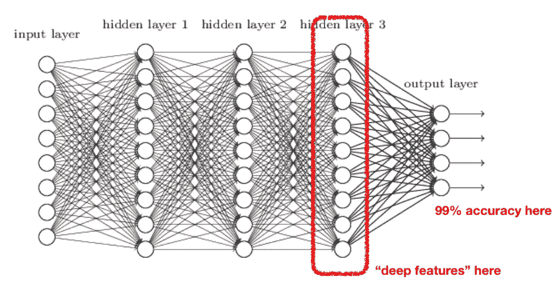
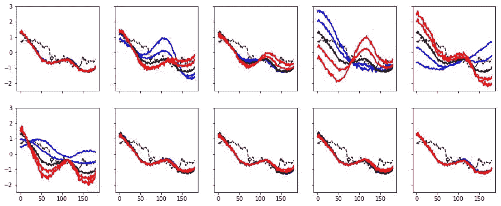

# “GANs”vs“ODEs”:数学建模的终结？

> 原文：<https://towardsdatascience.com/gans-vs-odes-the-end-of-mathematical-modeling-ec158f04acb9?source=collection_archive---------2----------------------->

Disentangling neural networks representations [[source](https://www.tik.ee.ethz.ch/file/8ca5c4b6375e366a1497653cbba27d13/LearningDisentRepresentations.pdf)]

大家好！在这篇文章中，我想在我们在学校、大学学习的经典数学建模和机器学习之间建立一种联系，机器学习也以完全不同的方式对我们周围的对象和过程进行建模。虽然数学家基于他们的专业知识和对世界的理解创建模型，但机器学习算法以某种隐藏的方式描述世界，不完全可以理解，但在大多数情况下，甚至比人类专家开发的数学模型更准确。然而，在许多应用中(如医疗保健、金融、军事)，我们需要清晰和可解释的决策，而机器学习算法，特别是深度学习模型，并没有设计来提供这些决策。

本博客将回顾我们期望从任何模型中获得的主要特征，以及“经典”数学建模和机器学习建模的优缺点，并将展示一个结合了这两个世界的候选者— **解开表征学习**。

此外，如果你想尝试在你自己的数据上应用解开的表示，请查看来自 Google Research 的[我在 GitHub 上的实现](https://github.com/Rachnog/disentanglment)和[这个库](https://github.com/google-research/disentanglement_lib)。

# 深度学习有什么问题？

自从深度学习革命以来，我们试图将神经网络应用到各个领域。在许多重要的领域，它确实有意义，并有助于实现最先进的结果:在计算机视觉，自然语言处理，语音分析和信号处理。最终，所有这些深度学习宣传都是关于从复杂数据中自动提取特征，结合神经网络中的线性和非线性转换，以一些“向量”结束，我们也称之为“嵌入”，它表示关于输入对象的所有需要的信息，并允许对其进行分类或回归:

这些“嵌入”在特征提取和准确性方面确实非常好，但它们在许多方面都失败了:

*   **解释**:大小为 N 的向量没有告诉我为什么要做出某个特定的决定，只有逆向工程方法可以突出输入数据中的“感兴趣的对象”。
*   **需要大量数据**:深度学习实际上对 10–100 个样本不起作用。
*   **无监督学习**:现在大部分应用都需要标注训练数据
*   **零触发重用**:这是当今一个非常重要的问题:在一个数据集上训练的神经网络很少能够直接应用于另一个类似的数据集，而无需重新训练。
*   **对象生成**:我能从这个嵌入中生成一个真实的对象吗？可能是和甘斯——是的。
*   **对象操作**:我可以用这个嵌入操作输入对象的特定属性吗？不完全是。
*   **理论基础**:嗯，我们得到了普适近似理论。不多。

看起来这些问题真的很难在现代机器学习框架内解决。但是我们最近都在处理它们！

# 数学建模有什么好？

关于上面提到的所有这些问题，20 年、50 年甚至 100 年前的大多数数学家根本没有遇到过。为什么？因为他们忙于**数学建模**，即使用数学抽象描述现实世界中的对象和过程，例如，分布、公式或微分方程(这就是为什么我们在标题中有“ODE”，即常微分方程)。让我们再检查一下“问题清单”，但是想想科学家们从零开始创造的数学模型。这里我仍将使用术语“嵌入”，但它将表示数学模型的**参数，即微分方程中的一组自由度。**

*   **解释**:每一个数学模型都是基于科学家对物体的描述而创建的——带有明确的动机和理解。例如，为了描述物理运动，我们的嵌入将由物体质量、运动速度和坐标空间组成——没有抽象矢量！
*   **需要大量数据**:今天的大多数科学突破都不是在“图像网络大小”的数据集上完成的。
*   **无监督学习**:嗯，数学建模也不尽然:)
*   **零炮重用**:比如说，几何布朗运动的同一个随机微分方程可以应用于金融、生物或物理——只需重命名参数名称。
*   **对象生成**:开箱即用，只是采样参数。
*   **对象操纵**:开箱即用，只是操纵参数。
*   **理论基础**:几百年的科学。

那么为什么我们不把微分方程用于所有的事情呢？事实证明，对于大规模的复杂数据，它们的表现要差得多。这就是为什么我们今天正在驾驭深度学习的浪潮。但是，我们仍然希望从人类开发的模型中获得好的属性。

# 结合机器学习和基于人类的建模

如果我们仍然可以使用神经网络，在分析复杂数据时如此准确，而且还具有我们上面描述的属性，会怎么样？可解释性，生成和操纵对象的能力，无监督的特征学习和不同环境下的零拍重用，你在哪？例如，作为面部图像的特征提取器，我希望看到这样的内容:

Almost unsupervised disentanglement

它处理对于微分方程或其他模型来说过于复杂的图像，允许生成和操作对象，是可解释的，并且最有可能的是，也可以在另一个数据集上完成所有这些。这项工作的唯一问题是不能完全无人监督。操纵的另一个重要问题是，当我改变“胡子”特征时，它会自动使一张脸变得更有男子气概，这意味着，习得的特征虽然可以解释，但彼此相关，或者换句话说，**纠缠在一起**。

# β -VAE

然而，有一种方法可以帮助我们获得**解开的**表示，换句话说，一种嵌入，其中每个元素负责一个单独的因素，并且这种嵌入可以用于新数据的分类、生成或操作任务(以零触发的方式)。[该算法](https://openreview.net/forum?id=Sy2fzU9gl)由 DeepMind 实验室开发，基于变分自动编码器，但更强调潜在分布和选择的先验分布之间的 KL 散度，而不是恢复损失。要了解更多细节，我希望你参考下面的视频，它很好地解释了贝塔 VAE 背后的想法，它在监督学习和强化学习中的应用。

beta-VAE applications to machine learning and reinforcement learning

看完这个视频后，你可以看到，beta-VAEs 真的能够提取输入数据的变化因素:物理运动方向、对象大小、颜色和方向，它们能够在强化学习应用中分离感兴趣的对象和背景，以及在现实环境中的模拟中训练的代理的零触发重用。

# 我自己的实验

由于我经常处理医疗和金融应用，在这些应用中，分离可以真正解决许多与模型的可解释性、人工数据生成和零触发学习相关的实际问题，因此我尝试将 beta-VAEs 用于 ECG 数据和 BTC 价格数据。你可以在[我的 GitHub](https://github.com/Rachnog/disentanglment) 里找到训练模型的代码。首先，我将β-VAE(实际上非常简单的 MLP 网络)应用于来自 [PTB 诊断数据集](https://physionet.org/physiobank/database/ptbdb/)的心电图，该数据集实际上有三个变化因素:心电图的不同**导联/形式**、因人而异的**脉搏**、以及**诊断**，即梗塞或其缺失。我用瓶颈大小= 10，学习速率 5e-4，容量 C = 25 训练了 VAE 50 个纪元(详见[本作](https://github.com/miyosuda/disentangled_vae))。输入总是一个心跳。正如我所料，我的模型了解到了数据集中变化的真实因素。在下面的图片上，你可以看到，我是如何操作输入(黑线)心跳的，将一个单一的特性从瓶颈的-3 变为 3，同时保持所有其他特性不变。你可以看到，第 5 个特征负责改变心跳的形式，第 8 个特征代表心脏状况(蓝色心电图有梗塞症状，而红色心电图试图“相反”)，第 10 个特征轻微改变脉搏。

Disentangling ECG beats

关于财务数据，一切都不那么明朗(这并不奇怪)。训练参数相对相似，但输入是 2017 年收集的 180 分钟 BTC 价格样本。我期望从 beta-VAE 中学习一些“标准的”金融时间序列模型，如**均值回复时间序列**，但是解释获得的表示相对困难。好吧，我可以告诉你，特征 5 改变了输入时间序列的趋势，但是特征 2、4 和 6 在时间序列的不同部分添加/移除曲线，或者使其更“不稳定”。

Disentangling BTC close prices

# 多个对象解开

当几个物体出现在图像上，我们想为每个物体找到不同的因素时，该怎么办呢？同样，DeepMind 让我们对他们的结果感到满意。我不会深究细节，只需查看下面两张 gif，获得动力并阅读推文中相应的论文。值得:)

# 摘要

让我们像描述“正常的”深度学习和数学建模一样，得出描述贝塔-VAE 方法的结论。

*   **解释**:完全可解释的特性，我们只需要验证每个特定的嵌入元素。
*   **需要大量数据**:嗯，仍然如此，因为我们正在深度学习领域运营。
*   **无监督学习** : 100%无监督。
*   **零镜头重用**:视频《为自己说话》中的强化学习实例
*   **对象生成**:像一般 VAE 一样简单采样。
*   **物体操作**:你想要的任何变化因素都很好很容易。
*   **理论基础**:进行中的工作:/

我们几乎拥有数学建模的所有良好特性，同时具备深度学习能力，能够以高精度分析复杂的数据类型。因此，一个非常自然的问题出现了:如果我能以完全无监督的方式从复杂数据中学习如此好的表示，这是否意味着“经典”数学建模的终结？如果一个 ML 模型可以做到，我们真的需要考虑复杂的模型吗，我们只需要分析它的特征？由我们决定:)

**P.S.**
如果你觉得这个内容有用，有观点，可以[在 Bitclout 上支持我](https://bitclout.com/u/alexrachnog)。关注我还可以在[脸书](https://www.facebook.com/rachnogstyle.blog)上看到太短的人工智能文章，在 [Instagram](http://instagram.com/rachnogstyle) 上看到个人资料，在 [Linkedin](https://www.linkedin.com/in/alexandr-honchar-4423b962/) 上看到！如果你想在可解释的人工智能应用或其他人工智能项目上合作，请联系我。