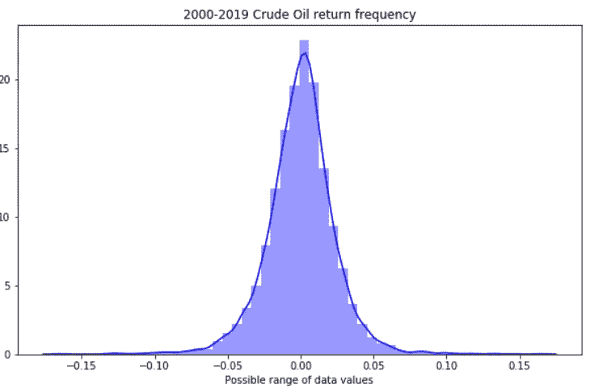

# 使用 GARCH & Monte-Carlo 模拟的波动性度量

> 原文：<https://towardsdatascience.com/garch-processes-monte-carlo-simulations-for-analytical-forecast-27edf77b2787?source=collection_archive---------7----------------------->

## 风险度量是资金管理的关键

## 如何对波动性建模以衡量风险


Image by author

风险措施是投资组合基金管理的主要因素。波动性和风险是相互关联的。高波动性的投资容易产生高风险，因此不利于短期风险。传统上，波动性在度量风险中起着重要的作用，然而，波动性并不跟随市场的变化。为了估计波动性，有必要开发一个考虑到时间序列中波动性变动的模型，例如非对称 Garch 模型，如 Tarch 和 Egarch 模型。

在这里，我们将探讨如何使用 GARCH、e GARCH 和 GJR-GARCH 模型结合蒙特卡罗模拟来建立 VaR 模型。金融时间序列的尖峰值、聚集波动性和杠杆效应特征证明了 GARCH 建模方法的正确性。时间序列的非线性特性将被用来检验布朗运动和研究时间演化模式。

因此，在 GARCH 建模方法之前，我们将采用涉及分形维数(FD)、重标极差和递归量化分析(RQA)的数据建模技术来总结数据的非线性动力学行为并实现研究目标。

# 方法:

*赫斯特系数* *(H)* 是长程相关性的特征，与 *FD* ( *FD + H = 2* )相关。*重定标(R/S)* 分析是分形数据建模的核心工具。经验研究(*1)表明，与该类别中的其他方法相比，如自相关分析、方差比和光谱分解，R/S 会带来更好的结果。它是表征时间序列散度的度量，定义为给定持续时间 *(T)* 的以平均值为中心的值的范围除以该持续时间的标准偏差[*R/S = k * T(H)*]； *k* 是依赖于时间序列的常数。h 测量时间序列的长期记忆，将其描述为均值回复、趋势或随机游走。

> H < 0.5 indicating mean reversion
> 
> H > 0.5 表示趋势时间序列，以及
> 
> H = 0.5 表示随机游走。

递归量化分析(RQA)将用于通过计算 REC、DET、TT 和 LAM 等测量值对动态系统进行量化，从而从数据中提取有价值的见解。

我们将探讨如何使用 GARCH 模型进行风险评估。

GARCH 模型的一个关键限制是对其参数施加非负约束，以确保条件方差的正定性。这种限制会给估计 GARCH 模型带来困难。因此，非对称 GARCH 模型，俗称 GJR-GARCH 模型，可以用来处理对称 GARCH 模型的局限性。此外，指数 GARCH (EGARCH)将被引入，对传统 GARCH 模型进行潜在的改进(4)。

## 数据挖掘:

让我们看看数据中存储了什么。


在过去的几十年里，原油价格呈现大幅波动，尤其是在 2008 年前后。可以看出，随着多次断崖式的涨跌，价格保持在相对较低的水平。从自相关图中可以看到原始数据中显著的序列自相关的明显证据。QQ 和概率图的形状表明该过程接近正态，但尾部很重。

> 简单收益常用的形式是:r(t) = {p(t) — p(t-1)}/p(t-1)对数收益= ln(pt/p(t-1)，pt 每日原油价格，r(t)是每日收益。

日志返回在这里被认为是每日返回。原始价格和对数收益的直观显示清楚地证明了使用接近常数均值的对数收益的合理性。


回归序列图显示了高和低可变性的周期。在图中可以看到一个以零为中心的随机过程。正负收益的大幅波动增加了风险投资和管理的难度。石油日收益率的均值基本上在零水平附近，具有明显的波动聚类，表明存在异方差。ACF 很小，串行不相关，但高度依赖。QQ 和概率图的形状没有明显变化。正负收益的大幅波动增加了风险投资和管理的难度。



```
*sns.distplot(df.returns, color=’blue’) #density plot
plt.title(“2000–2019 Crude Oil return frequency”)
plt.xlabel(‘Possible range of data values’)
# Pull up summary statistics
print(df.returns.describe())*
```

收益的偏度(-0.119)和向右偏离表明正收益比负收益更强烈，峰度(7.042)反映了石油波动的大范围。

> 标准正态分布的偏度和峰度分别为 0 和 3。

Jarque-Bera 检验的值表明，传统的正态分布假设并不适合原油收益的真实分布。


```
*ADF = ADF(df.returns)
print(ADF.summary().as_text())**kpss = KPSS(df.returns)
print(kpss.summary().as_text())**dfgls = DFGLS(df.returns)
print(dfgls.summary().as_text())**pp = PhillipsPerron(df.returns)
print(pp.summary().as_text())**za = ZivotAndrews(df.returns)
print(za.summary().as_text())**vr = VarianceRatio(df.returns, 12)
print(vr.summary().as_text())*
```

进行虚拟现实测试是为了测试收益序列是否是纯粹的随机游走，而不是具有一定的可预测性。我们在这里比较了 1 个月和 12 个月的回报。用负检验统计量 VA(-11.07)拒绝零表示时间序列中存在序列相关性。ADF、KPSS、DFGLS、PP 和 ZA 统计量的单位根和平稳性检验都显示出显著性，表明应用 ***GARCH*** 型模型拟合收益率序列是合适的。

> 自从 Mandelbrot 发表了他的关于 R/S 分析在时间序列的长记忆依赖性中的应用的著作(Mandelbrot，Wallis，1969；Mandelbrot，1972)和自从 Peters 提出了他的分形市场假说(Peters，1991)作为公认的有效市场假说的替代，这种方法正在关于金融时间序列被检查。

## 非线性动力学:

我们现在将使用 *H* 扩展对平稳性的研究。 *H* 提供了一种方法来衡量金融时间序列偏离随机游走的程度。

```
*closes_recent = df.Price[-2000:]
plot(closes_recent); show()
# calculate Hurst of recent prices
lag1 = 2
lags = range(lag1, 20)
tau = [sqrt(std(subtract(closes_recent[lag:], closes_recent[:-lag]))) for lag in lags]
plot(log(lags), log(tau)); show()
m = polyfit(log(lags), log(tau), 1)
hurst = m[0]*2
print (‘hurst = ‘,hurst)*
```


*H* (0.531)表示具有长期相关性的随机运动时间序列。对数收益的长记忆性证明了本研究中给定系列的 ***GARCH*** 模型的合理性。

```
*time_series = TimeSeries(df.Price, embedding_dimension=2, time_delay=2)
settings = Settings(time_series, computing_type=ComputingType.Classic, neighbourhood=FixedRadius(0.65), similarity_measure=EuclideanMetric,
theiler_corrector=1)
computation = RQAComputation.create(settings, verbose=True)
result = computation.run()
result.min_diagonal_line_length = 2
result.min_vertical_line_length = 2
result.min_white_vertical_line_lelngth = 2
print(result)*
```


这里，低 *RR* 表示较低程度的周期性和随机行为；此外，低的 *DET* 值表明较少的确定性。 *LAM* 值表示过程中的层次性，是明显周期性和混沌动力学的阶段交替。虽然来自 RQA 的发现也证明了分形建模的含义，但是，通过显示自动回归行为，非线性动力学拒绝了有效市场假说，证明了使用 GARCH 方法的合理性。

## GARCH 模型:

在估计 GARCH 型模型之前，将回报率放大 100 倍总是一个好主意。这有助于优化器转换，因为波动率截距的范围更接近模型中其他参数的范围。

```
X = 100* df.returns
```

让我们拟合一个 ***ARCH*** 模型，并绘制平方残差来检验自相关性。

```
*gam = arch_model(Model.resid, p=2, o=0, q=2, dist=’StudentsT’)
gres = gam.fit(update_freq=5, disp=’off’)
print(gres.summary())**tsplot(gres.resid**2, lags=30)*
```


我们可以在平方残差中看到自相关的明显证据。让我们拟合一个 GARCH 模型，看看它的表现如何。我们将应用如下程序:

*   *迭代 ARIMA(p，d，q)模型的组合，以最佳拟合时间序列。*
*   *根据 AIC 最低的 ARIMA 模型选择 GARCH 模型订单。*
*   *用 GARCH(p，q)模型拟合时间序列。*
*   *检查自相关的模型残差和残差平方*

```
*def _get_best_model(TS):
 best_aic = np.inf 
 best_order = None
 best_mdl = None
 pq_rng = range(5) # [0,1,2,3,4,5]
 d_rng = range(2) # [0,1]
 for i in pq_rng:
 for d in d_rng:
 for j in pq_rng:
 try:
 tmp_mdl = smt.ARIMA(TS, order=(i,d,j)).fit(
 method=’mle’, trend=’nc’
 )
 tmp_aic = tmp_mdl.aic
 if tmp_aic < best_aic:
 best_aic = tmp_aic
 best_order = (i, d, j)
 best_mdl = tmp_mdl
 except: continue
 print(‘aic: {:6.2f} | order: {}’.format(best_aic, best_order)) 
 return best_aic, best_order, best_mdl

TS = X
res_tup = _get_best_model(TS)*
```

#aic: 22462.01 |顺序:(2，0，2)

所以，我们在这里发现，最佳模型是 ARIMA(2，0，2)。现在我们绘制残差来决定它们是否拥有条件异方差行为的证据。

```
*am = arch_model(X, p=2, q=2, o=1,power=2.0, vol=’Garch’, dist=’StudentsT’)
res = am.fit(update_freq=5)
print(res.summary())*
```


```
*am = arch_model(X, p=2, q=2, o=1,power=2.0, vol=’Garch’, dist=’StudentsT’)
res = am.fit(update_freq=5)
print(res.summary())**eam = arch_model(X, p=2,q=2, o=1, power=2.0, vol=’EGARCH’, dist=’StudentsT’)
eres = eam.fit(update_freq=5)
print(res.summary())**gjam = arch_model(X, p=2, o=1, q=2, power=2.0, dist=’StudentsT’)
gjres = gjam.fit(update_freq=5, disp=’off’)
print(gjres.summary())*
```

所有 3 个 GARCH 模型的输出都以表格形式显示。ω是白噪声，α和β是模型的参数。此外，α [1] + β [1] < 1 表示稳定模型。EGARCH 模型似乎是三个模型中最好的，然而，GARCH 和 EGARCH 之间的差别很小。

> 尽管我已经用所有可用的数据进行了实验；然而，在训练/测试中分割数据并获得 MSE/MAE/RMSE 结果来比较最佳模型拟合是一个好主意。


标准化残差的计算方法是将残差除以条件波动率。

```
*std_resid = res_normal.resid / res_normal.conditional_volatility
unit_var_resid = res_normal.resid / res_normal.resid.std()*
```

标准化残差和条件波动率图显示了一些误差，但幅度不大。


```
*plt.xlim(-2, 2)
sns.kdeplot(squared_resid, shade=True)
sns.kdeplot(std_resid, shade=True)
sns.kdeplot(unit_var_resid, shade=True)
plt.legend([‘Squared Residual’, “Unit variance residual”, “Std Residual”], loc=’best’)
plt.show()*
```

标准化残差也与非标准化但成比例的残差一起绘制。平方残差在中心更突出，表明该分布比标准化残差的分布具有更重的尾部。让我们检查一下 ACF 图。


```
*plot_acf(std_resid)
plt.title(‘Standardized residuals’)
pyplot.show()*
```

看起来有些尖峰超出了阴影置信区域。让我们来看看残差的平方。


```
*plot_acf(squared_resid)
plt.title(‘Squared residuals’)
pyplot.show()*
```

残差平方显示数据点位于蓝色阴影置信区域(95%)内，表明模型拟合度良好。


```
*am = arch_model(X,mean=’HAR’,lags=[1,5,22],vol=’Constant’) 
sim_data = am.simulate([0.1,0.4,0.3,0.2,1.0], 250)
sim_data.index = pd.date_range(‘2019–01–01’,periods=250) 
am = arch_model(sim_data[‘data’],mean=’HAR’,lags=[1,5,22], vol=’Constant’) 
res = am.fit()
fig = res.hedgehog_plot(type=’mean’)*
```

刺猬图显示了 2019 年的预测方法。橙色线表示不同时间间隔的预测。

## **基于模拟的预测:**

基于模拟的方法用于从这里模拟的 EGARCH 中获得预测波动率的置信区间。这个过程被重复了很多次，以获得波动性预测的集合。预测点通过对模拟进行平均来计算，95%置信区间分别使用模拟分布的 2.5%和 97.5%分位数来计算。考虑到平均收益输入(mu)为 0.0292，年波动率输入(vol)为(26.48) * sqrt 252 = 37.37%。


```
*vol = df.returns.std()*sqrt(252)
print (“Annual Volatility =”, str(round(vol,4)*100)+”%”)**#Define Variables
S = df.Price[-1] #starting stock price (i.e. last available real stock price)
T = 252 #Number of trading days
mu = 0.0622 #Return
vol = 0.3737 #Volatility**daily_returns=np.random.normal((1+mu)**(1/T),vol/sqrt(T),T)**price_list = [S]
 price_list.append(price_list[-1]*x)**#Generate Plots — price series and histogram of daily returns
plt.plot(price_list)
plt.show()
plt.hist(daily_returns-1, 100) 
plt.show()*
```

最上面的图显示了一个交易年度(252 天)内潜在价格序列演变的单一模拟，基于遵循正态分布的随机每日回报。第二个图是一年中这些随机日收益率的直方图。然而，真正的洞察力可以从运行成千上万的模拟中获得，每次运行都基于相同的股票特征(mu 和 vol)产生不同系列的潜在价格演变。

```
*#set up empty list to hold our ending values for each simulated price series
result = []**S = df.Price[-1] #starting stock price (i.e. last available real stock price)
T = 252 #Number of trading days
mu = 0.0622 #Return
vol = 0.3737 #Volatility**#choose number of runs to simulate — I have chosen 10,000
for i in range(10000):
 #create list of daily returns using random normal distribution
 daily_returns= np.random.normal((1+mu)**(1/T),vol/sqrt(T),T)

 #set starting price and create price series generated by above random daily returns
 price_list = [S]

 for x in daily_returns:
 price_list.append(price_list[-1]*x)**#append the ending value of each simulated run to the empty list we created at the beginning
 result.append(price_list[-1])**plt.figure(figsize=(10,6))
plt.hist(result,bins= 100)
plt.axvline(np.percentile(result,5), color=’r’, linestyle=’dashed’, linewidth=2)
plt.axvline(np.percentile(result,95), color=’r’, linestyle=’dashed’, linewidth=2)
plt.figtext(0.6,0.8,s=”Start price: $%.2f” %S)
plt.figtext(0.6,0.7,”Mean final price: $58.44")
plt.figtext(0.6,0.6,”5% quantile: $29.72")
plt.figtext(0.15,0.6, “95% quantile: $101.75”)
plt.title(u”Final price distribution for Crude stock”, weight=’bold’, fontsize=12)
plt.show()*
```

这里的结果会略有不同，因为这些是模拟随机的每日收益抽取。由于每个模拟中包含的路径，平均值越倾向于“mu”输入中使用的平均回报。下面的直方图显示了潜在价格分布的几个分位数，以了解非常高或非常低的回报的可能性。


很明显，原油价格有 5%的可能会低于 29.72 美元，有 5%的可能会高于 101.75 美元。

# 关键要点:

在这里，我们研究并提出了一个基于混合时变长记忆 GARCH 和模拟的波动模型。经验证据表明，具有布朗运动的原油数据往往在其时间动态中表现出一定程度的可预测性。

虽然风险值可以用分析方法和模拟方法来衡量；我们使用蒙特卡罗模拟来检验结果的稳健性。蒙特卡洛模拟的输出表明，即使在控制了外来因素之后，结果仍然是稳健的。因此，研究结果提供了一个很好的混合 EGARCH 和 Monte-Carlo 模拟模型，该模型考虑了诸如波动聚集性和不对称性、时变风险和重尾分布等波动特征来衡量原油价格。

我**可以到达** [***这里***](https://www.linkedin.com/in/saritmaitra/) **。**

*参考文献:*

*(1)曼德尔布罗，b . b .&沃利斯，J. R. (1969)。分数高斯噪声的计算机实验:第 2 部分，重新标度的范围和光谱。水资源研究，5(1)，242–259*

*(2)杜塔，A. (2014)。波动性建模:对称或非对称 garch 模型。统计学杂志:理论与应用进展，12(2)，99–108。*

*(3) Glosten，l .，Jagannathan，r .和 Runkle，D. (1993)关于股票预期收益之间的关系，金融杂志，48，1779–801。*

(4) Nelson，D. (1991)资产回报的条件异方差:一种新的方法，计量经济学，59，349–70。

(5)彼得斯，E. E. (1991)，资本市场的混乱和秩序:周期、价格和市场波动的新观点，威利，纽约。