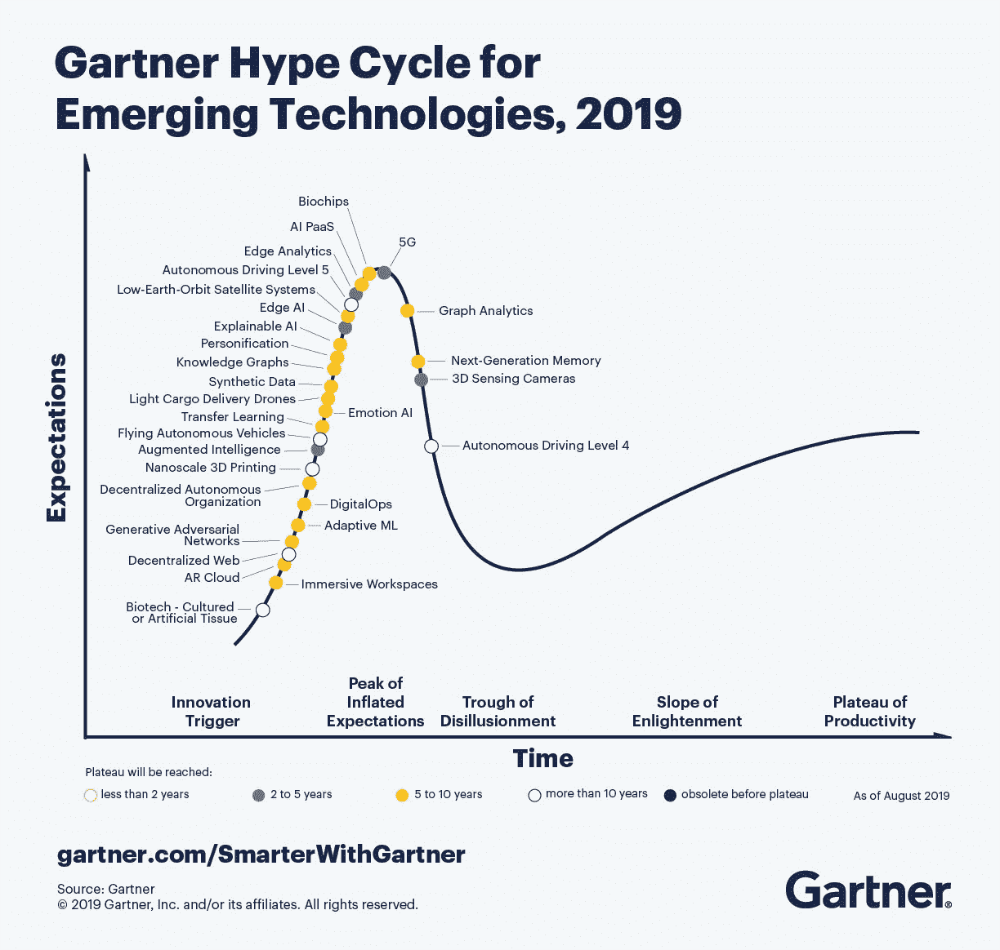

# Gartner 2019 新兴技术炒作周期。人工智能领导者有什么好处？

> 原文：<https://towardsdatascience.com/gartner-2019-hype-cycle-for-emerging-technologies-whats-in-it-for-ai-leaders-3d54ad6ffc53?source=collection_archive---------13----------------------->

[https://www.gartner.com/smarterwithgartner/5-trends-appear-on-the-gartner-hype-cycle-for-emerging-technologies-2019/](https://www.gartner.com/smarterwithgartner/5-trends-appear-on-the-gartner-hype-cycle-for-emerging-technologies-2019/)

Gartner 2019 年对新兴技术的炒作周期已经结束，因此这是一个很好的时机来深入研究这份报告并**反思我们作为一家公司的人工智能战略**。你可以在这里找到完整报告[的简要总结](https://www.gartner.com/smarterwithgartner/5-trends-appear-on-the-gartner-hype-cycle-for-emerging-technologies-2019/)。

首先，在详细介绍报告的内容及其对公司人工智能战略的影响之前，我想谈谈最近几天我在社交网络上看到的一个反复出现的评论。许多人惊讶地看到，某些技术尽管在前几年出现过，却完全从报告中消失了。正如 Gartner 在其研究中解释的那样，其炒作周期涵盖了非常广泛的主题，因此**如果某项特定技术没有被报道，并不一定意味着它们不重要，恰恰相反**。**一些技术从炒作周期中消失的一个原因可能是它们不再是“新兴的”,而是业务和 IT 的关键。**

因此，让我们从实际回顾与人工智能相关的基础技术开始，这些技术已从今年的报告中排除，但对业务仍然至关重要:

*   **深度神经网络**。事实上，Gartner 认为 DNNs 是炒作周期中许多其他新兴技术的基础。
*   **对话人工智能平台。** Gartner 不再考虑对话式人工智能平台新兴技术，而是坚持其业务相关性。
*   **虚拟助手**。Gartner 不再认为虚拟助理是新兴技术，而是坚持其业务相关性。
*   **人工通用智能(AGI)** 。在我看来，Gartner 的呼吁很好，主张围绕人工智能的务实愿景，远离炒作。正如 Gartner 提到的，AGI 几十年内都不会成熟。

**根据 Gartner 的说法，哪些应该是公司人工智能领导者的重点领域？**根据其 2019 年新兴技术优先矩阵，这些技术应该是:

*   **增强智能**。Gartner 将这一新兴技术视为新业务解决方案设计方法的关键，平衡短期自动化与中长期方法，确保不仅通过自动化手段，而且通过放大人才来提高质量。
*   **边缘 AI** 。在那些通信成本、延迟或大容量摄入可能是关键的场景中。当然，这意味着确保我们用例(如深度学习)的足够的人工智能开发和技术可用于我们想要部署的物联网基础设施，以及其他条件。

最后，2019 炒作周期中与 AI 相关的**新兴技术有哪些:**

*   **适应性 ML。**定义为可以在相同评分环境下再培训的一类 ML。
*   **情感 AI。**定义为使用计算机视觉或语音分析等人工智能技术来适应用户的情绪状态并改善整体体验。
*   **可解释的人工智能。**在确保道德和法规合规性的同时，可解释性是深度学习面临的主要挑战之一。可解释的人工智能包括不同的方法和技术，能够解释人工智能算法考虑基于提供的数据产生其输出的推理。
*   **生成对抗网络(GANs)。**最初[由 Ian Goodfellow 和 al。](https://arxiv.org/abs/1406.2661)，GANs 使用两种不同的神经网络(生成型和判别型)。虽然判别网络的目标是改善其对输入数据的分类方式，但生成网络试图通过创建旨在欺骗算法的合成数据来使其失败。虽然这种网络可以用来改善人工智能训练，但它们正被用来按照特定的模式或风格生成视频、音频或文本等合成内容。
*   **迁移学习。**定义为重用先前训练的人工智能模型作为在不同背景下训练它们的起点，一些[人工智能专家声称迁移学习是未来实现人工一般智能的关键](https://www.youtube.com/watch?v=YofMOh6_WKo)。

综上所述，基于我的个人经验，人工智能领导者应该:

*   拥抱像 DNN 这样的人工智能核心技术不是作为一项创新举措，而是作为公司核心战略的一部分。公司应该从实验室概念验证转向可扩展的人工智能方法，包括如何组织人工智能人才、应用方法以及在整个公司范围内实施通用平台。
*   考虑人工智能如何帮助他们的公司与物联网或 5G 等其他创新技术一起解决业务挑战。虽然 Gartner 专注于边缘 AI 的影响，但 5G 也可以在不久的将来使解决有趣的用例变得可行。此外，区块链(顺便说一下，它也从炒作周期中消失了)和人工智能非常适合解决非常有趣的用例。
*   最后，**关注技术的人性一面**。从如何让我们的数字人才从自动化中受益，到考虑人工智能对员工工作、客户体验和整个社会的影响。

*如果你喜欢读这篇文章，请* [*考虑成为会员*](https://dpereirapaz.medium.com/membership) *以获得每个故事的完整访问权，同时支持我和媒体上的其他作者。*