# 高斯混合模型(GMM)

> 原文：<https://towardsdatascience.com/gaussian-mixture-modelling-gmm-833c88587c7f?source=collection_archive---------0----------------------->


## [内部 AI](https://medium.com/towards-data-science/inside-ai/home)

## 使用无监督学习理解文本数据

在之前的[帖子](/k-means-clustering-8e1e64c1561c)中，我讨论了 k-means 聚类作为总结文本数据的一种方式。我还谈到了 k-means 的一些局限性，以及在什么情况下它可能不是最合适的解决方案。可能最大的限制是每个聚类都有相同的对角协方差矩阵。这就产生了球形集群，就它们能够建模的分布类型而言，球形集群是相当不灵活的。在这篇文章中，我想解决其中的一些限制，并特别谈谈一种可以避免这些问题的方法，***【GMM】。这篇文章的格式将与上一篇非常相似，在上一篇文章中，我解释了 GMM 背后的理论以及它是如何工作的。然后，我想深入研究用 Python 编写算法，我们可以看到结果与 k-means 有何不同，以及为什么使用 GMM 可能是一个很好的替代方案。***

# GMM 变得简单了

最简单地说，GMM 也是一种聚类算法。顾名思义，每个聚类都是根据不同的高斯分布建模的。这种灵活的概率数据建模方法意味着，我们有软分配，而不是像 k-means 那样将硬分配到聚类中。这意味着每个数据点可能是由具有相应概率的任何分布生成的。实际上，每个分布对于生成特定的数据点都有一些“责任”。

我们如何评估这种类型的模型？嗯，我们可以做的一件事是为每个数据点引入一个 ***潜变量*** **𝛾** (伽马)。这假设每个数据点都是通过使用潜在变量 **𝛾** 的一些信息生成的。换句话说，它告诉我们哪个高斯函数生成了一个特定的数据点。然而，在实践中，我们没有观察到这些潜在的变量，所以我们需要估计它们。我们该怎么做？对我们来说幸运的是，已经有一种算法可以在这种情况下使用，即 ***期望最大化(EM)算法*** ，这是我们接下来要讨论的。

# EM 算法

EM 算法由两个步骤组成，E 步骤或期望步骤和 M 步骤或最大化步骤。假设我们有一些潜在变量 **𝛾** (它们未被观察到，用下面的向量 z 表示)和我们的数据点 **X** 。我们的目标是在给定参数的情况下最大化 X 的边际可能性(由向量 **θ** 表示)。本质上，我们可以找到作为 X 和 Z 的结合点的边际分布，并对所有 Z 求和(概率求和规则)。


Equation 1: Marginal Likelihood with Latent variables

上述等式通常会产生一个难以最大化的复杂函数。在这种情况下我们能做的就是用 [***简森斯不等式***](https://en.wikipedia.org/wiki/Jensen%27s_inequality)*构造一个*下界函数这样就更容易优化了。如果我们通过最小化两个分布之间的 [***KL 散度***](https://www.coursera.org/learn/bayesian-methods-in-machine-learning/lecture/jyYT0/e-step-details)*(间隙)来优化这一点，我们可以近似原始函数。这个过程如下图 1 所示。我也在上面提供了一个视频链接，展示了 KL 散度的推导，给那些想要更严格的数学解释的人。***

***为了从本质上评估我们的模型，我们只需要执行两个步骤。在第一步(E-step)中，我们希望根据我们的权重(π)均值()和高斯分布的协方差(σ)来估计我们的潜在变量𝛾的后验分布。参数向量在图 1 中表示为θ。估计 E-step 需要首先初始化这些值，我们可以用 k-means 来完成，这通常是一个很好的起点(在下面的代码中有更多的介绍)。然后，我们可以进入第二步(m 步),使用𝛾使参数θ的可能性最大化。重复这个过程，直到算法收敛(损失函数不变)。***

# ***可视化 EM 算法***

***为什么我们不试着用图 1 来形象化这个过程呢？我们在第一步中计算𝛾的后验分布，它相当于我们通过最小化两个分布之间的 KL 散度得到的值。然后，我们将后验概率设为 q(我知道这是一个令人困惑的符号，但这只是𝛾)，并最大化关于参数θ的函数。从图中我们可以看到，当我们迭代和执行这些计算时，我们向最优(或者至少是局部最优)移动。***

***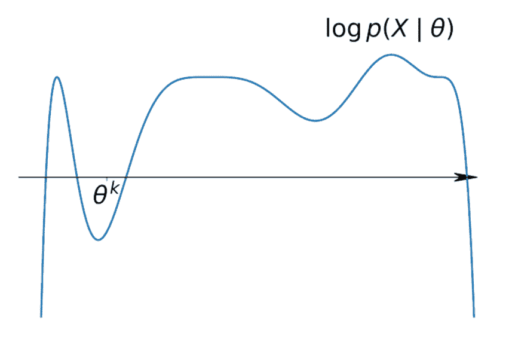***

***Note: Theta is a vector of all parameters, Source: Bayesian Methods for Machine Learning***

# ***GMM 的 EM 算法***

## ***电子步骤***

***好了，现在我们已经看到了 EM 算法在做什么，我想概述并解释一下我们需要在 E 步和 M 步中计算的方程。在编写代码的时候，这些真的很重要。我们可以将高斯混合分布写成权重等于π的高斯分布的组合，如下所示。其中 K 是我们要建模的高斯数。***

***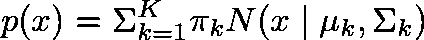***

***Equation 2: Gaussian Mixture Distribution***

***采用上述结果，我们可以使用下面的公式计算每个高斯函数对于每个数据点的责任的后验分布。这个等式就是贝叶斯规则，其中π是先验权重，并且似然性是正态的。***

***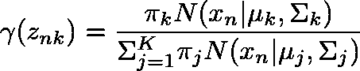***

***Equation 3: Posterior Responsibilities using Bayes Rule***

## ***M 步***

***在计算后验概率之后，我们需要做的就是得到由下面的等式定义的每个高斯参数的估计，然后评估对数似然。然后重复这两个步骤，直到收敛。***

***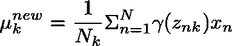***

***Equation 4: Mean of the Gaussians***

***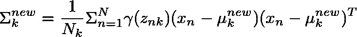***

***Equation 5: Covariance of the Gaussians***

***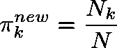***

***Equation 6: weights***

******

***Equation 7: Sum of responsibilities in each Gaussian k***

***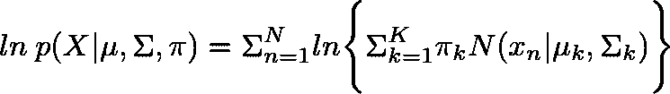***

***Equation 8: Marginal Likelihood: This is what we want to maximise***

***请记住，我们已经以这样的方式设置了问题，我们可以最大化下限(或最小化分布之间的距离)，这将近似于上面的等式 8。我们可以把我们的下界写成如下，其中 z 是我们的潜在变量。请注意，我们的求和现在出现在对数之外，而不是对数之内，这导致表达式比等式 8 简单得多。***

***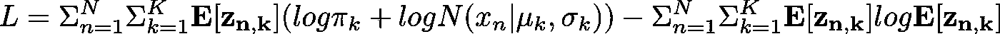***

***Equation 9: Variational Lower Bound, Source: Bishop equation 9.74***

# ***Python 代码***

***既然我们已经解释了建模背后的理论，我想用 Python 来编写这个算法。像我之前的[帖子](/k-means-clustering-8e1e64c1561c)一样，我将使用相同的数据集，这样我们可以比较 k-means 和 GMM 的结果。预处理步骤与前一篇文章中的步骤完全相同，我在这篇文章的结尾提供了完整代码的链接。***

## ***k 均值估计***

***正如我之前提到的，为了开始算法(执行第一步)，我们需要参数的初始值。与其随机设置这些值，不如使用 k-means 来估计它们。这通常会给我们一个好的起点，并可以帮助我们的模型更快地收敛。在我们估计 GMM 之前，让我们快速看一下 k-means 给出了什么样的聚类。***

***sklearn k-means***

***使用来自 sklearn 的估计，我们可以创建一个很好的集群可视化(图 2)。请注意，这些集群都是球形的，大小相同。球形聚类似乎没有很好地模拟数据的分布，这表明在这种特定情况下 k-means 可能不是最佳方法。这说明了 k 均值的局限性之一，因为所有协方差矩阵都是单位方差的对角矩阵。这个限制意味着该模型不是特别灵活。记住这一点，让我们试试 GMM，看看会给我们带来什么样的结果。***

***Source: *Python for Data Science Handbook****

***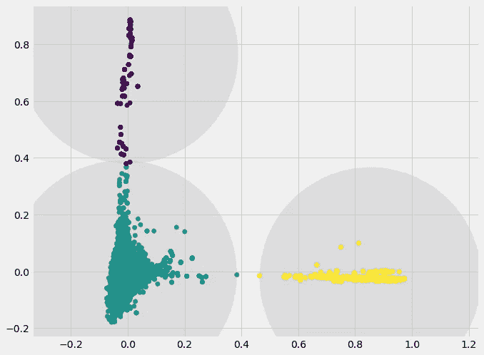***

***Figure 2: k-means spherical Gaussians***

## ***GMM 估计***

***下面的图 3 展示了 GMM 正在做的事情。它清楚地显示了由三种不同的高斯分布建模的三个集群。我在这里用了一个玩具数据集来清楚地说明这一点，因为安然的数据集不太清楚。如你所见，与图 2 中使用球状星团建模相比，GMM 更加灵活，使我们能够生成更好的拟合分布。***

***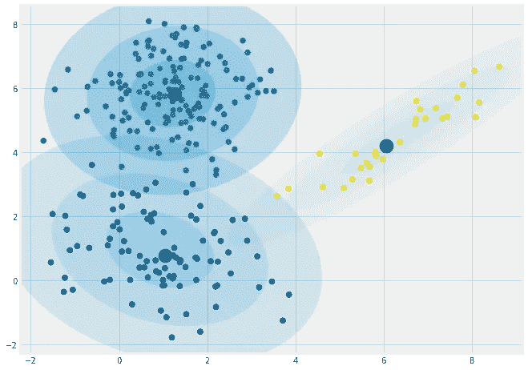***

***Figure 3: GMM example: simple data set: Full Covariance***

## ***GMM Python 类***

***好了，现在我们将直接用 Python 来编写我们的 GMM 类。和往常一样，我们从一个 init 方法开始。我在这里初始化的唯一的东西是我们想要运行我们的算法的次数和我们想要建模的集群的数量。这段代码中最有趣的方法是***calculate _ mean _ 协方差*** 。这有助于我们计算初始参数的值。它接受我们的数据以及来自 k-means 的预测，并计算每个聚类的权重、均值和协方差矩阵。***

**下一段代码实现了我们的 initialise _ parameters 方法，该方法使用 sklearn 库中的 k-means 来计算我们的聚类。注意，这个函数实际上调用了上面定义的 calculate _ mean _ 协方差方法。我们可能已经使用了一种方法来计算我们的集群和初始参数，但是如果每种方法只执行一个特定的任务，通常会更容易调试和避免错误。**

**是时候进入我们班上最重要的方法了。算法的 ***E-step*** 在下面定义，并接受我们的参数和数据，这对于我们上面定义的方程来说是非常有意义的。记住，这一步的目的是计算我们责任的后验分布(𝞬).)这里要注意的主要问题是，我们循环遍历每个 C 高斯函数(在我们的例子中是 3 个),并使用 scipy 中的函数计算后验概率，以计算多元正态 pdf。**

```
**from scipy.stats import multivariate_normal as mvn**
```

**在我们为每个高斯计算了这个值之后，我们只需要归一化伽马(𝞬)，对应于等式 3 中的分母。这是为了确保我们的伽玛是有效概率。如果我们对每个数据点的聚类值求和，它们应该等于 1。**

**在我们计算出职责(𝞬)的值后，我们可以将这些值输入到 ***M-step 中。*** 同样，M 步的目的是使用 E 步的结果计算我们的新参数值，对应于等式 4、5 和 6。为了使调试更容易，我在下面的代码中分离了 ***m_step*** 方法和***compute _ loss _ function***方法。compute_loss_function 正如其名称所暗示的那样。它接受 E-step 和 M-step 返回的责任和参数，并使用这些来计算等式 9 中定义的下限损失函数。**

**我们所有最重要的方法现在都被编码了。与 sklearn 保持一致，我将定义一个 fit 方法，它将调用我们刚刚定义的方法。特别是，我们从初始化参数值开始。在此之后，我们执行 EM 算法中概述的步骤，以选择迭代次数。请注意，实际上并不需要大量的迭代来收敛，特别是当您使用 k-means 来获得初始参数的值时(我认为我的算法在大约 30 次迭代中就收敛了)。**

**因为我们可能也对使用这个模型来预测高斯新数据可能属于什么感兴趣，所以我们可以实现一个 ***预测*** 和 ***预测 _proba*** 方法。predict_proba 方法将接受新的数据点，并预测每个高斯函数的责任。换句话说，这个数据点来自每个分布的概率。这就是我在文章开头提到的软任务的本质。predict 方法基本上做同样的事情，但是使用 np.argmax 来分配具有最高概率的聚类。**

## **符合我们的模型**

**解释完之后，我认为是时候评估我们的模型了，看看我们会得到什么。希望上面的 GMM 视觉化提供了一个关于模型正在做什么的很好的直觉。我们将对我们的安然数据集做完全相同的事情。下面的代码只是使用 3 种不同的高斯模型在我们的数据集上估计我们的 GMM 模型。为了绘图的目的，我还计算了每个分布的最高密度点，对应于中心，这有助于可视化。最后，我们还使用模型参数来绘制图 4 中每个分布的形状。**

**该图的主要结论是，分布显然不再是球形的。GMM 允许我们放松对协方差矩阵的限制，使分布更好地符合数据。考虑到我们的数据显然不是球形的，这一点特别有用。现在，这可能不是一个完美的解决方案，有一些数据点不适合任何分布，但它是对 k 均值的改进。**

**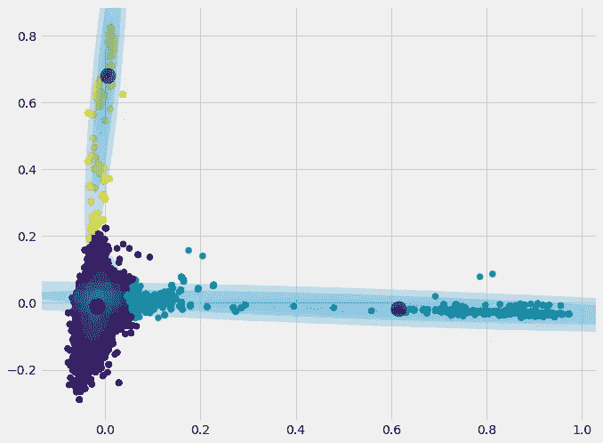**

**Figure 4: GMM with Full covariance**

## **GMM sklearn 实施**

**现在，为了确保我们没有在代码中做任何完全疯狂的事情，我将使用 sklearn 重新做这个估计，看看我的解决方案是否相同。下面的代码与上面的代码几乎完全相同，所以我不会详细介绍。看起来我们和 sklearn 的结果非常相似。唯一不同的是，我们的一个集群中心似乎是不同的。在 sklearn 实现中，中心接近 0.4，而在我们的实现中，中心接近 0.6。或许这是由于 sklearn 中的初始化略有不同？**

**sklearn GMM**

**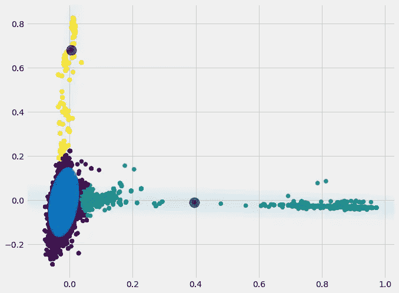**

**Figure 5: GMM sklearn**

**好了，伙计们，这是这篇文章。我希望这是对高斯混合模型的一个有用且非常直观的解释。如果你们中的任何人想要更深入地理解这些材料，我推荐 Coursera 课程 [***机器学习的贝叶斯方法***](https://click.linksynergy.com/link?id=z2stMJEP3T4&offerid=759505.11503135374&type=2&murl=https%3A%2F%2Fwww.coursera.org%2Flearn%2Fbayesian-methods-in-machine-learning) *。*我从本课程中获取了大量资料，我认为它对我在这里提出的概念进行了非常好和深入的解释。我还要推荐主教*[***模式识别与机器学习这本书。*这本书是你在机器学习中会遇到的大多数经典算法的绝佳参考。下面我提供了帖子中概述的 GMM 类的完整代码，以及一个到 Kaggle 内核的链接，我在那里做了所有的分析。一如既往，欢迎反馈。**](https://www.amazon.co.uk/gp/product/0387310738/ref=as_li_tl?ie=UTF8&camp=1634&creative=6738&creativeASIN=0387310738&linkCode=as2&tag=mediumdannyf1-21&linkId=9fde0d314e134f9c89a46f9264704c98)***

## *GMM 类的完整 Python 代码*

****链接完整代码:***[https://www.kaggle.com/dfoly1/gaussian-mixture-model](https://www.kaggle.com/dfoly1/gaussian-mixture-model)*

****来源:***[*Christopher m . Bishop 2006，模式识别与机器学习*](https://www.amazon.co.uk/gp/product/0387310738/ref=as_li_tl?ie=UTF8&camp=1634&creative=6738&creativeASIN=0387310738&linkCode=as2&tag=mediumdannyf1-21&linkId=9fde0d314e134f9c89a46f9264704c98)*

****来源:*** [*机器学习的贝叶斯方法:Coursera 课程*](https://click.linksynergy.com/link?id=z2stMJEP3T4&offerid=759505.11503135374&type=2&murl=https%3A%2F%2Fwww.coursera.org%2Flearn%2Fbayesian-methods-in-machine-learning)*

****来源:***[*Python for Data Science Handbook*](https://jakevdp.github.io/PythonDataScienceHandbook/)*

**请注意，上面的一些链接是附属链接。**