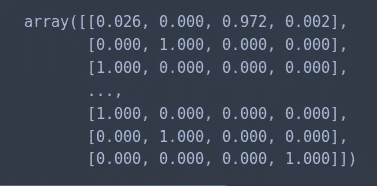
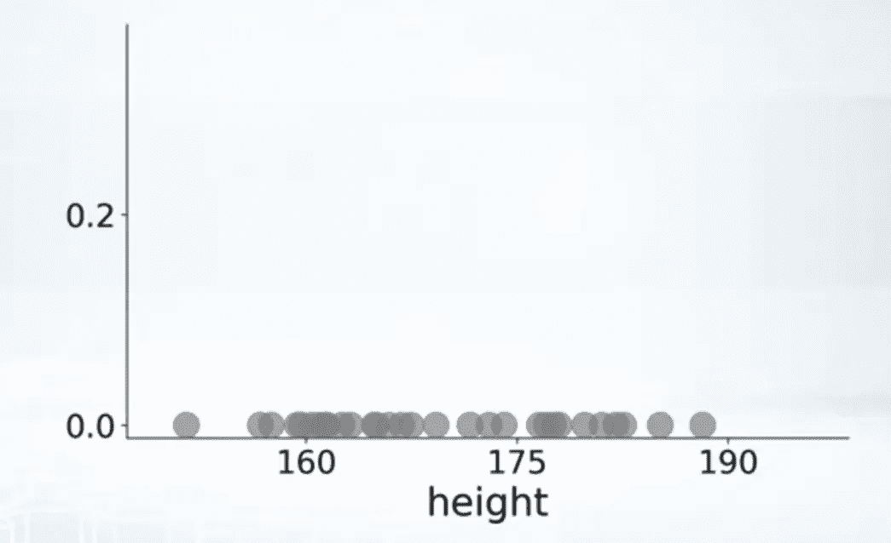

# 高斯混合模型聚类算法讲解

> 原文：<https://towardsdatascience.com/gaussian-mixture-models-d13a5e915c8e?source=collection_archive---------0----------------------->


[https://www.pexels.com/photo/macbook-pro-beside-spiral-notebook-669616/](https://www.pexels.com/photo/macbook-pro-beside-spiral-notebook-669616/)

高斯混合模型可以像 k-means 一样用于聚类未标记的数据。然而，与 k-均值相比，使用高斯混合模型有几个优点。

首先，k 均值不考虑方差。方差是指钟形曲线的宽度。


在二维中，方差(确切地说是协方差)决定了分布的形状。


思考*k*-均值模型的一种方式是，它在每个集群的中心放置一个圆(或者，在更高维度中，一个超球体)，半径由集群中最远的点定义。


当你的数据是循环的时候，这很好。然而，当您的数据呈现不同的形状时，您最终会得到这样的结果。


相比之下，高斯混合模型甚至可以处理非常长方形的集群。


k-means 和高斯混合模型之间的第二个区别是前者执行硬分类，而后者执行软分类。换句话说，k-means 告诉我们什么数据点属于哪个聚类，但不会给我们提供给定数据点属于每个可能的聚类的概率。

在调用`predict`函数时，模型会将每个数据点分配给其中一个聚类。

```
gmm.predict(X)
```


另一方面，我们可以调用`predict_proba`函数来返回一个数据点属于每个 *K* 聚类的概率。

```
gmm.predict_proba(X)
```



# 高斯混合模型一览

顾名思义，高斯混合模型涉及多个高斯分布的混合(即叠加)。为了便于解释，假设我们有三个由三个不同类别的样本组成的分布。

蓝色高斯表示构成下层阶级的人的教育水平。红高斯表示构成中产阶级的人的教育水平，绿高斯表示构成上层阶级的人的教育水平。


在不知道哪些样本来自哪个类的情况下，我们的目标是使用高斯混合模型将数据点分配到适当的聚类中。

训练完模型后，我们理想的结果是在同一轴上有三个分布。然后，根据给定样本的教育水平(它在轴上的位置)，我们将它放在三个类别中的一个。


每个分布都乘以一个权重π，以说明我们在每个类别中没有相同数量的样本。换句话说，我们可能只包括了 1000 名来自上层阶级的人和 10 万名来自中产阶级的人。

因为我们处理的是概率，所以权重加起来应该是 1。


如果我们决定添加另一个维度，比如孩子的数量，那么，它可能看起来像这样。


# 高斯混合模型算法

对于那些对数学不感兴趣的人，我提前向你们道歉，因为下一节很重。

假设我们想知道第 I 个样本来自高斯*k*的**概率是多少。我们可以这样表达:**


其中θ代表每个高斯的平均值、协方差和权重。


你也可能会碰到写成π的方程。这不要和每个高斯相关的权重混淆(我知道的混淆)。


接下来，我们将观察到来自高斯 K 的数据点的**可能性表示为:**


后者有时候是这样写的(我相信 ***N*** 来源于 ***N*** 正规分布):


假设我们有一个高斯分布，横轴是一个人可能得到的不同智商分数，从最低到最高。我们可以通过从沿着 x 轴的位置到曲线画一条垂直线，然后查看 y 轴上相应的值，来找出个人智商为 120 的可能性有多大。任意一点的 y 值都等于上面的等式。

如果我们想知道在考虑所有不同分布的情况下观察样本 ***i*** 的可能性，我们只需对观察样本的可能性求和，假设样本来自每个可能的高斯分布。


换句话说，我们从数据集中选取一个样本(行)，查看单个特征(即教育水平)，在 x 轴上绘制其位置，并对每个分布的相应 y 值(可能性)求和。


为了将此扩展到我们数据集中的所有样本。我们假设观察一个样本的可能性独立于所有其他样本，然后我们可以简单地将它们相乘。


我们可以使用之前看到的命名法重写该等式，如下所示:


通常情况下，我们采用可能性的对数，因为对数中两个数字的乘积等于其组成部分的对数之和，并且数字相加比相乘更容易。


# 期望最大化算法

我们还需要解决这样一个事实，即我们需要每个高斯的参数(即方差、均值和权重)以便对我们的数据进行聚类，但是我们需要知道哪个样本属于哪个高斯，以便估计那些完全相同的参数。

这就是期望最大化发挥作用的地方。在高层次上，期望值最大化算法可以描述如下:

1.  从随机高斯参数(θ)开始
2.  重复以下步骤，直到我们收敛:

a) **期望步骤**:计算 p(zi = k | xi，θ)。换句话说，样本 *i* 看起来像是来自聚类 k 吗？

b) **最大化步骤**:更新高斯参数(θ) 以适合分配给它们的点。

# 最大化步骤

在最大化步骤中，我们希望最大化每个样本来自分布的可能性。回想一下，可能性是曲线在 x 轴某一点的高度。因此，我们希望修改分布的方差和均值，以使每个数据点的图形高度最大化。


这就带来了一个问题，“我们应该如何着手选择方差和均值的最优值。”使用*期望最大化*的一般形式，我们可以推导出均值、方差和权重的一组方程。


我们可以遵循相同的过程来获得协方差和权重的方程。


一旦我们有了方程，我们只需在最大化步骤中应用它们。也就是说，我们在每个方程中插入数字，以确定最佳均值、协方差、权重，然后相应地设置高斯参数。

让我们来看看数学在起作用。最初，我们不知道哪些点与哪个分布相关联。



我们从具有随机均值、方差和权重的 K 个高斯分布(在这种情况下，K=2)开始。


然后，我们重复期望和最大化步骤，直到θ几乎没有变化。


值得注意的是，该算法易受局部极大值的影响。

# 密码

现在，我们已经掌握了高斯混合模型的工作原理，让我们来看看如何实现它们。首先，导入以下库。

```
import numpy as np
from sklearn.datasets.samples_generator import make_blobs
from sklearn.mixture import GaussianMixture
from matplotlib import pyplot as plt
import seaborn as sns
sns.set()
```

我们随机生成 4 个集群。

```
X, y = make_blobs(n_samples=300, centers=4, cluster_std=0.60, random_state=0)
plt.scatter(X[:,0], X[:,1])
```


最佳聚类数(K)是最小化[赤池信息准则(AIC)](https://en.wikipedia.org/wiki/Akaike_information_criterion) 或[贝叶斯信息准则(BIC)](https://en.wikipedia.org/wiki/Bayesian_information_criterion) 的值。

```
n_components = np.arange(1, 21)
models = [GaussianMixture(n, covariance_type='full', random_state=0).fit(X) for n in n_components]plt.plot(n_components, [m.bic(X) for m in models], label='BIC')
plt.plot(n_components, [m.aic(X) for m in models], label='AIC')
plt.legend(loc='best')
plt.xlabel('n_components');
```


我们使用最佳数量的聚类(在本例中为 4)来训练我们的模型。

```
gmm = GaussianMixture(n_components=4)gmm.fit(X)
```

我们使用`predict`方法来获得一系列的点和它们各自的集群。

```
labels = gmm.predict(X)plt.scatter(X[:, 0], X[:, 1], c=labels, cmap='viridis');
```


# 最后的想法

与 k-means 不同，高斯混合模型考虑了方差并返回数据点属于每个 *K* 聚类的概率。