# 高斯混合模型解释

> 原文：<https://towardsdatascience.com/gaussian-mixture-models-explained-6986aaf5a95?source=collection_archive---------0----------------------->

## 从直觉到实施

在机器学习领域，我们可以区分两个主要领域:监督学习和非监督学习。两者的主要区别在于数据的性质以及处理数据的方法。聚类是一个无监督的学习问题，我们希望在数据集中找到具有一些共同特征的点的聚类。假设我们有一个类似这样的数据集:

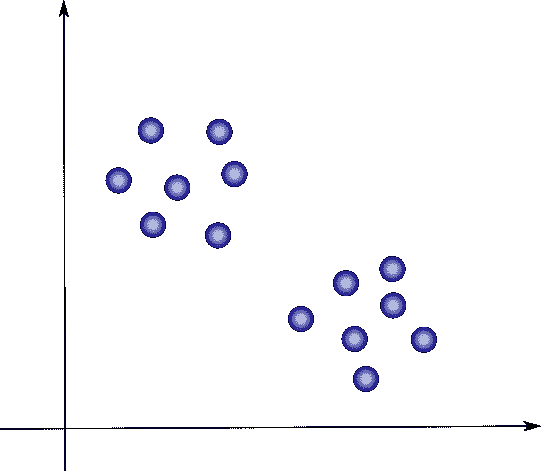

我们的工作是找到看起来很接近的几组点。在这种情况下，我们可以清楚地识别出两组点，我们将分别将它们着色为蓝色和红色:

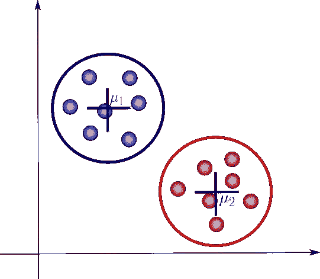

请注意，我们现在引入了一些额外的符号。这里，μ1 和μ2 是每个聚类的质心，并且是识别每个聚类的参数。一种流行的聚类算法被称为 K-means，它将遵循迭代方法来更新每个聚类的参数。更具体地说，它要做的是计算每个聚类的均值(或质心)，然后计算它们到每个数据点的距离。后者随后被标记为由其最近质心识别的聚类的一部分。重复该过程，直到满足某种收敛标准，例如当我们看不到集群分配中的进一步变化时。

K-means 的一个重要特点是它是一个*硬聚类方法*，也就是说它会将每个点关联到一个且仅一个聚类。这种方法的一个局限是没有不确定性度量或*概率*来告诉我们一个数据点与一个特定的聚类有多少关联。那么，使用软集群而不是硬集群怎么样呢？这正是高斯混合模型(简称 GMM)试图做的事情。现在让我们进一步讨论这个方法。

# 定义

一个*高斯混合*是一个由几个高斯组成的函数，每个高斯由 *k* ∈ {1，…， *K* }标识，其中 *K* 是我们数据集的聚类数。混合物中的每个高斯 k 由以下参数组成:

*   定义其中心的平均值μ。
*   定义其宽度的协方差σ。这相当于多变量场景中椭球体的维度。
*   定义高斯函数大小的混合概率π。

现在让我们用图表来说明这些参数:

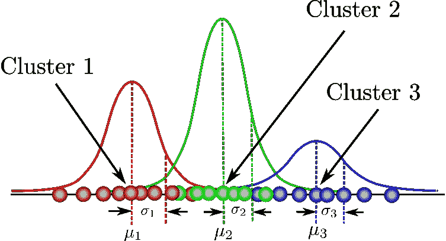

在这里，我们可以看到有三个高斯函数，因此 *K* = 3。每个高斯解释了三个可用分类中包含的数据。混合系数本身是概率，必须满足以下条件:

现在，我们如何确定这些参数的最佳值呢？为了实现这一点，我们必须确保每个高斯拟合属于每个聚类的数据点。这正是最大似然法的作用。

通常，高斯密度函数由下式给出:

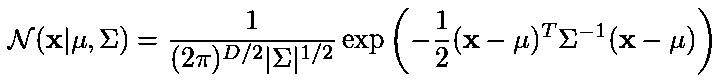

其中 **x** 代表我们的数据点， *D* 是每个数据点的维数。μ和σ分别是均值和协方差。如果我们有一个由 *N* = 1000 个三维点( *D* = 3)组成的数据集，那么 **x** 将是一个 1000 × 3 的矩阵。μ将是 1 × 3 的向量，σ将是 3 × 3 的矩阵。为了后面的目的，我们还会发现取这个等式的对数是有用的，它由下式给出:

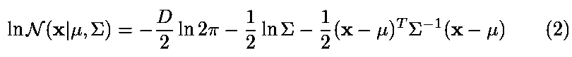

如果我们对该方程的均值和协方差进行微分，然后使其等于零，那么我们将能够找到这些参数的最优值，并且解将对应于该设置的最大似然估计(MLE)。然而，因为我们处理的不是一个，而是许多个高斯函数，当我们找到整个混合物的参数时，事情会变得有点复杂。在这方面，我们需要引入一些额外的方面，我们将在下一节中讨论。

# 初始导数

我们现在要引入一些额外的符号。只是一句警告。数学来了！别担心。为了更好地理解推导，我将尽量保持符号的简洁。首先假设我们想知道一个数据点**x**n 来自高斯 *k* 的概率是多少。我们可以这样表达:

上面写着“*给定一个数据点* **x** *，它来自高斯 k 的概率是多少？”*在这种情况下， *z* 是一个*潜在变量*，它只取两个可能的值。当 **x** 来自高斯 *k* 时为 1，否则为零。实际上，我们在现实中看不到这个 *z* 变量，但是知道它出现的概率将有助于我们确定高斯混合参数，正如我们稍后讨论的。

同样，我们可以陈述如下:

这意味着观察到来自高斯 *k* 的点的总概率实际上等于该高斯的混合系数。这是有意义的，因为高斯越大，我们期望的概率就越高。现在让 **z** 成为所有可能的潜在变量 *z* 的集合，因此:

我们预先知道每个 *z* 独立于其他出现，并且当 *k* 等于该点来自的集群时，它们只能取值 1。因此:

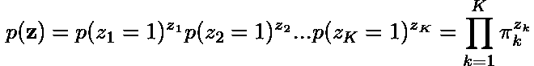

现在，假设我们的数据来自高斯函数 *k* ，那么如何找到观察数据的概率呢？原来它其实就是高斯函数本身！遵循我们用来定义 *p* ( **z** )的相同逻辑，我们可以声明:

好吧，现在你可能会问，我们为什么要做这些？还记得我们最初的目标是确定给定我们的观测值 **x** 时 *z* 的概率吗？事实证明，我们刚刚推导出的方程，以及贝叶斯法则，将帮助我们确定这个概率。根据概率的乘积法则，我们知道

嗯，看起来我们现在有所进展了。右边的操作数是我们刚刚找到的。也许你们中的一些人会预料到，我们会用贝叶斯法则来得到我们最终需要的概率。但是，首先我们会需要***p*(x***n***)**，而不是***p*(x***n*， **z)** 。那么我们这里怎么去掉 **z** 呢？是的，你猜对了。边缘化！我们只需要总结一下 z 轴上的术语，因此

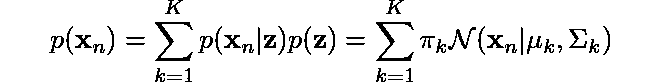

这是定义高斯混合的方程，你可以清楚地看到，它取决于我们之前提到的所有参数！为了确定这些的最优值，我们需要确定模型的最大似然。我们可以找到所有观测值的联合概率**x**n 的可能性，定义如下:

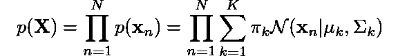

就像我们对原始高斯密度函数所做的那样，让我们将对数应用于等式的每一侧:

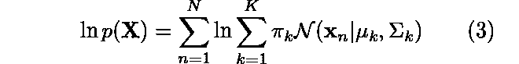

太好了！现在为了找到高斯混合的最佳参数，我们要做的就是对这个方程的参数求导，这样就完成了，对吗？等等！没那么快。我们这里有一个问题。我们可以看到，有一个对数正在影响第二次求和。计算这个表达式的导数，然后求解参数，会非常困难！

我们能做什么？嗯，我们需要用迭代法来估计参数。但是首先，记住我们应该找到给定 **x** 的 *z* 的概率？好，让我们这样做，因为在这一点上，我们已经有了定义这个概率的一切。

根据贝叶斯法则，我们知道

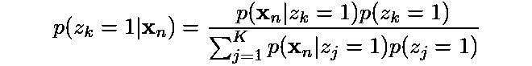

从我们之前的推导中，我们了解到:

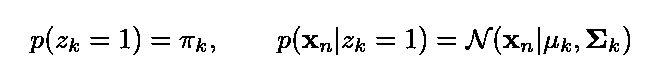

现在让我们将这些代入上一个等式:

这就是我们一直在寻找的！接下来，我们会经常看到这个表达。接下来，我们将继续讨论一种方法，这种方法将帮助我们容易地确定高斯混合的参数。

## 期望值最大化算法

好了，在这一点上，我们已经得到了一些概率的表达式，我们会发现这些表达式对确定模型的参数很有用。然而，在上一节中，我们可以看到，简单地评估(3)来找到这样的参数将被证明是非常困难的。幸运的是，我们可以使用一种迭代方法来达到这个目的。它被称为*期望——最大化*，或者简称为 *EM 算法*。它广泛用于目标函数复杂的优化问题，比如我们刚刚遇到的 GMM 问题。

让我们的模型的参数

现在让我们定义一般 EM 算法将遵循的步骤。

**步骤 1:** 相应地初始化 *θ* 。例如，我们可以使用前一次 K-Means 运行获得的结果作为我们算法的良好起点。

**第二步(期望步骤):**评估

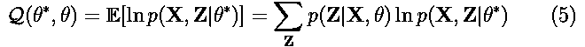

嗯，其实我们已经找到了 *p* ( **Z** | **X，** *θ* )。还记得上一节我们最后用的γ表达式吗？为了更好地理解，让我们将之前的等式(4)放在这里:

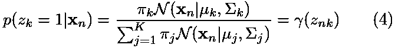

对于高斯混合模型，期望步骤归结为通过使用旧的参数值来计算(4)中γ的值。现在，如果我们将(4)替换为(5)，我们将得到:

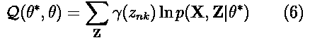

听起来不错，但是我们还缺少 *p* ( **X** ， **Z** | *θ** )。怎么才能找到呢？嗯，实际上并没有那么难。就是模型的完全似然，既包括 **X** 又包括 **Z** ，我们可以用下面的表达式求出:

这是计算所有观测值和潜在变量的联合概率的结果，是我们对 *p* ( **x** )的初始推导的扩展。该表达式的对数由下式给出

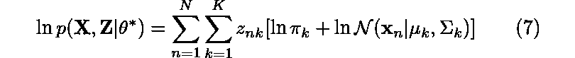

不错！我们终于摆脱了影响(3)中求和的这个麻烦的对数。有了所有这些，我们通过最大化关于参数的 *Q* 来估计参数就容易多了，但是我们将在*最大化步骤*中处理这个问题。此外，请记住，每次求和时，潜在变量 *z* 将**仅**为 1。有了这些知识，我们就可以根据推导的需要轻松地去掉它。

最后，我们可以将(6)中的(7)替换为:

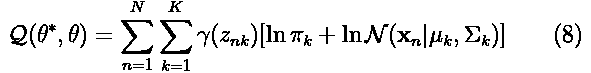

在最大化步骤中，我们将找到混合物的修正参数。出于这个目的，我们将需要使 Q 成为一个受限的最大化问题，因此我们将向(8)添加一个拉格朗日乘数。现在让我们回顾一下最大化步骤。

**步骤 3(最大化步骤):**使用以下公式找到修正参数 *θ* *

在哪里

这就是我们上一步的结果。但是，Q 还应考虑所有π值总和应为 1 的限制。为此，我们需要添加一个合适的拉格朗日乘数。因此，我们应该这样重写(8):

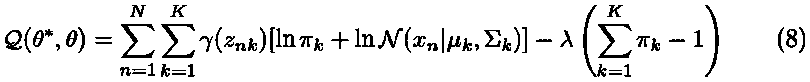

现在我们可以很容易地用最大似然法来确定参数。现在让我们对π求 *Q* 的导数，并将其设为 0:

然后，通过重新排列各项，并对等式两边的 *k* 求和，我们得到:

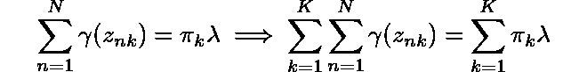

从(1)中，我们知道所有混合系数的总和π等于 1。此外，我们知道，将概率γ与 k 相加也会得到 1。因此我们得到 *λ* = *N* 。利用这个结果，我们可以求解 *π* :

类似地，如果我们将 *Q* 对μ和σ求导，使导数等于零，然后利用我们定义的对数似然方程(2)求解参数，我们得到:

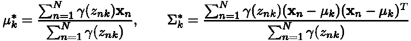

就是这样！然后，我们将在下一次 EM 迭代中使用这些修正值来确定γ，以此类推，直到我们看到似然值有所收敛。我们可以使用等式(3)来监控每一步中的对数似然，并且我们总是保证达到局部最大值。

如果能看到我们如何用编程语言实现这个算法就好了，不是吗？接下来，我们将看到我提供的 Jupyter 笔记本的一部分，这样您就可以看到 GMMs 在 Python 中的工作实现。

## 用 Python 实现

顺便提一下，完整的实现可以在 https://bit.ly/2MpiZp4 的 Jupyter 笔记本上获得

我在这个练习中使用了 Iris 数据集，主要是为了简单和快速训练。根据我们之前的推导，我们说明了 EM 算法遵循迭代方法来寻找高斯混合模型的参数。我们的第一步是初始化我们的参数。在这种情况下，我们可以使用 K-means 的值来满足这个目的。这方面的 Python 代码如下所示:

接下来，我们执行期望步骤。我们在这里计算

相应的 Python 代码如下所示:

请注意，为了计算总和，我们只需利用分子中的项，然后进行相应的除法运算。

然后是最大化步骤，我们计算

相应的 Python 代码如下所示:

请注意，为了稍微简化计算，我们使用了:

最后，我们还有对数似然计算，由下式给出

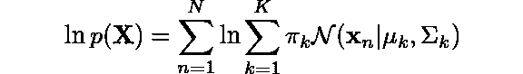

这方面的 Python 代码应该是

我们已经在期望步骤中预先计算了第二个求和的值，所以我们在这里只是利用它。此外，创建图表来查看可能性的进展情况总是很有用的。

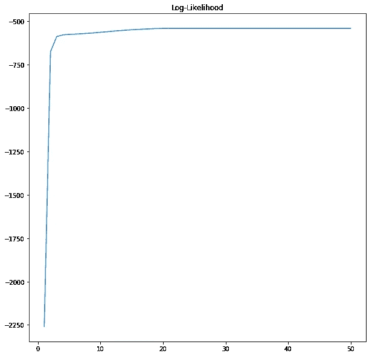

我们可以清楚地看到，算法在大约 20 个历元后收敛。EM 保证在过程的给定迭代次数之后将达到局部最大值。

最后，作为实现的一部分，我们还生成一个动画，向我们展示每次迭代后集群设置是如何改进的。

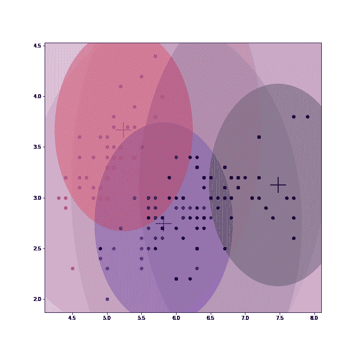

注意 GMM 是如何改进 K-means 估计的质心的。当我们收敛时，每个集群的参数值不再改变。

## 结束语

高斯混合模型是一种非常强大的工具，广泛用于涉及数据聚类的各种任务。我希望这篇文章对你有用！请随意提出问题或评论。我也强烈建议您亲自尝试这些派生，并深入研究代码。我期待着尽快创作出更多这样的材料。

尽情享受吧！

[1] Bishop，Christopher M. *模式识别和机器学习* (2006)施普林格出版社柏林，海德堡。

[2]墨菲，凯文·p .*机器学习:一种概率视角* (2012) 麻省理工学院出版社，剑桥，麻省，