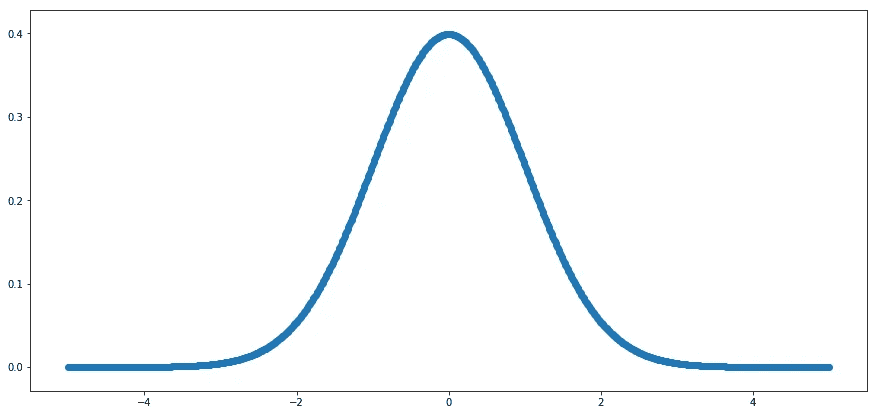
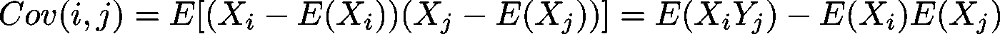
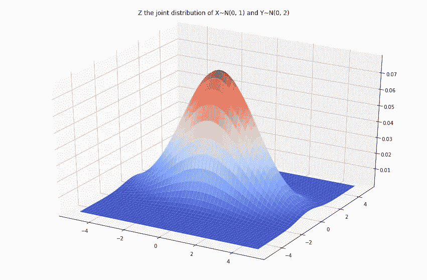
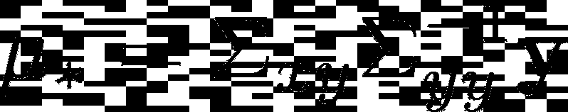
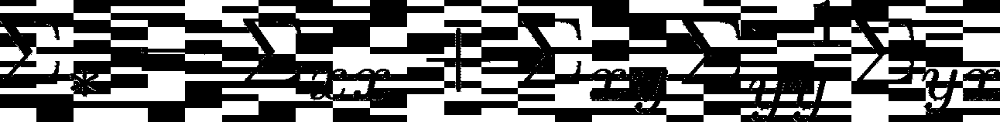
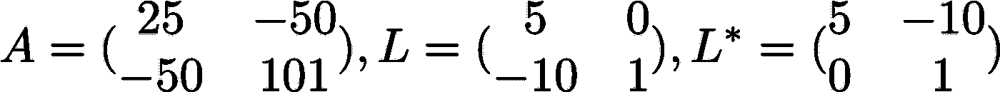
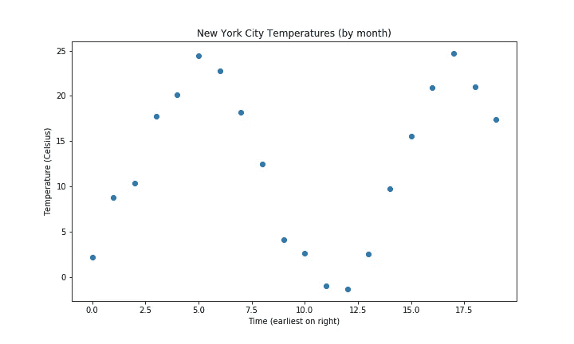
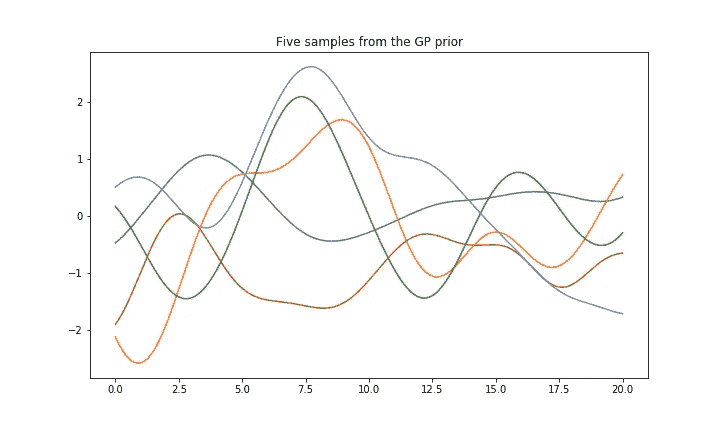
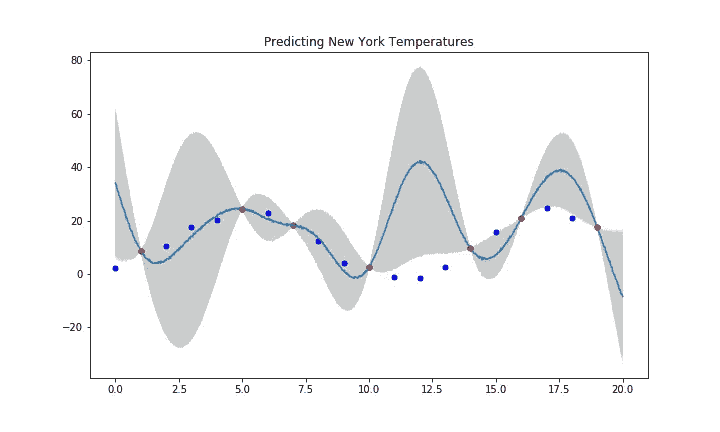

# 高斯过程:预测纽约气温

> 原文：<https://towardsdatascience.com/gaussian-processes-predicting-new-york-temperatures-d80906eb006?source=collection_archive---------18----------------------->

在我们开始之前，我想澄清一下，这篇文章并不完整，也不一定正确。当我试图学习更多关于高斯过程的知识时，把它看作是我的想法的笔记本，如果你看到错误或需要进一步澄清的部分，请突出显示并评论它们，以帮助我和其他读者。

数学中最著名的形状之一一定是不起眼的钟形曲线。卡尔·弗里德里希·高斯首先提出了这个函数，许多人都知道这个函数，而且由于它被用作正态分布随机变量的概率密度函数，现在学生们必须在高中以上学习。它广泛存在于我们的自然世界，这在很大程度上归功于[中心极限定理](https://en.wikipedia.org/wiki/Central_limit_theorem)。

The Guassian Curve for a random variable with mean 0 and standard deviation 1 i.e. the probability density function for such a random variable

由于我们试图了解更多关于高斯人以及这一切背后的数学和计算机科学，上面的曲线是以一种比使用图书馆更 DIY 的方式生成的。我觉得这是最好的学习方式之一，尤其是涉及数据科学及其他领域的编程技能。

A verbose Guassian function

现在我们对正态分布和定义其概率密度函数的高斯函数有了更好的理解，你可能会问，如果我不是只有一个变量呢？现代世界中的许多系统，无论是生物学、物理学还是气候科学，都是复杂的，涉及许多干扰变量。你的健康不仅仅取决于你的年龄，就像气候变化不仅仅与二氧化碳排放有关一样。

我们能把这个想法纳入我们的正态分布吗？简短的回答是:是的！但是首先，我们需要了解更多关于描述这些被称为协变量的干扰变量。

通常在科学和数学中，当我们想要理解多个元素时，我们会求助于向量和矩阵，因为它们将所有这些东西捆绑在一起，使得应用变换更加容易。以你的健康为例，它可以(不完全)表达为你的年龄、身高和体重的向量。我们可能需要计算哪些东西？首先是每一个的意思，这很简单。如果我们考虑一个大型电子表格，其中每个人都有行，向量中的每个元素都有列，我们可以很容易地计算出每列的平均值，因此健康向量的平均值是包含这些组件的单个向量。

更有趣的是协方差矩阵。这个想法很简单，我们想了解一个变量相对于另一个变量是如何变化的。凭直觉，你可以开始做预测:年龄越大，你会越高(在一定程度上)，你越高，你越有可能重。显然，事情没那么简单。

A Covariance Formula

呀！好吧，让我们稍微分解一下。协方差在这里有很多详细的描述[。在某种意义上，我们正在寻找两个随机变量偏离其平均值的乘积的平均值。需要注意的一点是，如果随机变量是独立的，那么它们的协方差是零。在这种情况下，它们的联合分布就是它们两个分布的乘积。](/let-us-understand-the-correlation-matrix-and-covariance-matrix-d42e6b643c22)

让我们看一个具体的例子，多元高斯分布。下面是两个随机变量 X 和 Y，都以零为中心，但具有不同的标准偏差。我们假设它们是独立的，我们看 Z，它们的联合分布，就是它们的概率密度函数的乘积。

有趣的是，通过联合分布，我们可以计算边际和条件概率分布，就像反向工作一样，以发现有趣的模式和对数据的洞察。事实上，我们可以从联合正态分布`p(x_1, x_2)`到条件概率`p(x_1 | x_2)`，因为我们已经了解了第二个变量。

这就是我们如何开始对看不见的数据进行预测！我们可以将我们观察到的数据和我们想要预测的数据视为一个联合分布，然后将其转换为一个条件分布，其中我们以我们标记的数据为条件。这种转换的数学问题超出了本文的范围，所以我们将只应用公式。下面公式中的`x`和`y`分别与训练和测试数据有关。

在开始举例之前，这个难题还有一个额外的部分。[乔莱斯基分解](http://mathworld.wolfram.com/CholeskyDecomposition.html)。这听起来很可怕，但事实并非如此，如果你从未听说过它，那么希望你能从这篇文章中学到一些数学知识。直观上就像是求一个矩阵的平方根。如果我有一些矩阵`A`，那么乔莱斯基分解会给我一个新的矩阵`L`，这样`LL* = A`。所有这些矩阵都需要有一些特殊的属性，例如`A`必须是[正定的](https://en.wikipedia.org/wiki/Definiteness_of_a_matrix)并且`L`必须是下三角矩阵。这里有一个例子:

让我们用一个例子来使它更加真实。我们将尝试用高斯过程来拟合来自纽约市(T2)的温度数据。

The earliest twenty data points for New York City temperatures

在实际数据中，我们将在尝试进行任何类型的拟合之前对其进行归一化——这是数据科学中使用的一种常用技术，可以使梯度下降等事情更好地工作(见最后我关于这一点的问题)。

在这里，我们只是初始化数据，并将其规范化。下一步是使用我们的核函数进行计算——在这个例子中，我选择使用[径向基函数](https://en.wikipedia.org/wiki/Radial_basis_function)。我们用核函数来度量变量的协方差。不同的函数有不同的属性，选择正确的函数似乎既是一门科学，也是一门艺术。但首先，让我们在没有任何数据的情况下，通过逐步完成这个过程来感受一下我们在做什么。

这将产生不同采样函数的下图。

现在，我们将做同样的事情，只是这一次，我们将对一些观察到的数据进行处理，以更好地猜测数据中的潜在模式。

请注意，我重新调整了所有的数据，使其回到此时的原始温度。拟合度显然不是很好，改善的一种方法是改变`alpha`值(称为长度比例)，这可以控制曲线中的摆动量，考虑到季节性波动引起的数据周期性，将其设置为 6 可能是有意义的。

我希望这篇文章已经帮助你掌握了高斯过程的一些关键数学特征。正如我在开始时提到的，它绝不是完整的，甚至是正确的，所以请指出任何错误或有用的指示。我发现这是一个学习和展开讨论的好方法。

## 问题

我对高斯过程相当陌生，实际上我自己也有不少问题，如果有人读到这里，觉得他们可以启发我，并为其他人提供更多内容，请评论。

1.  当我试图拟合温度，然后绘制它们顶部的标准偏差时，最初我没有将数据标准化。在我看来，标准偏差需要进行缩放，是这样吗？
2.  在我看来，高斯过程更适合填补数据点之间的空白，而不是推断遥远的未来，这是正确的吗？

## 资源

*   凯瑟琳·贝利关于 GPs 的一篇精彩的[帖子](http://katbailey.github.io/post/gaussian-processes-for-dummies/)
*   Neil Lawrence 在 MLSS 的演讲记录
*   Chris Fonnesbeck 的另一篇[好文章，代码清晰](https://blog.dominodatalab.com/fitting-gaussian-process-models-python/)示例
*   牛津大学工程科学和天体物理学系的详尽的[课程笔记](http://www.robots.ox.ac.uk/~sjrob/Pubs/philTransA_2012.pdf)。